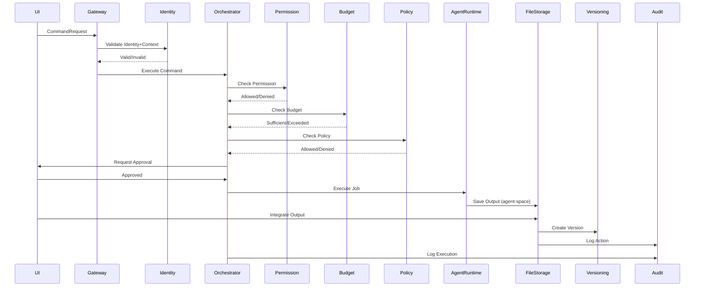
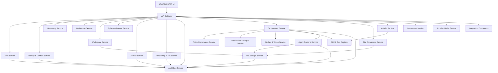

# 🏗️ CHE·NU V1 — ARCHITECTURE MICROSERVICES

**Date:** 16 décembre 2025  
**Version:** V1.0.0 (POST-FREEZE)  
**Status:** ARCHITECTURE TECHNIQUE DÉTAILLÉE

---

## 🎯 OBJECTIF

Architecture microservices scalable, sécurisée, et fidèle à la gouvernance:
- ✅ Isolation identité/contexte
- ✅ Agents sandboxés
- ✅ Versioning append-only
- ✅ Audit immuable

---

## 📐 PRINCIPES DE DÉCOUPAGE (CHE·NU-PROOF)

### 1. Bounded Context
> **Un service = une responsabilité claire**

### 2. Données Isolées
> **Chaque service possède sa DB (ou schéma) + ses tables**

### 3. Événements pour Couplage Faible
> **Pub/Sub pour communication asynchrone**

### 4. Commandes pour Actions Gouvernées
> **Via Orchestrator uniquement**

### 5. Règle d'Or
> **Pas d'agent qui écrit dans User Space**
> 
> Tout passe par un service "Integration/Publishing"

---

## 🗺️ CARTE DES MICROSERVICES CHE·NU (V1)

### 24 Services Organisés en 8 Catégories

---

## 2.1 EDGE & FOUNDATION (3 services)

### 1. api-gateway
**Responsabilités:**
- Routing
- Rate limiting
- Auth forwarding
- Versioning API
- Request validation

**Endpoints:**
```
/*                    → Route to appropriate service
/health              → Health check
/version             → API version
```

**Technologies:**
- Kong / Nginx / Traefik
- Redis (rate limiting)

---

### 2. auth-service
**Responsabilités:**
- Login / Logout
- MFA (Multi-Factor Authentication)
- Token generation (JWT)
- Session management
- Device trust

**Endpoints:**
```
POST /auth/login
POST /auth/logout
POST /auth/refresh
POST /auth/mfa/enable
POST /auth/mfa/verify
GET  /auth/session
```

**Database:** Dedicated (credentials, sessions)

**Technologies:**
- bcrypt (password hashing)
- JWT tokens
- Redis (sessions)

---

### 3. identity-context-service
**Responsabilités:**
- Identity management (4 types)
- Active identity per session
- Context building (sphere + org + project)
- Context switching
- Scope lock

**Endpoints:**
```
POST /identity/create
GET  /identity/list
POST /identity/switch
GET  /identity/active

POST /context/set
GET  /context/active
POST /context/lock
POST /context/unlock
```

**Database:** Dedicated (identities, contexts, switch log)

**Critical Rules:**
- ✅ One active identity per session
- ✅ Context switch clears working state
- ✅ Switch is logged (audit)

---

## 2.2 CORE GOVERNANCE (3 services)

### 4. policy-governance-service
**Responsabilités:**
- Policy rules engine
- Enforcement decisions
- "What is allowed?" validation
- Policy versioning

**Endpoints:**
```
POST /policy/check
GET  /policy/rules
POST /policy/create
PUT  /policy/update
GET  /policy/{id}/versions
```

**Database:** Policies, rule versions

**Integration:**
- Called by Orchestrator before execution
- Returns: allowed/denied + reason

---

### 5. permission-scope-service
**Responsabilités:**
- RBAC/ABAC implementation
- Permission grants/revokes
- Scope lifecycle management
- Permission history

**Endpoints:**
```
POST /permission/grant
POST /permission/revoke
GET  /permission/check
GET  /permission/list
GET  /scope/{id}
POST /scope/create
```

**Database:** Grants, revokes, history

**Critical Rules:**
- ✅ Least privilege by default
- ✅ Explicit grants only
- ✅ Time-bound permissions (optional)

---

### 6. budget-token-service
**Responsabilités:**
- Budget management per identity/sphere/project
- Token consumption tracking
- Threshold warnings
- Execution blocking on budget exceeded

**Endpoints:**
```
POST /budget/create
GET  /budget/{id}
POST /budget/consume
GET  /budget/{id}/usage
POST /budget/threshold/set
GET  /budget/alerts
```

**Database:** Budgets, consumption ledger (append-only)

**Critical Rules:**
- ✅ Check BEFORE agent execution
- ✅ Block if threshold exceeded
- ✅ Alert on warning threshold

---

## 2.3 KNOWLEDGE & DATA SPINE (4 services)

### 7. sphere-bureau-service
**Responsabilités:**
- 8 Spheres management
- Bureau templates (10 sections)
- Bureau views (filtered by context)
- Section visibility rules

**Endpoints:**
```
GET  /spheres
GET  /sphere/{id}
GET  /sphere/{id}/bureau
GET  /bureau/{id}/sections
GET  /bureau/{id}/section/{sectionId}/data
```

**Database:** Spheres, bureau configs, section templates

**Critical Rules:**
- ✅ Always 10 sections per bureau
- ✅ Section order immutable
- ✅ Views filtered by active context

---

### 8. thread-service
**Responsabilités:**
- Thread (.chenu) management
- Thread linking (references)
- Thread classification
- Decision records
- Cross-sphere references (read-only)

**Endpoints:**
```
POST /threads
GET  /threads/{id}
PUT  /threads/{id}
POST /threads/{id}/link
POST /threads/{id}/decision
GET  /threads/search
GET  /threads/{id}/references
```

**Database:** Threads, links, metadata

**Critical Rules:**
- ✅ Thread = unit of truth
- ✅ Links ≠ duplication
- ✅ Cross-sphere = read-only
- ✅ Versioned (via versioning-service)

---

### 9. versioning-diff-service
**Responsabilités:**
- Version store (append-only)
- Diff generation (text + structure)
- Rollback creation (new version)
- Version history

**Endpoints:**
```
POST /versions/create
GET  /versions/{objectId}
GET  /versions/{objectId}/history
GET  /versions/diff?from={v1}&to={v2}
POST /versions/rollback
```

**Database:** Versions (append-only, immutable)

**Critical Rules:**
- ✅ Append-only (never delete)
- ✅ Rollback = new version
- ✅ Agent vs Human flag
- ✅ Diffs are calculated, not stored

---

### 10. audit-log-service
**Responsabilités:**
- Immutable audit log
- Action traceability
- Security events
- Compliance reports

**Endpoints:**
```
POST /audit/log
GET  /audit/search
GET  /audit/user/{userId}
GET  /audit/context/{contextId}
GET  /audit/export
```

**Database:** Audit logs (append-only, immutable)

**Critical Rules:**
- ✅ EVERYTHING is logged
- ✅ Logs are immutable
- ✅ User-accessible
- ✅ Required for agents & budgets

**Integration:**
- All services send audit events
- Async (pub/sub)

---

## 2.4 WORKSPACE & FILES (3 services)

### 11. workspace-service
**Responsabilités:**
- Workspace sessions
- Layout management
- Editor state
- Collaboration hooks
- Real-time presence

**Endpoints:**
```
POST /workspace/session/create
GET  /workspace/session/{id}
PUT  /workspace/layout
GET  /workspace/state
POST /workspace/collaborate
```

**Database:** Sessions, layouts, editor states

**Technologies:**
- WebSocket (real-time)
- Redis (presence tracking)

---

### 12. file-storage-service
**Responsabilités:**
- Object storage abstraction
- File metadata
- Access policies
- Agent space vs User space separation

**Endpoints:**
```
POST /files/upload
GET  /files/{id}
POST /files/{id}/move
POST /files/{id}/integrate  # agent → user
DELETE /files/{id}
GET  /files/search
```

**Storage:**
- S3-compatible object storage
- Metadata in PostgreSQL

**Critical Rules:**
- ✅ Agent space isolated
- ✅ Integration requires user approval
- ✅ Integration triggers versioning

---

### 13. file-conversion-service
**Responsabilités:**
- PDF/DOCX/XLSX/MD conversions
- Transform operations
- Preview rendering
- Format validation

**Endpoints:**
```
POST /convert
POST /convert/{jobId}/status
GET  /convert/{jobId}/result
POST /preview/generate
```

**Technologies:**
- LibreOffice (headless)
- Pandoc
- Image processing libs

**Queue:** BullMQ for async processing

---

## 2.5 MEETINGS & COMMUNICATION (3 services)

### 14. meeting-service
**Responsabilités:**
- Meeting scheduling
- Session management
- Recording metadata
- Minutes/actions extraction
- Reference to threads

**Endpoints:**
```
POST /meetings/create
GET  /meetings/{id}
POST /meetings/{id}/start
POST /meetings/{id}/end
POST /meetings/{id}/minutes
GET  /meetings/upcoming
```

**Database:** Meetings, sessions, participants

**Integration:**
- Links to threads for decisions
- Triggers notifications

---

### 15. messaging-service
**Responsabilités:**
- User-to-user messaging
- Nova chat interface
- Orchestrator chat
- Notification payload generation

**Endpoints:**
```
POST /messages/send
GET  /messages/{threadId}
POST /messages/nova
POST /messages/orchestrator
GET  /messages/unread
```

**Technologies:**
- WebSocket (real-time)
- Redis (message queue)

---

### 16. notification-service
**Responsabilités:**
- Sphere lights (status indicators)
- Event alerts
- Delivery rules (email, push, in-app)
- Notification preferences

**Endpoints:**
```
POST /notifications/send
GET  /notifications/list
PUT  /notifications/{id}/read
POST /notifications/preferences
GET  /notifications/sphere/{id}/lights
```

**Technologies:**
- Push notifications (FCM/APNS)
- Email service
- WebSocket (in-app)

---

## 2.6 AGENTS & IA LABS (4 services)

### 17. orchestrator-service
**Responsabilités:**
- Command planning
- Agent selection
- Execution pipeline
- Approval workflow
- Execution graph

**Endpoints:**
```
POST /commands/plan
POST /commands/execute
POST /commands/{id}/approve
POST /commands/{id}/reject
GET  /commands/{id}/status
GET  /commands/{id}/graph
```

**Workflow:**
1. Receive command
2. Validate with governance services:
   - permission-scope: "allowed?"
   - budget-token: "budget ok?"
   - policy-governance: "policy ok?"
3. Create execution plan
4. Wait for user approval
5. Execute via agent-runtime
6. Track completion

**Critical Rules:**
- ✅ NEVER executes without validation
- ✅ User approval required
- ✅ Complete audit trail

---

### 18. agent-runtime-service
**Responsabilités:**
- Sandbox execution (Docker containers)
- L0/L1/L2/L3 enforcement
- Output routing
- Resource limits
- Timeout management

**Endpoints:**
```
POST /jobs/create
GET  /jobs/{id}
GET  /jobs/{id}/logs
GET  /jobs/{id}/outputs
POST /jobs/{id}/cancel
```

**Technologies:**
- Docker (sandboxing)
- Resource limits (CPU/Memory)
- Timeout enforcement

**Folders:**
```
/agents/{agentId}/
  working/     # Temp workspace
  output/      # Results (isolated)
  memory/      # Context retention
```

**Critical Rules:**
- ✅ Agents CANNOT write to user space
- ✅ Output goes to agent-space (file-storage)
- ✅ Budget checked BEFORE execution
- ✅ Timeout kills process

---

### 19. skill-tool-registry-service
**Responsabilités:**
- Skills catalog (24+ skills)
- Tools registry (21+ tools)
- Skill → Tool mappings
- Sphere activation presets
- Compatibility matrix

**Endpoints:**
```
POST /skills/register
GET  /skills/list
GET  /skills/{id}
POST /tools/register
GET  /tools/list
GET  /tools/{id}
POST /mappings/create
GET  /sphere/{id}/skills
```

**Database:** Skills, tools, mappings, activations

**Integration:**
- Used by orchestrator for agent selection
- Used by IA Labs for testing

---

### 20. ia-labs-service
**Responsabilités:**
- Experimentation environment
- Skill testing
- Performance validation
- Promotion workflow (test → validated → production)

**Endpoints:**
```
POST /experiments/create
POST /experiments/{id}/run
GET  /experiments/{id}/results
POST /experiments/{id}/validate
POST /skills/{id}/promote
GET  /experiments/list
```

**Database:** Experiments, test results, validations

**Workflow:**
1. Create experiment
2. Run in isolated environment
3. Collect metrics
4. Validate results
5. Promote to production (manual)

---

## 2.7 COMMUNITY & SOCIAL (3 services)

### 21. community-service
**Responsabilités:**
- Public threads graph
- Topics management
- Intent types
- Geo filtering
- Explorable chat (not infinite timeline)

**Endpoints:**
```
POST /community/threads/create
GET  /community/threads/search
GET  /community/threads/{id}
GET  /community/topics
GET  /community/explore
```

**Database:** Public threads, topics, geo data

**Navigation:**
- By topics
- By geolocation
- By time
- By intent

---

### 22. social-media-service
**Responsabilités:**
- Posts management
- Comments
- Scheduling
- Analytics
- External connectors (optional)

**Endpoints:**
```
POST /social/posts/create
GET  /social/posts/{id}
POST /social/posts/{id}/comment
POST /social/posts/schedule
GET  /social/analytics
```

**Database:** Posts, comments, schedules

---

### 23. integration-connectors-service
**Responsabilités:**
- External platform connectors
- Google Drive integration
- Safe import/export
- OAuth management
- Data sync

**Endpoints:**
```
POST /connectors/auth
GET  /connectors/list
POST /connectors/{type}/import
POST /connectors/{type}/export
GET  /connectors/{type}/status
```

**Supported Connectors:**
- Google Drive
- Dropbox
- OneDrive
- Slack
- (extensible)

---

## 2.8 XR (EXTENSION, LATER) (1 service)

### 24. xr-spatial-service
**Responsabilités:**
- Scene graphs
- XR assets management
- VR meeting templates
- Spatial mapping
- Avatar management

**Endpoints:**
```
POST /xr/scenes/create
GET  /xr/scenes/{id}
POST /xr/meeting/create
GET  /xr/avatars
POST /xr/spatial/map
```

**Status:** ⚠️ Optional for MVP (feature flag)

**Technologies:**
- WebXR
- Three.js
- Spatial audio

---

## 🗄️ FRONTIÈRES DE DONNÉES (ANTI-MÉLANGE)

### Données "Les Plus Sensibles"

#### auth-service
```
Database: auth_db (dedicated)
Tables:
  - users
  - credentials (encrypted)
  - mfa_secrets (encrypted)
  - sessions
  - devices
```

#### identity-context-service
```
Database: identity_db (dedicated)
Tables:
  - identities
  - contexts
  - identity_switches (audit)
  - active_sessions
```

---

### Données "Gouvernance"

#### policy-governance-service
```
Tables:
  - policies
  - policy_versions
  - enforcement_decisions
```

#### permission-scope-service
```
Tables:
  - permissions
  - grants
  - revokes
  - grant_history
```

#### budget-token-service
```
Tables:
  - budgets
  - consumption_ledger (append-only)
  - thresholds
  - alerts
```

---

### Colonne Vertébrale

#### thread-service
```
Tables:
  - threads
  - thread_links
  - thread_metadata
  - decisions
```

#### versioning-diff-service
```
Tables:
  - versions (append-only, immutable)
  - version_metadata
```

#### audit-log-service
```
Tables:
  - audit_logs (append-only, immutable)
  - security_events
```

---

### Workspace / Files

#### file-storage-service
```
Tables:
  - file_metadata
  - storage_pointers
  - access_policies
  - agent_space_files
  - user_space_files
```

#### workspace-service
```
Tables:
  - workspace_sessions
  - layouts
  - editor_states
  - collaboration_sessions
```

---

### Agents

#### agent-runtime-service
```
Tables:
  - jobs
  - execution_logs
  - sandbox_config
  - output_locations
```

#### orchestrator-service
```
Tables:
  - commands
  - execution_plans
  - approvals
  - execution_graph
```

---

## 🔄 FLUX D'EXÉCUTION (COMMANDE GOUVERNÉE)

### Workflow Complet:

```
1. UI envoie CommandRequest → api-gateway

2. api-gateway → identity-context-service
   Valide: Active Identity + Active Context
   Si ambigu → STOP (erreur)

3. api-gateway → orchestrator-service
   Orchestrator demande validation:
   
   3a. permission-scope-service → "allowed?"
       Response: granted / denied + reason
   
   3b. budget-token-service → "budget ok?"
       Response: sufficient / exceeded + remaining
   
   3c. policy-governance-service → "policy ok?"
       Response: allowed / denied + policy

4. Si toutes validations OK:
   orchestrator-service crée execution plan
   → Attend user approval

5. User approves:
   orchestrator-service → agent-runtime-service
   agent-runtime exécute dans sandbox

6. agent-runtime génère output:
   → Stocké dans agent-space (file-storage)
   → Tag: "agent-owned", "pending_review"

7. User review:
   → User decides: integrate / reject / modify
   
   Si integrate:
   → file-storage.integrate(fileId)
   → File moved/copied to user-space
   → versioning-service creates version
   → audit-log logs action

8. audit-log-service reçoit TOUS les events:
   → identity switch
   → permission check
   → budget consumption
   → policy validation
   → command execution
   → file integration
```

### Diagram:



---

## 🌐 MAPPING API (HAUT NIVEAU)

### identity-context-service
```
POST   /identity/switch
GET    /context/active
POST   /scope/lock
```

### thread-service
```
POST   /threads
POST   /threads/{id}/link
POST   /threads/{id}/decision
GET    /threads?filters=...
```

### versioning-diff-service
```
POST   /versions
GET    /versions/{objectId}
GET    /diff?from={v1}&to={v2}
POST   /rollback
```

### orchestrator-service
```
POST   /commands/plan
POST   /commands/execute
POST   /commands/{id}/approve
GET    /commands/{id}/status
```

### agent-runtime-service
```
POST   /jobs
GET    /jobs/{id}
GET    /jobs/{id}/outputs
```

### file-storage-service
```
POST   /files/upload
GET    /files/{id}
POST   /files/{id}/move
POST   /files/{id}/integrate  # agent → user (versioned)
```

### workspace-service
```
POST   /workspace/session
POST   /workspace/layout
GET    /workspace/state
```

### audit-log-service
```
GET    /audit?context={contextId}
```

---

## 📊 DIAGRAMME MERMAID — MICROSERVICES CHE·NU (FINAL)



---

## 🚀 DÉPLOIEMENT CONSEILLÉ (MVP → SCALE)

### MVP (Phase 1)

**Services Essentiels:**
```
✅ api-gateway
✅ auth-service
✅ identity-context-service
✅ thread-service
✅ versioning-diff-service
✅ audit-log-service
✅ sphere-bureau-service
✅ workspace-service
✅ file-storage-service
✅ orchestrator-service (simple)
✅ agent-runtime-service (L0 only)
✅ skill-tool-registry (minimal)
✅ notification-service (light)
✅ messaging-service (light)
```

**Total:** 14 services

---

### Phase 2

**Ajouts:**
```
+ ia-labs-service
+ file-conversion-service
+ meeting-service
```

**Total:** 17 services

---

### Phase 3

**Ajouts:**
```
+ community-service
+ social-media-service
+ integration-connectors-service
```

**Total:** 20 services

---

### Phase XR (Optional)

**Ajouts:**
```
+ xr-spatial-service
```

**Total:** 21+ services

---

## 💡 RECOMMANDATION IMPORTANTE (RÉALITÉ TERRAIN)

### Modular Monolith First

**Approche recommandée:**

1. **Démarrer en "modular monolith"** (NestJS modules)
2. **Respecter EXACTEMENT ces frontières** (modules séparés)
3. **Puis extraire en microservices** sans réécrire

### Avantages:

✅ **Évite de se noyer dans le DevOps trop tôt**
✅ **Développement plus rapide au début**
✅ **Migration progressive vers microservices**
✅ **Tests plus simples initialement**

### Structure NestJS:

```
src/
  modules/
    auth/
    identity-context/
    thread/
    versioning/
    orchestrator/
    agent-runtime/
    ...
```

Chaque module:
- Son propre controller
- Son propre service
- Son propre repository
- Ses propres DTOs
- Ses tests

**Migration:** Extraire module par module selon les besoins de scale.

---

## 🎯 CHECKLIST DÉPLOIEMENT MVP

```
Infrastructure:
  ⬜ Kubernetes cluster (ou Docker Compose pour dev)
  ⬜ PostgreSQL (multi-schema ou multi-DB)
  ⬜ Redis (sessions + cache + queues)
  ⬜ S3-compatible object storage
  ⬜ Monitoring (Prometheus + Grafana)
  ⬜ Logging (ELK stack)

Services MVP:
  ⬜ API Gateway (Kong/Nginx)
  ⬜ Auth Service
  ⬜ Identity & Context Service
  ⬜ Thread Service
  ⬜ Versioning Service
  ⬜ Audit Log Service
  ⬜ Sphere & Bureau Service
  ⬜ Workspace Service
  ⬜ File Storage Service
  ⬜ Orchestrator Service
  ⬜ Agent Runtime Service (L0)
  ⬜ Skill & Tool Registry
  ⬜ Notification Service
  ⬜ Messaging Service

Observability:
  ⬜ Health checks
  ⬜ Metrics collection
  ⬜ Distributed tracing
  ⬜ Error tracking
  ⬜ Audit log indexing

Security:
  ⬜ TLS/SSL certificates
  ⬜ Secrets management
  ⬜ Network policies
  ⬜ Rate limiting
  ⬜ DDoS protection
```

---

## 🔜 PROCHAINE ÉTAPE

**Tu veux:**

1. **OpenAPI Specs** (Swagger pour chaque service)
2. **Structure Repo** (dossier services/ + docker-compose)
3. **Database Schemas** (SQL migrations pour chaque service)
4. **Starter Templates** (NestJS boilerplate pour services)

---

**Date:** 16 décembre 2025  
**Version:** V1.0.0  
**Status:** ARCHITECTURE TECHNIQUE DÉTAILLÉE ✅
