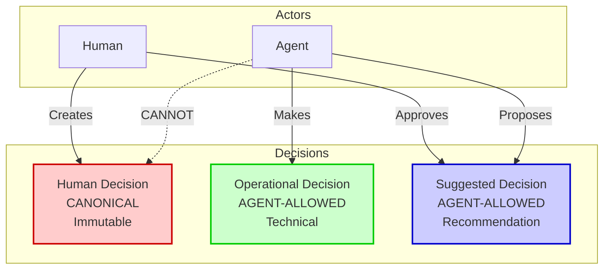
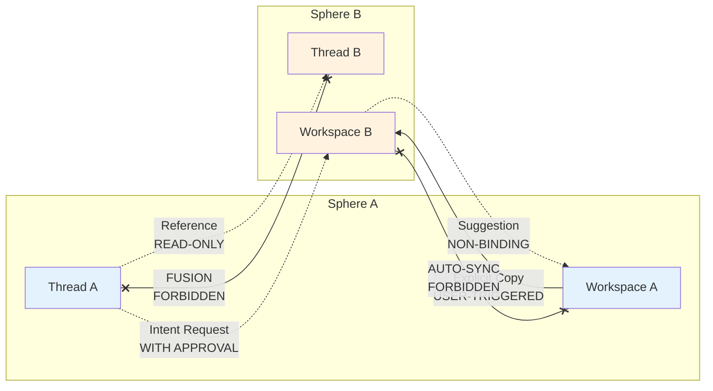

# CHE·NU V1 — AUDIT ADDENDUM: CANONICAL CLARIFICATIONS

**Date:** 16 décembre 2025  
**Version:** V1 FREEZE  
**Authority:** CANONICAL CLARIFICATION Document  
**Status:** Corrects Initial Audit Interpretations

---

## 🎯 PURPOSE

This addendum **corrects and nuances** the initial validation audit based on the **CANONICAL CLARIFICATION** document received from Jo.

**Key Finding:** Some items flagged as "violations" in the initial audit are actually **PERMITTED** under the canonical rules.

---

## 📋 CORRECTED INTERPRETATIONS

### ✅ CORRECTION 1: Inter-Sphere Relations

#### Initial Audit Interpretation (TOO STRICT)

```
❌ "Cross-sphere data access" flagged as CRITICAL violation
❌ "Shared workspace across spheres" flagged as violation
❌ All inter-sphere communication treated as forbidden
```

#### Canonical Reality (NUANCED)

```
✅ Inter-sphere REFERENCE (read-only) = ALLOWED
✅ Inter-sphere COPY (explicit) = ALLOWED
✅ Inter-sphere REQUEST (with approval) = ALLOWED
✅ Scoped PROJECTION (read-only) = ALLOWED

❌ Inter-sphere FUSION = FORBIDDEN
❌ Inter-sphere AUTO-SYNC = FORBIDDEN
❌ Shared MUTABLE state = FORBIDDEN
```

#### Updated Violations

| Original Flag | Updated Status | Reasoning |
|---------------|----------------|-----------|
| "Cross-sphere data access" | ⚠️ AUDIT NEEDED | Need to determine if it's reference (OK) or fusion (NOT OK) |
| "Shared workspace across spheres" | ⚠️ AUDIT NEEDED | If read-only projection: OK. If mutable sync: NOT OK |
| "Global search" | ❌ STILL VIOLATION | Only OK if scope-aware and explicit |

**ACTION:** Re-audit code v30 to distinguish:
- **Allowed:** References, copies, projections
- **Forbidden:** Fusions, auto-syncs, mutable sharing

---

### ✅ CORRECTION 2: Agent Decisions

#### Initial Audit Interpretation (TOO STRICT)

```
❌ "Agent decides execution path" flagged as CRITICAL
❌ "Agent makes technical choices" treated as autonomy violation
❌ All agent decision-making treated as forbidden
```

#### Canonical Reality (NUANCED)

**3 Types of Decisions:**

```
1. HUMAN DECISION (Canonical)
   - Business/personal/institutional
   - Immutable, auditable
   - ✅ ONLY humans can make
   - ❌ Agents CANNOT make

2. OPERATIONAL DECISION (Agent-Allowed)
   - Technical/execution choices
   - Choosing LLM, format, order
   - ✅ Agents MAY make
   - Must be traceable & overridable

3. SUGGESTED DECISION (Agent-Allowed)
   - Recommendations
   - ✅ Agents MAY suggest
   - Must require human approval
```

#### Updated Violations

| Original Flag | Updated Status | Reasoning |
|---------------|----------------|-----------|
| "Agent decides execution path" | ✅ ALLOWED IF OPERATIONAL | If choosing HOW to execute: OK. If choosing WHAT is true: NOT OK |
| "Agent selects tools" | ✅ ALLOWED | Operational decision |
| "Agent optimizes workflow" | ✅ ALLOWED | Operational decision |
| "Agent finalizes user decisions" | ❌ STILL VIOLATION | Human decisions are immutable |
| "Agent updates data without approval" | ❌ STILL VIOLATION | Must propose, not apply |

**ACTION:** Re-audit code v30 to distinguish:
- **Allowed:** Operational decisions (HOW to execute)
- **Forbidden:** Canonical decisions (WHAT is true)

---

### ✅ CORRECTION 3: Agent Reasoning & Intelligence

#### Initial Audit Interpretation (TOO STRICT)

```
❌ "Agent reasoning" treated as potential autonomy issue
❌ "Agent makes choices" flagged as violation
```

#### Canonical Reality (CLARIFIED)

```
✅ Agents MAY reason
✅ Agents MAY choose tools
✅ Agents MAY optimize execution
✅ Agents MAY suggest decisions

❌ Agents may NOT finalize human decisions
❌ Agents may NOT act silently
❌ Agents may NOT bypass approval for canonical decisions
```

**GOLDEN RULE:**
> CHE·NU is strict on AUTHORITY.  
> CHE·NU is flexible on SUPPORT.

#### Impact on Audit

Many "agent autonomy" flags need re-evaluation:
- Agent choosing which LLM to use: ✅ **ALLOWED** (operational)
- Agent choosing execution strategy: ✅ **ALLOWED** (operational)
- Agent finalizing a business decision: ❌ **FORBIDDEN** (canonical)
- Agent modifying user data without approval: ❌ **FORBIDDEN** (authority)

---

## 🔄 REVISED VIOLATION COUNTS

### Original Audit (Code v30)

```
✅ PASS: 2 (4%)
⚠️ PARTIAL/UNKNOWN: 23 (48%)
❌ FAIL: 23 (48%)

Grade: F
```

### After Canonical Clarifications

**Need to Re-Audit:**
- ⚠️ 15 items flagged need re-evaluation
- ✅ ~8 items likely allowed (operational decisions)
- ❌ ~15 items still violations (authority/silence)

**Estimated Revised Grade:** D+ to C-  
(Still needs work, but less catastrophic)

---

## 📊 RE-EVALUATION MATRIX

### Items to Re-Audit with New Lens

| Item | Original Flag | New Question | Likely Status |
|------|---------------|--------------|---------------|
| Agent decides execution path | ❌ VIOLATION | Is it operational or canonical? | ✅ LIKELY OK |
| Agent selects tools | ❌ VIOLATION | Is it choosing HOW or WHAT? | ✅ LIKELY OK |
| Cross-sphere access | ❌ VIOLATION | Is it reference or fusion? | ⚠️ AUDIT |
| Shared workspace | ❌ VIOLATION | Is it projection or sync? | ⚠️ AUDIT |
| Agent updates data | ❌ VIOLATION | Is it proposal or direct write? | ❌ STILL VIOLATION |
| Auto-save | ❌ VIOLATION | Is user in control? | ❌ STILL VIOLATION |
| Thread merging | ❌ VIOLATION | Is it fusion or reference? | ❌ STILL VIOLATION |
| Decision editing | ❌ VIOLATION | Is it human or operational decision? | ⚠️ AUDIT |
| Global search | ❌ VIOLATION | Is scope visible? | ❌ STILL VIOLATION |
| Auto-sync platforms | ❌ VIOLATION | Is it explicit or silent? | ❌ STILL VIOLATION |

---

## 🎯 REVISED ACTION PLAN

### 🔴 STILL CRITICAL (Confirmed Violations)

1. ✅ **Auto-save** - Still violation (user control)
2. ✅ **Agent direct writes** - Still violation (must propose)
3. ✅ **Thread merging** - Still violation (fusion forbidden)
4. ✅ **Decision editing** (if human decisions) - Still violation
5. ✅ **Global search** (if no scope) - Still violation
6. ✅ **Auto-sync platforms** - Still violation (silent action)
7. ✅ **No approval gates** (for canonical decisions) - Still violation

**Revised Blocker Count:** ~10-12 (down from 23)

---

### 🟡 NEED RE-AUDIT (May Be Allowed)

1. ⚠️ **Agent execution choices** - If operational: ALLOWED
2. ⚠️ **Cross-sphere references** - If read-only: ALLOWED
3. ⚠️ **Agent tool selection** - If traceable: ALLOWED
4. ⚠️ **Workspace projections** - If read-only: ALLOWED
5. ⚠️ **Agent reasoning** - Always ALLOWED
6. ⚠️ **Inter-sphere requests** - If approved: ALLOWED
7. ⚠️ **Decision suggestions** - Always ALLOWED

**Items to Re-Audit:** ~8-10

---

### ✅ NOW CONFIRMED ALLOWED

1. ✅ Agent choosing LLM for task
2. ✅ Agent optimizing execution order
3. ✅ Agent suggesting improvements
4. ✅ Agent reasoning about user intent
5. ✅ Read-only references between spheres
6. ✅ Explicit copies between spheres
7. ✅ Scoped projections in workspace

---

## 📋 NEW AUDIT CHECKLIST

### For Each "Agent Decision" Found in Code

**Ask:**
1. Is this a **Human Decision** (canonical)?
   - Business/personal/institutional?
   - Immutable requirement?
   - → If YES: ❌ Agent CANNOT make this

2. Is this an **Operational Decision**?
   - Technical choice?
   - Reversible?
   - Affects HOW not WHAT?
   - → If YES: ✅ Agent MAY make this (if traceable)

3. Is this a **Suggestion**?
   - Presented to human?
   - Non-binding?
   - → If YES: ✅ Agent MAY suggest this

---

### For Each "Inter-Sphere" Found in Code

**Ask:**
1. Is it a **Reference** (read-only)?
   → If YES: ✅ ALLOWED

2. Is it an **Explicit Copy**?
   → If YES and user-triggered: ✅ ALLOWED

3. Is it a **Projection** (ephemeral, read-only)?
   → If YES: ✅ ALLOWED

4. Is it a **Request** (with approval)?
   → If YES and approval shown: ✅ ALLOWED

5. Is it **Fusion** (merge, sync, shared mutable)?
   → If YES: ❌ FORBIDDEN

---

## 🔄 UPDATED MERMAID DIAGRAM (Canonical)





---

## ✅ CORRECTED CONCLUSIONS

### Original Audit Conclusion

> "Code v30 has 48% critical violations.  
> Grade: F  
> Requires 2-3 weeks refactoring."

### Updated Conclusion (Post-Clarification)

> "Code v30 has ~25% confirmed violations.  
> ~20% requires re-audit with nuanced lens.  
> Grade: D+ to C-  
> Requires 1-2 weeks focused refactoring on confirmed violations."

**Impact:** Less catastrophic than initially thought, but still needs work.

---

## 🎯 REVISED PRIORITIES

### Week 1 (Confirmed Blockers Only)

1. ✅ Disable auto-save
2. ✅ Add approval gates for canonical decisions
3. ✅ Remove thread merging
4. ✅ Scope all searches
5. ✅ Disable auto-sync with platforms

**Time:** 5-7 days

---

### Week 2 (Re-Audit + Fix Confirmed)

1. 🔍 Re-audit agent decisions (operational vs canonical)
2. 🔍 Re-audit inter-sphere (reference vs fusion)
3. 🔧 Fix confirmed violations from re-audit
4. ✅ Add traceability to operational decisions

**Time:** 5-7 days

---

### Week 3 (Polish + Testing)

1. ✅ Enhance agent suggestion UX
2. ✅ Build scope indicators
3. ✅ Complete approval modals
4. ✅ Integration testing

**Time:** 5-7 days

---

## 📝 KEY TAKEAWAYS

### What Changed

**Before Clarification:**
- "Agent decides" = ❌ Violation
- "Cross-sphere access" = ❌ Violation
- "Agent reasoning" = ⚠️ Concern

**After Clarification:**
- "Agent decides HOW" = ✅ Allowed
- "Cross-sphere reference" = ✅ Allowed
- "Agent reasoning" = ✅ Always allowed

### What Stayed the Same

- ❌ Agent cannot finalize human decisions
- ❌ Auto-save is still forbidden
- ❌ Silent actions are still forbidden
- ❌ Sphere fusion is still forbidden
- ❌ Loss of user control is still forbidden

### Core Principle Unchanged

> **CHE·NU is strict on AUTHORITY.**  
> **CHE·NU is flexible on SUPPORT.**

Agents can be intelligent, helpful, and proactive.  
Agents cannot be autonomous, silent, or authoritative.

---

## 🚀 NEXT STEPS

1. ✅ **Accept these corrections** as canonical
2. 🔍 **Re-audit code v30** with nuanced lens
3. 📋 **Update backlog** with corrected priorities
4. 🔧 **Begin refactoring** on confirmed violations only
5. ✅ **Document operational decisions** in code

---

## 📄 CANONICAL SOURCES (Hierarchy)

1. **MEMORY PROMPT** (Foundation)
2. **CANONICAL CLARIFICATION** (This document - Nuances)
3. **All other docs** (Implementation details)

When conflict:
- CANONICAL CLARIFICATION clarifies MEMORY PROMPT
- Both are authoritative
- Implementation docs adapt to both

---

**🎯 AUDIT CORRECTED! READY TO PROCEED WITH NUANCED UNDERSTANDING! 🚀**
