# Canonical Action Flow

```mermaid
flowchart LR
    subgraph Flow["🔄 ACTION FLOW"]
        A["💭 INTENT<br/>User expresses need"]
        B["📋 PROPOSAL<br/>Nova prepares action"]
        C["📖 EXPLANATION<br/>Nova explains what & why"]
        D["✅ CONFIRMATION<br/>User approves"]
        E["⚡ EXECUTION<br/>System performs"]
        F["📊 REPORT<br/>Results shown"]
    end

    A --> B
    B --> C
    C --> D
    D -->|"Yes"| E
    D -->|"No"| A
    E --> F
    F --> A

    style A fill:#f59e0b,color:#fff
    style B fill:#8b5cf6,color:#fff
    style C fill:#3b82f6,color:#fff
    style D fill:#10b981,color:#fff
    style E fill:#ef4444,color:#fff
    style F fill:#6b7280,color:#fff
```

## Flow Rules

1. **No shortcut from Intent to Execution**
2. **Every action requires explanation**
3. **User can reject at confirmation step**
4. **Reports always follow execution**
5. **Cycle restarts after report**
