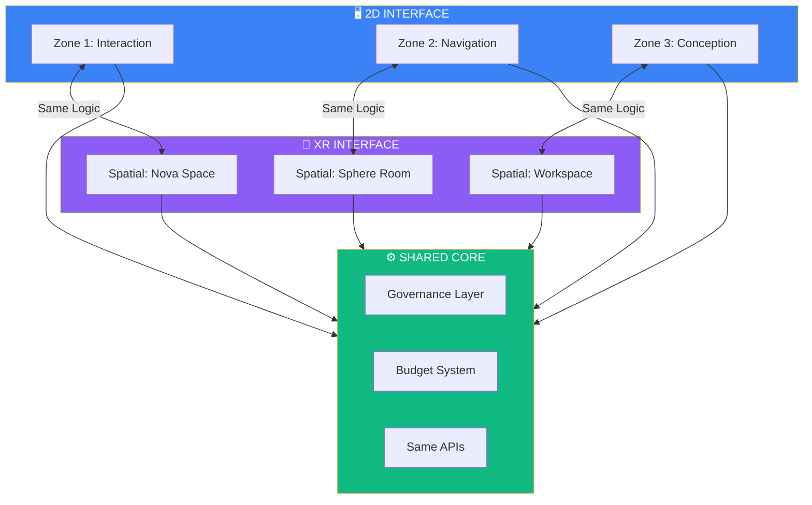

# XR Interface Mapping

## XR Rules

1. **XR is interface-only** — same backend
2. **Same governance in spatial**
3. **Same confirmation requirements**
4. **Same budget enforcement**
5. **No spatial shortcuts to bypass consent**
6. **No implicit recording in XR**
