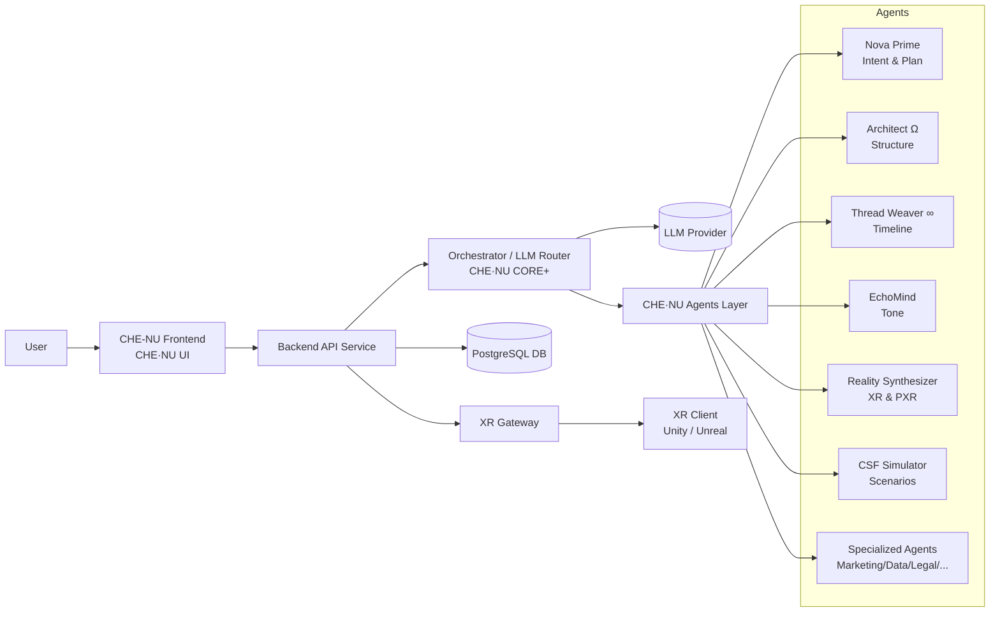
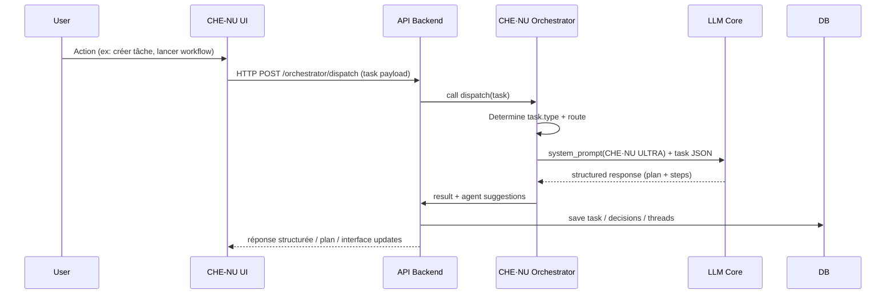
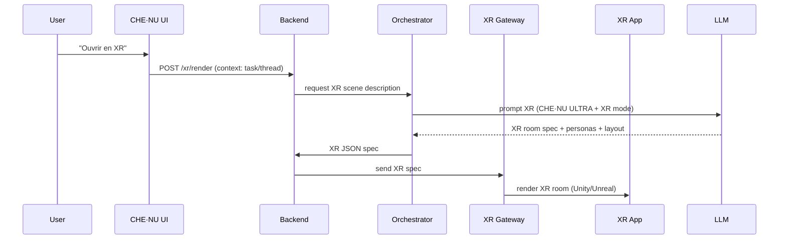

# CHE·NU — Diagrammes Orchestrateur
> Version: 1.0 | Architecture & Flux

---

## 1. Vue Système Globale



---

## 2. Flow d'une Requête Typique



---

## 3. Flux avec XR & PXR



---

## 4. Architecture Complète

```
┌─────────────────────────────────────────────────────────────────────┐
│                           USER LAYER                                │
│  ┌─────────────┐  ┌─────────────┐  ┌─────────────┐                 │
│  │   Web UI    │  │  Mobile App │  │  XR Client  │                 │
│  └──────┬──────┘  └──────┬──────┘  └──────┬──────┘                 │
└─────────┼────────────────┼────────────────┼─────────────────────────┘
          │                │                │
          ▼                ▼                ▼
┌─────────────────────────────────────────────────────────────────────┐
│                          API GATEWAY                                │
│  ┌──────────────────────────────────────────────────────────────┐  │
│  │  /api/orchestrator  │  /api/agents  │  /api/xr  │  /api/...  │  │
│  └──────────────────────────────────────────────────────────────┘  │
└─────────────────────────────┬───────────────────────────────────────┘
                              │
                              ▼
┌─────────────────────────────────────────────────────────────────────┐
│                      ORCHESTRATION LAYER                            │
│  ┌────────────────────────────────────────────────────────────┐    │
│  │            CHE·NU CORE+ / ULTRA PACK                       │    │
│  │  ┌──────────┐  ┌──────────┐  ┌──────────┐  ┌──────────┐   │    │
│  │  │ Task     │  │ LLM      │  │ Agent    │  │ Output   │   │    │
│  │  │ Router   │  │ Router   │  │ Manager  │  │ Protocol │   │    │
│  │  └──────────┘  └──────────┘  └──────────┘  └──────────┘   │    │
│  └────────────────────────────────────────────────────────────┘    │
└─────────────────────────────┬───────────────────────────────────────┘
                              │
                              ▼
┌─────────────────────────────────────────────────────────────────────┐
│                         AGENTS LAYER                                │
│  ┌─────────┐ ┌─────────┐ ┌─────────┐ ┌─────────┐ ┌─────────┐      │
│  │  Nova   │ │Architect│ │ Thread  │ │  Echo   │ │ Reality │      │
│  │  Prime  │ │  Omega  │ │ Weaver  │ │  Mind   │ │Synthesiz│      │
│  └─────────┘ └─────────┘ └─────────┘ └─────────┘ └─────────┘      │
│  ┌─────────┐ ┌─────────┐ ┌─────────────────────────────────┐      │
│  │   CSF   │ │   PXR   │ │      Specialized Agents         │      │
│  │Simulator│ │ Engine  │ │ Marketing│Data│Legal│Finance... │      │
│  └─────────┘ └─────────┘ └─────────────────────────────────┘      │
└─────────────────────────────┬───────────────────────────────────────┘
                              │
                              ▼
┌─────────────────────────────────────────────────────────────────────┐
│                         DATA LAYER                                  │
│  ┌──────────────┐  ┌──────────────┐  ┌──────────────┐              │
│  │  PostgreSQL  │  │    Redis     │  │  Vector DB   │              │
│  │   (Core DB)  │  │   (Cache)    │  │ (Embeddings) │              │
│  └──────────────┘  └──────────────┘  └──────────────┘              │
└─────────────────────────────────────────────────────────────────────┘
```

---

**CHE·NU ORCHESTRATOR — SYSTEM ARCHITECTURE** 🚀
