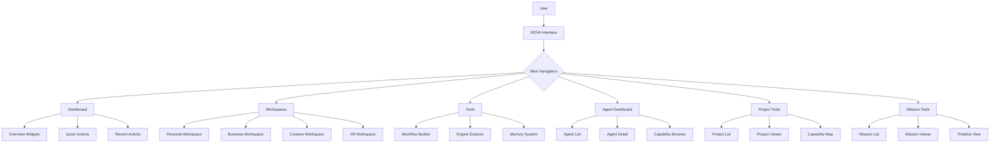
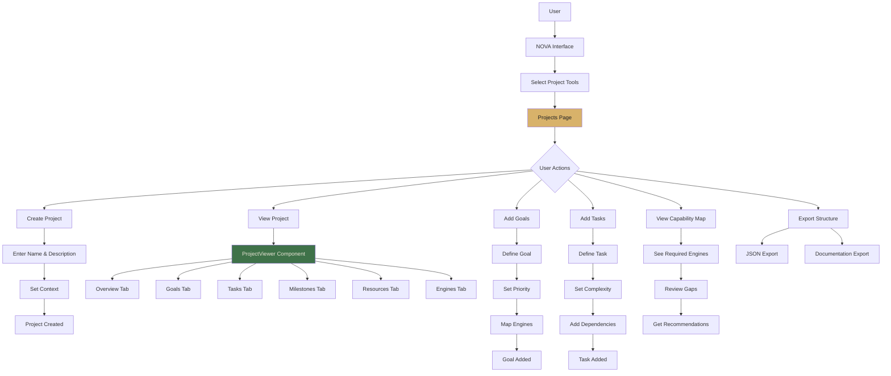
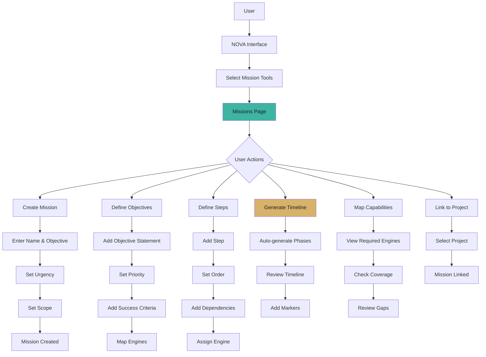
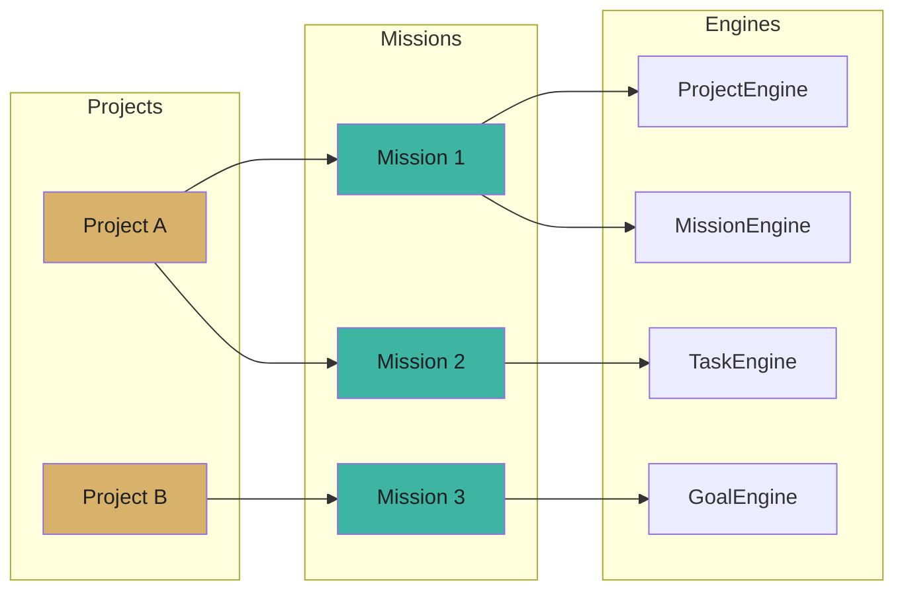
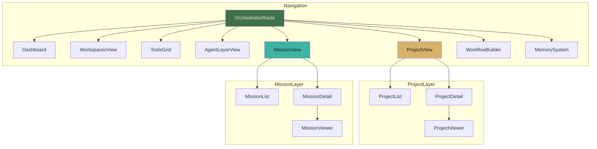

############################################################
#                                                          #
#       CHE·NU PROJECT & MISSION LAYER                     #
#       PART 5: SYSTEM UPDATES                             #
#       SAFE · REPRESENTATIONAL · NON-AUTONOMOUS           #
#                                                          #
############################################################

============================================================
SECTION 6 — SYSTEM INDEX UPDATE
============================================================

--- FILE: /che-nu-sdk/system_index.json
--- ACTION: UPDATE FILE (ADD PROJECT & MISSION LAYER)

{
  "name": "CHE·NU SDK",
  "version": "2.6.0",
  "description": "SAFE · NON-AUTONOMOUS · REPRESENTATIONAL Architecture Framework",
  "classification": {
    "type": "sdk",
    "isNotASphere": true,
    "isRepresentational": true
  },
  "modules": {
    "core": {
      "UniverseOS": {
        "path": "/che-nu-sdk/core/universe.ts",
        "description": "Universal operating layer",
        "version": "1.0.0"
      },
      "Workspaces": {
        "path": "/che-nu-sdk/core/workspaces.ts",
        "description": "Workspace management system",
        "version": "1.0.0"
      },
      "HyperFabric": {
        "path": "/che-nu-sdk/core/hyperfabric.ts",
        "description": "Interconnection layer",
        "version": "1.0.0"
      },
      "Cartography": {
        "path": "/che-nu-sdk/core/cartography.ts",
        "description": "Navigation and mapping",
        "version": "1.0.0"
      },
      "DepthLens": {
        "path": "/che-nu-sdk/core/depth-lens.ts",
        "description": "Depth perception layer",
        "version": "1.0.0"
      },
      "ProjectionEngine": {
        "path": "/che-nu-sdk/core/projection.ts",
        "description": "Context projection system",
        "version": "1.0.0"
      },
      "Orchestrator": {
        "path": "/che-nu-sdk/core/orchestrator.ts",
        "description": "Routing-only orchestration (non-autonomous)",
        "version": "1.1.0"
      },
      "ContextInterpreter": {
        "path": "/che-nu-sdk/core/context_interpreter.ts",
        "description": "Input context analysis and domain routing",
        "version": "1.1.0"
      },
      "AgentProfileEngine": {
        "path": "/che-nu-sdk/core/agent_profile.ts",
        "description": "Agent capability profile definitions",
        "version": "1.0.0"
      },
      "AgentRegistry": {
        "path": "/che-nu-sdk/core/agent_registry.ts",
        "description": "In-memory agent profile registry",
        "version": "1.0.0"
      },
      "AgentTemplates": {
        "path": "/che-nu-sdk/core/agent_templates.ts",
        "description": "Pre-configured agent profile templates",
        "version": "1.0.0"
      },
      "ProjectEngine": {
        "path": "/che-nu-sdk/core/project.ts",
        "description": "Representational project structure engine",
        "version": "1.0.0",
        "subModules": {
          "GoalsEngine": "/che-nu-sdk/core/project/goals.engine.ts",
          "TasksEngine": "/che-nu-sdk/core/project/tasks.engine.ts",
          "MilestoneEngine": "/che-nu-sdk/core/project/milestone.engine.ts",
          "ResourcesEngine": "/che-nu-sdk/core/project/resources.engine.ts",
          "CapabilityEngine": "/che-nu-sdk/core/project/capability.engine.ts"
        }
      },
      "MissionEngine": {
        "path": "/che-nu-sdk/core/mission.ts",
        "description": "Representational mission structure engine",
        "version": "1.0.0",
        "subModules": {
          "ObjectivesEngine": "/che-nu-sdk/core/mission/objectives.engine.ts",
          "StepsEngine": "/che-nu-sdk/core/mission/steps.engine.ts",
          "MissionTimelineEngine": "/che-nu-sdk/core/mission/timeline.engine.ts",
          "MissionCapabilityMapEngine": "/che-nu-sdk/core/mission/capability_map.engine.ts"
        }
      }
    },
    "engines": {
      "HealthEngine": {
        "path": "/che-nu-sdk/engines/health.ts",
        "description": "Health and wellness management",
        "subEngines": ["FitnessEngine", "NutritionEngine", "SleepEngine", "WellnessEngine", "VitalEngine"],
        "version": "1.0.0"
      },
      "FinanceEngine": {
        "path": "/che-nu-sdk/engines/finance.ts",
        "description": "Financial planning and analysis",
        "subEngines": ["BudgetEngine", "InvestmentEngine", "TaxEngine", "RetirementEngine", "DebtEngine"],
        "version": "1.0.0"
      },
      "KnowledgeEngine": {
        "path": "/che-nu-sdk/engines/knowledge.ts",
        "description": "Knowledge organization and mapping",
        "subEngines": ["TaxonomyEngine", "ConnectionEngine", "VisualizationEngine"],
        "version": "1.0.0"
      },
      "EmotionEngine": {
        "path": "/che-nu-sdk/engines/emotion.ts",
        "description": "Emotional awareness and regulation",
        "subEngines": ["AwarenessEngine", "RegulationEngine", "ResilienceEngine"],
        "version": "1.0.0"
      },
      "ProductivityEngine": {
        "path": "/che-nu-sdk/engines/productivity.ts",
        "description": "Personal productivity optimization",
        "subEngines": ["TimeBlockEngine", "FocusEngine", "HabitEngine", "EnergyEngine"],
        "version": "1.0.0"
      },
      "SkillEngine": {
        "path": "/che-nu-sdk/engines/skill.ts",
        "description": "Skill development and tracking",
        "subEngines": ["TaxonomyEngine", "GapAnalysisEngine", "RoadmapEngine", "AssessmentEngine"],
        "version": "1.0.0"
      },
      "MethodologyEngine": {
        "path": "/che-nu-sdk/engines/methodology.ts",
        "description": "Methodology frameworks and operators",
        "version": "1.0.0"
      },
      "MemoryManager": {
        "path": "/che-nu-sdk/engines/memory.ts",
        "description": "External documentary memory system",
        "version": "1.0.0"
      },
      "ReplayEngine": {
        "path": "/che-nu-sdk/engines/replay.ts",
        "description": "Decision replay and analysis",
        "version": "1.0.0"
      },
      "GoalEngine": {
        "path": "/che-nu-sdk/engines/goal.ts",
        "description": "Goal setting and tracking",
        "version": "1.0.0"
      },
      "AnalysisEngine": {
        "path": "/che-nu-sdk/engines/analysis.ts",
        "description": "Data analysis and pattern recognition",
        "subEngines": ["DataEngine", "PatternEngine", "SynthesisEngine"],
        "version": "1.0.0"
      },
      "StrategyEngine": {
        "path": "/che-nu-sdk/engines/strategy.ts",
        "description": "Strategic planning and execution",
        "subEngines": ["VisionEngine", "AnalysisEngine", "PositioningEngine", "RoadmapEngine", "ExecutionEngine"],
        "version": "1.0.0"
      },
      "DecisionEngine": {
        "path": "/che-nu-sdk/engines/decision.ts",
        "description": "Decision frameworks and analysis",
        "version": "1.0.0"
      },
      "ReflectionEngine": {
        "path": "/che-nu-sdk/engines/reflection.ts",
        "description": "Journaling and reflection workflows",
        "version": "1.0.0"
      },
      "RelationshipEngine": {
        "path": "/che-nu-sdk/engines/relationship.ts",
        "description": "Relationship management and networking",
        "version": "1.0.0"
      },
      "DocumentFormatEngine": {
        "path": "/che-nu-sdk/engines/document-format.ts",
        "description": "Document formatting and export",
        "version": "1.0.0"
      },
      "CommunicationEngine": {
        "path": "/che-nu-sdk/engines/communication.ts",
        "description": "Communication and messaging frameworks",
        "subEngines": ["MessagingEngine", "ChannelEngine", "PresentationEngine", "NegotiationEngine"],
        "version": "1.0.0"
      },
      "XRSceneEngine": {
        "path": "/che-nu-sdk/engines/xr-scene.ts",
        "description": "XR scene design and blueprinting",
        "subEngines": ["EnvironmentEngine", "AvatarDesignEngine", "InteractionDesignEngine", "LightingDesignEngine", "SpatialUIEngine"],
        "version": "1.0.0"
      },
      "ResearchEngine": {
        "path": "/che-nu-sdk/engines/research.ts",
        "description": "Research process structuring",
        "subEngines": ["SourceManagementEngine", "SynthesisEngine", "CitationEngine", "LiteratureEngine", "MethodologyResearchEngine"],
        "version": "1.0.0"
      },
      "ContentEngine": {
        "path": "/che-nu-sdk/engines/content.ts",
        "description": "Content creation and strategy",
        "subEngines": ["StoryEngine", "BrandVoiceEngine", "MediaPlanningEngine", "EditorialEngine", "ContentStrategyEngine"],
        "version": "1.0.0"
      },
      "TaskEngine": {
        "path": "/che-nu-sdk/engines/task.ts",
        "description": "Task management and prioritization",
        "subEngines": ["PriorityEngine", "DeadlineEngine", "DelegationEngine", "DependencyEngine", "BatchingEngine"],
        "version": "1.0.0"
      },
      "SchedulingEngine": {
        "path": "/che-nu-sdk/engines/scheduling.ts",
        "description": "Time management and calendar planning",
        "subEngines": ["TimeBlockEngine", "AvailabilityEngine", "RecurrenceEngine", "ConflictEngine", "OptimizationEngine"],
        "version": "1.0.0"
      },
      "CollaborationEngine": {
        "path": "/che-nu-sdk/engines/collaboration.ts",
        "description": "Team coordination and meetings",
        "subEngines": ["TeamEngine", "MeetingEngine", "StatusEngine", "HandoffEngine", "FeedbackCollabEngine"],
        "version": "1.0.0"
      },
      "DataEngine": {
        "path": "/che-nu-sdk/engines/data.ts",
        "description": "Data processing and visualization",
        "subEngines": ["ProcessingEngine", "TransformEngine", "QualityEngine", "VisualizationEngine", "PipelineEngine"],
        "version": "1.0.0"
      },
      "CreativityEngine": {
        "path": "/che-nu-sdk/engines/creativity.ts",
        "description": "Creative process and ideation",
        "subEngines": ["IdeationEngine", "BrainstormEngine", "IterationEngine", "EvaluationEngine"],
        "version": "1.0.0"
      },
      "LearningEngine": {
        "path": "/che-nu-sdk/engines/learning.ts",
        "description": "Learning design and curriculum",
        "version": "1.0.0"
      },
      "HabitEngine": {
        "path": "/che-nu-sdk/engines/habit.ts",
        "description": "Habit formation and tracking",
        "version": "1.0.0"
      }
    },
    "schemas": {
      "project": {
        "path": "/che-nu-sdk/schemas/project.schema.json",
        "description": "Project structure JSON schema"
      },
      "mission": {
        "path": "/che-nu-sdk/schemas/mission.schema.json",
        "description": "Mission structure JSON schema"
      },
      "agent_profile": {
        "path": "/che-nu-sdk/schemas/agent_profile.schema.json",
        "description": "Agent profile JSON schema"
      },
      "xr_scene": {
        "path": "/che-nu-sdk/schemas/xr_scene.schema.json",
        "description": "XR scene JSON schema"
      }
    },
    "memory": {
      "MemorySystem": {
        "path": "/memory/",
        "description": "External documentary memory system",
        "version": "1.0.0"
      }
    },
    "xr": {
      "XRSuite": {
        "path": "/che-nu-sdk/xr/",
        "description": "XR scene building and orchestration",
        "version": "1.0.0"
      }
    }
  },
  "layers": {
    "agentCapabilityLayer": {
      "description": "Representational agent profiles linking engines to capabilities",
      "modules": {
        "AgentProfileEngine": "/che-nu-sdk/core/agent_profile.ts",
        "AgentRegistry": "/che-nu-sdk/core/agent_registry.ts",
        "AgentTemplates": "/che-nu-sdk/core/agent_templates.ts"
      },
      "templates": 12
    },
    "projectMissionLayer": {
      "description": "Representational project and mission structure management",
      "modules": {
        "ProjectEngine": "/che-nu-sdk/core/project.ts",
        "MissionEngine": "/che-nu-sdk/core/mission.ts"
      },
      "subModules": {
        "project": ["GoalsEngine", "TasksEngine", "MilestoneEngine", "ResourcesEngine", "CapabilityEngine"],
        "mission": ["ObjectivesEngine", "StepsEngine", "MissionTimelineEngine", "MissionCapabilityMapEngine"]
      }
    }
  },
  "statistics": {
    "totalCoreModules": 13,
    "totalEngines": 28,
    "totalSubEngines": 67,
    "totalAgentTemplates": 12,
    "totalSchemas": 4,
    "projectSubModules": 5,
    "missionSubModules": 4
  },
  "safe": {
    "isRepresentational": true,
    "noAutonomy": true,
    "noExecution": true,
    "noPersistence": true
  },
  "meta": {
    "generated": "2024-12-12",
    "version": "2.6.0"
  }
}

============================================================
SECTION 7 — ORCHESTRATOR UPDATE
============================================================

--- FILE: /che-nu-sdk/core/orchestrator.ts
--- ACTION: UPDATE FILE (ADD PROJECT & MISSION ROUTING)

/**
 * CHE·NU SDK — Orchestrator
 * ==========================
 * SAFE · NON-AUTONOMOUS · REPRESENTATIONAL
 * 
 * Routing-only orchestration layer.
 * Routes requests to appropriate engines based on domain.
 * 
 * NO EXECUTION — routing only.
 * 
 * @module Orchestrator
 * @version 1.1.0
 */

// ============================================================
// TYPE DEFINITIONS
// ============================================================

export type Domain = 
  | 'Health'
  | 'Finance'
  | 'Knowledge'
  | 'Emotion'
  | 'Productivity'
  | 'Skill'
  | 'Strategy'
  | 'Decision'
  | 'Reflection'
  | 'Relationship'
  | 'Communication'
  | 'XR'
  | 'Research'
  | 'Content'
  | 'Task'
  | 'Scheduling'
  | 'Collaboration'
  | 'Data'
  | 'Creativity'
  | 'Learning'
  | 'Habit'
  | 'Goal'
  | 'Agent'
  | 'Project'    // NEW
  | 'Mission'    // NEW
  | 'Unknown';

export interface RouteResult {
  domain: Domain;
  engine: string;
  subEngine?: string;
  confidence: number;
  alternativeEngines: string[];
  routingReason: string;
}

export interface OrchestratorConfig {
  defaultDomain: Domain;
  enableLogging: boolean;
  strictMode: boolean;
}

// ============================================================
// DOMAIN TO ENGINE MAPPING
// ============================================================

const DOMAIN_ENGINE_MAP: Record<Domain, string> = {
  Health: 'HealthEngine',
  Finance: 'FinanceEngine',
  Knowledge: 'KnowledgeEngine',
  Emotion: 'EmotionEngine',
  Productivity: 'ProductivityEngine',
  Skill: 'SkillEngine',
  Strategy: 'StrategyEngine',
  Decision: 'DecisionEngine',
  Reflection: 'ReflectionEngine',
  Relationship: 'RelationshipEngine',
  Communication: 'CommunicationEngine',
  XR: 'XRSceneEngine',
  Research: 'ResearchEngine',
  Content: 'ContentEngine',
  Task: 'TaskEngine',
  Scheduling: 'SchedulingEngine',
  Collaboration: 'CollaborationEngine',
  Data: 'DataEngine',
  Creativity: 'CreativityEngine',
  Learning: 'LearningEngine',
  Habit: 'HabitEngine',
  Goal: 'GoalEngine',
  Agent: 'AgentProfileEngine',
  Project: 'ProjectEngine',    // NEW
  Mission: 'MissionEngine',    // NEW
  Unknown: 'MethodologyEngine',
};

// ============================================================
// ALTERNATIVE ENGINES BY DOMAIN
// ============================================================

const ALTERNATIVE_ENGINES: Record<Domain, string[]> = {
  Health: ['HabitEngine', 'GoalEngine', 'EmotionEngine'],
  Finance: ['AnalysisEngine', 'DecisionEngine', 'StrategyEngine'],
  Knowledge: ['ResearchEngine', 'LearningEngine', 'SkillEngine'],
  Emotion: ['ReflectionEngine', 'RelationshipEngine', 'HealthEngine'],
  Productivity: ['TaskEngine', 'SchedulingEngine', 'HabitEngine'],
  Skill: ['LearningEngine', 'KnowledgeEngine', 'GoalEngine'],
  Strategy: ['DecisionEngine', 'AnalysisEngine', 'GoalEngine'],
  Decision: ['StrategyEngine', 'AnalysisEngine', 'MethodologyEngine'],
  Reflection: ['EmotionEngine', 'JournalEngine', 'GoalEngine'],
  Relationship: ['CommunicationEngine', 'EmotionEngine', 'CollaborationEngine'],
  Communication: ['ContentEngine', 'RelationshipEngine', 'CollaborationEngine'],
  XR: ['CreativityEngine', 'ContentEngine', 'DataEngine'],
  Research: ['KnowledgeEngine', 'AnalysisEngine', 'ContentEngine'],
  Content: ['CreativityEngine', 'CommunicationEngine', 'ResearchEngine'],
  Task: ['ProductivityEngine', 'SchedulingEngine', 'ProjectEngine'],
  Scheduling: ['TaskEngine', 'ProductivityEngine', 'CollaborationEngine'],
  Collaboration: ['CommunicationEngine', 'TaskEngine', 'ProjectEngine'],
  Data: ['AnalysisEngine', 'ResearchEngine', 'KnowledgeEngine'],
  Creativity: ['ContentEngine', 'XRSceneEngine', 'IdeationEngine'],
  Learning: ['SkillEngine', 'KnowledgeEngine', 'ContentEngine'],
  Habit: ['ProductivityEngine', 'HealthEngine', 'GoalEngine'],
  Goal: ['StrategyEngine', 'ProductivityEngine', 'ProjectEngine'],
  Agent: ['AgentRegistry', 'AgentTemplates', 'MethodologyEngine'],
  Project: ['MissionEngine', 'TaskEngine', 'GoalEngine', 'CollaborationEngine'],  // NEW
  Mission: ['ProjectEngine', 'GoalEngine', 'TaskEngine', 'StrategyEngine'],       // NEW
  Unknown: ['KnowledgeEngine', 'AnalysisEngine', 'ResearchEngine'],
};

// ============================================================
// ORCHESTRATOR CLASS
// ============================================================

export class Orchestrator {
  private config: OrchestratorConfig;
  private routeLog: RouteResult[] = [];
  
  constructor(config?: Partial<OrchestratorConfig>) {
    this.config = {
      defaultDomain: 'Unknown',
      enableLogging: false,
      strictMode: false,
      ...config,
    };
  }
  
  /**
   * Route a domain to its primary engine
   * ROUTING ONLY — no execution
   */
  route(domain: Domain): RouteResult {
    const engine = DOMAIN_ENGINE_MAP[domain] || DOMAIN_ENGINE_MAP.Unknown;
    const alternatives = ALTERNATIVE_ENGINES[domain] || [];
    
    const result: RouteResult = {
      domain,
      engine,
      confidence: domain === 'Unknown' ? 0.5 : 0.9,
      alternativeEngines: alternatives,
      routingReason: this.getRoutingReason(domain),
    };
    
    if (this.config.enableLogging) {
      this.routeLog.push(result);
    }
    
    return result;
  }
  
  /**
   * Route with sub-engine specification
   */
  routeWithSubEngine(domain: Domain, subEngineHint?: string): RouteResult {
    const result = this.route(domain);
    
    if (subEngineHint) {
      result.subEngine = subEngineHint;
    }
    
    return result;
  }
  
  /**
   * Get routing reason for documentation
   */
  private getRoutingReason(domain: Domain): string {
    const reasons: Record<Domain, string> = {
      Health: 'Health and wellness domain detected',
      Finance: 'Financial planning domain detected',
      Knowledge: 'Knowledge organization domain detected',
      Emotion: 'Emotional awareness domain detected',
      Productivity: 'Personal productivity domain detected',
      Skill: 'Skill development domain detected',
      Strategy: 'Strategic planning domain detected',
      Decision: 'Decision-making domain detected',
      Reflection: 'Self-reflection domain detected',
      Relationship: 'Relationship management domain detected',
      Communication: 'Communication domain detected',
      XR: 'XR/immersive experience domain detected',
      Research: 'Research process domain detected',
      Content: 'Content creation domain detected',
      Task: 'Task management domain detected',
      Scheduling: 'Time/calendar domain detected',
      Collaboration: 'Team collaboration domain detected',
      Data: 'Data processing domain detected',
      Creativity: 'Creative process domain detected',
      Learning: 'Learning/education domain detected',
      Habit: 'Habit formation domain detected',
      Goal: 'Goal setting domain detected',
      Agent: 'Agent capability domain detected',
      Project: 'Project structure domain detected',    // NEW
      Mission: 'Mission/objective domain detected',    // NEW
      Unknown: 'Domain unclear, using methodology fallback',
    };
    
    return reasons[domain];
  }
  
  /**
   * Get all available routes
   */
  getAvailableRoutes(): Record<Domain, string> {
    return { ...DOMAIN_ENGINE_MAP };
  }
  
  /**
   * Get route log (if logging enabled)
   */
  getRouteLog(): RouteResult[] {
    return [...this.routeLog];
  }
  
  /**
   * Clear route log
   */
  clearRouteLog(): void {
    this.routeLog = [];
  }
  
  /**
   * Module metadata
   */
  static meta(): Record<string, unknown> {
    return {
      name: 'Orchestrator',
      version: '1.1.0',
      description: 'Routing-only orchestration layer for CHE·NU',
      totalDomains: Object.keys(DOMAIN_ENGINE_MAP).length,
      safe: {
        isRepresentational: true,
        noAutonomy: true,
        noExecution: true,
      },
      changelog: {
        '1.1.0': 'Added Project and Mission domain routing',
        '1.0.0': 'Initial release',
      },
    };
  }
}

// ============================================================
// CONVENIENCE FUNCTIONS
// ============================================================

const defaultOrchestrator = new Orchestrator();

/**
 * Quick route function
 */
export function route(domain: Domain): RouteResult {
  return defaultOrchestrator.route(domain);
}

/**
 * Get engine for domain
 */
export function getEngineForDomain(domain: Domain): string {
  return DOMAIN_ENGINE_MAP[domain] || DOMAIN_ENGINE_MAP.Unknown;
}

/**
 * Check if domain is valid
 */
export function isValidDomain(domain: string): domain is Domain {
  return domain in DOMAIN_ENGINE_MAP;
}

export default Orchestrator;

============================================================
SECTION 8 — CONTEXT INTERPRETER UPDATE
============================================================

--- FILE: /che-nu-sdk/core/context_interpreter.ts
--- ACTION: UPDATE FILE (ADD PROJECT & MISSION DETECTION)

/**
 * CHE·NU SDK — Context Interpreter
 * =================================
 * SAFE · NON-AUTONOMOUS · REPRESENTATIONAL
 * 
 * Analyzes input context to determine domain routing.
 * Pattern-based detection, no learning or persistence.
 * 
 * @module ContextInterpreter
 * @version 1.1.0
 */

import type { Domain } from './orchestrator';

// ============================================================
// TYPE DEFINITIONS
// ============================================================

export interface InterpretationResult {
  primaryDomain: Domain;
  secondaryDomains: Domain[];
  confidence: number;
  matchedKeywords: string[];
  suggestedEngine: string;
  context: {
    intent: string;
    complexity: 'simple' | 'moderate' | 'complex';
    urgency: 'low' | 'normal' | 'high' | 'critical';
  };
}

export interface KeywordPattern {
  keywords: string[];
  domain: Domain;
  weight: number;
}

// ============================================================
// KEYWORD PATTERNS
// ============================================================

const KEYWORD_PATTERNS: KeywordPattern[] = [
  // Health
  { keywords: ['health', 'fitness', 'exercise', 'nutrition', 'sleep', 'wellness', 'diet', 'workout'], domain: 'Health', weight: 1.0 },
  
  // Finance
  { keywords: ['finance', 'money', 'budget', 'investment', 'savings', 'tax', 'expense', 'income', 'wealth'], domain: 'Finance', weight: 1.0 },
  
  // Knowledge
  { keywords: ['knowledge', 'learn', 'understand', 'concept', 'information', 'taxonomy', 'organize'], domain: 'Knowledge', weight: 0.9 },
  
  // Emotion
  { keywords: ['emotion', 'feeling', 'mood', 'stress', 'anxiety', 'happiness', 'mental', 'emotional'], domain: 'Emotion', weight: 1.0 },
  
  // Productivity
  { keywords: ['productivity', 'efficient', 'focus', 'time management', 'workflow', 'optimize'], domain: 'Productivity', weight: 1.0 },
  
  // Skill
  { keywords: ['skill', 'ability', 'competency', 'capability', 'expertise', 'proficiency'], domain: 'Skill', weight: 0.9 },
  
  // Strategy
  { keywords: ['strategy', 'strategic', 'vision', 'positioning', 'competitive', 'long-term'], domain: 'Strategy', weight: 1.0 },
  
  // Decision
  { keywords: ['decision', 'decide', 'choice', 'option', 'trade-off', 'evaluate', 'assess'], domain: 'Decision', weight: 1.0 },
  
  // Reflection
  { keywords: ['reflect', 'journal', 'introspect', 'review', 'gratitude', 'mindful'], domain: 'Reflection', weight: 0.9 },
  
  // Relationship
  { keywords: ['relationship', 'network', 'connection', 'friend', 'family', 'colleague', 'stakeholder'], domain: 'Relationship', weight: 1.0 },
  
  // Communication
  { keywords: ['communication', 'message', 'email', 'present', 'speak', 'negotiate', 'convince'], domain: 'Communication', weight: 1.0 },
  
  // XR
  { keywords: ['xr', 'vr', 'ar', 'immersive', '3d', 'virtual', 'spatial', 'metaverse'], domain: 'XR', weight: 1.0 },
  
  // Research
  { keywords: ['research', 'study', 'investigate', 'analyze', 'source', 'cite', 'literature'], domain: 'Research', weight: 1.0 },
  
  // Content
  { keywords: ['content', 'write', 'create', 'article', 'blog', 'story', 'brand', 'editorial'], domain: 'Content', weight: 1.0 },
  
  // Task
  { keywords: ['task', 'todo', 'checklist', 'action item', 'deliverable', 'assignment'], domain: 'Task', weight: 1.0 },
  
  // Scheduling
  { keywords: ['schedule', 'calendar', 'appointment', 'meeting time', 'availability', 'book'], domain: 'Scheduling', weight: 1.0 },
  
  // Collaboration
  { keywords: ['collaboration', 'team', 'together', 'coordinate', 'sync', 'handoff', 'delegate'], domain: 'Collaboration', weight: 1.0 },
  
  // Data
  { keywords: ['data', 'database', 'analytics', 'metrics', 'dashboard', 'visualization', 'pipeline'], domain: 'Data', weight: 1.0 },
  
  // Creativity
  { keywords: ['creativity', 'creative', 'brainstorm', 'ideate', 'innovate', 'design', 'artistic'], domain: 'Creativity', weight: 1.0 },
  
  // Learning
  { keywords: ['learning', 'course', 'curriculum', 'education', 'training', 'teach', 'lesson'], domain: 'Learning', weight: 1.0 },
  
  // Habit
  { keywords: ['habit', 'routine', 'daily', 'streak', 'behavior', 'pattern', 'ritual'], domain: 'Habit', weight: 1.0 },
  
  // Goal
  { keywords: ['goal', 'objective', 'target', 'aim', 'aspiration', 'okr', 'kpi'], domain: 'Goal', weight: 1.0 },
  
  // Agent
  { keywords: ['agent', 'assistant', 'ai', 'capability', 'profile', 'template'], domain: 'Agent', weight: 0.9 },
  
  // ═══════════════════════════════════════════════════════════
  // NEW: PROJECT PATTERNS
  // ═══════════════════════════════════════════════════════════
  { 
    keywords: ['project', 'initiative', 'program', 'endeavor', 'undertaking', 'venture'], 
    domain: 'Project', 
    weight: 1.0 
  },
  { 
    keywords: ['plan', 'planning', 'structure', 'organize project', 'project plan'], 
    domain: 'Project', 
    weight: 0.8 
  },
  { 
    keywords: ['milestone', 'deliverable', 'phase', 'stage', 'sprint'], 
    domain: 'Project', 
    weight: 0.9 
  },
  { 
    keywords: ['resource allocation', 'project resource', 'project scope', 'project goal'], 
    domain: 'Project', 
    weight: 1.0 
  },
  
  // ═══════════════════════════════════════════════════════════
  // NEW: MISSION PATTERNS
  // ═══════════════════════════════════════════════════════════
  { 
    keywords: ['mission', 'objective', 'purpose', 'cause', 'quest'], 
    domain: 'Mission', 
    weight: 1.0 
  },
  { 
    keywords: ['execute', 'accomplish', 'achieve', 'complete mission', 'mission critical'], 
    domain: 'Mission', 
    weight: 0.9 
  },
  { 
    keywords: ['timeline', 'time-bound', 'deadline mission', 'urgent mission'], 
    domain: 'Mission', 
    weight: 0.8 
  },
  { 
    keywords: ['outcome', 'result', 'success criteria', 'key result'], 
    domain: 'Mission', 
    weight: 0.9 
  },
];

// ============================================================
// URGENCY PATTERNS
// ============================================================

const URGENCY_KEYWORDS: Record<string, 'low' | 'normal' | 'high' | 'critical'> = {
  'whenever': 'low',
  'sometime': 'low',
  'eventually': 'low',
  'soon': 'normal',
  'today': 'normal',
  'this week': 'normal',
  'urgent': 'high',
  'important': 'high',
  'asap': 'high',
  'critical': 'critical',
  'emergency': 'critical',
  'immediately': 'critical',
  'now': 'critical',
};

// ============================================================
// CONTEXT INTERPRETER
// ============================================================

/**
 * Interpret input text to determine domain
 */
export function interpret(input: string): InterpretationResult {
  const lowerInput = input.toLowerCase();
  const matchedPatterns: { domain: Domain; weight: number; keywords: string[] }[] = [];
  
  // Find matching patterns
  KEYWORD_PATTERNS.forEach(pattern => {
    const matchedKeywords: string[] = [];
    pattern.keywords.forEach(keyword => {
      if (lowerInput.includes(keyword.toLowerCase())) {
        matchedKeywords.push(keyword);
      }
    });
    
    if (matchedKeywords.length > 0) {
      matchedPatterns.push({
        domain: pattern.domain,
        weight: pattern.weight * matchedKeywords.length,
        keywords: matchedKeywords,
      });
    }
  });
  
  // Sort by weight
  matchedPatterns.sort((a, b) => b.weight - a.weight);
  
  // Determine primary and secondary domains
  const primaryDomain = matchedPatterns.length > 0 ? matchedPatterns[0].domain : 'Unknown';
  const secondaryDomains = matchedPatterns
    .slice(1, 4)
    .map(p => p.domain)
    .filter((d, i, arr) => arr.indexOf(d) === i);
  
  // Calculate confidence
  const confidence = matchedPatterns.length > 0
    ? Math.min(0.95, 0.5 + (matchedPatterns[0].weight * 0.15))
    : 0.3;
  
  // Determine urgency
  let urgency: 'low' | 'normal' | 'high' | 'critical' = 'normal';
  for (const [keyword, level] of Object.entries(URGENCY_KEYWORDS)) {
    if (lowerInput.includes(keyword)) {
      urgency = level;
      break;
    }
  }
  
  // Determine complexity
  const wordCount = input.split(/\s+/).length;
  const complexity: 'simple' | 'moderate' | 'complex' = 
    wordCount < 10 ? 'simple' : wordCount < 30 ? 'moderate' : 'complex';
  
  // Get suggested engine
  const engineMap: Record<Domain, string> = {
    Health: 'HealthEngine',
    Finance: 'FinanceEngine',
    Knowledge: 'KnowledgeEngine',
    Emotion: 'EmotionEngine',
    Productivity: 'ProductivityEngine',
    Skill: 'SkillEngine',
    Strategy: 'StrategyEngine',
    Decision: 'DecisionEngine',
    Reflection: 'ReflectionEngine',
    Relationship: 'RelationshipEngine',
    Communication: 'CommunicationEngine',
    XR: 'XRSceneEngine',
    Research: 'ResearchEngine',
    Content: 'ContentEngine',
    Task: 'TaskEngine',
    Scheduling: 'SchedulingEngine',
    Collaboration: 'CollaborationEngine',
    Data: 'DataEngine',
    Creativity: 'CreativityEngine',
    Learning: 'LearningEngine',
    Habit: 'HabitEngine',
    Goal: 'GoalEngine',
    Agent: 'AgentProfileEngine',
    Project: 'ProjectEngine',    // NEW
    Mission: 'MissionEngine',    // NEW
    Unknown: 'MethodologyEngine',
  };
  
  return {
    primaryDomain,
    secondaryDomains,
    confidence,
    matchedKeywords: matchedPatterns.flatMap(p => p.keywords).slice(0, 10),
    suggestedEngine: engineMap[primaryDomain],
    context: {
      intent: determineIntent(lowerInput),
      complexity,
      urgency,
    },
  };
}

/**
 * Determine intent from input
 */
function determineIntent(input: string): string {
  if (input.includes('create') || input.includes('make') || input.includes('build')) {
    return 'create';
  }
  if (input.includes('analyze') || input.includes('review') || input.includes('assess')) {
    return 'analyze';
  }
  if (input.includes('plan') || input.includes('organize') || input.includes('structure')) {
    return 'plan';
  }
  if (input.includes('track') || input.includes('monitor') || input.includes('measure')) {
    return 'track';
  }
  if (input.includes('help') || input.includes('assist') || input.includes('support')) {
    return 'assist';
  }
  if (input.includes('find') || input.includes('search') || input.includes('discover')) {
    return 'find';
  }
  return 'general';
}

/**
 * Quick domain detection
 */
export function detectDomain(input: string): Domain {
  return interpret(input).primaryDomain;
}

/**
 * Check if input matches a specific domain
 */
export function matchesDomain(input: string, domain: Domain): boolean {
  const result = interpret(input);
  return result.primaryDomain === domain || result.secondaryDomains.includes(domain);
}

/**
 * Module metadata
 */
export function meta(): Record<string, unknown> {
  return {
    name: 'ContextInterpreter',
    version: '1.1.0',
    description: 'Pattern-based context interpretation for domain routing',
    totalPatterns: KEYWORD_PATTERNS.length,
    supportedDomains: [...new Set(KEYWORD_PATTERNS.map(p => p.domain))].length,
    safe: {
      isRepresentational: true,
      noAutonomy: true,
      noLearning: true,
    },
    changelog: {
      '1.1.0': 'Added Project and Mission domain detection patterns',
      '1.0.0': 'Initial release',
    },
  };
}

export default {
  interpret,
  detectDomain,
  matchesDomain,
  meta,
};

============================================================
SECTION 10 — UI FLOW UPDATE
============================================================

--- FILE: /che-nu-app/docs/UI_FLOW.md
--- ACTION: UPDATE FILE (ADD PROJECT & MISSION WORKFLOW SECTION)

# CHE·NU Application — UI Flow Documentation

> **SAFE · NON-AUTONOMOUS · REPRESENTATIONAL**

## Overview

This document describes the user interface flows within the CHE·NU application. All interactions are user-initiated and non-autonomous.

---

## Main Navigation Flow

---

## Project & Mission Layer Flow

### Project Workflow

### Mission Workflow

### Project-Mission Integration

---

## Orchestrator Routes

### Main Routes

| Route | Component | Description |
|-------|-----------|-------------|
| `/` | Dashboard | Main overview |
| `/workspaces` | WorkspaceView | Workspace selection |
| `/tools` | ToolsGrid | Tool selection |
| `/agents` | AgentsPage | Agent capability dashboard |
| `/agents/:id` | AgentDetail | Individual agent view |
| `/projects` | ProjectsPage | Project tools dashboard |
| `/projects/:id` | ProjectDetail | Individual project view |
| `/missions` | MissionsPage | Mission tools dashboard |
| `/missions/:id` | MissionDetail | Individual mission view |
| `/workflows` | WorkflowBuilder | Workflow creation |
| `/memory` | MemorySystem | Memory management |

### Route Flow

---

## User Actions Reference

### Project Tools Actions

| Action | UI Element | Result |
|--------|------------|--------|
| Create Project | "Create Project" button | Opens project creation form |
| View Project | Click project card | Opens ProjectViewer |
| Add Goal | "Add Goal" button in viewer | Opens goal form |
| Add Task | "Add Task" button in viewer | Opens task form |
| Add Milestone | "Add Milestone" button | Opens milestone form |
| View Capabilities | "View Capabilities" button | Shows capability map |
| Map Engines | "Map Engines" button | Shows engine mapping |
| Export Structure | "Export" button | Downloads JSON |

### Mission Tools Actions

| Action | UI Element | Result |
|--------|------------|--------|
| Create Mission | "Create Mission" button | Opens mission creation form |
| View Mission | Click mission card | Opens MissionViewer |
| Define Objectives | "Define Objectives" button | Opens objective form |
| Define Steps | "Define Steps" button | Opens step form |
| Show Timeline | "Show Timeline" button | Displays timeline view |
| Link to Project | "Link to Project" button | Opens project selector |
| Map Engines | "Map Engines" button | Shows capability map |

---

## SAFE Compliance in Project & Mission Layer

All Project & Mission components adhere to SAFE principles:

- **No Autonomous Actions** — Every action requires user click/input
- **Representational Only** — Shows structures and models, not live projects
- **No Real Planning** — Does not provide actual project management advice
- **No Execution** — Does not perform real-world project actions
- **No Persistence** — Structures are for display only, not stored

### Prohibited Features

❌ Real project management advice  
❌ Actual deadline calculation  
❌ Resource allocation recommendations  
❌ Risk assessment with real consequences  
❌ Multi-step actionable plans  
❌ Budget calculations  

### Allowed Features

✓ Structural project models  
✓ Abstract goal/task representations  
✓ Capability mapping to engines  
✓ Symbolic timeline generation  
✓ Visual project/mission viewers  
✓ JSON structure export  

---

## Quick Reference

### Keyboard Shortcuts

| Shortcut | Action |
|----------|--------|
| `Cmd/Ctrl + K` | Open command palette |
| `Cmd/Ctrl + P` | Open Project Tools |
| `Cmd/Ctrl + M` | Open Mission Tools |
| `Cmd/Ctrl + A` | Open Agent Dashboard |
| `Cmd/Ctrl + W` | Open Workspaces |
| `Esc` | Close modal / Go back |

### Status Indicators

| Color | Meaning |
|-------|---------|
| 🟡 Gold (#D8B26A) | Project-related / Active |
| 🔵 Turquoise (#3EB4A2) | Mission-related / Information |
| 🟢 Emerald (#3F7249) | SAFE Compliant / Completed |
| 🟠 Ember (#7A593A) | Warning / High Priority |
| ⚪ Stone (#8D8371) | Draft / Low Priority |
| ⚫ Slate (#1E1F22) | Background |
| 🔴 Red (#E53E3E) | Critical / Blocked |

---

*Last Updated: 2024-12-12 | Version: 2.6.0*
