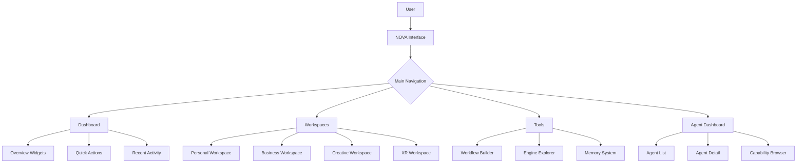
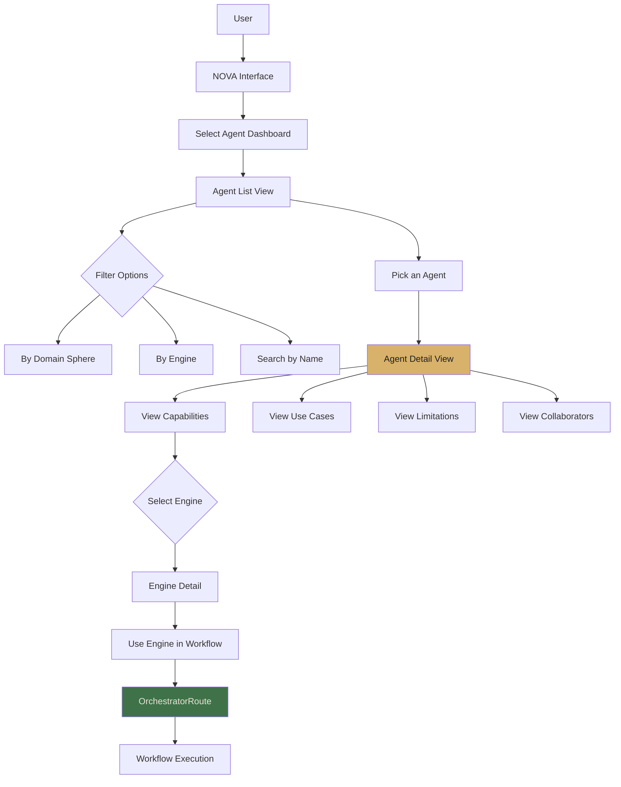
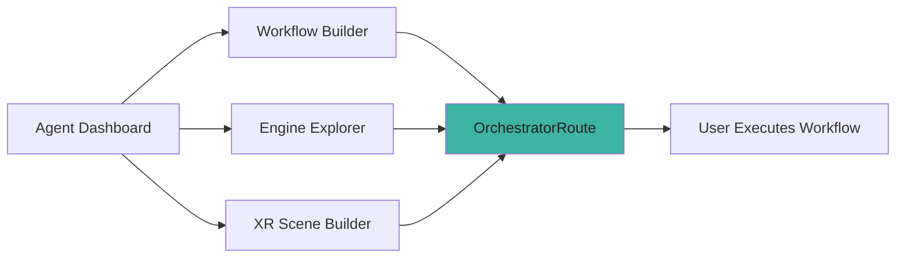
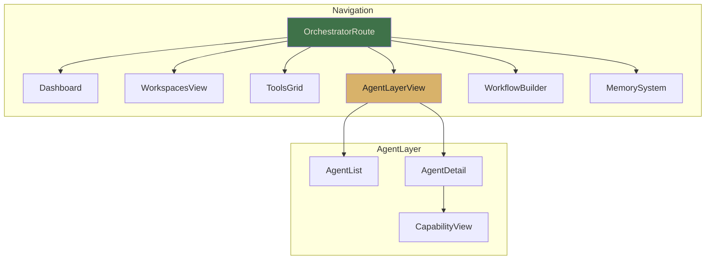

############################################################
#                                                          #
#       CHE·NU AGENT CAPABILITY SYSTEM                     #
#       SYSTEM INDEX · API SERVICE · UI FLOW               #
#       SAFE · REPRESENTATIONAL · NON-AUTONOMOUS           #
#                                                          #
############################################################

============================================================
SECTION 4 — SYSTEM INDEX UPDATE
============================================================

--- FILE: /che-nu-sdk/system_index.json
--- ACTION: UPDATE FILE (ADD AGENT CAPABILITY LAYER)

{
  "name": "CHE·NU SDK",
  "version": "2.5.0",
  "description": "SAFE · NON-AUTONOMOUS · REPRESENTATIONAL Architecture Framework",
  "classification": {
    "type": "sdk",
    "isNotASphere": true,
    "isRepresentational": true
  },
  "modules": {
    "core": {
      "UniverseOS": {
        "path": "/che-nu-sdk/core/universe.ts",
        "description": "Universal operating layer",
        "version": "1.0.0"
      },
      "Workspaces": {
        "path": "/che-nu-sdk/core/workspaces.ts",
        "description": "Workspace management system",
        "version": "1.0.0"
      },
      "HyperFabric": {
        "path": "/che-nu-sdk/core/hyperfabric.ts",
        "description": "Interconnection layer",
        "version": "1.0.0"
      },
      "Cartography": {
        "path": "/che-nu-sdk/core/cartography.ts",
        "description": "Navigation and mapping",
        "version": "1.0.0"
      },
      "DepthLens": {
        "path": "/che-nu-sdk/core/depth-lens.ts",
        "description": "Depth perception layer",
        "version": "1.0.0"
      },
      "ProjectionEngine": {
        "path": "/che-nu-sdk/core/projection.ts",
        "description": "Context projection system",
        "version": "1.0.0"
      },
      "Orchestrator": {
        "path": "/che-nu-sdk/core/orchestrator.ts",
        "description": "Routing-only orchestration (non-autonomous)",
        "version": "1.0.0"
      },
      "AgentProfileEngine": {
        "path": "/che-nu-sdk/core/agent_profile.ts",
        "description": "Agent capability profile definitions",
        "version": "1.0.0"
      },
      "AgentRegistry": {
        "path": "/che-nu-sdk/core/agent_registry.ts",
        "description": "In-memory agent profile registry",
        "version": "1.0.0"
      },
      "AgentTemplates": {
        "path": "/che-nu-sdk/core/agent_templates.ts",
        "description": "Pre-configured agent profile templates",
        "version": "1.0.0"
      }
    },
    "engines": {
      "HealthEngine": {
        "path": "/che-nu-sdk/engines/health.ts",
        "description": "Health and wellness management",
        "subEngines": ["FitnessEngine", "NutritionEngine", "SleepEngine", "WellnessEngine", "VitalEngine"],
        "version": "1.0.0"
      },
      "FinanceEngine": {
        "path": "/che-nu-sdk/engines/finance.ts",
        "description": "Financial planning and analysis",
        "subEngines": ["BudgetEngine", "InvestmentEngine", "TaxEngine", "RetirementEngine", "DebtEngine"],
        "version": "1.0.0"
      },
      "KnowledgeEngine": {
        "path": "/che-nu-sdk/engines/knowledge.ts",
        "description": "Knowledge organization and mapping",
        "subEngines": ["TaxonomyEngine", "ConnectionEngine", "VisualizationEngine"],
        "version": "1.0.0"
      },
      "EmotionEngine": {
        "path": "/che-nu-sdk/engines/emotion.ts",
        "description": "Emotional awareness and regulation",
        "subEngines": ["AwarenessEngine", "RegulationEngine", "ResilienceEngine"],
        "version": "1.0.0"
      },
      "ProductivityEngine": {
        "path": "/che-nu-sdk/engines/productivity.ts",
        "description": "Personal productivity optimization",
        "subEngines": ["TimeBlockEngine", "FocusEngine", "HabitEngine", "EnergyEngine"],
        "version": "1.0.0"
      },
      "SkillEngine": {
        "path": "/che-nu-sdk/engines/skill.ts",
        "description": "Skill development and tracking",
        "subEngines": ["TaxonomyEngine", "GapAnalysisEngine", "RoadmapEngine", "AssessmentEngine"],
        "version": "1.0.0"
      },
      "MethodologyEngine": {
        "path": "/che-nu-sdk/engines/methodology.ts",
        "description": "Methodology frameworks and operators",
        "version": "1.0.0"
      },
      "MemoryManager": {
        "path": "/che-nu-sdk/engines/memory.ts",
        "description": "External documentary memory system",
        "version": "1.0.0"
      },
      "ReplayEngine": {
        "path": "/che-nu-sdk/engines/replay.ts",
        "description": "Decision replay and analysis",
        "version": "1.0.0"
      },
      "GoalEngine": {
        "path": "/che-nu-sdk/engines/goal.ts",
        "description": "Goal setting and tracking",
        "version": "1.0.0"
      },
      "AnalysisEngine": {
        "path": "/che-nu-sdk/engines/analysis.ts",
        "description": "Data analysis and pattern recognition",
        "subEngines": ["DataEngine", "PatternEngine", "SynthesisEngine"],
        "version": "1.0.0"
      },
      "StrategyEngine": {
        "path": "/che-nu-sdk/engines/strategy.ts",
        "description": "Strategic planning and execution",
        "subEngines": ["VisionEngine", "AnalysisEngine", "PositioningEngine", "RoadmapEngine", "ExecutionEngine"],
        "version": "1.0.0"
      },
      "DecisionEngine": {
        "path": "/che-nu-sdk/engines/decision.ts",
        "description": "Decision frameworks and analysis",
        "version": "1.0.0"
      },
      "ReflectionEngine": {
        "path": "/che-nu-sdk/engines/reflection.ts",
        "description": "Journaling and reflection workflows",
        "version": "1.0.0"
      },
      "RelationshipEngine": {
        "path": "/che-nu-sdk/engines/relationship.ts",
        "description": "Relationship management and networking",
        "version": "1.0.0"
      },
      "DocumentFormatEngine": {
        "path": "/che-nu-sdk/engines/document-format.ts",
        "description": "Document formatting and export",
        "version": "1.0.0"
      },
      "CommunicationEngine": {
        "path": "/che-nu-sdk/engines/communication.ts",
        "description": "Communication and messaging frameworks",
        "subEngines": ["MessagingEngine", "ChannelEngine", "PresentationEngine", "NegotiationEngine"],
        "version": "1.0.0"
      },
      "XRSceneEngine": {
        "path": "/che-nu-sdk/engines/xr-scene.ts",
        "description": "XR scene design and blueprinting",
        "subEngines": ["EnvironmentEngine", "AvatarDesignEngine", "InteractionDesignEngine", "LightingDesignEngine", "SpatialUIEngine"],
        "version": "1.0.0"
      },
      "ResearchEngine": {
        "path": "/che-nu-sdk/engines/research.ts",
        "description": "Research process structuring",
        "subEngines": ["SourceManagementEngine", "SynthesisEngine", "CitationEngine", "LiteratureEngine", "MethodologyResearchEngine"],
        "version": "1.0.0"
      },
      "ContentEngine": {
        "path": "/che-nu-sdk/engines/content.ts",
        "description": "Content creation and strategy",
        "subEngines": ["StoryEngine", "BrandVoiceEngine", "MediaPlanningEngine", "EditorialEngine", "ContentStrategyEngine"],
        "version": "1.0.0"
      },
      "TaskEngine": {
        "path": "/che-nu-sdk/engines/task.ts",
        "description": "Task management and prioritization",
        "subEngines": ["PriorityEngine", "DeadlineEngine", "DelegationEngine", "DependencyEngine", "BatchingEngine"],
        "version": "1.0.0"
      },
      "SchedulingEngine": {
        "path": "/che-nu-sdk/engines/scheduling.ts",
        "description": "Time management and calendar planning",
        "subEngines": ["TimeBlockEngine", "AvailabilityEngine", "RecurrenceEngine", "ConflictEngine", "OptimizationEngine"],
        "version": "1.0.0"
      },
      "CollaborationEngine": {
        "path": "/che-nu-sdk/engines/collaboration.ts",
        "description": "Team coordination and meetings",
        "subEngines": ["TeamEngine", "MeetingEngine", "StatusEngine", "HandoffEngine", "FeedbackCollabEngine"],
        "version": "1.0.0"
      },
      "DataEngine": {
        "path": "/che-nu-sdk/engines/data.ts",
        "description": "Data processing and visualization",
        "subEngines": ["ProcessingEngine", "TransformEngine", "QualityEngine", "VisualizationEngine", "PipelineEngine"],
        "version": "1.0.0"
      },
      "CreativityEngine": {
        "path": "/che-nu-sdk/engines/creativity.ts",
        "description": "Creative process and ideation",
        "subEngines": ["IdeationEngine", "BrainstormEngine", "IterationEngine", "EvaluationEngine"],
        "version": "1.0.0"
      },
      "ProjectEngine": {
        "path": "/che-nu-sdk/engines/project.ts",
        "description": "Project planning and tracking",
        "subEngines": ["PlanningEngine", "TrackingEngine", "ResourceEngine", "RiskEngine"],
        "version": "1.0.0"
      },
      "LearningEngine": {
        "path": "/che-nu-sdk/engines/learning.ts",
        "description": "Learning design and curriculum",
        "version": "1.0.0"
      },
      "HabitEngine": {
        "path": "/che-nu-sdk/engines/habit.ts",
        "description": "Habit formation and tracking",
        "version": "1.0.0"
      }
    },
    "memory": {
      "MemorySystem": {
        "path": "/memory/",
        "description": "External documentary memory system",
        "version": "1.0.0"
      }
    },
    "xr": {
      "XRSuite": {
        "path": "/che-nu-sdk/xr/",
        "description": "XR scene building and orchestration",
        "version": "1.0.0"
      }
    }
  },
  "agentCapabilityLayer": {
    "description": "Representational agent profiles linking engines to capabilities",
    "modules": {
      "AgentProfileEngine": "/che-nu-sdk/core/agent_profile.ts",
      "AgentRegistry": "/che-nu-sdk/core/agent_registry.ts",
      "AgentTemplates": "/che-nu-sdk/core/agent_templates.ts"
    },
    "templates": [
      "Research Agent",
      "XR Scene Architect",
      "Productivity Coach",
      "Finance Overview Agent",
      "Health Overview Agent",
      "Knowledge Map Agent",
      "Project Manager Agent",
      "Creative Director Agent",
      "Strategy Agent",
      "Communication Specialist Agent",
      "Data Analyst Agent",
      "Wellbeing Mentor Agent"
    ]
  },
  "statistics": {
    "totalEngines": 28,
    "totalSubEngines": 67,
    "totalAgentTemplates": 12,
    "totalDomainSpheres": 12
  },
  "safe": {
    "isRepresentational": true,
    "noAutonomy": true,
    "noExecution": true,
    "noPersistence": true
  },
  "meta": {
    "generated": "2024-12-12",
    "version": "2.5.0"
  }
}

============================================================
--- FILE: /che-nu-sdk/docs/SYSTEM_INDEX.md
--- ACTION: UPDATE FILE (ADD AGENT CAPABILITY LAYER SECTION)

# CHE·NU SDK — System Index

> **SAFE · NON-AUTONOMOUS · REPRESENTATIONAL**

## Overview

The CHE·NU SDK provides a comprehensive framework for building life management interfaces. All modules are representational only — they describe structures and capabilities without autonomous execution.

---

## Core Modules

| Module | Path | Purpose |
|--------|------|---------|
| UniverseOS | `/che-nu-sdk/core/universe.ts` | Universal operating layer |
| Workspaces | `/che-nu-sdk/core/workspaces.ts` | Workspace management |
| HyperFabric | `/che-nu-sdk/core/hyperfabric.ts` | Interconnection layer |
| Cartography | `/che-nu-sdk/core/cartography.ts` | Navigation and mapping |
| DepthLens | `/che-nu-sdk/core/depth-lens.ts` | Depth perception |
| ProjectionEngine | `/che-nu-sdk/core/projection.ts` | Context projection |
| Orchestrator | `/che-nu-sdk/core/orchestrator.ts` | Routing-only orchestration |

---

## Agent Capability Layer

> **NEW IN v2.5.0**

The Agent Capability Layer provides representational profiles that connect agents to their available engines and capabilities.

| Module | Path | Purpose |
|--------|------|---------|
| AgentProfileEngine | `/che-nu-sdk/core/agent_profile.ts` | Agent profile definitions |
| AgentRegistry | `/che-nu-sdk/core/agent_registry.ts` | In-memory profile registry |
| AgentTemplates | `/che-nu-sdk/core/agent_templates.ts` | Pre-configured templates |

### Available Agent Templates

| Agent | Role | Primary Engines | Domain Spheres |
|-------|------|-----------------|----------------|
| Research Agent | researcher | KnowledgeEngine, ResearchEngine, MethodologyEngine | Scholar, Business, Personal |
| XR Scene Architect | architect | XRSceneEngine, CreativityEngine, MethodologyEngine | XR, Creative, Business |
| Productivity Coach | coach | ProductivityEngine, GoalEngine, TaskEngine | Personal, Business, MyTeam |
| Finance Overview Agent | analyst | FinanceEngine, AnalysisEngine, StrategyEngine | Personal, Business |
| Health Overview Agent | coach | HealthEngine, EmotionEngine, GoalEngine | Personal |
| Knowledge Map Agent | curator | KnowledgeEngine, SkillEngine, LearningEngine | Scholar, Personal, Business |
| Project Manager Agent | coordinator | ProjectEngine, TaskEngine, CollaborationEngine | Business, Projets, MyTeam |
| Creative Director Agent | creator | CreativityEngine, ContentEngine, MethodologyEngine | Creative, Business, Personal |
| Strategy Agent | analyst | StrategyEngine, AnalysisEngine, DecisionEngine | Business, Personal, Projets |
| Communication Specialist | specialist | CommunicationEngine, RelationshipEngine, ContentEngine | Business, Personal, Community |
| Data Analyst Agent | analyst | AnalysisEngine, DataEngine, KnowledgeEngine | Business, Scholar, Personal |
| Wellbeing Mentor Agent | mentor | EmotionEngine, RelationshipEngine, ReflectionEngine | Personal, Social |

---

## Operational Engines

### Personal Domain

| Engine | Sub-Engines | Description |
|--------|-------------|-------------|
| HealthEngine | FitnessEngine, NutritionEngine, SleepEngine, WellnessEngine, VitalEngine | Health management |
| EmotionEngine | AwarenessEngine, RegulationEngine, ResilienceEngine | Emotional wellness |
| ProductivityEngine | TimeBlockEngine, FocusEngine, HabitEngine, EnergyEngine | Personal productivity |
| ReflectionEngine | — | Journaling and reflection |
| HabitEngine | — | Habit formation |

### Business Domain

| Engine | Sub-Engines | Description |
|--------|-------------|-------------|
| FinanceEngine | BudgetEngine, InvestmentEngine, TaxEngine, RetirementEngine, DebtEngine | Financial planning |
| StrategyEngine | VisionEngine, AnalysisEngine, PositioningEngine, RoadmapEngine, ExecutionEngine | Strategic planning |
| ProjectEngine | PlanningEngine, TrackingEngine, ResourceEngine, RiskEngine | Project management |
| CollaborationEngine | TeamEngine, MeetingEngine, StatusEngine, HandoffEngine, FeedbackCollabEngine | Team coordination |
| CommunicationEngine | MessagingEngine, ChannelEngine, PresentationEngine, NegotiationEngine | Communication |

### Knowledge Domain

| Engine | Sub-Engines | Description |
|--------|-------------|-------------|
| KnowledgeEngine | TaxonomyEngine, ConnectionEngine, VisualizationEngine | Knowledge management |
| ResearchEngine | SourceManagementEngine, SynthesisEngine, CitationEngine, LiteratureEngine, MethodologyResearchEngine | Research processes |
| SkillEngine | TaxonomyEngine, GapAnalysisEngine, RoadmapEngine, AssessmentEngine | Skill development |
| LearningEngine | — | Learning design |
| AnalysisEngine | DataEngine, PatternEngine, SynthesisEngine | Data analysis |

### Creative Domain

| Engine | Sub-Engines | Description |
|--------|-------------|-------------|
| CreativityEngine | IdeationEngine, BrainstormEngine, IterationEngine, EvaluationEngine | Creative process |
| ContentEngine | StoryEngine, BrandVoiceEngine, MediaPlanningEngine, EditorialEngine, ContentStrategyEngine | Content creation |
| XRSceneEngine | EnvironmentEngine, AvatarDesignEngine, InteractionDesignEngine, LightingDesignEngine, SpatialUIEngine | XR design |

### Operational Domain

| Engine | Sub-Engines | Description |
|--------|-------------|-------------|
| TaskEngine | PriorityEngine, DeadlineEngine, DelegationEngine, DependencyEngine, BatchingEngine | Task management |
| SchedulingEngine | TimeBlockEngine, AvailabilityEngine, RecurrenceEngine, ConflictEngine, OptimizationEngine | Time management |
| DataEngine | ProcessingEngine, TransformEngine, QualityEngine, VisualizationEngine, PipelineEngine | Data processing |
| DecisionEngine | — | Decision frameworks |
| GoalEngine | — | Goal tracking |

### Support Engines

| Engine | Description |
|--------|-------------|
| MethodologyEngine | Methodology frameworks |
| MemoryManager | External documentary memory |
| ReplayEngine | Decision replay |
| RelationshipEngine | Relationship management |
| DocumentFormatEngine | Document formatting |

---

## Statistics

| Metric | Count |
|--------|-------|
| Total Engines | 28 |
| Total Sub-Engines | 67 |
| Agent Templates | 12 |
| Domain Spheres | 12 |

---

## SAFE Compliance

All modules in the CHE·NU SDK adhere to SAFE principles:

- ✓ **Representational Only** — Describes structures, not actions
- ✓ **Non-Autonomous** — No self-initiated behavior
- ✓ **No Execution** — Does not perform real-world actions
- ✓ **No Persistence** — No internal state memory
- ✓ **User-Initiated** — All workflows require user action

---

*Generated: 2024-12-12 | Version: 2.5.0*

============================================================
SECTION 6 — UI FLOW DOCS UPDATE
============================================================

--- FILE: /che-nu-app/docs/UI_FLOW.md
--- ACTION: UPDATE FILE (ADD AGENT CAPABILITY LAYER SECTION)

# CHE·NU Application — UI Flow Documentation

> **SAFE · NON-AUTONOMOUS · REPRESENTATIONAL**

## Overview

This document describes the user interface flows within the CHE·NU application. All interactions are user-initiated and non-autonomous.

---

## Main Navigation Flow

---

## Agent Capability Layer Flow

### Entry Points

Users can access the Agent Capability Layer through:

1. **Main Navigation** → "Agent Dashboard" button
2. **NOVA Interface** → "Show me agents" command
3. **Workflow Grid** → "Agent Dashboard" quick action

### Agent Dashboard Flow

### User Actions in Agent Dashboard

| Action | Result |
|--------|--------|
| View Agent List | Displays all available agent templates |
| Filter by Sphere | Shows agents operating in selected domain |
| Filter by Engine | Shows agents using selected engine |
| Select Agent | Opens detailed agent profile view |
| View Capabilities | Lists all attached engines with levels |
| View Collaborators | Shows agents that work well together |

### Integration Points

---

## Orchestrator Routes

### Main Routes

| Route | Component | Description |
|-------|-----------|-------------|
| `/` | Dashboard | Main overview |
| `/workspaces` | WorkspaceView | Workspace selection |
| `/tools` | ToolsGrid | Tool selection |
| `/agents` | AgentsPage | Agent capability dashboard |
| `/agents/:id` | AgentDetail | Individual agent view |
| `/workflows` | WorkflowBuilder | Workflow creation |
| `/memory` | MemorySystem | Memory management |

### Route Flow

---

## SAFE Compliance in UI

All UI components adhere to SAFE principles:

- **No Autonomous Actions** — Every action requires user click/input
- **Representational Display** — Shows profiles and capabilities, not live agents
- **Clear Limitations** — Always displays what agents cannot do
- **User Control** — User initiates all workflows through explicit actions

---

## Quick Reference

### Keyboard Shortcuts

| Shortcut | Action |
|----------|--------|
| `Cmd/Ctrl + K` | Open command palette |
| `Cmd/Ctrl + A` | Open Agent Dashboard |
| `Cmd/Ctrl + W` | Open Workspaces |
| `Esc` | Close modal / Go back |

### Status Indicators

| Color | Meaning |
|-------|---------|
| 🟡 Gold (#D8B26A) | Selected / Active |
| 🟢 Emerald (#3F7249) | SAFE Compliant |
| 🔵 Turquoise (#3EB4A2) | Information |
| ⚪ Sand (#E9E4D6) | Default text |
| ⚫ Slate (#1E1F22) | Background |

---

*Last Updated: 2024-12-12 | Version: 2.5.0*

============================================================
SECTION 7 — API SERVICE UPDATE
============================================================

--- FILE: /che-nu-api/services/chenu.service.ts
--- ACTION: UPDATE FILE (ADD AGENT CAPABILITY ENDPOINTS)

/**
 * CHE·NU API — Main Service
 * ==========================
 * SAFE · NON-AUTONOMOUS · REPRESENTATIONAL
 * 
 * API service for CHE·NU platform operations.
 * All endpoints return representational data only.
 */

import { Router, Request, Response } from 'express';
import { 
  getAllTemplates, 
  getTemplateByName, 
  getTemplatesForSphere,
  getTemplatesUsingEngine 
} from '@che-nu-sdk/core/agent_templates';
import { 
  AgentRegistry, 
  createAgentRegistry 
} from '@che-nu-sdk/core/agent_registry';
import type { 
  AgentProfile, 
  DomainSphere 
} from '@che-nu-sdk/core/agent_profile';

// ============================================================
// SERVICE CONFIGURATION
// ============================================================

const router = Router();
const registry = createAgentRegistry();

// Initialize registry with templates
const templates = getAllTemplates();
registry.registerAgents(templates);

// ============================================================
// AGENT CAPABILITY ENDPOINTS
// ============================================================

/**
 * GET /che-nu/agents
 * Returns list of all agent templates
 * REPRESENTATIONAL ONLY
 */
router.get('/agents', (req: Request, res: Response) => {
  try {
    const agents = registry.listAgents();
    
    res.json({
      success: true,
      data: agents,
      meta: {
        count: agents.length,
        timestamp: new Date().toISOString(),
        safe: {
          isRepresentational: true,
          noAutonomy: true,
        },
      },
    });
  } catch (error) {
    res.status(500).json({
      success: false,
      error: 'Failed to retrieve agents',
    });
  }
});

/**
 * GET /che-nu/agents/:name
 * Returns specific agent template by name
 */
router.get('/agents/:name', (req: Request, res: Response) => {
  try {
    const { name } = req.params;
    const agent = getTemplateByName(decodeURIComponent(name));
    
    if (!agent) {
      return res.status(404).json({
        success: false,
        error: `Agent '${name}' not found`,
      });
    }
    
    res.json({
      success: true,
      data: agent,
      meta: {
        timestamp: new Date().toISOString(),
        safe: {
          isRepresentational: true,
          noAutonomy: true,
        },
      },
    });
  } catch (error) {
    res.status(500).json({
      success: false,
      error: 'Failed to retrieve agent',
    });
  }
});

/**
 * GET /che-nu/agents/sphere/:sphere
 * Returns agents for a specific domain sphere
 */
router.get('/agents/sphere/:sphere', (req: Request, res: Response) => {
  try {
    const { sphere } = req.params;
    const agents = getTemplatesForSphere(sphere as DomainSphere);
    
    res.json({
      success: true,
      data: agents,
      meta: {
        sphere,
        count: agents.length,
        timestamp: new Date().toISOString(),
      },
    });
  } catch (error) {
    res.status(500).json({
      success: false,
      error: 'Failed to retrieve agents by sphere',
    });
  }
});

/**
 * GET /che-nu/agents/engine/:engine
 * Returns agents that use a specific engine
 */
router.get('/agents/engine/:engine', (req: Request, res: Response) => {
  try {
    const { engine } = req.params;
    const agents = getTemplatesUsingEngine(engine);
    
    res.json({
      success: true,
      data: agents,
      meta: {
        engine,
        count: agents.length,
        timestamp: new Date().toISOString(),
      },
    });
  } catch (error) {
    res.status(500).json({
      success: false,
      error: 'Failed to retrieve agents by engine',
    });
  }
});

/**
 * GET /che-nu/agents/stats
 * Returns registry statistics
 */
router.get('/agents/stats', (req: Request, res: Response) => {
  try {
    const stats = registry.getStats();
    
    res.json({
      success: true,
      data: stats,
      meta: {
        timestamp: new Date().toISOString(),
      },
    });
  } catch (error) {
    res.status(500).json({
      success: false,
      error: 'Failed to retrieve statistics',
    });
  }
});

/**
 * GET /che-nu/agents/coverage/engines
 * Returns engine coverage across agents
 */
router.get('/agents/coverage/engines', (req: Request, res: Response) => {
  try {
    const coverage = registry.getEngineCoverage();
    
    res.json({
      success: true,
      data: coverage,
      meta: {
        timestamp: new Date().toISOString(),
      },
    });
  } catch (error) {
    res.status(500).json({
      success: false,
      error: 'Failed to retrieve engine coverage',
    });
  }
});

/**
 * GET /che-nu/agents/coverage/spheres
 * Returns sphere coverage across agents
 */
router.get('/agents/coverage/spheres', (req: Request, res: Response) => {
  try {
    const coverage = registry.getSphereCoverage();
    
    res.json({
      success: true,
      data: coverage,
      meta: {
        timestamp: new Date().toISOString(),
      },
    });
  } catch (error) {
    res.status(500).json({
      success: false,
      error: 'Failed to retrieve sphere coverage',
    });
  }
});

// ============================================================
// EXISTING ENDPOINTS (preserved)
// ============================================================

/**
 * GET /che-nu/health
 * Health check endpoint
 */
router.get('/health', (req: Request, res: Response) => {
  res.json({
    status: 'healthy',
    service: 'che-nu-api',
    version: '2.5.0',
    timestamp: new Date().toISOString(),
  });
});

/**
 * GET /che-nu/system
 * Returns system information
 */
router.get('/system', (req: Request, res: Response) => {
  res.json({
    name: 'CHE·NU API',
    version: '2.5.0',
    classification: 'SAFE · NON-AUTONOMOUS · REPRESENTATIONAL',
    modules: {
      core: 10,
      engines: 28,
      subEngines: 67,
      agentTemplates: 12,
    },
    safe: {
      isRepresentational: true,
      noAutonomy: true,
      noExecution: true,
    },
  });
});

// ============================================================
// EXPORT
// ============================================================

export const chenuService = router;
export default chenuService;

============================================================
--- FILE: /che-nu-frontend/components/WorkflowGrid.tsx
--- ACTION: UPDATE FILE (ADD AGENT DASHBOARD BUTTON)

/**
 * CHE·NU Frontend — Workflow Grid Component
 * ==========================================
 * UPDATED: Added Agent Dashboard quick action
 */

import React from 'react';
import { useNavigate } from 'react-router-dom';

const COLORS = {
  sacredGold: '#D8B26A',
  ancientStone: '#8D8371',
  jungleEmerald: '#3F7249',
  cenoteTurquoise: '#3EB4A2',
  shadowMoss: '#2F4C39',
  uiSlate: '#1E1F22',
  softSand: '#E9E4D6',
};

interface QuickAction {
  id: string;
  label: string;
  icon: string;
  route: string;
  description: string;
  color: string;
}

const quickActions: QuickAction[] = [
  {
    id: 'dashboard',
    label: 'Dashboard',
    icon: '📊',
    route: '/',
    description: 'Main overview',
    color: COLORS.sacredGold,
  },
  {
    id: 'workspaces',
    label: 'Workspaces',
    icon: '🏠',
    route: '/workspaces',
    description: 'Domain workspaces',
    color: COLORS.jungleEmerald,
  },
  {
    id: 'workflows',
    label: 'Workflows',
    icon: '⚡',
    route: '/workflows',
    description: 'Build workflows',
    color: COLORS.cenoteTurquoise,
  },
  {
    id: 'agents',
    label: 'Agent Dashboard',
    icon: '🤖',
    route: '/agents',
    description: 'Agent capabilities',
    color: COLORS.sacredGold,
  },
  {
    id: 'engines',
    label: 'Engine Explorer',
    icon: '⚙️',
    route: '/engines',
    description: 'Browse engines',
    color: COLORS.ancientStone,
  },
  {
    id: 'memory',
    label: 'Memory System',
    icon: '🧠',
    route: '/memory',
    description: 'External memory',
    color: COLORS.shadowMoss,
  },
  {
    id: 'xr',
    label: 'XR Builder',
    icon: '🥽',
    route: '/xr',
    description: 'XR scene design',
    color: COLORS.cenoteTurquoise,
  },
  {
    id: 'settings',
    label: 'Settings',
    icon: '⚙️',
    route: '/settings',
    description: 'Configuration',
    color: COLORS.ancientStone,
  },
];

export function WorkflowGrid() {
  const navigate = useNavigate();

  return (
    

      <h2 style={{
        margin: '0 0 20px 0',
        fontSize: '18px',
        fontWeight: 600,
        color: COLORS.softSand,
      }}>
        Quick Actions
      </h2>

      

        {quickActions.map((action) => (
          <button
            key={action.id}
            onClick={() => navigate(action.route)}
            style={{
              display: 'flex',
              flexDirection: 'column',
              alignItems: 'center',
              justifyContent: 'center',
              padding: '20px 16px',
              backgroundColor: COLORS.shadowMoss,
              border: `1px solid transparent`,
              borderRadius: '12px',
              cursor: 'pointer',
              transition: 'all 0.2s ease',
            }}
            onMouseEnter={(e) => {
              e.currentTarget.style.borderColor = action.color;
              e.currentTarget.style.transform = 'translateY(-2px)';
            }}
            onMouseLeave={(e) => {
              e.currentTarget.style.borderColor = 'transparent';
              e.currentTarget.style.transform = 'translateY(0)';
            }}
          >
            
              {action.icon}
            
            
              {action.label}
            
            
              {action.description}
            
          </button>
        ))}
      

      {/* SAFE Notice */}
      

        🔒
        
          SAFE · NON-AUTONOMOUS · All actions are user-initiated
        
      

    

  );
}

export default WorkflowGrid;
