# CHE·NU

### A Sovereign Multi-Agent Operating Space for Humans

---

**Vision**

- Multi-sphere system for life, work, and institutions
- Coherent structure instead of fragmented apps
- Built to scale ethically and visually (2D → XR)

**Tagline**

> *"Your universe. Your rules. Your clarity."*

---

# The Problem

---

### Fragmentation & Opacity

- **Life and work are scattered** across platforms, tools, and identities
- **AI is often opaque**, centralized, and manipulative by design
- Users lack a **coherent structure** for decisions, memory, and collaboration
- Institutions **fear AI** because of ethics, trust, and control concerns

---

### The Current State

| Challenge | Impact |
|-----------|--------|
| Scattered tools | Cognitive overload |
| Opaque AI | Loss of trust |
| No unified memory | Repeated context |
| Centralized authority | Dependency risk |
| Hidden optimization | Behavioral manipulation |

---

# The Opportunity

---

### A New Paradigm

- **Structure** the way humans and agents collaborate across spheres
- Provide a **transparent, navigable "personal universe"** (CHE·NU)
- Offer AI that **clarifies instead of deciding**
- Enable **responsible multi-agent systems** for individuals, teams, institutions

---

### Market Timing

| Trend | CHE·NU Position |
|-------|-----------------|
| AI adoption surge | Ethical differentiation |
| Privacy concerns rising | Sovereignty by design |
| XR emerging | Native spatial readiness |
| Enterprise AI caution | Trust-first architecture |
| Regulatory pressure | Compliance-ready core |

---

# What is CHE·NU?

---

### Definition

**CHE·NU** (pronounced "Chez Nous" — *"Our Home"*)

A **multi-sphere operating space** where:

- Humans retain sovereignty over AI agents
- Structure replaces chaos
- Clarity replaces manipulation
- Memory and context persist across domains

---

### Core Components

| Component | Purpose |
|-----------|---------|
| **Trunk** | Core laws, governance, ethics |
| **Spheres** | Life domains (Personal, Business, Social…) |
| **Agents** | Specialized assistants under human control |
| **Methodologies** | Pluggable analytical frameworks |
| **XR Layer** | Spatial navigation and collaboration |

---

# Architecture

### Trunk & Spheres

---

### The Trunk

The **immutable core** that governs all operations:

- **Tree Laws** — Constitutional principles
- **Ethics Module** — Frozen ethical foundation
- **Orchestration** — Agent coordination
- **Methodology Engine** — Analytical frameworks
- **PTC System** — Pre-Approved Task Contexts

---

### The Spheres


---

### Sphere Details

| Sphere | Domain | Examples |
|--------|--------|----------|
| **Personal** | Private life | Health, finance, relationships |
| **Business** | Professional | Projects, contracts, compliance |
| **Social & Media** | Public presence | Content, reputation, networks |
| **Scholar** | Knowledge | Research, learning, certifications |
| **Creative** | Expression | Design, writing, media production |
| **Institutions** | Governance | Policies, audits, public services |
| **XR** | Spatial | Meetings, visualization, collaboration |

---

# Multi-Agent System

---

### Agent Architecture

CHE·NU employs a **hierarchical multi-agent system**:

| Level | Role | Count |
|-------|------|-------|
| L0 | Core orchestration | 1 |
| L1 | Sphere coordinators | 8 |
| L2 | Domain specialists | 24 |
| L3 | Task executors | 135+ |

**Total:** 168+ specialized agents

---

### Agent Principles

Every agent operates under strict contracts:

```
✓ Agents NEVER decide for users
✓ All delegation is voluntary
✓ Every chain passes through the user
✓ Silence mode overrides all agents
✓ Replay is read-only
```

---

### Agent Contract Example

| Agent | Does | Never Does |
|-------|------|------------|
| **Analysis** | Describe, organize, summarize | Decide, recommend, judge |
| **Methodology** | Present frameworks, explain options | Choose, prioritize, impose |
| **Comparison** | Compare factually, highlight differences | Judge, prefer, conclude |
| **Presentation** | Format, structure, visualize | Modify meaning, persuade |

---

### Multi-Agent Workflows

```mermaid
flowchart TD
    A[User initiates task] --> B{Workflow declared}
    B -->|Light task| C[Execute silently]
    B -->|Heavy task| D[Multi-Agent Workflow]
    D --> E[Ethics Checkpoint 🧭]
    E --> F[Coordinated Execution]
    F --> G[Result to User]
    G --> H{User Decision}
    H -->|Accept| I[Finalize]
    H -->|Modify| J[Iterate]
    H -->|Reject| K[Cancel]
```



---

# Ethics by Architecture

---

### The Problem with AI Ethics Today

| Approach | Issue |
|----------|-------|
| Policy-based | Can be overridden |
| Training-based | Opaque, inconsistent |
| Filter-based | Reactive, not structural |
| Audit-based | Post-hoc, not preventive |

**CHE·NU takes a different path:**

> Ethics frozen at the **architectural level**

---

### Frozen Ethical Foundation

```
CHE·NU is a system centered on human sovereignty.

No agent makes decisions on behalf of users.
No moral judgment is performed.
No ideological or behavioral standard is imposed.

Responsibility always remains human.
The system is co-responsible for clarity, never for choice.

All assistance is explicit, voluntary, and reversible.
Silence mode disables all analysis and observation.
```

**SHA-256:** `1122494114f55449991abca77eccf0324b89d6df79b3183e13459730bb97be7d`

---

### What This Means

| Traditional AI | CHE·NU |
|----------------|--------|
| Decides for users | Clarifies for users |
| Hidden optimization | Transparent assistance |
| Behavioral nudging | Neutral presentation |
| Moral authority | Human sovereignty |
| Trust us | Verify us |

---

### Co-Responsibility Model

**User Responsibilities:**
- Define intent
- Set boundaries
- Make decisions
- Accept outcomes

**System Responsibilities:**
- Increase clarity
- Show consequences (factually)
- Signal misalignment (non-judgmentally)
- Preserve sovereignty

---

# Ethics Checkpoints

---

### What is an Ethics Checkpoint?

An **Ethics Checkpoint** (🧭) is a **structural moment** where the system makes explicit:

- The active frame (PTC + context)
- Human responsibility
- The possibility to reflect or ignore

It does **NOT**:
- Block anything
- Judge anything
- Decide anything

---

### Checkpoint Locations

Only **4 locations** are authorized:

| Location | Trigger |
|----------|---------|
| **Task Init** | Creating a new task |
| **Context Change** | Switching spheres |
| **XR Meeting** | Entering spatial collaboration |
| **Replay/Export** | Publishing or sharing |

**No other checkpoint exists.**

---

### Workflow Checkpoint Flow


---

### Checkpoint Activation Conditions

Heavy workflow checkpoint triggers **only if**:

```
loadLevel === "heavy"
AND (
  agentCount > 1
  OR crossesSpheres === true
  OR producesPersistentOutput === true
  OR xrInvolved === true
)
```

**Light workflows = ZERO friction**

---

### Checkpoint Content

**Strictly authorized:**

| Element | Content |
|---------|---------|
| Icon | 🧭 |
| Message | "Multi-agent workflow active · Human responsibility maintained" |
| Subtext | "Multiple agents cooperate within a frame you defined." |

**No warnings. No judgments. No alerts.**

---

# Market & Use Cases

---

### Target Segments

| Segment | Need | CHE·NU Value |
|---------|------|--------------|
| **Professionals** | Unified workspace | Multi-sphere coherence |
| **Enterprises** | AI governance | Ethics by architecture |
| **Institutions** | Public trust | Transparent operations |
| **Creators** | Creative control | Sovereign studio |
| **Researchers** | Knowledge management | Scholar sphere |

---

### Use Case: Construction Management

**CHE·NU** originated in construction project management:

| Challenge | Solution |
|-----------|----------|
| Regulatory compliance (RBQ, CNESST, CCQ) | Pre-configured compliance agents |
| Multi-stakeholder coordination | Sphere-based collaboration |
| Document management | Persistent memory + versioning |
| Site safety | XR visualization + checklists |

**Market:** Quebec construction industry ($50B+ annually)

---

### Use Case: Enterprise AI Governance

| Concern | CHE·NU Answer |
|---------|---------------|
| "AI makes decisions we can't audit" | All decisions are human |
| "We can't prove ethical compliance" | Frozen, hashed foundation |
| "Employees don't trust AI" | Sovereignty + transparency |
| "Regulatory risk is too high" | Architecture-level compliance |

---

### Use Case: Personal Life Management

| Need | CHE·NU Feature |
|------|----------------|
| Unified view of life domains | Multi-sphere navigation |
| Privacy across contexts | Sphere isolation |
| Memory across time | Persistent context |
| AI without manipulation | Ethical foundation |

---

# Business Model

---

### Revenue Streams

| Stream | Model |
|--------|-------|
| **Individual** | Freemium → Premium subscription |
| **Professional** | Per-seat licensing |
| **Enterprise** | Annual license + implementation |
| **Institutional** | Custom deployment + support |
| **Platform** | API access for integrations |

---

### Competitive Position

| Dimension | CHE·NU | Competitors |
|-----------|--------|-------------|
| Ethics | Frozen, auditable | Policy-based |
| Structure | Multi-sphere | Single-purpose |
| Sovereignty | User-owned | Platform-owned |
| XR Ready | Native | Retrofitted |
| Multi-Agent | 168+ coordinated | Single or siloed |

---

### Go-to-Market Strategy

**Phase 1: Vertical Focus**
- Quebec construction industry
- Compliance-heavy sectors
- Privacy-conscious professionals

**Phase 2: Horizontal Expansion**
- Enterprise AI governance
- Institutional deployments
- Creator economy

**Phase 3: Platform**
- API ecosystem
- Third-party agents
- XR marketplace

---

# Roadmap

---

### Development Timeline

```mermaid
gantt
    title CHE·NU Development Roadmap
    dateFormat  YYYY-Q
    section Foundation
    Core Architecture     :done, 2024-Q1, 2024-Q4
    Ethics Module         :done, 2024-Q3, 2024-Q4
    Agent System          :done, 2024-Q2, 2024-Q4
    section MVP
    Web Interface         :active, 2025-Q1, 2025-Q2
    Construction Vertical :active, 2025-Q1, 2025-Q3
    Beta Launch           :2025-Q2, 2025-Q3
    section Scale
    Enterprise Features   :2025-Q3, 2025-Q4
    XR Integration        :2025-Q4, 2026-Q2
    Platform API          :2026-Q1, 2026-Q3
```

---

### Milestone Details

| Phase | Milestone | Status |
|-------|-----------|--------|
| **Foundation** | Core architecture | ✅ Complete |
| **Foundation** | Ethics module frozen | ✅ Complete |
| **Foundation** | 168+ agents defined | ✅ Complete |
| **MVP** | Web interface | 🔄 In Progress |
| **MVP** | Construction vertical | 🔄 In Progress |
| **Scale** | Enterprise features | 📋 Planned |
| **Scale** | XR integration | 📋 Planned |

---

### Technical Foundation Complete

| Component | Lines of Code | Status |
|-----------|---------------|--------|
| Backend (FastAPI) | 25,000+ | ✅ |
| Frontend (React/TS) | 20,000+ | ✅ |
| Agent Definitions | 5,000+ | ✅ |
| Documentation | 4,000+ | ✅ |
| **Total** | **54,000+** | ✅ |

---

# Why Now?

---

### Convergence of Forces

| Trend | Timing |
|-------|--------|
| AI capabilities | Ready for multi-agent |
| AI concerns | Rising demand for ethics |
| XR adoption | Approaching mainstream |
| Regulatory pressure | EU AI Act, Quebec laws |
| Enterprise readiness | AI governance budgets forming |

**The window for ethical AI infrastructure is NOW.**

---

### Why CHE·NU?

| Advantage | Evidence |
|-----------|----------|
| **First-mover in ethical architecture** | Frozen foundation, hashed |
| **Production-ready codebase** | 54,000+ lines, tested |
| **Domain expertise** | Construction + AI + ethics |
| **Scalable design** | 2D → XR native |
| **Clear differentiation** | Sovereignty, not control |

---

# Team

---

### Leadership

**Pro-Service Construction**
- Quebec-based company
- Construction industry expertise
- Full-stack AI development capability
- Vision: Ethical AI for professionals

**Technical Capability:**
- FastAPI / React / TypeScript
- Multi-LLM integration (Claude, GPT, Gemini, Ollama)
- XR development experience
- Regulatory compliance knowledge

---

# The Ask

---

### Investment Opportunity

**Seeking:** Strategic partners and seed investment

**Use of Funds:**
- Complete MVP for construction vertical
- Beta program with early adopters
- Enterprise feature development
- XR integration acceleration

**Goal:** Establish CHE·NU as the standard for sovereign, ethical AI operating spaces

---

# Summary

---

### Key Takeaways

✅ **Ethics frozen at the core** — Auditable, versioned, immutable

✅ **Responsibility stays human** — Agents clarify, never decide

✅ **Transparency without coercion** — Checkpoints inform, never block

✅ **Built to scale safely** — 2D → XR, individual → enterprise

✅ **Production-ready foundation** — 54,000+ lines of code

---

### The CHE·NU Promise

> CHE·NU is not an AI that tells users what to do.
> 
> It is a system that ensures users always know what they are doing.

---

# Contact

### CHE·NU by Pro-Service Construction

**Location:** Brossard, Quebec, Canada

**Ethical Foundation Hash:**
`1122494114f55449991abca77eccf0324b89d6df79b3183e13459730bb97be7d`

---

# Thank You

### *Your universe. Your rules. Your clarity.*

🧭 **CHE·NU**
