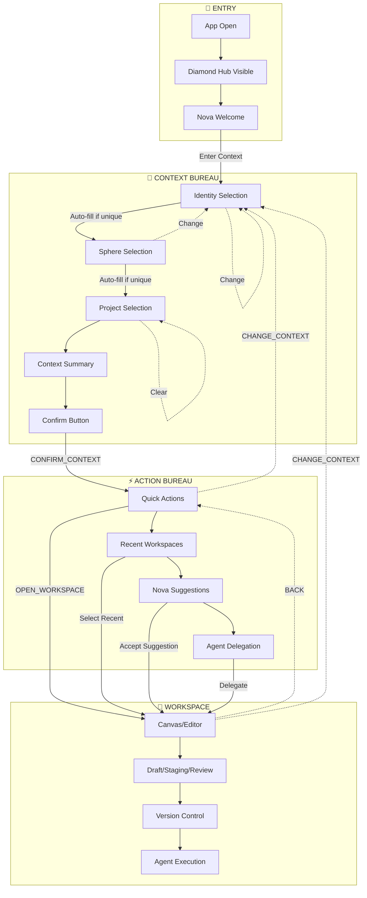
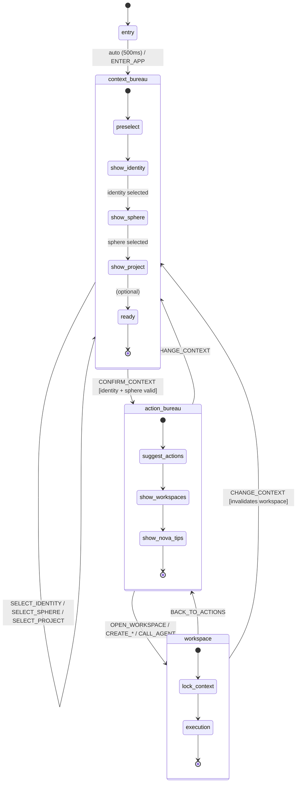

# CHE·NU — WIREFLOW CANONICAL (FINAL)

## 🧭 Vue d'ensemble

```
┌─────────┐     ┌─────────────────┐     ┌─────────────────┐     ┌─────────────┐
│  ENTRY  │────▶│ CONTEXT BUREAU  │────▶│  ACTION BUREAU  │────▶│  WORKSPACE  │
└─────────┘     └─────────────────┘     └─────────────────┘     └─────────────┘
                       │    ▲                  │    ▲                 │
                       │    │                  │    │                 │
                       └────┘                  └────┘                 │
                   (change context)       (change context)            │
                                               ▲                      │
                                               └──────────────────────┘
                                                    (back / change)
```

---

## 🧠 WIREFLOW MERMAID (Copiable)



---

## 🔄 FLOW DÉTAILLÉ MERMAID



---

## 📱 ÉCRANS DÉTAILLÉS

### 🟦 SCREEN 0 — ENTRY / APP OPEN

```
┌─────────────────────────────────────────────────────────────┐
│                                                             │
│                           ◆                                 │
│                        CHE·NU                               │
│                                                             │
│                    ┌───────────────┐                        │
│                    │      ✦        │                        │
│                    │    Nova       │                        │
│                    │  "Bonjour!"   │                        │
│                    └───────────────┘                        │
│                                                             │
│              ○ ○ ○ ○ ○ ○ ○ ○  (8 spheres)                   │
│                                                             │
│                 [ Entrer dans mon contexte ]                │
│                                                             │
└─────────────────────────────────────────────────────────────┘
```

**But:** Ne pas réfléchir, comprendre où on est.

**Transition:** Toujours vers Context Bureau

---

### 🟨 SCREEN 1 — CONTEXT BUREAU

```
┌─────────────────────────────────────────────────────────────┐
│  📍 CONTEXT BUREAU                                          │
│  "Sur quoi je travaille?"                                   │
├─────────────────────────────────────────────────────────────┤
│                                                             │
│  IDENTITÉ                                                   │
│  ┌─────────────────────────────────────────────┐            │
│  │ 💼 Pro Service Inc                    [Auto]│  [Change]  │
│  └─────────────────────────────────────────────┘            │
│                                                             │
│  SPHÈRE                                                     │
│  ┌─────────────────────────────────────────────┐            │
│  │ 💼 Business                           [Auto]│  [Change]  │
│  └─────────────────────────────────────────────┘            │
│                                                             │
│  PROJET (optionnel)                                         │
│  ┌─────────────────────────────────────────────┐            │
│  │ 📁 CHE·NU Development                       │  [Clear]   │
│  └─────────────────────────────────────────────┘            │
│                                                             │
├─────────────────────────────────────────────────────────────┤
│  RÉSUMÉ                                                     │
│  ┌─────────┐  ┌─────────┐  ┌─────────┐                      │
│  │ 3 Tasks │  │ 2 Meet  │  │ 1 Alert │                      │
│  │ urgents │  │ proches │  │         │                      │
│  └─────────┘  └─────────┘  └─────────┘                      │
│                                                             │
│              ╔═══════════════════════════╗                  │
│              ║    ALLER TRAVAILLER →     ║                  │
│              ╚═══════════════════════════╝                  │
│                                                             │
└─────────────────────────────────────────────────────────────┘
```

**But:** Répondre à "sur quoi je travaille?"

**Actions:**
- Changer identité
- Changer sphère  
- Changer projet
- Confirmer contexte

**Transitions:**
- → Action Bureau (CONFIRM_CONTEXT)
- → Navigation Hub (modifier le contexte)

---

### 🟧 SCREEN 2 — ACTION BUREAU

```
┌─────────────────────────────────────────────────────────────┐
│  ⚡ ACTION BUREAU                                           │
│  "Que faire maintenant?"                                    │
├─────────────────────────────────────────────────────────────┤
│                                                             │
│  ACTIONS RAPIDES                                            │
│  ┌──────────────┐ ┌──────────────┐ ┌──────────────┐         │
│  │ 🔧 Workspace │ │ 📝 Note     │ │ ✅ Tâche    │         │
│  └──────────────┘ └──────────────┘ └──────────────┘         │
│  ┌──────────────┐ ┌──────────────┐                          │
│  │ 📹 Meeting   │ │ 🤖 Agent    │                          │
│  └──────────────┘ └──────────────┘                          │
│                                                             │
├─────────────────────────────────────────────────────────────┤
│  📌 WORKSPACES ÉPINGLÉS                                     │
│  ┌─────────────────────────────────────────────┐            │
│  │ Main Development Workspace              →   │            │
│  └─────────────────────────────────────────────┘            │
│                                                             │
│  🕐 RÉCENTS                                                 │
│  ┌─────────────────────────────────────────────┐            │
│  │ API Integration Session            (hier)   │            │
│  ├─────────────────────────────────────────────┤            │
│  │ Documentation Review              (2 jours) │            │
│  └─────────────────────────────────────────────┘            │
│                                                             │
├─────────────────────────────────────────────────────────────┤
│  💡 SUGGESTIONS NOVA                                        │
│  ┌─────────────────────────────────────────────┐            │
│  │ "Vous avez 3 tâches urgentes. Commencer?"   │            │
│  └─────────────────────────────────────────────┘            │
│                                                             │
│        [ ← Changer de contexte ]                            │
│                                                             │
└─────────────────────────────────────────────────────────────┘
```

**But:** Décider quoi faire maintenant.

**Actions:**
- Ouvrir un workspace
- Créer du contenu
- Déléguer à un agent

**Transitions:**
- → Workspace
- → Context Bureau (si changement de cap)

---

### 🟥 SCREEN 3 — WORKSPACE

```
┌─────────────────────────────────────────────────────────────┐
│  🔧 WORKSPACE: Main Development                             │
│  Context: 💼 Business • Pro Service • CHE·NU Dev   [🔒]     │
├─────────────────────────────────────────────────────────────┤
│  ┌───────────────────────────────────────────────────────┐  │
│  │                                                       │  │
│  │                                                       │  │
│  │                      CANVAS                           │  │
│  │                                                       │  │
│  │              (doc / table / board / etc.)             │  │
│  │                                                       │  │
│  │                                                       │  │
│  │                                                       │  │
│  └───────────────────────────────────────────────────────┘  │
│                                                             │
├─────────────────────────────────────────────────────────────┤
│  MODE: [Draft] [Staging] [Review]                           │
│                                                             │
│  ┌──────────┐ ┌──────────┐ ┌──────────┐ ┌──────────┐       │
│  │ 📋 Diff  │ │ 🔄 Sync  │ │ 🤖 Agent │ │ ↩️ Back  │       │
│  └──────────┘ └──────────┘ └──────────┘ └──────────┘       │
│                                                             │
└─────────────────────────────────────────────────────────────┘
```

**But:** Exécution.

**Note:** Le contexte est VERROUILLÉ (🔒) pendant l'exécution.

**Transitions:**
- → Action Bureau (BACK)
- → Context Bureau (CHANGE_CONTEXT - invalide le workspace)

---

## 🔐 RÈGLES DE GOUVERNANCE

| Règle | Description |
|-------|-------------|
| ❌ | Aucun accès direct au workspace sans contexte validé |
| ❌ | Aucun agent ne travaille sans contexte figé |
| ✅ | Tout changement de contexte invalide le workspace actif |
| ✅ | Le Diamond Hub reflète toujours l'état courant |

---

## 🧱 BLOC CANONIQUE (Pour Claude)

```
CHE·NU — WIREFLOW & STATE MACHINE RULES (FINAL)

There are exactly FOUR main states:
1) ENTRY
2) CONTEXT_BUREAU
3) ACTION_BUREAU
4) WORKSPACE

Context Bureau is NEVER skipped.
Intelligence is used only to pre-fill it, not bypass it.

Flow:
ENTRY → CONTEXT_BUREAU → ACTION_BUREAU → WORKSPACE

Returning backward is always allowed.

Any context change invalidates execution state.
Diamond Hub always reflects the current state.
```

---

## 📊 TRANSITIONS MATRIX

| From | To | Event | Guard |
|------|-----|-------|-------|
| entry | context_bureau | ENTER_APP / auto | - |
| context_bureau | context_bureau | SELECT_* | - |
| context_bureau | action_bureau | CONFIRM_CONTEXT | identity + sphere |
| action_bureau | workspace | OPEN_WORKSPACE | - |
| action_bureau | context_bureau | CHANGE_CONTEXT | - |
| workspace | action_bureau | BACK_TO_ACTIONS | - |
| workspace | context_bureau | CHANGE_CONTEXT | invalidates ws |

---

*CHE·NU — Governed Intelligence Operating System*
*Version: CANONICAL FINAL*
