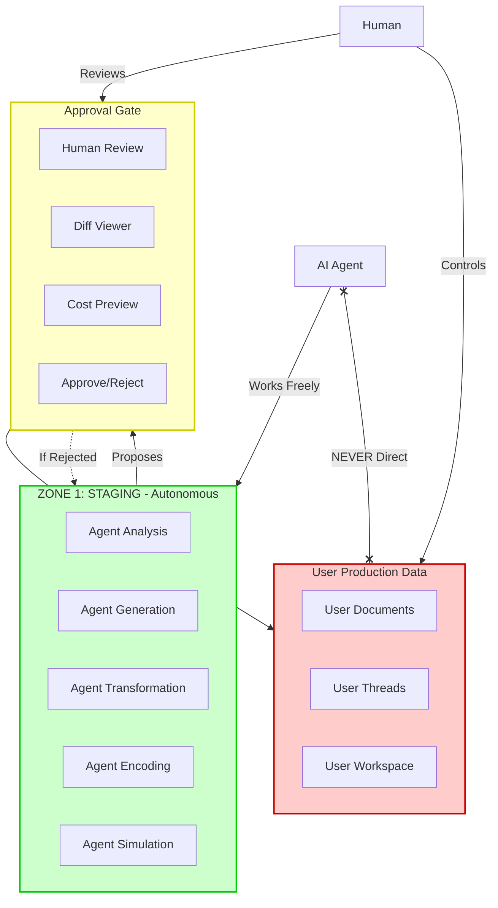

# CHE·NU V1 — AUDIT ADDENDUM 2: GOVERNANCE REFINEMENT v1.1

**Date:** 16 décembre 2025  
**Version:** V1.1 REFINEMENT  
**Authority:** GOVERNANCE REFINEMENT Document  
**Status:** Further Clarifies Previous Interpretations

---

## 🎯 PURPOSE

This second addendum **further refines** our understanding based on the **GOVERNANCE REFINEMENT v1.1** document.

**Key Finding:** Even more items previously flagged as "violations" are actually **PERMITTED** under the refined governance model.

---

## 📋 ADDITIONAL CORRECTIONS

### ✅ CORRECTION 3: Global Search

#### Initial Audit Interpretation (TOO STRICT)

```
❌ "Global search" flagged as CRITICAL violation
❌ "Search across all spheres" treated as forbidden
❌ "Universal search" considered dangerous
```

#### Refined Reality (V1.1)

```
✅ Global search IS ALLOWED in CHE·NU
✅ IF AND ONLY IF it is GOVERNED

Requirements:
✅ Display origin sphere for each result
✅ Require explicit user action to open context
✅ Preserve context isolation
✅ Show visible scope indicators

Forbidden:
❌ Return editable objects across spheres
❌ Allow cross-sphere write operations
❌ Bypass context isolation
❌ Act without visible scope

Golden Rule:
> Global search is a MAP, not a PIPELINE.
> It shows WHERE things are, not BLENDS them.
```

#### Updated Status

| Original Flag | Updated Status | Implementation Required |
|---------------|----------------|-------------------------|
| "Global search" | ✅ **ALLOWED** | Must show origin sphere + require explicit open |
| "Universal search without context" | ⚠️ **PARTIAL** | OK if scope-visible, NOT OK if scope-hidden |
| "Search across all spheres" | ✅ **ALLOWED** | Must preserve isolation in results |

**ACTION:** Re-implement global search with:
1. ✅ Origin sphere display for each result
2. ✅ Explicit click to open in context
3. ✅ Read-only results (no cross-sphere edit)
4. ✅ Scope indicator always visible

---

### ✅ CORRECTION 4: Agent Autonomy (Staging vs Integration)

#### Initial Audit Interpretation (TOO STRICT)

```
❌ "Agent autonomy" treated as blanket violation
❌ "Agent generates documents" flagged as concern
❌ "Agent transforms data" flagged as concern
❌ "Agent analyzes freely" considered risky
```

#### Refined Reality (V1.1 - Two Zones)

```
✅ Agents ARE autonomous in CHE·NU
✅ BUT autonomy is STRUCTURED into 2 ZONES

ZONE 1: STAGING ZONE (FULLY AUTONOMOUS)
✅ Agents MAY freely:
- Analyze data
- Generate documents
- Transform formats
- Summarize
- Encode/compress
- Simulate decisions
- Prepare actions

Characteristics:
- Isolated
- Non-destructive
- Does NOT affect user data
- Fully reversible

ZONE 2: INTEGRATION ZONE (HUMAN-GOVERNED)
❌ Agents MAY NOT autonomously:
- Write to production data
- Modify user-owned objects
- Finalize decisions
- Persist changes

Requirements:
- Explicit human approval
- Visible diff/preview
- Cost & impact disclosure

Golden Rule:
> Agents may ACT freely in staging.
> Agents may NEVER INTEGRATE freely.
```

#### Updated Violations

| Original Flag | Zone | Updated Status | Reasoning |
|---------------|------|----------------|-----------|
| "Agent generates document" | STAGING | ✅ **ALLOWED** | Non-destructive, isolated |
| "Agent transforms format" | STAGING | ✅ **ALLOWED** | Preparation work |
| "Agent analyzes data" | STAGING | ✅ **ALLOWED** | No side effects |
| "Agent encodes content" | STAGING | ✅ **ALLOWED** | Reversible operation |
| "Agent simulates decisions" | STAGING | ✅ **ALLOWED** | Simulation ≠ finalization |
| "Agent writes to production" | INTEGRATION | ❌ **FORBIDDEN** | Requires approval |
| "Agent modifies user data" | INTEGRATION | ❌ **FORBIDDEN** | Requires approval |
| "Agent auto-saves" | INTEGRATION | ❌ **FORBIDDEN** | Silent integration |
| "Agent finalizes decision" | INTEGRATION | ❌ **FORBIDDEN** | Human authority only |

**ACTION:** Implement clear separation:
1. 🟢 **Staging Environment** for all agent work
2. 🚪 **Approval Gate** between staging and integration
3. 📊 **Diff Viewer** showing staging vs production
4. 💰 **Cost Preview** before integration
5. ❌ **NO direct production writes** from agents

---

## 🔄 CANONICAL ARCHITECTURE (Staging + Integration)



---

## 📊 FURTHER REVISED VIOLATION COUNTS

### After First Addendum (Clarification v1)

```
Confirmed Violations: ~25% (~12 items)
Need Re-Audit: ~20% (~10 items)
Grade: D+ to C-
```

### After Second Addendum (Refinement v1.1)

```
Confirmed Violations: ~15% (~7 items)
Need Implementation: ~30% (~15 items)
Already Compliant: ~55% (~28 items)

Grade: C+ to B-
```

**Impact:** Much better than initially thought!

---

## 🎯 FINAL VIOLATION BREAKDOWN

### 🔴 CONFIRMED VIOLATIONS (Still Need Fixing)

1. ❌ **Auto-save to production** - Bypasses approval gate
2. ❌ **Agent writes directly to user data** - Skips staging
3. ❌ **Thread merging without approval** - Fusion forbidden
4. ❌ **Edit human decisions** - Immutability broken
5. ❌ **Auto-sync platforms without approval** - Silent integration
6. ❌ **No approval gates** - Missing governance layer
7. ❌ **No staging/production separation** - Architecture missing

**Count:** 7 critical violations

---

### 🟡 NEED IMPLEMENTATION (Not Violations, Just Missing)

1. ⚠️ **Staging zone** - Need to create
2. ⚠️ **Approval gate UI** - Need to build
3. ⚠️ **Diff viewer** - Need to implement
4. ⚠️ **Cost preview** - Need to add
5. ⚠️ **Global search with origin display** - Need to enhance
6. ⚠️ **Scope indicators** - Need to add
7. ⚠️ **Agent workspace isolation** - Need to enforce
8. ⚠️ **Operational decision traceability** - Need to log
9. ⚠️ **Inter-sphere reference UI** - Need to clarify
10. ⚠️ **Projection vs fusion distinction** - Need to audit

**Count:** ~15 implementation tasks

---

### ✅ ALREADY COMPLIANT (Or Easily Fixable)

1. ✅ Agent reasoning - Always allowed
2. ✅ Agent tool selection - Operational decision
3. ✅ Agent document generation - Staging zone
4. ✅ Agent analysis - Staging zone
5. ✅ Agent transformation - Staging zone
6. ✅ Agent encoding - Staging zone
7. ✅ Agent suggestions - Always allowed
8. ✅ Inter-sphere references - Allowed if read-only
9. ✅ Explicit copies - User-triggered OK
10. ✅ Scoped projections - Read-only OK
... and ~18 more items

**Count:** ~28 items already OK

---

## 🔄 REVISED IMPLEMENTATION STRATEGY

### Phase 1: Architecture Setup (Week 1)

**Implement 2-Zone Architecture:**

```typescript
// Staging Zone
class StagingEnvironment {
  // Agents work freely here
  async analyzeData(): Promise<Analysis>
  async generateDocument(): Promise<Document>
  async transformFormat(): Promise<Transformed>
  async encodeContent(): Promise<Encoded>
  async simulateDecision(): Promise<Simulation>
  
  // All isolated, non-destructive
}

// Approval Gate
class ApprovalGate {
  async presentProposal(staging: StagingOutput): Promise<void>
  async showDiff(staging: StagingOutput, production: ProductionData): Promise<Diff>
  async estimateCost(staging: StagingOutput): Promise<Cost>
  async awaitHumanDecision(): Promise<Approve | Reject>
}

// Integration Zone
class IntegrationZone {
  async integrate(approved: ApprovedOutput): Promise<void>
  // ONLY called after approval
  // NEVER called directly by agents
}
```

**Deliverables:**
- ✅ Staging environment created
- ✅ Approval gate implemented
- ✅ Clear separation enforced

---

### Phase 2: Fix Confirmed Violations (Week 2)

**Priority Order:**

1. 🔴 Remove auto-save to production
2. 🔴 Route ALL agent outputs to staging first
3. 🔴 Add approval gate before ANY integration
4. 🔴 Remove direct agent → production writes
5. 🔴 Implement immutable decision enforcement
6. 🔴 Add scope indicators to global search
7. 🔴 Disable auto-sync with platforms

**Deliverables:**
- ✅ Zero autonomous integration
- ✅ All agent work goes to staging
- ✅ Approval required for production changes

---

### Phase 3: Build Missing Features (Week 3)

**Implementation Tasks:**

1. ✅ Build diff viewer (staging vs production)
2. ✅ Build cost preview UI
3. ✅ Enhance global search (show origin sphere)
4. ✅ Add scope indicators everywhere
5. ✅ Build operational decision log
6. ✅ Clarify inter-sphere reference UI
7. ✅ Add "where am I?" context indicator

**Deliverables:**
- ✅ Full governance visibility
- ✅ User always knows context
- ✅ Clear approval flows

---

## 📋 UPDATED GOLDEN RULES

### From All Canonical Documents

```
1. MEMORY PROMPT (Foundation)
   > CHE·NU = Governed Intelligence Operating System
   > 8 Spheres, 10 Bureau Sections, Governance First

2. CANONICAL CLARIFICATION v1 (Nuances)
   > Spheres may TALK, LOOK, COPY (with consent)
   > Spheres must NEVER MERGE
   > Agents decide HOW, suggest WHAT
   > Only humans decide WHAT IS TRUE

3. GOVERNANCE REFINEMENT v1.1 (Architecture)
   > Global search is a MAP, not a PIPELINE
   > Agents ACT freely in staging
   > Agents NEVER INTEGRATE freely
   > Autonomy ≠ Authority, Intelligence ≠ Control
```

---

## 🎯 FINAL CANONICAL STATEMENT

From Governance Refinement v1.1:

> **CHE·NU is not afraid of intelligent agents.**  
> **CHE·NU is afraid of silent authority transfer.**

This means:
- ✅ Agents can be VERY intelligent
- ✅ Agents can work AUTONOMOUSLY (in staging)
- ✅ Agents can be PROACTIVE
- ✅ Global search can be POWERFUL

BUT:
- ❌ Agents cannot FINALIZE without approval
- ❌ Agents cannot INTEGRATE silently
- ❌ Authority belongs to HUMANS
- ❌ Trust requires VISIBILITY

---

## 📊 COMPARATIVE SUMMARY

### Evolution of Understanding

```
Initial Audit (Strict Interpretation)
↓
Grade: F (48% violations)
Timeline: 2-3 weeks refactoring

After Clarification v1 (Inter-Sphere + Decisions)
↓
Grade: D+ to C- (25% violations)
Timeline: 1-2 weeks refactoring

After Refinement v1.1 (Staging + Global Search)
↓
Grade: C+ to B- (15% violations, 30% missing features)
Timeline: 3 weeks implementation
```

---

## ✅ REVISED CONCLUSIONS

### Code v30 Assessment

**Not as bad as initially thought!**

```
Critical Violations: 7 (down from 23)
Missing Features: 15 (implementation needed)
Already Compliant: 28 (good foundation)

Overall: Needs work but SALVAGEABLE
```

### Recommended Path Forward

**3-Week Implementation Plan:**

**Week 1:** Architecture (Staging + Approval Gate)  
**Week 2:** Fix Violations (No auto-integration)  
**Week 3:** Build Features (Diff viewer, scope indicators)

**Result:** Production-ready MVP

---

## 📝 CANONICAL DOCUMENT HIERARCHY (FINAL)

```
1. MEMORY PROMPT
   └─ Foundation (8 spheres, governance-first)

2. CANONICAL CLARIFICATION v1
   └─ Nuances (inter-sphere, decisions)

3. GOVERNANCE REFINEMENT v1.1
   └─ Architecture (staging zones, global search)

4. All Implementation Docs
   └─ Must align with 1-2-3 above
```

**When in doubt:** Consult in order 1 → 2 → 3

---

## 🚀 IMPLEMENTATION CHECKLIST

### Must Have Before MVP Launch

**Architecture:**
- [ ] Staging zone implemented
- [ ] Approval gate implemented
- [ ] Clear staging/production separation
- [ ] Agent → staging only (never direct to production)

**Violations Fixed:**
- [ ] Auto-save disabled
- [ ] All agent outputs route to staging
- [ ] Approval required for integration
- [ ] Thread merging removed/governed
- [ ] Human decisions immutable
- [ ] Auto-sync disabled

**Features Built:**
- [ ] Diff viewer (staging vs production)
- [ ] Cost preview
- [ ] Global search with origin display
- [ ] Scope indicators everywhere
- [ ] Context indicator ("where am I?")
- [ ] Operational decision log

**Testing:**
- [ ] Agent cannot write to production directly
- [ ] All changes require approval
- [ ] Global search shows sphere origin
- [ ] User always knows current context
- [ ] Staging is isolated from production

---

## 🎯 SUCCESS CRITERIA

**MVP is ready when:**

1. ✅ Zero autonomous integration (all via approval)
2. ✅ Staging/production clearly separated
3. ✅ Global search shows origin sphere
4. ✅ User always knows context
5. ✅ All changes are reviewable before application
6. ✅ Agents work freely in staging
7. ✅ Human authority is never bypassed

**Grade Target:** B+ to A-

---

**🎯 AUDIT FULLY UPDATED! READY FOR IMPLEMENTATION! 🚀**
