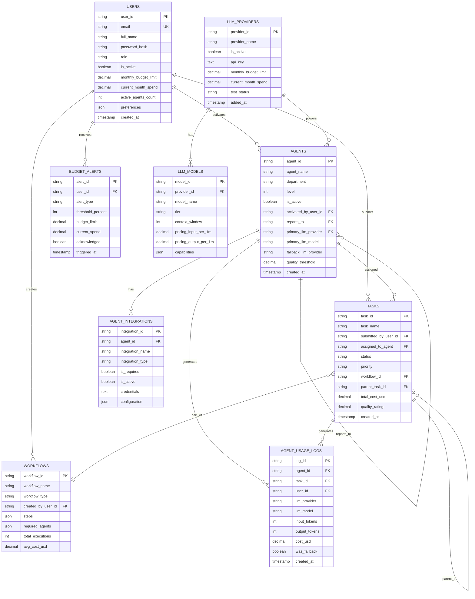
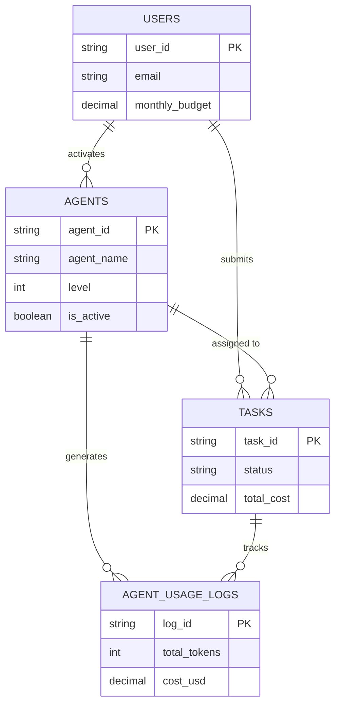
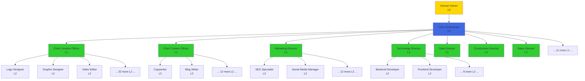
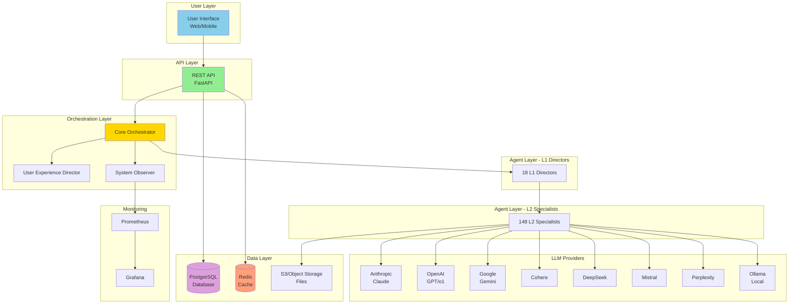
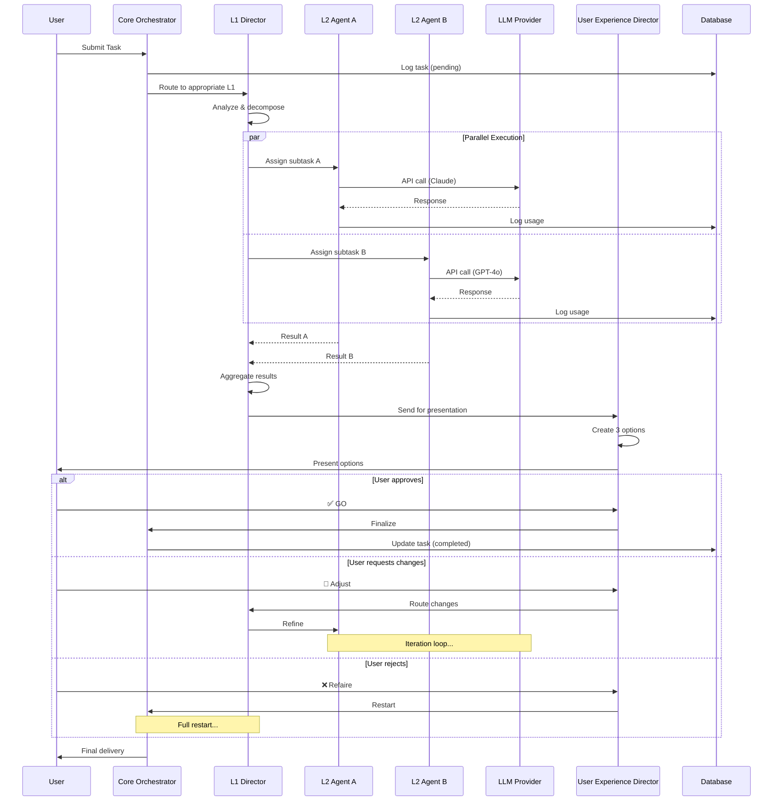
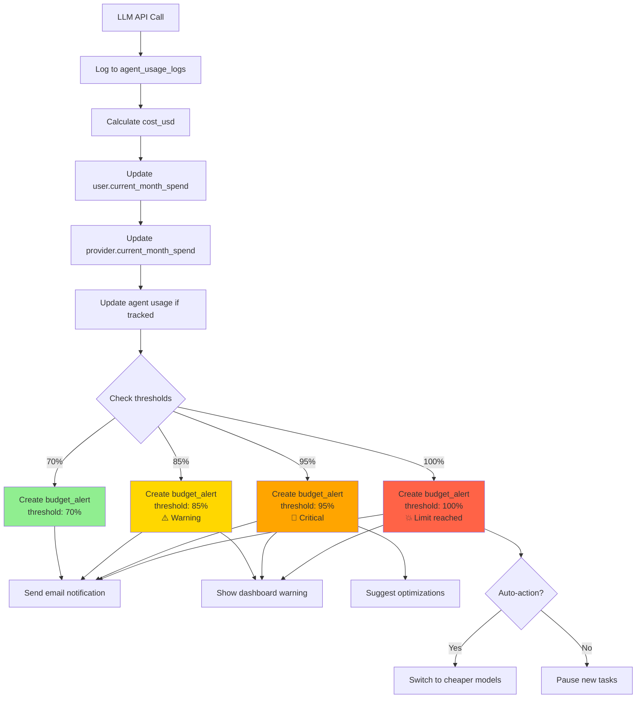
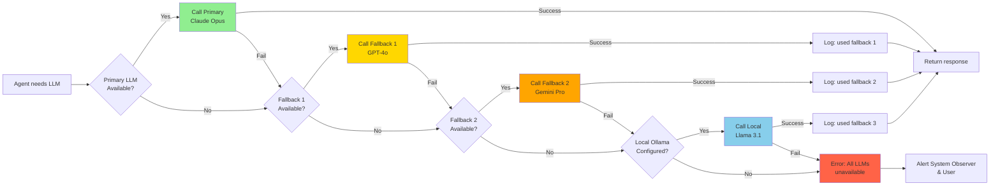
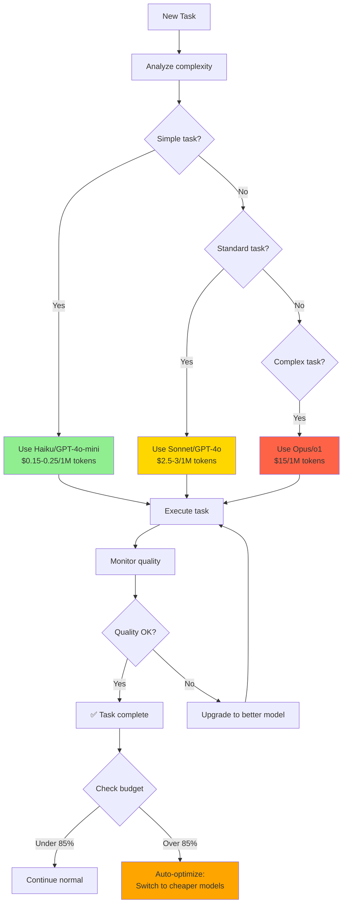
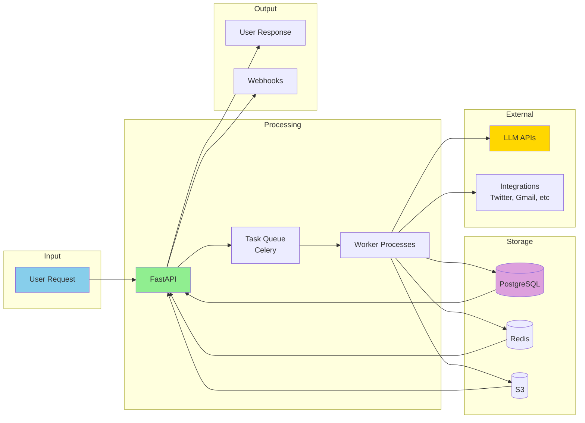
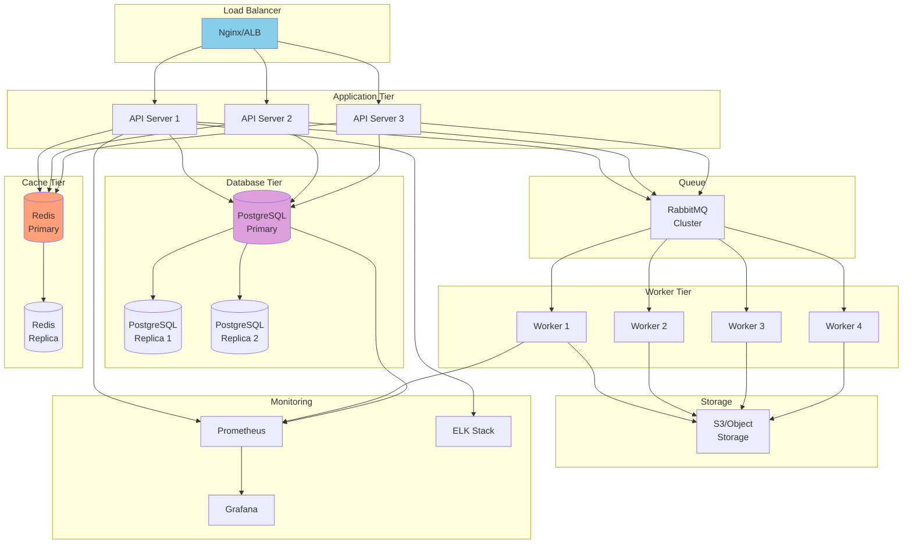

# CHENU DATABASE - VISUAL DIAGRAMS
# Entity Relationship Diagrams and Architecture Diagrams

## 📊 Table of Contents
1. [Complete ER Diagram](#complete-er-diagram)
2. [Simplified ER Diagram](#simplified-er-diagram)
3. [Agent Hierarchy](#agent-hierarchy)
4. [System Architecture](#system-architecture)
5. [Workflow Diagram](#workflow-diagram)
6. [Budget Tracking Flow](#budget-tracking-flow)

---

## Complete ER Diagram



---

## Simplified ER Diagram (Core Tables Only)



---

## Agent Hierarchy



---

## System Architecture



---

## Task Workflow Diagram



---

## Budget Tracking Flow



---

## LLM Fallback Chain



---

## Agent Activation Flow

```mermaid
stateDiagram-v2
    [*] --> Inactive: Agent created
    
    Inactive --> Browsing: User browses agents
    Browsing --> Configuring: User clicks "Activate"
    
    Configuring --> SelectingLLM: Configure LLM
    SelectingLLM --> ConfiguringParams: Select model
    ConfiguringParams --> ConfiguringIntegrations: Set parameters
    
    ConfiguringIntegrations --> Testing: Add integrations
    Testing --> Active: Test passed
    Testing --> Configuring: Test failed
    
    Active --> InUse: Receives tasks
    InUse --> Active: Task completed
    
    Active --> Paused: Budget limit reached
    Paused --> Active: Budget increased
    
    Active --> Inactive: User deactivates
    
    Inactive --> [*]
```

---

## Multi-LLM Cost Optimization



---

## Data Flow Architecture



---

## Deployment Architecture



---

## Notes

- All diagrams are in Mermaid format
- Can be rendered in:
  - GitHub README
  - GitLab
  - VS Code (with Mermaid extension)
  - draw.io (import Mermaid)
  - Online: mermaid.live

- Color coding:
  - 🟦 Blue: User/Frontend
  - 🟩 Green: API/Backend
  - 🟪 Purple: Database
  - 🟨 Yellow: LLM/External
  - 🟥 Red: Critical/Error
