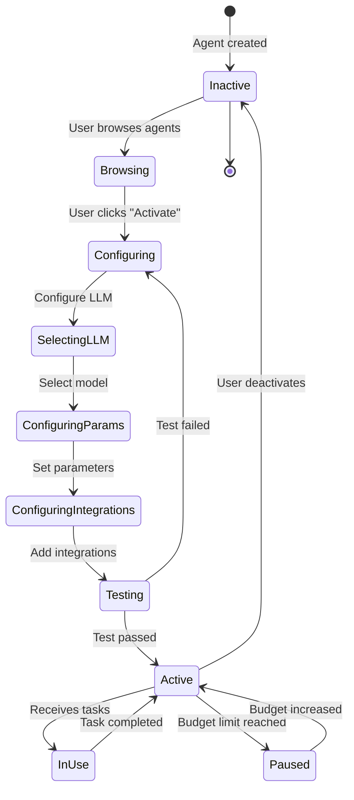

# CHENU DATABASE - VISUAL DIAGRAMS
# Entity Relationship Diagrams and Architecture Diagrams

## 📊 Table of Contents
1. [Complete ER Diagram](#complete-er-diagram)
2. [Simplified ER Diagram](#simplified-er-diagram)
3. [Agent Hierarchy](#agent-hierarchy)
4. [System Architecture](#system-architecture)
5. [Workflow Diagram](#workflow-diagram)
6. [Budget Tracking Flow](#budget-tracking-flow)

---

## Complete ER Diagram

---

## Simplified ER Diagram (Core Tables Only)

```mermaid
erDiagram
    USERS ||--o{ AGENTS : activates
    USERS ||--o{ TASKS : submits
    
    AGENTS ||--o{ TASKS : "assigned to"
    AGENTS ||--o{ AGENT_USAGE_LOGS : generates
    
    TASKS ||--o{ AGENT_USAGE_LOGS : tracks
    
    USERS {
        string user_id PK
        string email
        decimal monthly_budget
    }
    
    AGENTS {
        string agent_id PK
        string agent_name
        int level
        boolean is_active
    }
    
    TASKS {
        string task_id PK
        string status
        decimal total_cost
    }
    
    AGENT_USAGE_LOGS {
        string log_id PK
        int total_tokens
        decimal cost_usd
    }
```

---

## Agent Hierarchy

---

## System Architecture

---

## Task Workflow Diagram

```mermaid
sequenceDiagram
    participant U as User
    participant CO as Core Orchestrator
    participant L1 as L1 Director
    participant L2A as L2 Agent A
    participant L2B as L2 Agent B
    participant LLM as LLM Provider
    participant UED as User Experience Director
    participant DB as Database
    
    U->>CO: Submit Task
    CO->>DB: Log task (pending)
    CO->>L1: Route to appropriate L1
    L1->>L1: Analyze & decompose
    
    par Parallel Execution
        L1->>L2A: Assign subtask A
        L2A->>LLM: API call (Claude)
        LLM-->>L2A: Response
        L2A->>DB: Log usage
    and
        L1->>L2B: Assign subtask B
        L2B->>LLM: API call (GPT-4o)
        LLM-->>L2B: Response
        L2B->>DB: Log usage
    end
    
    L2A-->>L1: Result A
    L2B-->>L1: Result B
    L1->>L1: Aggregate results
    L1->>UED: Send for presentation
    
    UED->>UED: Create 3 options
    UED->>U: Present options
    
    alt User approves
        U->>UED: ✅ GO
        UED->>CO: Finalize
        CO->>DB: Update task (completed)
    else User requests changes
        U->>UED: 🔧 Adjust
        UED->>L1: Route changes
        L1->>L2A: Refine
        Note over L2A,LLM: Iteration loop...
    else User rejects
        U->>UED: ❌ Refaire
        UED->>CO: Restart
        Note over CO,L1: Full restart...
    end
    
    CO->>U: Final delivery
```

---

## Budget Tracking Flow

---

## LLM Fallback Chain

---

## Agent Activation Flow

---

## Multi-LLM Cost Optimization

```mermaid
graph TD
    Task[New Task] --> Analyze[Analyze complexity]
    
    Analyze --> Simple{Simple task?}
    Simple -->|Yes| Cheap[Use Haiku/GPT-4o-mini<br/>$0.15-0.25/1M tokens]
    Simple -->|No| Standard{Standard task?}
    
    Standard -->|Yes| Mid[Use Sonnet/GPT-4o<br/>$2.5-3/1M tokens]
    Standard -->|No| Complex{Complex task?}
    
    Complex -->|Yes| Premium[Use Opus/o1<br/>$15/1M tokens]
    
    Cheap --> Execute
    Mid --> Execute
    Premium --> Execute
    
    Execute[Execute task] --> Monitor[Monitor quality]
    
    Monitor --> Quality{Quality OK?}
    Quality -->|Yes| Success[✅ Task complete]
    Quality -->|No| Upgrade[Upgrade to better model]
    Upgrade --> Execute
    
    Success --> Budget{Check budget}
    Budget -->|Under 85%| Continue[Continue normal]
    Budget -->|Over 85%| Optimize[Auto-optimize:<br/>Switch to cheaper models]
    
    style Cheap fill:#90EE90
    style Mid fill:#FFD700
    style Premium fill:#FF6347
    style Optimize fill:#FFA500
```

---

## Data Flow Architecture

---

## Deployment Architecture

---

## Notes

- All diagrams are in Mermaid format
- Can be rendered in:
  - GitHub README
  - GitLab
  - VS Code (with Mermaid extension)
  - draw.io (import Mermaid)
  - Online: mermaid.live

- Color coding:
  - 🟦 Blue: User/Frontend
  - 🟩 Green: API/Backend
  - 🟪 Purple: Database
  - 🟨 Yellow: LLM/External
  - 🟥 Red: Critical/Error
