# CHE·NU V1 — AUDIT ADDENDUM 3: CANONICAL WORKSPACE MODEL

**Date:** 16 décembre 2025  
**Version:** V1 FREEZE - WORKSPACE MODEL  
**Authority:** CANONICAL WORKSPACE MODEL Document  
**Status:** Defines Workspace Architecture

---

## 🎯 PURPOSE

This third addendum **defines the concrete workspace architecture** based on the **CANONICAL WORKSPACE MODEL** document.

**Key Addition:** Precise separation of USER, AGENT, and REVIEW workspaces with explicit flows.

---

## 🏗️ 3-WORKSPACE ARCHITECTURE (Canonical)

### Overview Diagram

```mermaid
flowchart TB

subgraph UserZone[USER WORKSPACE - Primary]
  UW[User Documents]
  UN[User Notes]
  UT[User Tables]
  UD[User Drafts]
end

subgraph AgentZone[AGENT STAGING WORKSPACE - Autonomous]
  AT[Agent Transformations]
  AS[Agent Summaries]
  AF[Agent Format Conversions]
  AV[Agent Alternative Versions]
end

subgraph ReviewZone[COMPARISON WORKSPACE - Shared View]
  RU[User Version Display]
  RA[Agent Version Display]
  RD[Diff Viewer]
  RE[Explanations]
end

User[👤 User] -->|Selects Content| UserZone
UserZone -->|COPY to Agent| AgentZone
Agent[🤖 Agent] -->|Works Freely| AgentZone
AgentZone -->|Proposes| ReviewZone
User -->|Reviews| ReviewZone
ReviewZone -.->|Discard| AgentZone
ReviewZone -->|Save as New Version| UserZone
ReviewZone -->|Keep Both| UserZone

UserZone x--x|NEVER Direct Modify| Agent
AgentZone x--x|NEVER Overwrite| UserZone

style UserZone fill:#e3f2fd,stroke:#1976d2,stroke-width:3px
style AgentZone fill:#f1f8e9,stroke:#689f38,stroke-width:2px
style ReviewZone fill:#fff3e0,stroke:#f57c00,stroke-width:2px
```



---

## 📋 WORKSPACE TYPE SPECIFICATIONS

### 1️⃣ USER WORKSPACE (Primary)

**Purpose:** User's primary working environment

**Contains:**
- Documents (drafts, finals)
- Notes
- Tables
- Any user-created content

**Rules:**
```typescript
class UserWorkspace {
  // Strictly controlled
  
  rules = {
    autoSave: false,           // ❌ FORBIDDEN
    silentModification: false, // ❌ FORBIDDEN
    closeWithoutSave: true,    // ✅ ALLOWED
    saveCreatesVersion: true   // ✅ MANDATORY
  }
  
  // User has FULL control
  save(): Version {
    return this.createNewVersion(this.content)
    // NEVER overwrites existing version
  }
  
  close(): void {
    // May close without saving
    // No forced prompt (user choice)
  }
}
```

**UI Requirements:**
- Clear "Save" button (explicit action)
- No auto-save indicator
- "Close without saving" clearly available
- Version history always accessible

---

### 2️⃣ AGENT STAGING WORKSPACE (Autonomous)

**Purpose:** Agent's isolated working environment

**Contains:**
- Agent transformations
- Agent summaries
- Format conversions
- Simulations
- Alternative versions

**Rules:**
```typescript
class AgentStagingWorkspace {
  // Agent works freely here
  
  characteristics = {
    isolated: true,        // ✅ No access to user data
    nonDestructive: true,  // ✅ Cannot harm user content
    temporary: true,       // ✅ Ephemeral
    autonomous: true       // ✅ Agent decides HOW
  }
  
  // Agent operations (all allowed)
  async transform(content: Content): Promise<Transformed>
  async summarize(content: Content): Promise<Summary>
  async convertFormat(content: Content, format: Format): Promise<Converted>
  async simulate(decision: Decision): Promise<Simulation>
  async generateAlternative(content: Content): Promise<Alternative>
  
  // All outputs are DRAFTS
  proposeToUser(output: AgentOutput): Proposal {
    return {
      content: output,
      status: 'draft',
      requiresApproval: true
    }
  }
}
```

**UI Requirements:**
- Clearly labeled "Agent Workspace" or "Agent Draft"
- Distinct visual style from User Workspace
- "This is a proposal" indicator
- Never feels like "production"

---

### 3️⃣ COMPARISON/REVIEW WORKSPACE (Shared View)

**Purpose:** Safe comparison and decision space

**Contains:**
- User version display
- Agent version display
- Diff viewer
- Explanations

**Rules:**
```typescript
class ComparisonWorkspace {
  // Read-only comparison
  
  display = {
    userVersion: UserContent,    // ✅ Original
    agentVersion: AgentContent,  // ✅ Proposal
    diff: Diff,                  // ✅ Changes highlighted
    explanation: string          // ✅ Why agent did this
  }
  
  // User decisions
  async discardAgentVersion(): void {
    // Agent output deleted
    // User continues with original
  }
  
  async saveUserVersion(): Version {
    // Save user's current work as new version
    // Ignore agent proposal
  }
  
  async saveAgentVersion(): Version {
    // Save agent proposal as new version
    // Creates NEW version (no overwrite)
  }
  
  async keepBoth(): [Version, Version] {
    // Save both versions
    // User can work on either later
  }
  
  // NO modification without explicit action
  canEdit = false  // ❌ Read-only
}
```

**UI Requirements:**
- Split view (User | Agent)
- Diff highlighting
- "Why this change?" explanations
- Clear action buttons:
  - "Discard Agent Version"
  - "Save My Version"
  - "Save Agent Version"
  - "Keep Both"

---

## 🔄 CANONICAL WORKSPACE FLOW (From Jo)


---

## 📋 DETAILED FLOW SPECIFICATIONS

### Flow 1: USER → AGENT (Explicit Send)

```typescript
// User Workspace → Agent Staging
async sendToAgent(content: Content, task: Task): Promise<void> {
  // 1. User explicitly triggers
  const userConfirmed = await confirmDialog({
    message: "Send this content to agent?",
    content: content.preview,
    task: task.description
  })
  
  if (!userConfirmed) return
  
  // 2. COPY content (not move)
  const contentCopy = deepCopy(content)
  
  // 3. Send to agent staging
  await agentStagingWorkspace.receive(contentCopy, task)
  
  // 4. User Workspace UNCHANGED
  // User can continue editing original
  
  // 5. Notify user
  notification.show({
    message: "Agent is working on your request",
    workspace: "Agent Staging",
    canCancel: true
  })
}
```

**Key Points:**
- ✅ Explicit user action
- ✅ COPY not move
- ✅ User workspace unchanged
- ✅ User can continue working
- ✅ Can cancel agent work

---

### Flow 2: AGENT → REVIEW (Draft Output)

```typescript
// Agent Staging → Comparison View
async proposeOutput(agentOutput: AgentOutput): Promise<void> {
  // 1. Agent completes work in staging
  const proposal = {
    original: originalContent,
    modified: agentOutput,
    diff: calculateDiff(originalContent, agentOutput),
    explanation: agentOutput.reasoning,
    cost: agentOutput.tokenCost
  }
  
  // 2. Present to user in Review Workspace
  await comparisonWorkspace.display(proposal)
  
  // 3. Notify user
  notification.show({
    message: "Agent proposal ready for review",
    action: "Review Now"
  })
  
  // 4. Agent Staging Workspace can be discarded
  // (unless user wants to keep it)
}
```

**Key Points:**
- ✅ Agent never writes to user workspace
- ✅ Output is "proposal" not "change"
- ✅ Diff calculated automatically
- ✅ Explanation provided
- ✅ Cost shown

---

### Flow 3: REVIEW → VERSIONS (User Decision)

```typescript
// Comparison View → Version Storage
class ReviewDecisions {
  
  // Option 1: Discard agent work
  async discardAgentVersion(): Promise<void> {
    await agentStagingWorkspace.clear()
    await userWorkspace.focus()
    // User continues with original
    // No version created
  }
  
  // Option 2: Save user's current work
  async saveUserVersion(): Promise<Version> {
    const version = await versionStore.create({
      content: userWorkspace.currentContent,
      author: 'user',
      timestamp: Date.now(),
      type: 'user_version'
    })
    
    await agentStagingWorkspace.clear()
    return version  // V1
  }
  
  // Option 3: Accept agent version
  async saveAgentVersion(): Promise<Version> {
    const version = await versionStore.create({
      content: agentProposal.content,
      author: 'agent',
      approvedBy: 'user',
      timestamp: Date.now(),
      type: 'agent_version',
      reasoning: agentProposal.explanation
    })
    
    // User workspace updated to new version
    await userWorkspace.loadVersion(version)
    await agentStagingWorkspace.clear()
    return version  // V2
  }
  
  // Option 4: Keep both (parallel versions)
  async keepBoth(): Promise<[Version, Version]> {
    const userVersion = await this.saveUserVersion()    // V1
    const agentVersion = await versionStore.create({     // V2
      content: agentProposal.content,
      author: 'agent',
      approvedBy: 'user',
      timestamp: Date.now(),
      type: 'agent_alternative'
    })
    
    // User can switch between versions later
    return [userVersion, agentVersion]
  }
}
```

**Key Points:**
- ✅ 4 explicit user choices
- ✅ Each save = NEW version (never overwrite)
- ✅ Parallel versions supported
- ✅ User always in control
- ✅ Agent work cleared after decision

---

### Flow 4: CONTINUE EDITING (User Autonomy)

```typescript
// User Workspace → User Workspace (continuous)
class UserWorkspace {
  
  // User can ALWAYS continue editing
  async continueEditing(): Promise<void> {
    // Even while agent is working
    // Even during review
    // User is never blocked
    
    this.isEditable = true  // Always
    this.canClose = true    // Always
    this.canSave = true     // Always (creates new version)
  }
  
  // No forced workflows
  async attemptClose(): Promise<void> {
    if (this.hasUnsavedChanges) {
      const choice = await askUser({
        message: "You have unsaved changes",
        options: [
          "Save as new version",
          "Discard changes",
          "Continue editing"
        ]
      })
      
      // User chooses, no forced action
    } else {
      this.close()
    }
  }
}
```

**Key Points:**
- ✅ Never blocked
- ✅ Can edit during agent work
- ✅ Can close anytime
- ✅ No forced saves
- ✅ User controls flow

---

## 🚫 FORBIDDEN PATTERNS (Anti-Patterns)

### ❌ ANTI-PATTERN 1: Auto-Apply

```typescript
// ❌ WRONG - Agent applies changes directly
async agentComplete(output: Output): Promise<void> {
  userWorkspace.content = output  // ❌ FORBIDDEN!
  userWorkspace.save()            // ❌ FORBIDDEN!
}

// ✅ CORRECT - Agent proposes
async agentComplete(output: Output): Promise<void> {
  comparisonWorkspace.display({
    userVersion: userWorkspace.content,
    agentProposal: output
  })
  // User decides
}
```

---

### ❌ ANTI-PATTERN 2: Silent Modification

```typescript
// ❌ WRONG - Agent modifies behind the scenes
async agentOptimize(): Promise<void> {
  const optimized = await agent.optimize(userContent)
  userWorkspace.content = optimized  // ❌ SILENT!
}

// ✅ CORRECT - Explicit review
async agentOptimize(): Promise<void> {
  const optimized = await agent.optimize(userContent)
  await showComparison(userContent, optimized)
  const approved = await getUserApproval()
  if (approved) {
    await saveAsNewVersion(optimized)
  }
}
```

---

### ❌ ANTI-PATTERN 3: Shared Mutable State

```typescript
// ❌ WRONG - User and agent edit same object
const sharedDoc = {
  content: "...",
  editedBy: ['user', 'agent']  // ❌ CONFUSION!
}

// ✅ CORRECT - Separate workspaces
const userDoc = { content: "...", owner: 'user' }
const agentDoc = deepCopy(userDoc)  // Separate copy
agentDoc.owner = 'agent'
```

---

### ❌ ANTI-PATTERN 4: Version Overwrite

```typescript
// ❌ WRONG - Overwrite existing version
async save(content: Content): Promise<void> {
  versions['v1'] = content  // ❌ OVERWRITE!
}

// ✅ CORRECT - Always create new
async save(content: Content): Promise<Version> {
  const newVersion = {
    id: generateNewId(),
    content: content,
    timestamp: Date.now(),
    immutable: true
  }
  versions.push(newVersion)  // ✅ APPEND
  return newVersion
}
```

---

## 🎯 IMPLEMENTATION CHECKLIST

### User Workspace

- [ ] No auto-save functionality
- [ ] Explicit "Save" button creates new version
- [ ] "Close without saving" always available
- [ ] Can edit while agent is working
- [ ] Never blocked by agent operations
- [ ] Version history always accessible

---

### Agent Staging Workspace

- [ ] Clearly labeled as "Agent" or "Draft"
- [ ] Distinct visual style (different color/border)
- [ ] Isolated from user data
- [ ] Agent can work autonomously here
- [ ] All outputs marked as "proposals"
- [ ] Can be discarded without affecting user work

---

### Comparison/Review Workspace

- [ ] Split view (User | Agent)
- [ ] Diff highlighting working
- [ ] Explanation text shown
- [ ] 4 action buttons present:
  - [ ] "Discard Agent Version"
  - [ ] "Save My Version"
  - [ ] "Save Agent Version"
  - [ ] "Keep Both Versions"
- [ ] Read-only (no editing in review)
- [ ] Cost/impact shown before approval

---

### Version System

- [ ] Each save creates new immutable version
- [ ] Versions NEVER overwrite
- [ ] Can switch between versions
- [ ] Parallel versions supported
- [ ] Version metadata includes:
  - [ ] Author (user/agent)
  - [ ] Timestamp
  - [ ] Reasoning (for agent versions)
  - [ ] Approval info

---

### Flows

- [ ] Explicit "Send to Agent" action
- [ ] Content COPIED (not moved) to agent
- [ ] User workspace unchanged during agent work
- [ ] Notification when agent completes
- [ ] Review flow before any integration
- [ ] User can discard at any point
- [ ] No forced workflows

---

## 📊 STATE DIAGRAM


---

## 🎯 GOLDEN RULES SUMMARY

### From Canonical Workspace Model

```
1. Agents may explore.
   → Agents work freely in staging

2. Humans decide what exists.
   → Only user approval integrates to production

3. No auto-save
   → User controls when to persist

4. No silent modification
   → All changes visible and reviewable

5. Save creates NEW version
   → Versions are immutable

6. Versions NEVER overwrite
   → History is preserved

7. Parallel versions allowed
   → Experimentation without risk

8. Close without save allowed
   → No forced workflows
```

---

## ✅ SUCCESS CRITERIA

**Workspace Implementation is Complete When:**

1. ✅ User can work without interruption
2. ✅ Agent cannot modify user workspace
3. ✅ All agent outputs go through review
4. ✅ User has 4 clear choices in review
5. ✅ Versions are immutable
6. ✅ No auto-save exists
7. ✅ Parallel versions work
8. ✅ User is never blocked
9. ✅ Agent work is always reversible
10. ✅ Context is always clear (which workspace?)

---

## 🚀 IMPLEMENTATION PRIORITY

### Week 1: Core Architecture

```
1. Create 3 workspace types (User, Agent, Review)
2. Implement workspace isolation
3. Build version system (immutable, append-only)
4. Create "Send to Agent" flow (with copy)
```

---

### Week 2: Review & Approval

```
1. Build comparison view (split screen)
2. Implement diff viewer
3. Add 4 decision buttons
4. Create version switching
5. Test parallel versions
```

---

### Week 3: Polish & Integration

```
1. Remove all auto-save code
2. Add visual distinctions (workspace types)
3. Implement "close without save"
4. Add notifications
5. Integration testing
6. User acceptance testing
```

---

## 📝 CANONICAL DOCUMENT HIERARCHY (Updated)

```
1. MEMORY PROMPT
   └─ Foundation (8 spheres, governance-first)

2. CANONICAL CLARIFICATION v1
   └─ Nuances (inter-sphere, decisions)

3. GOVERNANCE REFINEMENT v1.1
   └─ Architecture (staging zones, global search)

4. CANONICAL WORKSPACE MODEL  ⭐ NEW
   └─ Workspace separation (3 types, flows)

5. All Implementation Docs
   └─ Must align with 1-2-3-4 above
```

---

## 🎯 FINAL CANONICAL PRINCIPLE

```
╔═══════════════════════════════════════════════╗
║                                               ║
║  Agents may explore.                          ║
║  Humans decide what exists.                   ║
║                                               ║
║  User Workspace = User Control                ║
║  Agent Staging = Agent Freedom                ║
║  Review Space = Safe Decision                 ║
║                                               ║
║  No auto-save.                                ║
║  No silent modification.                      ║
║  No forced workflows.                         ║
║                                               ║
╚═══════════════════════════════════════════════╝
```

---

**🎯 WORKSPACE MODEL FULLY DOCUMENTED! ARCHITECTURE COMPLETE! 🚀**
