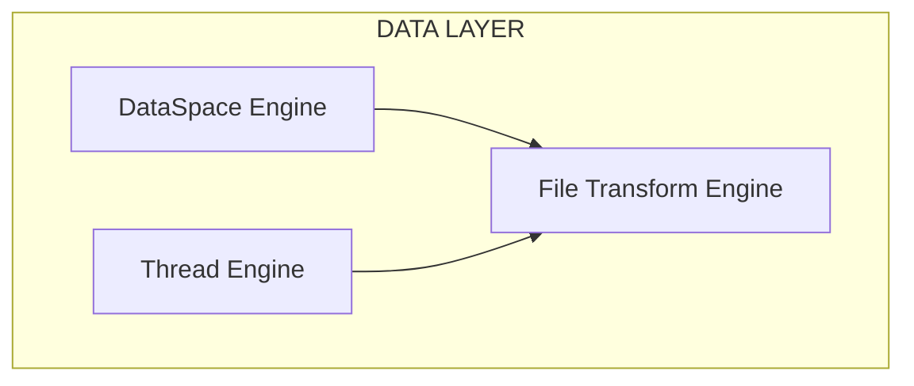

# CHE·NU™ — FILE TRANSFORM ENGINE CHAPTER
## Governed Intelligence Operating System

**Version:** 1.0.0  
**Status:** 🔒 CANONICAL  
**Module:** Data Layer Engine  
**Compliance:** SAFE · REPRESENTATIONAL · NON-AUTONOMOUS  

---

## 📋 Overview

The File Transform Engine handles document processing, format conversion, and file manipulation within CHE·NU. It operates on **descriptors and transformation rules** — actual file processing is governed and auditable.

---

## 🎯 Core Principles

```
┌─────────────────────────────────────────────────────────────┐
│                                                             │
│   File Transform Engine is GOVERNED.                       │
│   All transformations are EXPLICIT and REVERSIBLE.         │
│   User maintains OWNERSHIP of all files.                    │
│   Every operation is AUDITABLE.                             │
│                                                             │
└─────────────────────────────────────────────────────────────┘
```

### SAFE Compliance

```typescript
const FILE_TRANSFORM_SAFE = {
  isRepresentational: true,
  noAutonomy: true,
  userOwnership: true,
  reversibleTransforms: true,
  auditableOperations: true,
  governedExecution: true
} as const;
```

---

## 🏗️ Architecture

### Engine Position in Stack



### Supported Operations

| Category | Operations |
|----------|------------|
| **Conversion** | PDF↔DOCX, XLSX↔CSV, Image formats |
| **Extraction** | Text from PDF, Tables from documents |
| **Transformation** | Merge, Split, Compress, Resize |
| **Analysis** | Content extraction, Metadata parsing |
| **Generation** | Report generation, Template filling |

---

## 📊 Data Model

### FileTransformJob

```typescript
interface FileTransformJob {
  id: string;
  userId: string;
  sphereId: string;
  
  // Source
  sourceFiles: FileReference[];
  
  // Transform
  transformType: TransformType;
  transformConfig: TransformConfig;
  
  // Output
  outputFormat: OutputFormat;
  outputDestination: string;
  
  // Governance
  status: JobStatus;
  tokenBudget: number;
  tokensUsed: number;
  
  // Audit
  createdAt: string;
  completedAt?: string;
  auditLog: AuditEntry[];
}
```

### Transform Types

```typescript
type TransformType =
  | 'convert'          // Format conversion
  | 'extract'          // Content extraction
  | 'merge'            // Combine files
  | 'split'            // Split document
  | 'compress'         // Reduce size
  | 'template'         // Fill template
  | 'analyze'          // Content analysis
  | 'ocr'              // Text recognition
  | 'translate'        // Language translation
  | 'summarize';       // AI summarization
```

### Job Status

```typescript
type JobStatus =
  | 'pending'          // Awaiting execution
  | 'processing'       // In progress
  | 'completed'        // Successfully finished
  | 'failed'           // Error occurred
  | 'cancelled'        // User cancelled
  | 'governance_hold'; // Awaiting approval
```

---

## 🔄 Transform Configurations

### Convert Config

```typescript
interface ConvertConfig {
  sourceFormat: string;
  targetFormat: string;
  options: {
    preserveFormatting?: boolean;
    preserveImages?: boolean;
    preserveLinks?: boolean;
    quality?: 'low' | 'medium' | 'high';
  };
}
```

### Extract Config

```typescript
interface ExtractConfig {
  extractType: 'text' | 'tables' | 'images' | 'metadata';
  options: {
    pages?: number[];
    includeFormatting?: boolean;
    tableFormat?: 'csv' | 'json' | 'xlsx';
  };
}
```

### Merge Config

```typescript
interface MergeConfig {
  order: string[];  // File IDs in merge order
  options: {
    addPageBreaks?: boolean;
    addTableOfContents?: boolean;
    unifyStyles?: boolean;
  };
}
```

### Split Config

```typescript
interface SplitConfig {
  splitBy: 'pages' | 'sections' | 'size' | 'content';
  options: {
    pagesPerFile?: number;
    maxSizeKb?: number;
    splitPattern?: string;
  };
}
```

---

## 🎬 File Transform Service

### Methods

```typescript
class FileTransformService {
  /**
   * Create transform job (GOVERNED)
   */
  async createJob(
    userId: string,
    sphereId: string,
    config: TransformJobConfig
  ): Promise<FileTransformJob>;

  /**
   * Execute transform (GOVERNED)
   */
  async executeJob(jobId: string): Promise<TransformResult>;

  /**
   * Get job status
   */
  async getJobStatus(jobId: string): Promise<JobStatus>;

  /**
   * Cancel job
   */
  async cancelJob(jobId: string): Promise<boolean>;

  /**
   * Get transform history
   */
  async getHistory(
    userId: string,
    sphereId?: string,
    limit?: number
  ): Promise<FileTransformJob[]>;

  /**
   * Estimate tokens for transform
   */
  estimateTokens(config: TransformJobConfig): TokenEstimate;
}
```

---

## 🔐 Governance Integration

### Token Budget

```typescript
interface TransformBudget {
  jobId: string;
  allocatedTokens: number;
  usedTokens: number;
  estimatedCost: {
    extraction: number;
    processing: number;
    generation: number;
  };
}
```

### Approval Flow

For heavy transforms (AI-powered), governance approval is required:

```typescript
interface TransformApproval {
  jobId: string;
  transformType: TransformType;
  estimatedTokens: number;
  requiresApproval: boolean;
  approvalStatus: 'pending' | 'approved' | 'rejected';
  approvedBy?: string;
  approvedAt?: string;
}
```

### Audit Trail

```typescript
interface TransformAuditEntry {
  jobId: string;
  timestamp: string;
  action: 'created' | 'started' | 'completed' | 'failed' | 'cancelled';
  details: {
    filesProcessed?: number;
    tokensUsed?: number;
    outputSize?: number;
    errorMessage?: string;
  };
  userId: string;
}
```

---

## 🌐 API Routes

### Endpoints

| Method | Path | Description |
|--------|------|-------------|
| `POST` | `/api/transform/jobs` | Create transform job |
| `GET` | `/api/transform/jobs/{id}` | Get job status |
| `POST` | `/api/transform/jobs/{id}/execute` | Execute job |
| `DELETE` | `/api/transform/jobs/{id}` | Cancel job |
| `GET` | `/api/transform/history` | Get transform history |
| `POST` | `/api/transform/estimate` | Estimate tokens |

### Request Examples

```typescript
// Create Convert Job
POST /api/transform/jobs
{
  "sphereId": "business",
  "sourceFiles": [{ "id": "file-123", "name": "report.pdf" }],
  "transformType": "convert",
  "config": {
    "sourceFormat": "pdf",
    "targetFormat": "docx",
    "options": { "preserveFormatting": true }
  }
}

// Create Extract Job
POST /api/transform/jobs
{
  "sphereId": "business",
  "sourceFiles": [{ "id": "file-456", "name": "data.pdf" }],
  "transformType": "extract",
  "config": {
    "extractType": "tables",
    "options": { "tableFormat": "xlsx" }
  }
}

// Estimate Tokens
POST /api/transform/estimate
{
  "sourceFiles": [{ "size": 1024000, "format": "pdf" }],
  "transformType": "summarize"
}
```

---

## 🔗 Sphere Integration

File transforms respect sphere boundaries:

```
┌─────────────────────────────────────────────────────────────┐
│ SPHERE: Business 💼                                         │
│   └── BUREAU                                                │
│         └── Section 7: Data / Database                      │
│               ├── File: contract.pdf                        │
│               │     └── Transform: Extract tables → XLSX    │
│               └── File: report.docx                         │
│                     └── Transform: Convert → PDF            │
└─────────────────────────────────────────────────────────────┘
```

### Cross-Sphere Transforms

```typescript
interface CrossSphereTransform {
  sourceSpheree: SphereKey;
  targetSphere: SphereKey;
  requiresPermission: true;
  permissionGranted: boolean;
  auditRequired: true;
}
```

---

## 📋 Supported Formats

### Document Formats

| Format | Read | Write | Notes |
|--------|------|-------|-------|
| PDF | ✅ | ✅ | Full support |
| DOCX | ✅ | ✅ | Office Open XML |
| DOC | ✅ | ❌ | Legacy read-only |
| XLSX | ✅ | ✅ | Excel workbooks |
| CSV | ✅ | ✅ | Tabular data |
| TXT | ✅ | ✅ | Plain text |
| MD | ✅ | ✅ | Markdown |
| HTML | ✅ | ✅ | Web documents |

### Image Formats

| Format | Read | Write | Notes |
|--------|------|-------|-------|
| PNG | ✅ | ✅ | Lossless |
| JPG | ✅ | ✅ | Lossy compression |
| WebP | ✅ | ✅ | Modern format |
| SVG | ✅ | ✅ | Vector graphics |
| PDF | ✅ | ✅ | Image export |

---

## 📊 Statistics

| Metric | Value |
|--------|-------|
| Transform Types | 10 |
| Supported Input Formats | 15+ |
| Supported Output Formats | 12+ |
| API Endpoints | 6 |
| Governance Checkpoints | 3 |

---

## 🔒 Security & Privacy

### File Handling

```typescript
interface FileSecurityPolicy {
  encryptionAtRest: true;
  encryptionInTransit: true;
  retentionPolicy: {
    sourceFiles: '30d';
    outputFiles: '90d';
    auditLogs: '1y';
  };
  accessControl: 'user-owned';
  sharingPolicy: 'explicit-only';
}
```

### Data Minimization

- Source files are processed in memory when possible
- Temporary files are encrypted and auto-deleted
- Only necessary metadata is retained

---

*CHE·NU™ — Governed Intelligence Operating System*  
*File Transform Engine v1.0.0*  
*© 2024-2025 PR0 Services Inc.*
