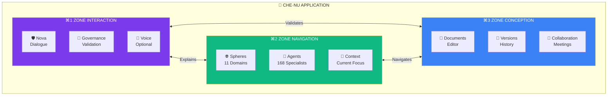

# Interaction Zones Model

## Zone Functions

| Zone | Shortcut | Primary Function |
|------|----------|------------------|
| INTERACTION | ⌘1 | Nova, dialogue, governance validation |
| NAVIGATION | ⌘2 | Spheres, agents, context switching |
| CONCEPTION | ⌘3 | Documents, versions, collaboration |
