# Interaction Zones Model

```mermaid
flowchart TB
    subgraph App["📱 CHE·NU APPLICATION"]
        subgraph ZoneA["⌘1 ZONE INTERACTION"]
            NOVA_UI["🛡️ Nova<br/>Dialogue"]
            GOV["📜 Governance<br/>Validation"]
            VOICE["🎤 Voice<br/>Optional"]
        end
        
        subgraph ZoneB["⌘2 ZONE NAVIGATION"]
            SPHERES["🌐 Spheres<br/>11 Domains"]
            AGENTS_UI["🤖 Agents<br/>168 Specialists"]
            CONTEXT["📍 Context<br/>Current Focus"]
        end
        
        subgraph ZoneC["⌘3 ZONE CONCEPTION"]
            DOCS["📄 Documents<br/>Editor"]
            VERSIONS["🔄 Versions<br/>History"]
            COLLAB["👥 Collaboration<br/>Meetings"]
        end
    end

    ZoneA <-->|"Validates"| ZoneC
    ZoneB <-->|"Navigates"| ZoneC
    ZoneA <-->|"Explains"| ZoneB

    style ZoneA fill:#7c3aed,color:#fff
    style ZoneB fill:#10b981,color:#fff
    style ZoneC fill:#3b82f6,color:#fff
```

## Zone Functions

| Zone | Shortcut | Primary Function |
|------|----------|------------------|
| INTERACTION | ⌘1 | Nova, dialogue, governance validation |
| NAVIGATION | ⌘2 | Spheres, agents, context switching |
| CONCEPTION | ⌘3 | Documents, versions, collaboration |
