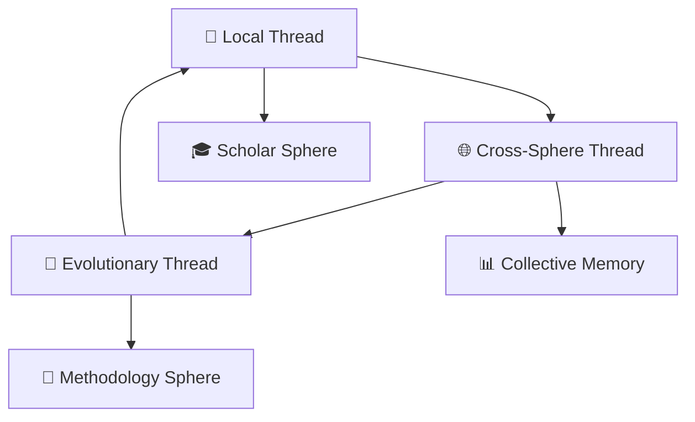

# CHE·NU — KNOWLEDGE THREADS SYSTEM
**VERSION:** v1.0 / FOUNDATION FREEZE READY  
**MODE:** NON-MANIPULATIVE / TRACEABLE CONTEXT

---

## PURPOSE ⚡

> **Knowledge Threads connect data, context, and insight across spheres, agents, and replays to form a living weave of verified knowledge — enabling recall, navigation, and evolution without distortion.**

> **Each THREAD = a verifiable lineage of understanding.**

---

## KNOWLEDGE THREADS — OVERVIEW ⚡

### 3 Thread Types ⚡
| Type | Description |
|------|-------------|
| **1 — LOCAL THREAD** | Sphere-specific (Business, Scholar, etc.) |
| **2 — CROSS-SPHERE THREAD** | Connects insights between domains |
| **3 — EVOLUTIONARY THREAD** | **Tracks growth and revision over time** |

---

## 1️⃣ LOCAL THREAD ⚡

### Scope
> **Within one sphere** (e.g. Scholar, Business). Maps knowledge from documents, meetings, agent outputs.

### Data Nodes ⚡
| Node | Description |
|------|-------------|
| Notes | ⚡ |
| Decisions | ⚡ |
| Artifacts | ⚡ |
| **Agent commentary** | ⚡ |

### Local Thread JSON ⚡
```json
{
  "local_thread": {
    "id": "uuid",
    "sphere": "scholar|business|creative|...",
    "entries": [
      { "type": "note", "content": "text", "timestamp": "..." },
      { "type": "decision", "summary": "..." },
      { "type": "artifact", "ref": "file_id" }
    ],
    "agent_owner": "agent_id",
    "hash": "sha256"
  }
}
```

### Behavior ⚡
| Behavior | Description |
|----------|-------------|
| **auto-index new knowledge nodes** | ⚡ |
| **maintains semantic cohesion** | ⚡ |
| **tags sources and reliability level** | ⚡ |
| **immutable lineage per version** | ⚡ |

---

## 2️⃣ CROSS-SPHERE THREAD ⚡

### Scope
> **Bridges two or more spheres. Creates connections between insights, replays, or data.**

### Data Nodes ⚡
| Node | Description |
|------|-------------|
| Concept links | ⚡ |
| Shared methodologies | ⚡ |
| **Causal relationships** | ⚡ |

### Cross-Sphere Thread JSON ⚡
```json
{
  "cross_thread": {
    "id": "uuid",
    "linked_spheres": ["business", "creative"],
    "relations": [
      { "concept": "sustainability", "overlap_score": 0.84 },
      { "concept": "optimization", "agent_link": "agent_id" }
    ],
    "confidence": "calculated"
  }
}
```

### Key Field: `overlap_score` ⚡
> **Calculated structural overlap (not emotional)**

### Behavior ⚡
| Behavior | Description |
|----------|-------------|
| **creates "bridge nodes" in universe view** | ⚡ |
| **adaptive connection strength** | ⚡ |
| **updates automatically from sphere evolution** | ⚡ |
| **can trigger collaborative re-analysis sessions** | ⚡ |

---

## 3️⃣ EVOLUTIONARY THREAD ⚡

### Scope
> **Monitors the change and refinement of ideas, data, or methodology.**

### Nodes ⚡
| Node | Description |
|------|-------------|
| Historical state snapshots | ⚡ |
| Review feedback | ⚡ |
| **Drift metrics** | ⚡ |
| **Agent learning logs** | ⚡ |

### Evolutionary Thread JSON ⚡
```json
{
  "evolution_thread": {
    "origin_thread": "thread_id",
    "timeline": [
      { "version": 1, "date": "2025-12-10", "summary": "initial concept" },
      { "version": 2, "date": "2026-03-01", "summary": "refined with field data" }
    ],
    "agent_evaluator": "learning_agent_id",
    "validated": true
  }
}
```

### Behavior ⚡
| Behavior | Description |
|----------|-------------|
| **compares before/after semantic drift** | ⚡ |
| **creates a "learning curve" graph** | ⚡ |
| **triggers methodology optimization** | ⚡ |
| **feeds Methodology Sphere agents for pattern analysis** | ⚡ |

---

## INTERCONNECTION LOGIC ⚡

### Mermaid Diagram ⚡


### Flow Summary ⚡
| From | To | Relationship |
|------|-----|--------------|
| Local Thread | Cross-Sphere | feeds insights |
| Cross-Sphere | Evolutionary | triggers evolution |
| Evolutionary | Local | **refines origin** |
| Cross-Sphere | Collective Memory | **stores validated** |
| Local | Scholar Sphere | domain knowledge |
| Evolutionary | Methodology Sphere | **pattern analysis** |

---

**END — FOUNDATION FREEZE READY**
