```mermaid
%%{init: {'theme': 'dark', 'themeVariables': { 'primaryColor': '#D8B26A', 'primaryTextColor': '#E9E4D6', 'primaryBorderColor': '#3EB4A2', 'lineColor': '#3F7249', 'secondaryColor': '#2F4C39', 'tertiaryColor': '#1E1F22'}}}%%

graph TD
    %% ═══════════════════════════════════════════════════════════════
    %% CHE·NU — OFFICIAL SPHERE SYSTEM (VERSION FINALE)
    %% FREEZE 1.5 — 10 CANONICAL SPHERES
    %% SAFE · NON-AUTONOMOUS · REPRESENTATIONAL
    %% ═══════════════════════════════════════════════════════════════

    %% ─────────────────────────────────────────────────────
    %% ROOT SPHERES (10 Official)
    %% ─────────────────────────────────────────────────────
    
    Personal((👤 Personal))
    Business((💼 Business))
    Creative((🎨 Creative))
    Scholar((📚 Scholar))
    Social((📱 Social Network & Media))
    Community((🏘️ Community))
    XR((🥽 XR / Spatial))
    MyTeam((👥 MyTeam))
    AILab((🤖 AI Lab))
    Entertainment((🎮 Entertainment))

    %% ─────────────────────────────────────────────────────
    %% PERSONAL SUB-SPHERES
    %% ─────────────────────────────────────────────────────
    
    Personal --> P_Health[🏥 Health & Wellbeing]
    Personal --> P_Habits[🔄 Habits & Lifestyle]
    Personal --> P_PFin[💵 Personal Finance]
    Personal --> P_Dev[📈 Personal Development]
    Personal --> P_Life[📋 Life Organization]

    %% ─────────────────────────────────────────────────────
    %% BUSINESS SUB-SPHERES
    %% ─────────────────────────────────────────────────────
    
    Business --> B_Fin[💰 Business Finance]
    Business --> B_Op[⚙️ Operations]
    Business --> B_Log[🚚 Supply & Logistics]
    Business --> B_Constr[🏗️ Construction / Industrial]
    Business --> B_Commerce[🛒 Commerce]

    %% ─────────────────────────────────────────────────────
    %% CREATIVE SUB-SPHERES
    %% ─────────────────────────────────────────────────────
    
    Creative --> C_Art[🖼️ Art & Media Creation]
    Creative --> C_Design[✏️ Design]
    Creative --> C_Imagination[💭 Imagination / Concept Worlds]
    Creative --> C_Expression[🎭 Creative Expression]

    %% ─────────────────────────────────────────────────────
    %% SCHOLAR SUB-SPHERES
    %% ─────────────────────────────────────────────────────
    
    Scholar --> S_Study[📖 Study]
    Scholar --> S_Research[🔬 Research]
    Scholar --> S_Doc[📝 Documentation]
    Scholar --> S_IA[🗂️ Information Architecture]

    %% ─────────────────────────────────────────────────────
    %% SOCIAL NETWORK & MEDIA SUB-SPHERES (UPDATED)
    %% ─────────────────────────────────────────────────────
    
    Social --> SN_Platform[📲 Social Media Platform]
    Social --> SN_Messaging[💬 Messaging & Interaction]
    Social --> SN_Feed[📰 Content Feed]
    Social --> SN_MediaTools[🎬 Media Creation Tools]

    %% ─────────────────────────────────────────────────────
    %% COMMUNITY SUB-SPHERES (UPDATED)
    %% ─────────────────────────────────────────────────────
    
    Community --> CM_Groups[👥 Community Groups & Pages]
    Community --> CM_Announce[📢 Public Announcements]
    Community --> CM_Forum[💬 Forum / Reddit-style Space]
    Community --> CM_Civic[🏛️ Civic Culture & Public Services]

    %% ─────────────────────────────────────────────────────
    %% XR / SPATIAL SUB-SPHERES
    %% ─────────────────────────────────────────────────────
    
    XR --> XR_Scenes[🎪 XR Scenes]
    XR --> XR_Spatial[🖐️ Spatial Interaction]
    XR --> XR_World[🌍 World Building]

    %% ─────────────────────────────────────────────────────
    %% MYTEAM SUB-SPHERES
    %% ─────────────────────────────────────────────────────
    
    MyTeam --> TM_Roles[🎭 Team Roles]
    MyTeam --> TM_Collab[🤝 Collaboration]
    MyTeam --> TM_Deleg[📋 Delegation]
    MyTeam --> TM_Coord[📅 Coordination Tools]

    %% ─────────────────────────────────────────────────────
    %% AI LAB SUB-SPHERES
    %% ─────────────────────────────────────────────────────
    
    AILab --> AI_Sandbox[🧪 AI Sandbox - SAFE]
    AILab --> AI_CogTools[🧠 Cognitive Tools]
    AILab --> AI_Simulation[🎯 Concept Simulation]
    AILab --> AI_Research[🔍 Structural Intelligence Research]

    %% ─────────────────────────────────────────────────────
    %% ENTERTAINMENT SUB-SPHERES (UPDATED)
    %% ─────────────────────────────────────────────────────
    
    Entertainment --> E_Streaming[📺 Video Streaming Platform]
    Entertainment --> E_Interactive[🕹️ Interactive Experiences]
    Entertainment --> E_Games[🎮 Games & Play]
    Entertainment --> E_Audience[🎟️ Audience Experience]
    Entertainment --> E_Immersion[🌌 Immersion Media]

    %% ─────────────────────────────────────────────────────
    %% CROSS-SPHERE CONNECTIONS (Secondary Services)
    %% ─────────────────────────────────────────────────────
    
    %% Social ↔ Community (Shared Identity)
    SN_Platform -.-> CM_Groups
    CM_Forum -.-> SN_Platform
    CM_Groups -.-> SN_Platform
    
    %% Entertainment ↔ Social
    E_Streaming -.-> SN_Platform
    E_Games -.-> SN_Messaging
    
    %% Community ↔ Scholar
    CM_Forum -.-> S_Research
    
    %% Creative ↔ Entertainment
    C_Art -.-> E_Streaming
    C_Expression -.-> E_Audience
    
    %% XR ↔ Entertainment
    XR_Scenes -.-> E_Interactive
    XR_Spatial -.-> E_Immersion
    
    %% MyTeam ↔ Business
    TM_Coord -.-> B_Op
    TM_Deleg -.-> B_Commerce

    %% ─────────────────────────────────────────────────────
    %% UNIFIED IDENTITY SYSTEM
    %% ─────────────────────────────────────────────────────
    
    subgraph UnifiedIdentity[🔐 Unified Identity System]
        direction LR
        Identity[UserIdentity]
        Identity --> Social
        Identity --> Community
        Identity --> Entertainment
        Identity --> MyTeam
        Identity --> XR
    end

    %% ─────────────────────────────────────────────────────
    %% STYLING
    %% ─────────────────────────────────────────────────────
    
    classDef rootSphere fill:#D8B26A,stroke:#3EB4A2,stroke-width:3px,color:#1E1F22
    classDef subSphere fill:#2F4C39,stroke:#3F7249,stroke-width:1px,color:#E9E4D6
    classDef identityBox fill:#1E1F22,stroke:#D8B26A,stroke-width:2px,color:#E9E4D6
    
    class Personal,Business,Creative,Scholar,Social,Community,XR,MyTeam,AILab,Entertainment rootSphere
    class P_Health,P_Habits,P_PFin,P_Dev,P_Life subSphere
    class B_Fin,B_Op,B_Log,B_Constr,B_Commerce subSphere
    class C_Art,C_Design,C_Imagination,C_Expression subSphere
    class S_Study,S_Research,S_Doc,S_IA subSphere
    class SN_Platform,SN_Messaging,SN_Feed,SN_MediaTools subSphere
    class CM_Groups,CM_Announce,CM_Forum,CM_Civic subSphere
    class XR_Scenes,XR_Spatial,XR_World subSphere
    class TM_Roles,TM_Collab,TM_Deleg,TM_Coord subSphere
    class AI_Sandbox,AI_CogTools,AI_Simulation,AI_Research subSphere
    class E_Streaming,E_Interactive,E_Games,E_Audience,E_Immersion subSphere
    class UnifiedIdentity,Identity identityBox
```

---

## 📊 DIAGRAMME SIMPLIFIÉ (Sans styling)

```mermaid
graph TD
    %% Root spheres
    Personal((Personal))
    Business((Business))
    Creative((Creative))
    Scholar((Scholar))
    Social((Social Network & Media))
    Community((Community))
    XR((XR / Spatial))
    MyTeam((MyTeam))
    AILab((AI Lab))
    Entertainment((Entertainment))

    %% Personal
    Personal --> P_Health[Health & Wellbeing]
    Personal --> P_Habits[Habits & Lifestyle]
    Personal --> P_PFin[Personal Finance]
    Personal --> P_Dev[Personal Development]
    Personal --> P_Life[Life Organization]

    %% Business
    Business --> B_Fin[Business Finance]
    Business --> B_Op[Operations]
    Business --> B_Log[Supply & Logistics]
    Business --> B_Constr[Construction / Industrial]
    Business --> B_Commerce[Commerce]

    %% Creative
    Creative --> C_Art[Art & Media Creation]
    Creative --> C_Design[Design]
    Creative --> C_Imagination[Imagination / Concept Worlds]
    Creative --> C_Expression[Creative Expression]

    %% Scholar
    Scholar --> S_Study[Study]
    Scholar --> S_Research[Research]
    Scholar --> S_Doc[Documentation]
    Scholar --> S_IA[Information Architecture]

    %% Social Network & Media
    Social --> SN_Platform[Social Media Platform]
    Social --> SN_Messaging[Messaging & Interaction]
    Social --> SN_Feed[Content Feed]
    Social --> SN_MediaTools[Media Creation Tools]

    %% Community
    Community --> CM_Groups[Community Groups & Pages]
    Community --> CM_Announce[Public Announcements]
    Community --> CM_Forum[Forum / Reddit-style Space]
    Community --> CM_Civic[Civic Culture & Public Services]

    %% XR
    XR --> XR_Scenes[XR Scenes]
    XR --> XR_Spatial[Spatial Interaction]
    XR --> XR_World[World Building]

    %% MyTeam
    MyTeam --> TM_Roles[Team Roles]
    MyTeam --> TM_Collab[Collaboration]
    MyTeam --> TM_Deleg[Delegation]
    MyTeam --> TM_Coord[Coordination Tools]

    %% AI Lab
    AILab --> AI_Sandbox[AI Sandbox - SAFE]
    AILab --> AI_CogTools[Cognitive Tools]
    AILab --> AI_Simulation[Concept Simulation]
    AILab --> AI_Research[Structural Intelligence Research]

    %% Entertainment
    Entertainment --> E_Streaming[Video Streaming Platform]
    Entertainment --> E_Interactive[Interactive Experiences]
    Entertainment --> E_Games[Games & Play]
    Entertainment --> E_Audience[Audience Experience]
    Entertainment --> E_Immersion[Immersion Media]
```

---

## 📋 LÉGENDE

| Symbole | Signification |
|---------|---------------|
| `(( ))` | Sphère racine (10 officielles) |
| `[ ]` | Sub-sphere (domaine module) |
| `-->` | Relation primaire (parent → enfant) |
| `-.->` | Relation secondaire (cross-sphere service) |
| `🔐` | Système d'identité unifiée |

---

## 🔒 NOTES FREEZE 1.5

1. **10 sphères UNIQUEMENT** - Pas d'ajout possible sans nouveau FREEZE
2. **Sub-spheres clarifiées** pour Entertainment, Social, Community
3. **Video Streaming** = Entertainment (primaire), pas Social
4. **Forum Reddit-style** = Community (primaire), pas Social
5. **Identité unifiée** partagée entre Social, Community, Entertainment, MyTeam, XR
