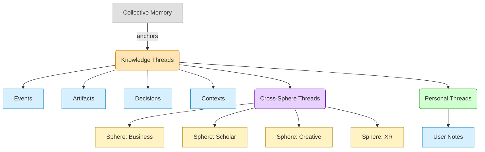

# CHE·NU — KNOWLEDGE THREADS SYSTEM (v1.0)
**MODE:** FOUNDATION / NON-MANIPULATIVE / TRACEABLE / IMMERSIVE-COMPATIBLE

---

## 1) GLOBAL KNOWLEDGE THREADS — FOUNDATION

### Purpose
Represent connections between facts, events, artifacts, replays, decisions, and spheres **WITHOUT interpretation or narrative shaping.**

### RULE
> **A Knowledge Thread = a LINE OF TRACEABLE LINKS. Not a story, not an analysis.**

### Thread Element Types ⚡
| Type | Description |
|------|-------------|
| `THREAD_EVENT` | **timestamped replay moment, anchor to collective memory** ⚡ |
| `THREAD_ARTIFACT` | **document, board, visual note** ⚡ |
| `THREAD_DECISION` | **factual recorded decision** ⚡ |
| `THREAD_CONTEXT` | **sphere, meeting type, participants** ⚡ |
| `THREAD_LINK` | **explicit connection (declared), never inferred automatically** ⚡ |

### Thread JSON Model (with relation types) ⚡

```json
{
  "knowledge_thread": {
    "id": "uuid",
    "name": "string",
    "links": [
      {
        "type": "event|artifact|decision|context",
        "source": "uuid",
        "relation": "requires|follows|references|contrasts",
        "timestamp": 1712345678
      }
    ],
    "sphere_scope": ["business","scholar", "..."],
    "hash": "sha256"
  }
}
```

### Thread Fields ⚡
| Field | Description |
|-------|-------------|
| `links[].relation` | **requires/follows/references/contrasts** ⚡ |
| `sphere_scope` | **Array of sphere names** ⚡ |

### Thread Behavior Rules ⚡
| Rule | Status |
|------|--------|
| append-only | ✅ |
| **user or agent must DECLARE links** | ✅ ⚡ |
| **no hidden linking** | ✅ ⚡ |
| no sentiment metadata | ✅ |
| **no suggestions based on psychology** | ✅ ⚡ |

---

## 2) CROSS-SPHERE KNOWLEDGE THREADS

### Purpose
Connect information across spheres (Business ↔ Scholar ↔ XR) while **respecting boundaries and visibility rules.**

### RULE
> **No cross-sphere propagation without explicit user request.**

### Allowed Cross-Links ⚡
| Link Type | Status |
|-----------|--------|
| shared artifact | ✅ |
| **repeated decision type** | ⚡ |
| **similar event patterns** | ⚡ |
| **shared participants (optional anonymization)** | ⚡ |
| **XR replay evidence** | ⚡ |

### Disallowed Cross-Links ⚡
| Forbidden | Status |
|-----------|--------|
| **inferred causality** | ❌ ⚡ |
| **emotional or behavioral assumptions** | ❌ ⚡ |
| **role-based shortcuts** | ❌ ⚡ |
| **automatic propagation** | ❌ ⚡ |

### Cross-Sphere Thread JSON (with visibility + audit_log) ⚡

```json
{
  "cross_thread": {
    "id": "uuid",
    "origin_sphere": "scholar",
    "target_spheres": ["business","creative","institution"],
    "links": [...],
    "visibility": "user_defined",
    "audit_log": [...],
    "hash": "sha256"
  }
}
```

### Cross-Sphere Fields ⚡
| Field | Description |
|-------|-------------|
| `visibility` | **"user_defined"** ⚡ |
| `audit_log` | **Array of audit entries** ⚡ |

### Cross-Sphere Visualization ⚡
| Property | Behavior |
|----------|----------|
| **Nodes cluster by sphere color** | ⚡ |
| **Links appear only on request** | ⚡ |
| **Hover shows: source replay, artifact name, timestamp** | ⚡ |

---

## 3) PERSONAL KNOWLEDGE THREADS

### Purpose
Allow users to build **private conceptual lines** across their own data, meetings, insights.

### RULE
> **Personal = PRIVATE by default.**

### Personal Thread Uses ⚡
| Use Case | Description |
|----------|-------------|
| planning | ✅ |
| **learning path** | ⚡ |
| **research synthesis** | ⚡ |
| **cross-project reasoning** | ⚡ |
| **meeting preparation** | ⚡ |

### Personal Thread JSON (with private + note) ⚡

```json
{
  "personal_thread": {
    "id": "uuid",
    "user_id": "uuid",
    "name": "string",
    "private": true,
    "links": [
      { "item": "memory_id", "note": "string", "timestamp": "..." }
    ],
    "hash": "sha256"
  }
}
```

### Personal Fields ⚡
| Field | Description |
|-------|-------------|
| `private` | **true** (default) ⚡ |
| `links[].note` | **User annotation string** ⚡ |

### Thread Safety Rules ⚡
| Rule | Status |
|------|--------|
| **no accidental sharing** | ✅ ⚡ |
| **encrypted at rest** | ✅ ⚡ |
| **cannot influence routing** | ✅ ⚡ |
| **cannot influence agent behavior** | ✅ ⚡ |
| **used only as user reference** | ✅ ⚡ |

---

## MERMAID DIAGRAM — KNOWLEDGE THREADS OVERVIEW ⚡



---

**END — KNOWLEDGE THREADS SYSTEM READY**
