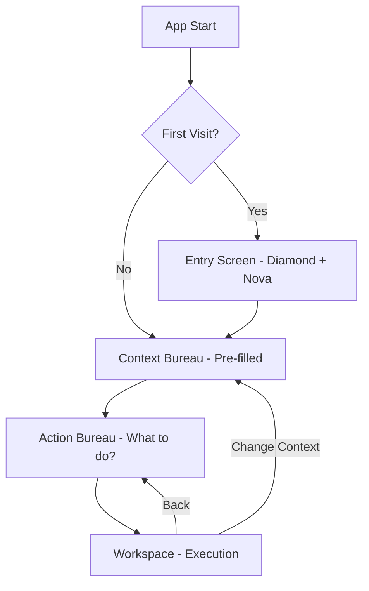

# 🎨 CHE·NU™ V46 — ANALYSE UI/UX APPROFONDIE

> **Date:** 24 décembre 2025
> **Version:** V46
> **Objectif:** Améliorer la navigation et l'affichage

---

## 📊 RÉSUMÉ EXÉCUTIF

| Aspect | Score Actuel | Cible | Gap |
|--------|--------------|-------|-----|
| **Conformité Wireflow** | 60% | 100% | -40% |
| **Cohérence Navigation** | 55% | 95% | -40% |
| **Clarté Interface** | 70% | 90% | -20% |
| **Réduction Cognitive** | 65% | 85% | -20% |

---

## 🔍 ANALYSE DU WIREFLOW CANONIQUE vs IMPLÉMENTATION

### Wireflow Attendu (CANONIQUE)

```
┌─────────┐     ┌─────────────────┐     ┌─────────────────┐     ┌─────────────┐
│  ENTRY  │────▶│ CONTEXT BUREAU  │────▶│  ACTION BUREAU  │────▶│  WORKSPACE  │
└─────────┘     └─────────────────┘     └─────────────────┘     └─────────────┘
                       ▲                        ▲                       │
                       └────────────────────────┴───────────────────────┘
```

### État Actuel de l'Implémentation

| Écran | Statut | Fichier | Problème |
|-------|--------|---------|----------|
| **Entry** | ✅ Existe | `EntryScreen.tsx` (mobile) | Pas de version web |
| **Context Bureau** | ✅ Existe | `ContextBureauScreen.tsx` | Pas intégré au flow principal |
| **Action Bureau** | ✅ Existe | `ActionBureauScreen.tsx` | Pas intégré au flow principal |
| **Workspace** | ⚠️ Partiel | Multiples implementations | Fragmenté |
| **Diamond Hub** | ✅ Existe | `DiamondHub.tsx` | Pas central dans la nav |

### 🚨 PROBLÈME MAJEUR #1: Flow Contourné

Le `MainRouter.tsx` **BYPASS** le wireflow canonique:
```typescript
// ACTUEL (incorrect)
<Route path="/" element={<Navigate to="/personal/dashboard" replace />} />

// DEVRAIT ÊTRE
<Route path="/" element={<EntryScreen />} />
<Route path="/context" element={<ContextBureauScreen />} />
<Route path="/action" element={<ActionBureauScreen />} />
<Route path="/:sphere/:workspace" element={<WorkspaceScreen />} />
```

---

## 📱 ANALYSE DE LA NAVIGATION

### Composants de Navigation Identifiés

| Composant | Fichier | Usage | Problème |
|-----------|---------|-------|----------|
| `Sidebar.tsx` | `/src/Sidebar.tsx` | Menu traditionnel | Ne suit pas le wireflow |
| `UnifiedNavigationHub.tsx` | `/src/UnifiedNavigationHub.tsx` | Spotlight (⌘K) | OK mais pas central |
| `GlobalLayout.tsx` | `/ui-wireframes/` | Layout wireframe | Non intégré |
| `BureauNavigation.tsx` | `/components/navigation/` | Nav bureau | Correct |

### 🚨 PROBLÈME MAJEUR #2: Navigation Fragmentée

**7+ systèmes de navigation** coexistent:

```
1. Sidebar.tsx           → Menu vertical classique
2. UnifiedNavigationHub  → Command palette (⌘K)
3. DiamondHub            → Hub contextuel
4. BureauNavigation      → Nav sections bureau
5. SphereSwitcher        → Changement de sphère
6. Header                → Top bar
7. MobileNavigation      → Version mobile
```

**Résultat:** L'utilisateur ne sait pas où regarder.

---

## 🎯 ANALYSE DES SECTIONS BUREAU

### Structure Canonique (6 sections)

```
┌─────────────────────────────────────────────────────────────────────────────────┐
│                         SPHERE BUREAU (ex: Business 💼)                         │
├─────────────────────────────────────────────────────────────────────────────────┤
│  ┌──────────────────┐  ┌──────────────────┐  ┌──────────────────┐              │
│  │ 1. Quick Capture │  │ 2. Resume Work   │  │ 3. Threads       │              │
│  │       ⚡         │  │       📂         │  │       💬         │              │
│  └──────────────────┘  └──────────────────┘  └──────────────────┘              │
│                                                                                  │
│  ┌──────────────────┐  ┌──────────────────┐  ┌──────────────────┐              │
│  │ 4. Data/Files    │  │ 5. Active Agents │  │ 6. Meetings      │              │
│  │       📁         │  │       🤖         │  │       📅         │              │
│  └──────────────────┘  └──────────────────┘  └──────────────────┘              │
│                                                                                  │
│                    ⚠️ MAXIMUM 6 SECTIONS — JAMAIS PLUS                         │
└─────────────────────────────────────────────────────────────────────────────────┘
```

### ✅ Implémentation Correcte

Le `BureauConsolidated.tsx` respecte les 6 sections:

```typescript
export const BUREAU_SECTIONS: BureauSectionConfig[] = [
  { id: 'QUICK_CAPTURE',    icon: '⚡', shortcut: 'Q' },
  { id: 'RESUME_WORKSPACE', icon: '📂', shortcut: 'R' },
  { id: 'THREADS',          icon: '💬', shortcut: 'T' },
  { id: 'DATA_FILES',       icon: '📁', shortcut: 'D' },
  { id: 'ACTIVE_AGENTS',    icon: '🤖', shortcut: 'A' },
  { id: 'MEETINGS',         icon: '📅', shortcut: 'M' },
];
```

---

## 🚨 PROBLÈMES CRITIQUES IDENTIFIÉS

### 1. Flow d'Entrée Inexistant (Web)

**Impact:** L'utilisateur arrive directement dans `/personal/dashboard` sans passer par Entry → Context Bureau

**Solution:**
```typescript
// Nouveau flow
App Start → EntryScreen → ContextBureauScreen → ActionBureauScreen → Workspace
```

### 2. Sidebar Obsolète

**Impact:** Le `Sidebar.tsx` utilise un menu statique qui:
- Ne reflète pas le contexte actif
- Mélange sphères et fonctionnalités
- Ne suit pas la philosophie "Bureau guide, Workspace execute"

**Menu Actuel (incorrect):**
```
📊 Dashboard
🏠 Maison
🏢 Entreprise
📁 Projets
🎨 Creative Studio  ← Mis en avant (pourquoi?)
🏛️ Gouvernement
🏘️ Immobilier
🤝 Associations
📱 Social Network
💬 Forum
🎬 Streaming
🤖 Nova AI
🎓 CHE-Learn
⚙️ Paramètres
```

**Structure Canonique (correcte):**
```
[Diamond Hub] - Contexte actif visible

NAVIGATION PRINCIPALE:
◆ Universe View (8 sphères)
📥 Inbox
📋 Tasks
🎯 Meetings
🧠 Memory
👥 My Team

[Nova] - Toujours accessible mais passif
```

### 3. Duplication des Composants

**Même fonctionnalité implémentée plusieurs fois:**

| Fonctionnalité | Fichiers |
|----------------|----------|
| Layout | `AppLayout.tsx`, `GlobalLayout.tsx`, `AppShell.tsx` |
| Navigation | `Sidebar.tsx`, `UnifiedNavigationHub.tsx`, `NavigationLayout.tsx` |
| Bureau | `BureauSections.tsx`, `BureauConsolidated.tsx`, `BureauSectionsCanonical.tsx` |
| Theme | 15+ fichiers de thèmes |

### 4. Manque de Hiérarchie Visuelle

**Problème:** Tout est au même niveau visuel
- Pas de distinction entre navigation primaire/secondaire
- Actions rapides noyées dans le menu
- Diamond Hub pas assez proéminent

---

## 💡 RECOMMANDATIONS D'AMÉLIORATION

### 1. Refonte du Flow Principal



### 2. Nouveau Layout Principal

```
┌─────────────────────────────────────────────────────────────────┐
│ ◆ Diamond Hub          [Contexte: Business • CHE·NU Dev]  ✦Nova │
├─────────────────────────────────────────────────────────────────┤
│                                                                  │
│  ┌────────────────────────────────────────────────────────────┐ │
│  │                                                            │ │
│  │                                                            │ │
│  │                    MAIN CONTENT AREA                       │ │
│  │                                                            │ │
│  │              (Context Bureau / Action Bureau /             │ │
│  │                    Workspace / etc.)                       │ │
│  │                                                            │ │
│  │                                                            │ │
│  └────────────────────────────────────────────────────────────┘ │
│                                                                  │
├─────────────────────────────────────────────────────────────────┤
│  [Q] Quick    [R] Resume    [T] Threads    [⌘K] Search         │
│      Capture       Work                                         │
└─────────────────────────────────────────────────────────────────┘
```

### 3. Simplification de la Navigation

**SUPPRIMER:**
- Menu sidebar traditionnel
- Navigation redondante
- Multiples layouts

**CONSERVER:**
- Diamond Hub (central)
- Bureau Sections (6 max)
- Spotlight Search (⌘K)
- Nova Panel (accessible)

### 4. Nouveau Composant: `CheNuShell.tsx`

```typescript
// Composant unique qui orchestre tout
export const CheNuShell: React.FC = () => {
  const { state, send } = useNavMachine();
  
  return (
    <div className="chenu-shell">
      {/* Diamond Hub - Always visible */}
      <DiamondHubBar context={state.context} />
      
      {/* Main Content - Based on state */}
      <main className="chenu-main">
        {state.matches('entry') && <EntryScreen />}
        {state.matches('context_bureau') && <ContextBureauScreen />}
        {state.matches('action_bureau') && <ActionBureauScreen />}
        {state.matches('workspace') && <WorkspaceScreen />}
      </main>
      
      {/* Quick Actions Bar - Context aware */}
      <QuickActionsBar context={state.context} />
      
      {/* Nova Panel - Slide from right */}
      <NovaPanel />
    </div>
  );
};
```

---

## 🎨 PROPOSITIONS DE DESIGN

### A. Entry Screen (Web)

```
┌─────────────────────────────────────────────────────────────────┐
│                                                                  │
│                           ◆                                      │
│                        CHE·NU                                    │
│                                                                  │
│                  ┌─────────────────────┐                        │
│                  │        ✦           │                        │
│                  │      Nova          │                        │
│                  │   "Bonjour Jo!"    │                        │
│                  └─────────────────────┘                        │
│                                                                  │
│         🏠  💼  🏛️  🎨  👥  📱  🎬  🤝  📚                     │
│                    (9 sphères)                                   │
│                                                                  │
│              ╔═══════════════════════════════╗                  │
│              ║     Entrer dans CHE·NU →      ║                  │
│              ╚═══════════════════════════════╝                  │
│                                                                  │
│                    ⌘K pour rechercher                           │
│                                                                  │
└─────────────────────────────────────────────────────────────────┘
```

### B. Context Bureau (Simplifié)

```
┌─────────────────────────────────────────────────────────────────┐
│ ◆ Context Bureau                              "Sur quoi je...?" │
├─────────────────────────────────────────────────────────────────┤
│                                                                  │
│   IDENTITÉ         ┌────────────────────────────────────────┐   │
│                    │ 💼 Pro Service Inc              [Auto] │   │
│                    └────────────────────────────────────────┘   │
│                                                                  │
│   SPHÈRE           ┌────────────────────────────────────────┐   │
│                    │ 💼 Business                     [Auto] │   │
│                    └────────────────────────────────────────┘   │
│                                                                  │
│   PROJET           ┌────────────────────────────────────────┐   │
│   (optionnel)      │ 📁 CHE·NU Development                  │   │
│                    └────────────────────────────────────────┘   │
│                                                                  │
│   ┌──────────┐   ┌──────────┐   ┌──────────┐                   │
│   │ 3 Tâches │   │ 2 Meet   │   │ 1 Alert  │                   │
│   │ urgentes │   │ proches  │   │          │                   │
│   └──────────┘   └──────────┘   └──────────┘                   │
│                                                                  │
│              ╔═══════════════════════════════╗                  │
│              ║       ALLER TRAVAILLER →      ║                  │
│              ╚═══════════════════════════════╝                  │
│                                                                  │
└─────────────────────────────────────────────────────────────────┘
```

### C. Action Bureau (Focus Actions)

```
┌─────────────────────────────────────────────────────────────────┐
│ ◆ Business • CHE·NU Dev                    ← Changer contexte   │
├─────────────────────────────────────────────────────────────────┤
│                                                                  │
│   ACTIONS RAPIDES                                                │
│   ┌────────────┐ ┌────────────┐ ┌────────────┐ ┌────────────┐  │
│   │  📝 Note   │ │  ✅ Tâche  │ │  📹 Meet   │ │  🤖 Agent  │  │
│   └────────────┘ └────────────┘ └────────────┘ └────────────┘  │
│                                                                  │
│   📌 ÉPINGLÉS                                                   │
│   ┌──────────────────────────────────────────────────────────┐  │
│   │ 🔧 Main Development Workspace                         → │  │
│   └──────────────────────────────────────────────────────────┘  │
│                                                                  │
│   🕐 RÉCENTS                                                    │
│   ┌──────────────────────────────────────────────────────────┐  │
│   │ API Integration Session                           (hier) │  │
│   │ Documentation Review                          (2 jours)  │  │
│   └──────────────────────────────────────────────────────────┘  │
│                                                                  │
│   💡 NOVA                                                       │
│   ┌──────────────────────────────────────────────────────────┐  │
│   │ "Vous avez 3 tâches urgentes. Commencer par là?"       │  │
│   └──────────────────────────────────────────────────────────┘  │
│                                                                  │
└─────────────────────────────────────────────────────────────────┘
```

### D. Workspace (Minimal Chrome)

```
┌─────────────────────────────────────────────────────────────────┐
│ 🔧 Main Development                 Context: Business 🔒   [←] │
├─────────────────────────────────────────────────────────────────┤
│                                                                  │
│  ┌───────────────────────────────────────────────────────────┐  │
│  │                                                           │  │
│  │                                                           │  │
│  │                       CANVAS                              │  │
│  │                                                           │  │
│  │              (Document / Table / Board)                   │  │
│  │                                                           │  │
│  │                                                           │  │
│  │                                                           │  │
│  └───────────────────────────────────────────────────────────┘  │
│                                                                  │
├─────────────────────────────────────────────────────────────────┤
│  [Draft] [Staging] [Review]        [📋 Diff] [🤖 Agent] [💾]   │
└─────────────────────────────────────────────────────────────────┘
```

---

## 📋 PLAN D'ACTION

### Phase 1: Nettoyage (1-2 jours)

- [ ] Supprimer les composants dupliqués
- [ ] Consolider vers `CheNuShell.tsx`
- [ ] Unifier le système de thèmes

### Phase 2: Flow Principal (2-3 jours)

- [ ] Implémenter `EntryScreen` (web)
- [ ] Intégrer le wireflow canonique dans le router
- [ ] Connecter `ContextBureauScreen` et `ActionBureauScreen`

### Phase 3: Navigation (2-3 jours)

- [ ] Refondre le `DiamondHubBar`
- [ ] Implémenter `QuickActionsBar`
- [ ] Supprimer l'ancien `Sidebar.tsx`

### Phase 4: Polish (1-2 jours)

- [ ] Animations et transitions
- [ ] Raccourcis clavier
- [ ] Tests utilisateur

---

## 📊 MÉTRIQUES DE SUCCÈS

| Métrique | Avant | Après (Cible) |
|----------|-------|---------------|
| Clics pour atteindre workspace | 2-5 | 1-2 |
| Composants de navigation | 7+ | 3 |
| Fichiers de layout | 5+ | 1 |
| Conformité wireflow | 60% | 100% |
| Cognitive load (subjectif) | Élevé | Faible |

---

## 🎯 CONCLUSION

CHE·NU V46 a tous les composants nécessaires mais ils ne sont pas orchestrés selon le wireflow canonique. Les écrans `EntryScreen`, `ContextBureauScreen`, `ActionBureauScreen` existent mais ne sont pas connectés au flow principal.

**Priorité #1:** Refaire le routing pour suivre le wireflow canonique:
```
ENTRY → CONTEXT_BUREAU → ACTION_BUREAU → WORKSPACE
```

**Priorité #2:** Consolider la navigation vers un système unique avec:
- Diamond Hub (central)
- Quick Actions Bar (contextuel)
- Nova Panel (assistif)

---

*CHE·NU™ — "Bureaux guide. Workspaces execute."*
*"Clarté > Features" • "Gouvernance > Automation"*

