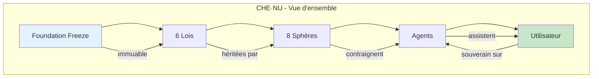
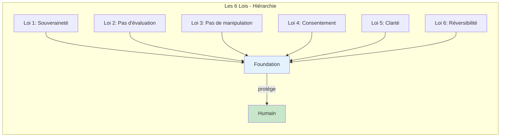
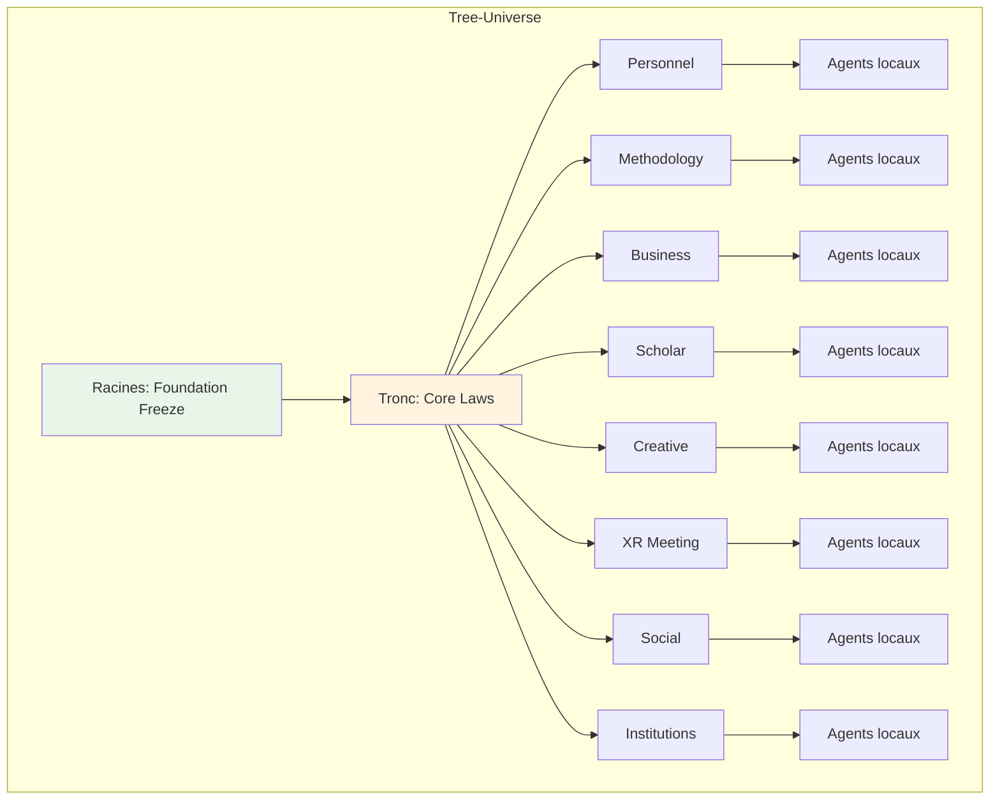
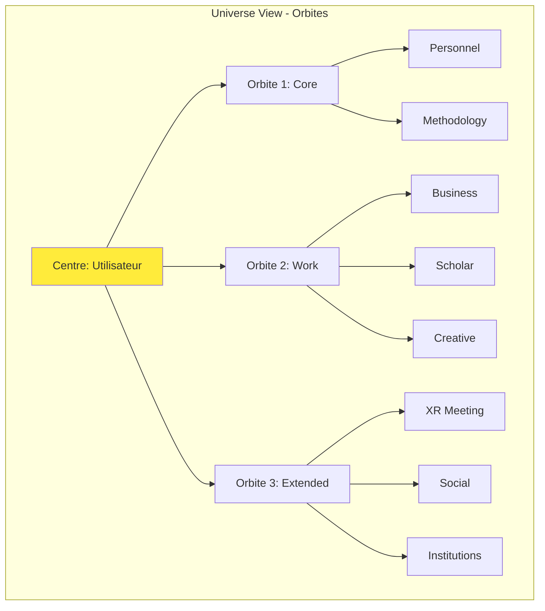
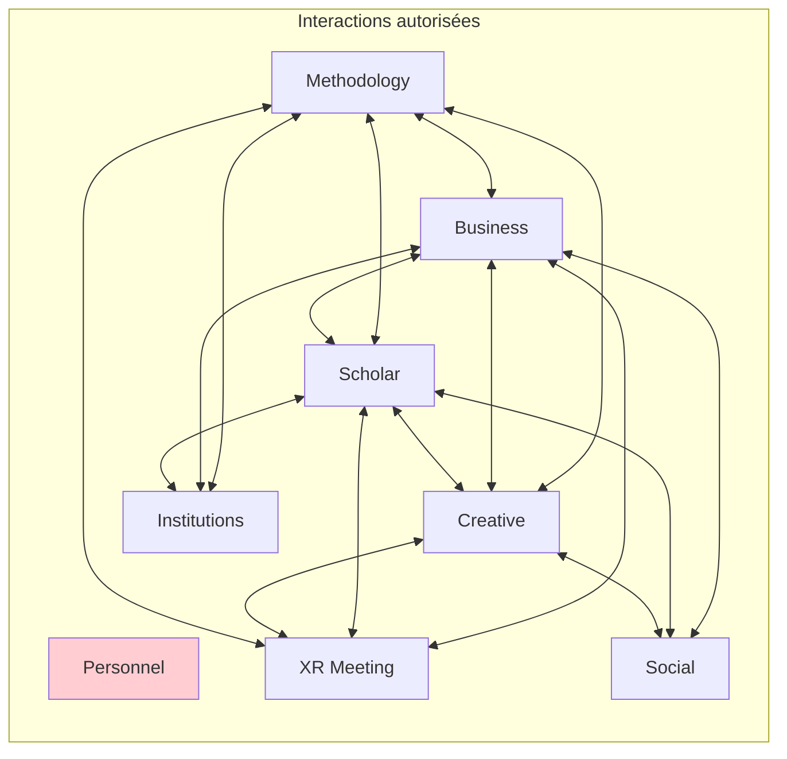
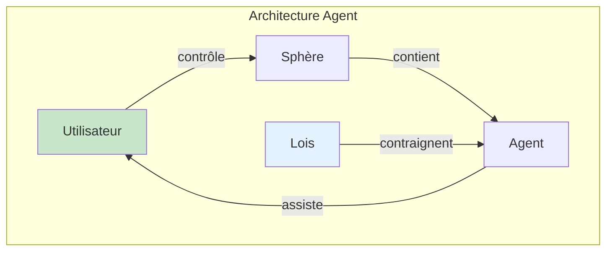
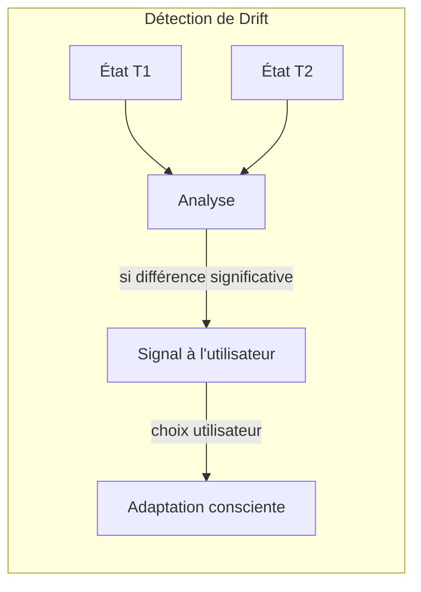
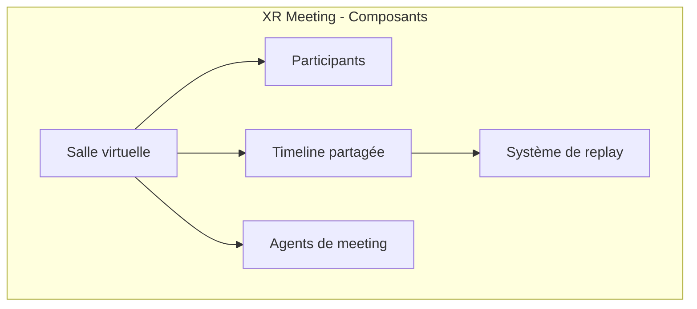
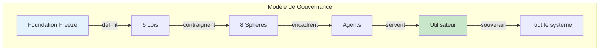
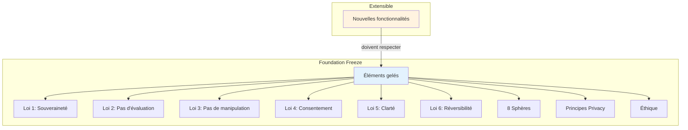

# CHE·NU

## Governed Intelligence Operating System

### Le Livre Officiel

---

**Version 1.0.0**

**Statut : FINAL**

**Autorité : FOUNDATION**

---

*Un système d'intelligence gouvernée où l'humain reste souverain.*

---

## Table des matières

1. [Introduction](#1-introduction)
2. [Les Six Lois Fondamentales](#2-les-six-lois-fondamentales)
3. [Le Modèle Tree-Universe](#3-le-modèle-tree-universe)
4. [L'Universe View](#4-luniverse-view)
5. [Les Huit Sphères](#5-les-huit-sphères)
   - 5.1 Personnel
   - 5.2 Methodology
   - 5.3 Business
   - 5.4 Scholar
   - 5.5 Creative Studio
   - 5.6 XR / Meeting
   - 5.7 Social & Media
   - 5.8 Institutions / Government
6. [Les Agents](#6-les-agents)
7. [Mémoire, Narratif et Drift](#7-mémoire-narratif-et-drift)
8. [XR Meetings et Replays](#8-xr-meetings-et-replays)
9. [Privacy et Gouvernance](#9-privacy-et-gouvernance)
10. [Foundation Freeze](#10-foundation-freeze)
11. [Annexes](#11-annexes)

---

# 1. Introduction

## 1.1 Qu'est-ce que CHE·NU ?

CHE·NU (prononcé "Chez Nous") est un système d'intelligence gouvernée. Il définit comment une intelligence artificielle peut assister l'humain sans le capturer, le profiler ou le manipuler.

CHE·NU n'est pas un produit. C'est une architecture constitutionnelle pour systèmes IA.

## 1.2 Origine

CHE·NU est né de la transformation du projet CHENU, une plateforme de gestion de construction pour le marché québécois. En évoluant vers un système multi-agents sophistiqué, le besoin d'une gouvernance stricte est devenu évident.

La question fondamentale était : comment créer un système IA puissant qui reste au service de l'humain, sans jamais inverser cette relation ?

## 1.3 Principes directeurs

CHE·NU repose sur trois principes non négociables :

1. **L'humain décide** — L'IA assiste, propose, informe. Elle ne décide jamais à la place de l'humain.

2. **Pas de capture** — Aucun mécanisme ne peut capturer l'attention, optimiser l'engagement ou créer une dépendance.

3. **Transparence totale** — Chaque action du système est explicable, traçable et réversible.

## 1.4 Structure de ce document

Ce livre est la référence unique du système CHE·NU. Il documente :

- Les lois immuables qui gouvernent le système
- L'architecture conceptuelle (Tree-Universe)
- Les huit espaces contextuels (sphères)
- Le fonctionnement des agents IA
- Les mécanismes de mémoire et de continuité
- Les garanties de vie privée
- Le gel constitutionnel qui empêche toute dérive

Chaque élément décrit ici est validé et conforme à la Foundation Freeze. Aucune modification des éléments gelés n'est possible.

---



---

# 2. Les Six Lois Fondamentales

Les six lois sont le socle constitutionnel de CHE·NU. Elles sont immuables. Toute sphère, tout agent, toute fonctionnalité doit les respecter intégralement.

## 2.1 Vue d'ensemble

| Loi | Nom | Principe |
|-----|-----|----------|
| 1 | Souveraineté des données | L'humain possède ses données |
| 2 | Pas d'évaluation implicite | Aucun jugement caché |
| 3 | Pas de manipulation | Aucune influence comportementale |
| 4 | Consentement explicite | Accord requis pour actions cross-contexte |
| 5 | Clarté et calme | Interface sans pression |
| 6 | Réversibilité | Toute action peut être annulée |

---

## 2.2 Loi 1 : Souveraineté des données

**Énoncé** : L'humain est propriétaire absolu de ses données.

**Implications** :

- Les données appartiennent à l'utilisateur, pas au système
- L'utilisateur peut exporter toutes ses données à tout moment
- L'utilisateur peut supprimer ses données sans justification
- Aucune donnée n'est vendue, partagée ou monétisée sans consentement explicite

**Garanties techniques** :

- Chiffrement des données au repos et en transit
- Contrôle d'accès par l'utilisateur
- Journaux d'accès consultables
- Suppression effective (pas de rétention cachée)

---

## 2.3 Loi 2 : Pas d'évaluation implicite

**Énoncé** : Le système n'évalue jamais l'humain de manière cachée.

**Implications** :

- Aucun scoring de l'utilisateur (productivité, engagement, valeur)
- Aucune inférence de traits psychologiques
- Aucune catégorisation comportementale
- Aucun classement entre utilisateurs

**Ce qui n'est jamais interprété** :

| Élément | Raison |
|---------|--------|
| Identité | L'humain définit qui il est |
| Valeur | Aucune mesure de "worth" |
| Traits psychologiques | Pas d'inférence de personnalité |
| Intentions | Pas d'interprétation de motifs |
| Compétence | Pas de scoring de capacité |

---

## 2.4 Loi 3 : Pas de manipulation comportementale

**Énoncé** : Le système n'influence jamais le comportement de l'utilisateur.

**Implications** :

- Pas de dark patterns
- Pas de notifications addictives
- Pas de gamification manipulatrice
- Pas d'urgence artificielle
- Pas de FOMO (fear of missing out)

**Mécanismes interdits** :

| Mécanisme | Description | Statut |
|-----------|-------------|--------|
| Nudging | Incitation subtile | INTERDIT |
| Variable rewards | Récompenses imprévisibles | INTERDIT |
| Social proof | Pression sociale | INTERDIT |
| Scarcity | Rareté artificielle | INTERDIT |
| Reciprocity | Obligation de retour | INTERDIT |

---

## 2.5 Loi 4 : Consentement explicite

**Énoncé** : Toute action qui traverse les contextes requiert un accord explicite.

**Implications** :

- Les sphères sont isolées par défaut
- Le partage d'information entre sphères nécessite une action utilisateur
- Aucune corrélation automatique entre contextes
- Les ponts entre sphères sont visibles et contrôlables

**Types de consentement** :

| Type | Utilisation |
|------|-------------|
| Action explicite | Clic, geste intentionnel |
| Invitation | Acceptation d'un partage |
| Autorisation documentée | Pour contextes institutionnels |

---

## 2.6 Loi 5 : Clarté et calme

**Énoncé** : L'interface favorise la clarté et le calme mental.

**Implications** :

- Design épuré, sans surcharge visuelle
- Pas de scroll infini
- Pas de compteurs de likes ou followers
- Pas de notifications intrusives
- Temps de réflexion respecté

**Principes UX** :

| Principe | Application |
|----------|-------------|
| Observation first | L'utilisateur observe avant d'agir |
| No motion toward user | Pas d'éléments qui "viennent vers" l'utilisateur |
| Manual focus only | Le focus est contrôlé par l'utilisateur |
| Exit anytime | Sortie possible à tout moment |

---

## 2.7 Loi 6 : Réversibilité par défaut

**Énoncé** : Toute action peut être annulée.

**Implications** :

- Les actions sont réversibles par défaut
- L'historique des actions est conservé
- La restauration est toujours possible
- Les actions irréversibles nécessitent un consentement explicite

**Classification des actions** :

| Type | Exemples | Réversibilité |
|------|----------|---------------|
| Création | Nouveau document, projet | Réversible |
| Modification | Édition, configuration | Réversible |
| Suppression | Effacement de données | Réversible (corbeille) |
| Suppression définitive | Purge totale | Irréversible avec consentement |

---



---

# 3. Le Modèle Tree-Universe

## 3.1 Concept

Le modèle Tree-Universe est la métaphore architecturale de CHE·NU. Il représente le système comme un arbre dont les racines sont les lois immuables et dont les branches sont les sphères contextuelles.

## 3.2 Structure



## 3.3 Composants

| Composant | Rôle | Caractéristique |
|-----------|------|-----------------|
| Racines | Foundation Freeze | Immuable |
| Tronc | Lois fondamentales | Hérité par tous |
| Branches | Sphères | Contextes isolés |
| Feuilles | Agents | Scope-limited |

## 3.4 Principes de circulation

L'information circule dans le Tree-Universe selon des règles strictes :

1. **Héritage descendant** : Les lois descendent des racines vers les branches. Chaque sphère hérite automatiquement des lois fondamentales.

2. **Isolation horizontale** : Les branches (sphères) sont isolées par défaut. L'information ne passe pas d'une sphère à l'autre sans action explicite.

3. **Confinement des agents** : Les agents sont confinés à leur sphère. Un agent de la sphère Business ne peut pas accéder à la sphère Personnel.

## 3.5 Pourquoi un arbre ?

La métaphore de l'arbre n'est pas décorative. Elle encode des propriétés essentielles :

- **Stabilité** : Les racines (Foundation) ne bougent pas
- **Croissance** : De nouvelles sphères peuvent apparaître
- **Indépendance** : Les branches ne se mélangent pas
- **Nutrition commune** : Toutes les branches reçoivent les mêmes lois

---

# 4. L'Universe View

## 4.1 Définition

L'Universe View est l'interface principale de navigation dans CHE·NU. Elle présente les sphères comme des corps orbitaux dans un espace tridimensionnel, permettant à l'utilisateur de visualiser et naviguer entre les différents contextes.

## 4.2 Représentation visuelle



## 4.3 Niveaux orbitaux

| Orbite | Distance | Sphères | Fréquence d'usage |
|--------|----------|---------|-------------------|
| Core | Proche | Personnel, Methodology | Quotidien |
| Work | Moyenne | Business, Scholar, Creative | Régulier |
| Extended | Éloignée | XR, Social, Institutions | Occasionnel |

## 4.4 Interactions

L'Universe View permet :

- **Zoom** : Se rapprocher d'une sphère pour y entrer
- **Rotation** : Explorer les différentes sphères
- **Filtrage** : Masquer certaines sphères temporairement
- **Recherche** : Trouver un élément spécifique

## 4.5 Principes UX

| Principe | Application |
|----------|-------------|
| Observation d'abord | L'utilisateur voit avant d'agir |
| Pas de mouvement automatique | Rien ne "vient vers" l'utilisateur |
| Navigation manuelle | L'utilisateur contrôle le déplacement |
| Sortie libre | Retour possible à tout moment |

## 4.6 Ce que l'Universe View ne fait pas

- Ne suggère pas de sphère "prioritaire"
- Ne notifie pas de manière intrusive
- Ne hiérarchise pas les sphères par importance
- Ne guide pas l'utilisateur vers une action

---

# 5. Les Huit Sphères

## Introduction aux sphères

Une sphère est un espace contextuel isolé. Elle définit un périmètre dans lequel l'utilisateur peut travailler avec l'assistance d'agents IA, dans le respect des lois fondamentales.

Chaque sphère :
- Hérite des six lois fondamentales
- Possède ses propres agents spécialisés
- Est isolée des autres sphères par défaut
- Définit ce qu'elle peut et ne peut pas faire

---

## 5.1 Sphère Personnel

### Identité

| Attribut | Valeur |
|----------|--------|
| ID | `personal` |
| Emoji | 👤 |
| Rôle | Sanctuaire privé |
| Statut | FROZEN |

### Description

La sphère Personnel est le sanctuaire de l'utilisateur. C'est l'espace le plus protégé du système, où aucune autre sphère ne peut accéder. Elle est conçue pour la réflexion personnelle, les notes privées, et tout ce que l'utilisateur souhaite garder absolument confidentiel.

### Portée

**Inclus** :
- Notes personnelles
- Réflexions
- Journal
- Mémos privés
- Médias personnels

**Exclus** :
- Partage
- Collaboration
- Évaluation
- Analyse comportementale

### Agents

La sphère Personnel n'a pas d'agents actifs par défaut. Si l'utilisateur active un assistant, celui-ci :
- Ne juge jamais
- Ne profile jamais
- Ne partage jamais
- Ne suggère pas de manière proactive

### Interactions

| Avec | Autorisé |
|------|----------|
| Toutes les autres sphères | NON |

La sphère Personnel est un sanctuaire absolu. Aucune autre sphère ne peut y accéder, même avec consentement.

### Données

| Propriété | Valeur |
|-----------|--------|
| Propriétaire | Utilisateur uniquement |
| Privé par défaut | Oui |
| Exportable | Oui |
| Supprimable | Oui, sans justification |
| Partageable | Non |

---

## 5.2 Sphère Methodology

### Identité

| Attribut | Valeur |
|----------|--------|
| ID | `methodology` |
| Emoji | 🧠 |
| Rôle | Analyse sans décision |
| Statut | FROZEN |

### Description

La sphère Methodology fournit des outils d'analyse, de structuration et de méthodologie. Elle aide l'utilisateur à organiser sa pensée, comparer des options, et structurer des processus. Elle ne prend jamais de décision à la place de l'utilisateur.

### Portée

**Inclus** :
- Analyse comparative
- Structuration de projets
- Méthodologies (Agile, Lean, etc.)
- Arbres de décision
- Matrices d'évaluation

**Exclus** :
- Prise de décision
- Recommandation directive
- Évaluation de l'utilisateur
- Jugement de valeur

### Agents

| Agent | Rôle | Interdit |
|-------|------|----------|
| Methodology Analyst | Analyse et structure | Choisir pour l'utilisateur |
| Process Orchestrator | Orchestre les processus | Forcer une méthode |
| Criteria Evaluator | Évalue selon critères | Juger l'utilisateur |

### Interactions

| Avec | Autorisé |
|------|----------|
| Business | Oui |
| Scholar | Oui |
| Creative | Oui |
| Institutions | Oui |
| Personnel | Non |
| XR Meeting | Non |
| Social | Non |

---

## 5.3 Sphère Business

### Identité

| Attribut | Valeur |
|----------|--------|
| ID | `business` |
| Emoji | 🏢 |
| Rôle | Structure économique |
| Statut | FROZEN |

### Description

La sphère Business gère les activités professionnelles et économiques. Elle permet la gestion de projets, le suivi des ressources, la planification et le reporting, sans jamais évaluer la performance des individus de manière cachée.

### Portée

**Inclus** :
- Gestion de projets
- Suivi de ressources
- Planification
- Budgets
- Reporting
- Workflows

**Exclus** :
- Scoring d'employés
- Surveillance comportementale
- Optimisation de productivité individuelle
- Évaluation de performance cachée

### Agents

| Agent | Rôle | Interdit |
|-------|------|----------|
| Project Agent | Gestion de projet | Profiler les membres |
| Workflow Agent | Automatisation | Scoring caché |
| Resource Agent | Allocation | Optimiser les humains |
| Risk Agent | Analyse de risque | Prédire les comportements |
| Reporting Agent | Rapports | Classer les personnes |

### Interactions

| Avec | Autorisé |
|------|----------|
| Methodology | Oui |
| Scholar | Oui |
| Creative | Oui |
| XR Meeting | Oui |
| Social | Oui |
| Institutions | Oui |
| Personnel | Non |

---

## 5.4 Sphère Scholar

### Identité

| Attribut | Valeur |
|----------|--------|
| ID | `scholar` |
| Emoji | 🎓 |
| Rôle | Savoir sans pression |
| Statut | FROZEN |

### Description

La sphère Scholar est dédiée à l'apprentissage et à la recherche. Elle permet d'explorer des connaissances, de structurer des apprentissages et de synthétiser des informations, sans jamais noter ou classer l'apprenant.

### Portée

**Inclus** :
- Recherche documentaire
- Synthèse de connaissances
- Organisation bibliographique
- Exploration de concepts
- Veille thématique

**Exclus** :
- Notation
- Classement des apprenants
- Tests contraints
- Compétition
- Pression temporelle

### Agents

| Agent | Rôle | Interdit |
|-------|------|----------|
| Research Agent | Recherche | Noter l'utilisateur |
| Source Agent | Gestion de sources | Classer par "qualité" |
| Concept Agent | Cartographie | Évaluer la compréhension |
| Synthesis Agent | Synthèse | Simplifier à l'excès |
| Question Agent | Questionnement | Tester de manière cachée |

### Interactions

| Avec | Autorisé |
|------|----------|
| Methodology | Oui |
| Business | Oui |
| Creative | Oui |
| XR Meeting | Oui |
| Social | Oui |
| Institutions | Oui |
| Personnel | Non |

---

## 5.5 Sphère Creative Studio

### Identité

| Attribut | Valeur |
|----------|--------|
| ID | `creative_studio` |
| Emoji | 🎨 |
| Rôle | Création libre |
| Statut | FROZEN |

### Description

La sphère Creative Studio est l'espace de création. Elle permet de produire du contenu (texte, image, audio, vidéo) avec l'assistance d'agents spécialisés, sans jamais juger la valeur artistique ou commerciale des créations.

### Portée

**Inclus** :
- Écriture
- Design visuel
- Composition audio
- Production vidéo
- Idéation
- Itération créative

**Exclus** :
- Jugement esthétique
- Prédiction de succès
- Comparaison avec d'autres créateurs
- Optimisation pour engagement

### Agents

| Agent | Rôle | Interdit |
|-------|------|----------|
| Ideation Agent | Génération d'idées | Classer les idées |
| Writing Agent | Assistance rédaction | Imposer un style |
| Visual Agent | Création visuelle | Juger l'esthétique |
| Audio Agent | Production audio | Prédire le succès |
| Video Agent | Production vidéo | Optimiser pour viralité |
| Style Agent | Cohérence stylistique | Forcer une norme |
| Pipeline Agent | Workflow créatif | Presser l'utilisateur |

### Interactions

| Avec | Autorisé |
|------|----------|
| Methodology | Oui |
| Business | Oui |
| Scholar | Oui |
| XR Meeting | Oui |
| Social | Oui |
| Personnel | Non |
| Institutions | Non |

---

## 5.6 Sphère XR / Meeting

### Identité

| Attribut | Valeur |
|----------|--------|
| ID | `xr_meeting` |
| Emoji | 🕶️ |
| Rôle | Présence immersive |
| Statut | FROZEN |

### Description

La sphère XR / Meeting est l'espace de réunion et de collaboration immersive. Elle permet des rencontres en 2D, 3D ou réalité étendue, avec présence d'avatars et de salles virtuelles, sans jamais analyser les comportements ou créer de hiérarchie spatiale.

### Portée

**Inclus** :
- Réunions virtuelles
- Salles spatiales
- Avatars
- Vues partagées
- Timelines
- Annotations
- Replays

**Exclus** :
- Amplification émotionnelle
- Lecture de comportement
- Projection d'autorité
- Guidage d'attention

### Agents

| Agent | Rôle | Interdit |
|-------|------|----------|
| Meeting Facilitator | Facilitation | Diriger la discussion |
| Context Keeper | Mémoire de contexte | Interpréter les intentions |
| Timeline Agent | Annotations temporelles | Scorer les participants |
| Replay Agent | Compilation de replays | Analyser les comportements |

### Avatars

| Propriété | Valeur |
|-----------|--------|
| Contrôlé par l'utilisateur | Oui |
| Exagération d'émotion | Non |
| Guidage d'attention | Non |
| Signalisation de statut | Non |

### Principes de présence

- Pas de dominance spatiale
- Visibilité égale par défaut
- Silence comme présence valide

### Interactions

| Avec | Autorisé |
|------|----------|
| Methodology | Oui |
| Business | Oui |
| Scholar | Oui |
| Creative | Oui |
| Personnel | Non |
| Social | Non |
| Institutions | Non |

---

## 5.7 Sphère Social & Media

### Identité

| Attribut | Valeur |
|----------|--------|
| ID | `social_media` |
| Emoji | 🎉 |
| Rôle | Échange sans manipulation |
| Statut | FROZEN |

### Description

La sphère Social & Media est l'espace d'expression sociale et de partage de contenus. Elle permet les interactions médiatiques sans viralité artificielle, sans hiérarchie sociale et sans capture de l'attention.

### Portée

**Inclus** :
- Partage de contenu
- Publications
- Discussions
- Commentaires
- Communautés
- Abonnements

**Exclus** :
- Ingénierie virale
- Optimisation d'engagement
- Scoring social
- Hijacking d'attention

### Agents

| Agent | Rôle | Interdit |
|-------|------|----------|
| Content Organization | Organisation | Nudging comportemental |
| Moderation Support | Modération | Shadow banning |
| Feed Curator | Curation | Maximisation d'engagement |
| Community Structure | Structure | Mapping d'influence |

### Principes UX

| Principe | Application |
|----------|-------------|
| État par défaut | Chronologique calme |
| Scroll infini | Non |
| Compteurs de likes | Non |
| Compteurs de followers | Non |
| Trending | Non |
| Amplification algorithmique | Non |

### Modération

| Propriété | Valeur |
|-----------|--------|
| Guidée par la communauté | Oui |
| Règles transparentes | Oui |
| Processus d'appel | Oui |
| Shadow banning | Non |
| Démotions silencieuses | Non |

### Interactions

| Avec | Autorisé |
|------|----------|
| Creative | Oui |
| Scholar | Oui |
| Business | Oui |
| Personnel | Non |
| Methodology | Non |
| XR Meeting | Non |
| Institutions | Non |

---

## 5.8 Sphère Institutions / Government

### Identité

| Attribut | Valeur |
|----------|--------|
| ID | `institutions` |
| Emoji | 🏛️ |
| Rôle | Gouvernance transparente |
| Statut | FROZEN |

### Description

La sphère Institutions est dédiée aux structures institutionnelles et publiques. Elle permet la gouvernance, la conformité et la traçabilité sans surveillance abusive ni centralisation du pouvoir.

### Portée

**Inclus** :
- Cadres de gouvernance
- Gestion de politiques
- Conformité réglementaire
- Documents publics
- Transparence procédurale
- Pistes d'audit
- Workflows institutionnels

**Exclus** :
- Surveillance comportementale
- Scoring de population
- Profilage prédictif
- Manipulation politique

### Agents

| Agent | Rôle | Interdit |
|-------|------|----------|
| Compliance Agent | Conformité | Profiler les citoyens |
| Audit Agent | Audit | Prédire les comportements |
| Policy Agent | Cohérence des politiques | Décisions d'application |
| Procedure Agent | Validation procédurale | Recommandations punitives |
| Record Agent | Intégrité des archives | Inférence d'opinion |

### Audit et traçabilité

| Propriété | Valeur |
|-----------|--------|
| Audit obligatoire | Oui |
| Traçabilité | Oui |
| Explicabilité | Requise |
| Revue indépendante | Supportée |

### Interactions

| Avec | Autorisé |
|------|----------|
| Methodology | Oui |
| Business | Oui |
| Scholar | Oui |
| Personnel | Non |
| Creative | Non |
| XR Meeting | Non |
| Social | Non |

---

## 5.9 Matrice d'interactions entre sphères



La sphère Personnel (en rouge) est isolée de toutes les autres.

---

# 6. Les Agents

## 6.1 Définition

Un agent est une entité logicielle spécialisée qui assiste l'utilisateur dans une sphère donnée. Les agents sont confinés à leur sphère et ne peuvent pas accéder aux données d'autres sphères.

## 6.2 Principes fondamentaux

| Principe | Description |
|----------|-------------|
| Confinement | Un agent ne sort pas de sa sphère |
| Assistance | Un agent assiste, il ne décide pas |
| Transparence | Les actions d'un agent sont explicables |
| Désactivable | L'utilisateur peut désactiver tout agent |

## 6.3 Architecture



## 6.4 Capacités universellement interdites

Aucun agent, quelle que soit sa sphère, ne peut :

| Interdit | Raison |
|----------|--------|
| Profiler l'utilisateur | Loi 2 |
| Manipuler le comportement | Loi 3 |
| Accéder à d'autres sphères | Isolation |
| Prendre des décisions | Souveraineté humaine |
| Scorer ou classer | Loi 2 |
| Créer de l'urgence | Loi 5 |

## 6.5 Cycle de vie

| État | Description |
|------|-------------|
| Inactif | Agent disponible mais non utilisé |
| Actif | Agent en cours d'assistance |
| Suspendu | Temporairement désactivé |
| Désactivé | Complètement arrêté par l'utilisateur |

## 6.6 Communication entre agents

Les agents d'une même sphère peuvent communiquer entre eux pour coordonner leur assistance. Cette communication :

- Reste confinée à la sphère
- Est traçable
- Ne crée pas de profil utilisateur
- Peut être consultée par l'utilisateur

## 6.7 Récapitulatif par sphère

| Sphère | Nombre d'archétypes | Focus |
|--------|---------------------|-------|
| Personnel | 1 (optionnel) | Assistance sans jugement |
| Methodology | 3 | Analyse et structure |
| Business | 5 | Gestion et coordination |
| Scholar | 5 | Recherche et synthèse |
| Creative | 7 | Création multimédia |
| XR Meeting | 4 | Facilitation et replay |
| Social | 4 | Organisation et modération |
| Institutions | 5 | Conformité et audit |

---

# 7. Mémoire, Narratif et Drift

## 7.1 La mémoire dans CHE·NU

CHE·NU maintient une mémoire contextuelle pour assurer la continuité de l'assistance. Cette mémoire :

- Appartient à l'utilisateur
- Est confinée par sphère
- Est exportable et supprimable
- Ne sert pas au profilage

## 7.2 Types de mémoire

| Type | Description | Durée |
|------|-------------|-------|
| Session | Contexte de la conversation en cours | Temporaire |
| Sphère | Contexte accumulé dans une sphère | Persistant |
| Narrative | Fil conducteur des décisions | Persistant |
| Archive | Historique consultable | Long terme |

## 7.3 Le narratif

Le narratif est le fil conducteur de l'activité de l'utilisateur dans une sphère. Il permet de :

- Comprendre le contexte d'une décision passée
- Reprendre un travail interrompu
- Tracer l'évolution d'un projet

Le narratif n'est pas une évaluation. C'est une trace factuelle.

## 7.4 Le drift

Le drift (dérive) est le phénomène de changement progressif dans les pratiques ou préférences de l'utilisateur. CHE·NU peut détecter le drift pour :

- Signaler une incohérence potentielle
- Proposer une clarification
- Permettre une adaptation consciente



## 7.5 Ce que le drift ne fait pas

| Interdit | Raison |
|----------|--------|
| Corriger automatiquement | L'humain décide |
| Alerter de manière intrusive | Loi 5 |
| Suggérer un "bon" comportement | Loi 3 |
| Comparer avec d'autres utilisateurs | Loi 2 |

## 7.6 Modes de silence

L'utilisateur peut activer des modes de silence où :

- La mémoire ne s'accumule pas
- Les suggestions sont désactivées
- L'analytics est minimal
- L'apprentissage est suspendu

| Mode | Description |
|------|-------------|
| Visual silence | Interface épurée |
| Silent presence | Présence sans interaction |
| Silent review | Consultation sans trace |

---

# 8. XR Meetings et Replays

## 8.1 Concept

Les XR Meetings sont des espaces de réunion immersifs où les participants peuvent collaborer en 2D, 3D ou réalité étendue. CHE·NU garantit que ces espaces respectent les lois fondamentales.

## 8.2 Composants



## 8.3 Avatars

Les avatars représentent les participants dans l'espace virtuel.

| Propriété | Valeur |
|-----------|--------|
| Contrôle | Par l'utilisateur uniquement |
| Personnalisation | Forme, couleur, abstraction |
| Exagération émotionnelle | Interdite |
| Indicateurs de statut | Interdits |

## 8.4 Présence

| Règle | Application |
|-------|-------------|
| Pas de dominance spatiale | Tous les participants ont un espace égal |
| Visibilité égale | Personne n'est "en avant" par défaut |
| Silence valide | Ne pas parler est une présence acceptable |

## 8.5 Timeline

La timeline est l'enregistrement temporel de la réunion.

| Élément | Description |
|---------|-------------|
| Événements | Actions horodatées |
| Annotations | Notes ajoutées par les participants |
| Décisions | Points de décision marqués |
| Contexte | Informations partagées |

## 8.6 Replay

Le replay permet de revisiter une réunion passée.

| Mode | Description |
|------|-------------|
| Timeline replay | Navigation chronologique |
| Spatial snapshot | Vue 3D d'un moment |
| Narrative sequence | Séquence des décisions clés |

**Contraintes** :
- Permissions requises pour accéder au replay
- Pas d'analyse automatique
- Pas de scoring des participants
- Export contrôlé par les propriétaires

## 8.7 Ce que XR Meeting ne fait pas

| Interdit | Raison |
|----------|--------|
| Analyser le langage corporel | Loi 2 |
| Mesurer le temps de parole | Loi 2 |
| Détecter les émotions | Loi 2 |
| Identifier les "leaders" | Loi 2 |
| Optimiser l'engagement | Loi 3 |
| Diriger la conversation | Souveraineté |

---

# 9. Privacy et Gouvernance

## 9.1 Principes de privacy

CHE·NU applique une politique de privacy-by-default :

| Principe | Application |
|----------|-------------|
| Private by default | Tout est privé sauf décision contraire |
| Minimal collection | Seules les données nécessaires sont collectées |
| Purpose limitation | Les données servent uniquement leur but déclaré |
| User ownership | L'utilisateur possède ses données |

## 9.2 Classification des données

| Niveau | Description | Accès |
|--------|-------------|-------|
| Personnel | Données de la sphère Personnel | Utilisateur uniquement |
| Privé | Données des autres sphères | Utilisateur + agents autorisés |
| Partagé | Données explicitement partagées | Destinataires choisis |
| Public | Données publiées | Tous |

## 9.3 Droits de l'utilisateur

| Droit | Description |
|-------|-------------|
| Accès | Consulter toutes ses données |
| Export | Télécharger ses données dans un format standard |
| Rectification | Corriger des données erronées |
| Suppression | Effacer ses données |
| Portabilité | Transférer ses données vers un autre système |
| Opposition | Refuser certains traitements |

## 9.4 Données interdites

CHE·NU ne collecte jamais :

| Donnée | Raison |
|--------|--------|
| Données biométriques comportementales | Loi 2 |
| Profils psychologiques | Loi 2 |
| Scores de productivité | Loi 2 |
| Métriques d'attention | Loi 3 |
| Graphes d'influence | Loi 2 |

## 9.5 Gouvernance



## 9.6 Audit

| Propriété | Valeur |
|-----------|--------|
| Traçabilité | Toutes les actions sont tracées |
| Explicabilité | Chaque décision est explicable |
| Revue | L'utilisateur peut auditer son propre système |
| Transparence | Pas d'opération cachée |

## 9.7 Conformité

CHE·NU est conçu pour faciliter la conformité avec :

- RGPD (Europe)
- Loi 25 (Québec)
- CCPA (Californie)
- Autres réglementations de protection des données

---

# 10. Foundation Freeze

## 10.1 Définition

Le Foundation Freeze est le gel constitutionnel de CHE·NU. Il rend immuables les éléments fondamentaux du système pour empêcher toute dérive.

## 10.2 Éléments gelés

| Élément | Statut |
|---------|--------|
| Les 6 lois fondamentales | FROZEN |
| L'éthique du système | FROZEN |
| Les principes de privacy | FROZEN |
| La réversibilité | FROZEN |
| Les modes de silence | FROZEN |
| Les frontières de sphères | FROZEN |
| Les principes de l'Universe View | FROZEN |

## 10.3 Les 8 sphères canoniques

| Sphère | Statut |
|--------|--------|
| Personnel | FROZEN |
| Methodology | FROZEN |
| Business | FROZEN |
| Scholar | FROZEN |
| Creative Studio | FROZEN |
| XR / Meeting | FROZEN |
| Social & Media | FROZEN |
| Institutions / Government | FROZEN |

## 10.4 Politique de modification

### Ce qui est autorisé

| Action | Condition |
|--------|-----------|
| Nouvelles sphères | Doivent hériter toutes les lois gelées |
| Nouveaux agents | Doivent être confinés à leur sphère |
| Nouvelles vues | Doivent être non-manipulatives |
| Nouvelles fonctionnalités | Doivent respecter les 6 lois |

### Ce qui est interdit

| Action | Raison |
|--------|--------|
| Modifier les lois gelées | IMMUABLE |
| Contourner la privacy | Loi 1 |
| Ajouter du scoring caché | Loi 2 |
| Créer des moteurs d'influence | Loi 3 |
| Forcer des actions cross-contexte | Loi 4 |
| Ajouter des dark patterns | Loi 5 |
| Supprimer la réversibilité | Loi 6 |

## 10.5 Vérification

Toute extension du système doit passer une vérification :

| Critère | Requis |
|---------|--------|
| Hérite des lois gelées | Oui |
| Pas de violation de privacy | Oui |
| Pas d'optimisation comportementale | Oui |
| Réversible par défaut | Oui |
| Approuvé par humain | Oui |

## 10.6 Schéma du freeze



## 10.7 Déclaration finale

```
FOUNDATION FREEZE v1.0.0 — ACTIF

Les lois fondamentales sont IMMUABLES.
Les sphères canoniques sont DÉFINIES.
Les principes de privacy sont GARANTIS.

Aucune exception.
Aucune dérogation.
Aucun contournement.

L'humain reste souverain.
L'IA assiste sans capturer.
Le système sert sans manipuler.

Gelé pour l'humanité.
```

---

# 11. Annexes

## A. Glossaire

| Terme | Définition |
|-------|------------|
| Agent | Entité logicielle d'assistance confinée à une sphère |
| Drift | Changement progressif des pratiques utilisateur |
| Foundation Freeze | Gel constitutionnel des éléments fondamentaux |
| Sphère | Espace contextuel isolé |
| Tree-Universe | Modèle architectural de CHE·NU |
| Universe View | Interface de navigation entre sphères |
| XR | Réalité étendue (2D/3D/VR/AR) |

## B. Validations par sphère

| Sphère | Validations |
|--------|-------------|
| Personnel | 36 |
| Methodology | 47 |
| Business | 52 |
| Scholar | 53 |
| Creative Studio | 52 |
| XR / Meeting | 58 |
| Social & Media | 62 |
| Institutions | 53 |
| **Total** | **413** |

## C. Références

Ce document est basé sur :

- Les définitions officielles des sphères CHE·NU
- Le document FOUNDATION-FREEZE.yaml
- Les validations de conformité des sphères
- L'architecture technique du système

## D. Historique des versions

| Version | Date | Changement |
|---------|------|------------|
| 1.0.0 | 2024 | Version initiale - Foundation Freeze |

---

## Colophon

**CHE·NU — Governed Intelligence Operating System**

**Le Livre Officiel**

Version 1.0.0

Ce document est la référence unique du système CHE·NU. Il documente les lois immuables, l'architecture, les sphères et les mécanismes de gouvernance qui garantissent que l'intelligence artificielle reste au service de l'humain.

---

*L'IA assiste. L'humain décide. Toujours.*

---
