# CHE·NU ARCHITECTURE DIAGRAMS v29
## Complete Mermaid Diagrams Collection

---

## 1. COMPLETE ENGINE STACK OVERVIEW

---

## 2. IDENTITY & SPHERE HIERARCHY

---

## 3. 1-CLICK ASSISTANT WORKFLOW

---

## 4. MEMORY & GOVERNANCE FLOW

---

## 5. WORKSPACE ENGINE MODES

---

## 6. BACKSTAGE INTELLIGENCE PIPELINE

---

## 7. AGENT HIERARCHY (L0-L3)

---

## 8. DATASPACE RELATIONSHIPS

---

## 9. MEETING SYSTEM FLOW

---

## 10. IMMOBILIER DOMAIN MODEL

---

## 11. CONSTRUCTION PROJECT WORKFLOW

---

## 12. OCW SESSION ARCHITECTURE

---

## 13. XR SPATIAL ENGINE

---

## 14. GOVERNANCE AUDIT TRAIL

---

## 15. COMPLETE DATA FLOW

---

## 16. MULTI-LLM INTEGRATION

```mermaid
flowchart TB
    subgraph "ROUTER"
        R[LLM Router]
    end
    
    subgraph "PROVIDERS"
        CL[Claude - Anthropic]
        GP[GPT-4 - OpenAI]
        GM[Gemini - Google]
        OL[Ollama - Local]
    end
    
    subgraph "TASKS"
        AN[Analysis]
        CR[Creative]
        CD[Code]
        VS[Vision]
    end
    
    R --> CL
    R --> GP
    R --> GM
    R --> OL
    
    AN --> R
    CR --> R
    CD --> R
    VS --> R
    
    CL --> |Primary|AN
    CL --> |Primary|CR
    GP --> |Fallback|AN
    GM --> |Vision|VS
    OL --> |Local/Private|CD
```

---

*CHE·NU Architecture Diagrams v29 - December 2024*
