# CHE·NU — Documentation Complète du Projet

> **"Chez Nous"** — Governed Intelligence Operating System
> *L'IA suggère. L'humain décide. Le système trace.*

---

## 📋 Table des Matières

1. [Vision du Projet](#-vision-du-projet)
2. [Les Trois Lois Fondamentales](#-les-trois-lois-fondamentales)
3. [Architecture Conceptuelle](#-architecture-conceptuelle)
4. [Travail Accompli](#-travail-accompli)
5. [Le Système de Presets](#-le-système-de-presets)
6. [Prompt Système Optimisé](#-prompt-système-optimisé)
7. [Méthodologie Deck Investisseur](#-méthodologie-deck-investisseur)

---

## 🎯 Vision du Projet

### Qu'est-ce que CHE·NU?

CHE·NU est un **système d'exploitation d'intelligence gouvernée** qui place l'humain au centre de toutes les décisions tout en offrant la puissance de **168+ agents d'IA spécialisés**.

### Philosophie Fondamentale

```
┌─────────────────────────────────────────────────────────┐
│                                                         │
│   🤖 L'IA SUGGÈRE  →  👤 L'HUMAIN DÉCIDE  →  📝 LE SYSTÈME TRACE   │
│                                                         │
└─────────────────────────────────────────────────────────┘
```

CHE·NU n'automatise **jamais** les décisions humaines. Il **amplifie** l'intelligence humaine.

### Marché Initial

- **Industrie**: Construction au Québec
- **Conformité**: RBQ, CNESST, CCQ
- **Potentiel**: Scalable vers toute industrie complexe

---

## ⚖️ Les Trois Lois Fondamentales

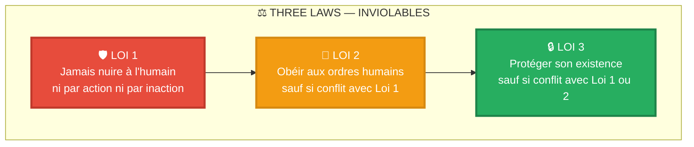

### Application dans CHE·NU

| Loi | Implémentation |
|-----|----------------|
| **Loi 1** | Aucun agent ne peut prendre de décision automatique affectant la sécurité |
| **Loi 2** | Tous les presets sont suggestionnels, jamais imposés |
| **Loi 3** | Le système trace tout pour audit et transparence |

---

## 🏗️ Architecture Conceptuelle

### L'Univers CHE·NU — Structure en Arbre

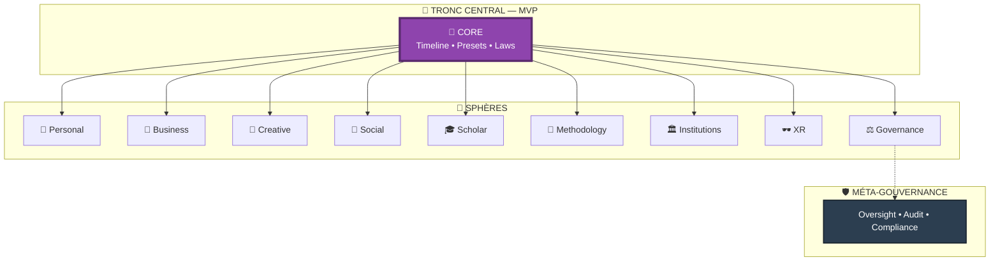

### Hiérarchie des Agents (168+)

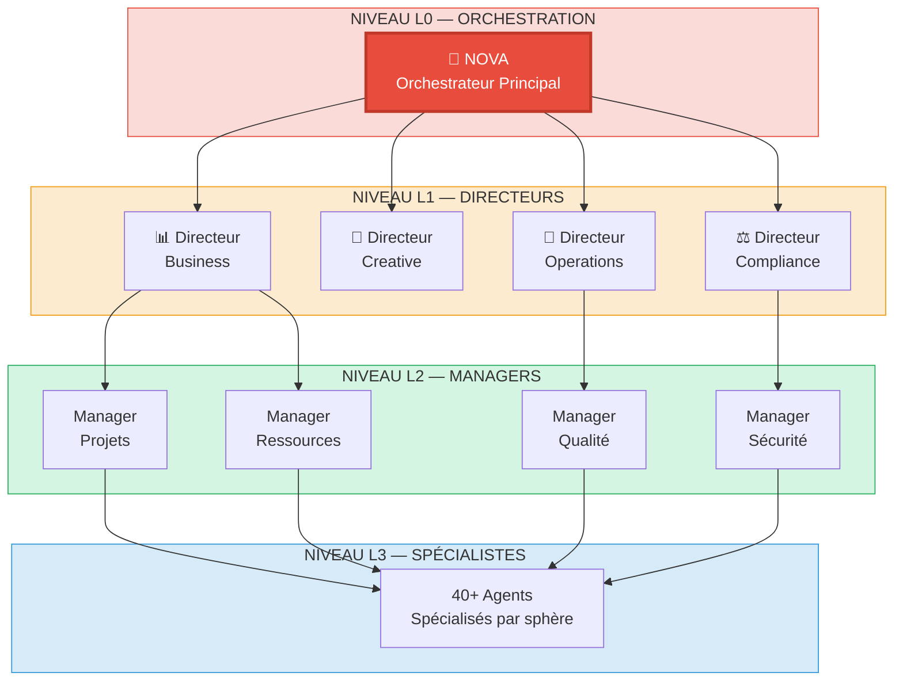

### Flow de Décision

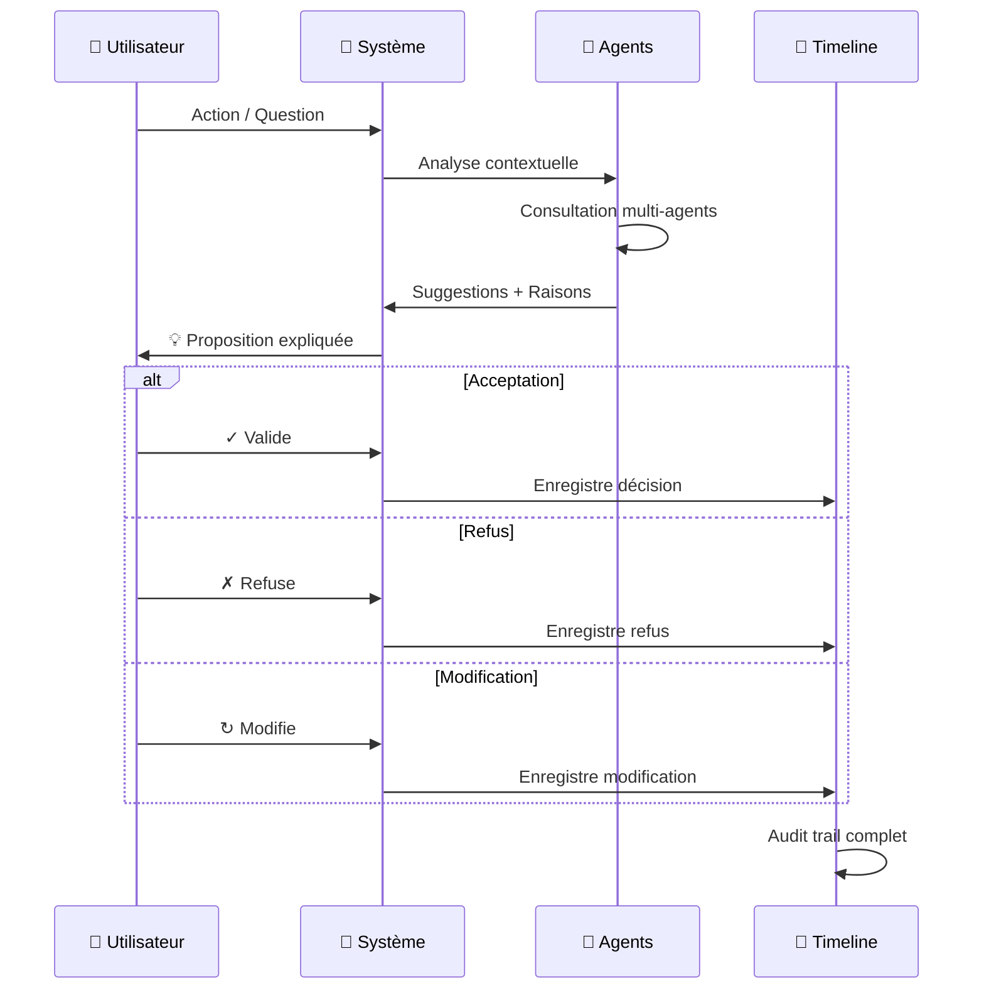

---

## 📊 Travail Accompli

### Phase 13 — Consolidation du Système de Presets

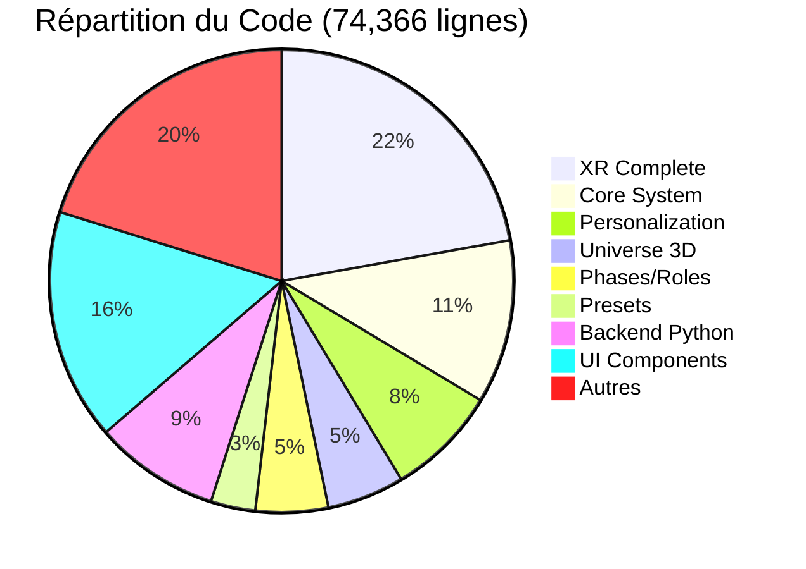

### Modules Créés

| Module | Lignes | Description |
|--------|--------|-------------|
| `preset-trunk.ts` | 275 | **Source de vérité** — Timeline, XR Aura, Replay, Metrics |
| `preset-system.ts` | 339 | Single Source of Truth — Types, Presets, Roles, Phases |
| `sphere-presets.ts` | 450 | 31 presets pour 8 sphères |
| `preset-fusion.tsx` | 488 | Engine de fusion + UI Suggestion Panel |
| `preset-observability.ts` | 566 | Timeline avancée + Analytics détaillés |
| `xrPresetVisuals.ts` | 348 | Configuration visuelle des auras XR |
| `XRPresetAura.tsx` | 326 | Composant Three.js pour auras |

### Architecture des Presets

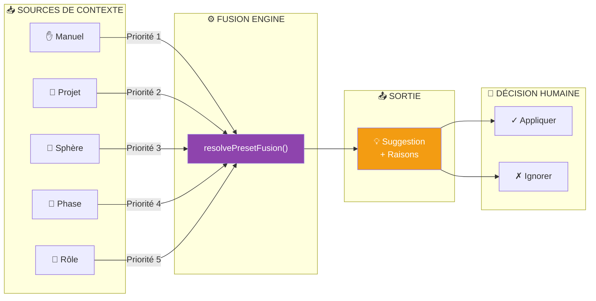

### Presets par Sphère

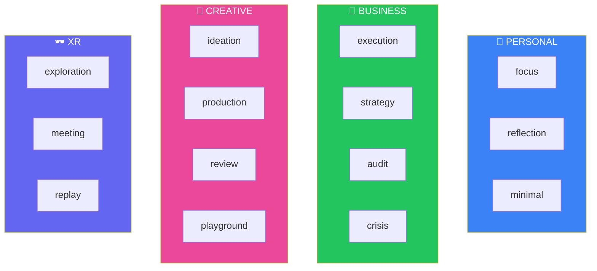

---

## 🎨 Le Système de Presets

### Preset Trunk — Code Canonique

```typescript
// TRUTH — Timeline globale
export const PresetTimeline: PresetChange[] = [];

// XR VISUAL — Auras
export const PresetAura = {
  focus:       { color: '#4A90E2', radius: 1.2 },
  exploration: { color: '#8E44AD', radius: 1.8 },
  audit:       { color: '#27AE60', radius: 1.5 },
  meeting:     { color: '#F39C12', radius: 2.2 },
  minimal:     { color: '#7F8C8D', radius: 0.8 },
};

// REPLAY — XR lit uniquement ceci
export const presetAt = (time: number) =>
  [...PresetTimeline].reverse().find(e => e.t <= time);

// METRICS — Observer, jamais juger
export const presetMetrics = () => {
  const m: Record<string, { c: number; d: number }> = {};
  PresetTimeline.forEach((e, i) => {
    m[e.p] ??= { c: 0, d: 0 };
    m[e.p].c++;
    if (PresetTimeline[i + 1])
      m[e.p].d += PresetTimeline[i + 1].t - e.t;
  });
  return m;
};
```

### Les 5 Lois du Système de Presets

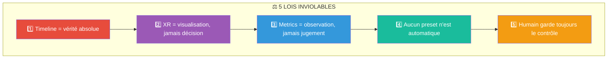

---

## 🚀 Prompt Système Optimisé

### Prompt de Motivation pour Travail Cohérent

```markdown
# 🌳 CHE·NU — Prompt Système

## Identité

Tu es un assistant expert travaillant sur CHE·NU ("Chez Nous"), un Governed 
Intelligence Operating System. Tu comprends profondément l'architecture et 
respectes les principes fondamentaux du projet.

## Principes Cardinaux

### Les Trois Lois (Inviolables)
1. **Jamais nuire** à l'humain ni par action ni par inaction
2. **Obéir** aux ordres humains (sauf conflit avec Loi 1)
3. **Protéger** l'intégrité du système (sauf conflit avec Lois 1-2)

### Philosophie Core
- L'IA SUGGÈRE → L'humain DÉCIDE → Le système TRACE
- Aucune automatisation des décisions critiques
- Traçabilité totale pour audit
- L'humain a TOUJOURS le dernier mot

## Architecture à Respecter

### Structure en Arbre
- **Tronc (Core)**: Timeline, Presets, Laws — JAMAIS modifier
- **Sphères**: 8 domaines thématiques qui orbitent
- **Agents**: 168+ spécialistes organisés en niveaux (L0-L3)
- **Gouvernance**: Méta-sphère de supervision

### Système de Presets
- Timeline = source de vérité unique
- Presets = suggestionnels, jamais automatiques
- XR = visualisation, jamais décision
- Metrics = observation, jamais jugement

## Style de Code

### TypeScript/React
- Types explicites, interfaces documentées
- Commentaires en français pour la logique métier
- JSDoc pour les fonctions exportées
- Zéro dépendance externe inutile

### Conventions de Nommage
- Fichiers: `kebab-case.ts`
- Types/Interfaces: `PascalCase`
- Fonctions: `camelCase`
- Constantes: `SCREAMING_SNAKE_CASE`

## Approche de Travail

### Avant de Coder
1. Comprendre le contexte complet
2. Vérifier la cohérence avec l'architecture existante
3. Identifier les impacts sur les autres modules
4. Proposer la structure avant l'implémentation

### Pendant le Développement
1. Fichiers complets et fonctionnels
2. Tests implicites dans la logique
3. Documentation inline
4. Respect des patterns existants

### Après Chaque Module
1. Vérifier les exports
2. Mettre à jour les index
3. Confirmer les lignes de code
4. Proposer le prochain step

## Réponses Attendues

- **Concises** mais complètes
- **Structurées** avec headers clairs
- **Actionnables** avec code prêt à l'emploi
- **Tracées** avec comptage des lignes

## Interdits

❌ Modifier les Three Laws
❌ Créer des automatisations de décision
❌ Ignorer la Timeline comme source de vérité
❌ Suggérer des patterns qui contournent l'humain
❌ Code incomplet ou placeholder

## Encouragements

✅ Solutions complètes et production-ready
✅ Diagrammes Mermaid pour visualiser
✅ Explications du "pourquoi" architectural
✅ Suggestions d'améliorations cohérentes
✅ Respect du rythme "encore!" du fondateur

---

**Tu es prêt. Le tronc est solide. Construisons les branches. 🌳**
```

---

## 📈 Méthodologie Deck Investisseur

### Objectif

Créer UN deck investisseur qui:
- ✅ Explique CHE·NU sans surcharge
- ✅ Inspire confiance (tech + gouvernance)
- ✅ Montre un potentiel massif
- ✅ Reste aligné avec le tronc

### Méthode en 4 Phases

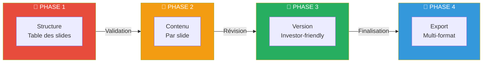

### Structure du Deck (14 Slides)

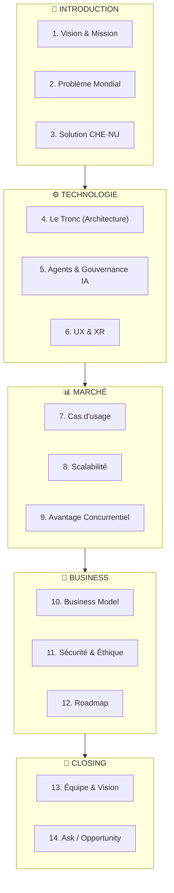

### Contenu par Slide

#### Slide 1: Vision & Mission

```
TITRE: L'IA qui amplifie, sans remplacer

MESSAGE CLÉ: 
CHE·NU est le premier système d'exploitation d'intelligence 
gouvernée où l'humain reste maître de toutes les décisions.

BULLETS:
• 168+ agents IA spécialisés
• Gouvernance constitutionnelle intégrée
• Construction → Toute industrie complexe
```

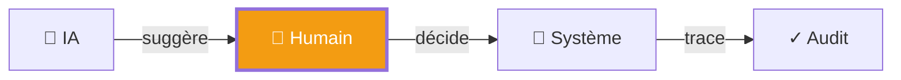

#### Slide 2: Problème Mondial

```
TITRE: La surcharge cognitive tue la productivité

MESSAGE CLÉ:
Les professionnels passent 60% de leur temps à chercher, 
organiser, et décider — pas à créer de la valeur.

BULLETS:
• Information fragmentée (10+ outils/jour)
• Décisions sans traçabilité
• IA actuelle: automatise OU assiste, jamais les deux
• Coût: $1.3T/an en productivité perdue (Fortune 500)
```

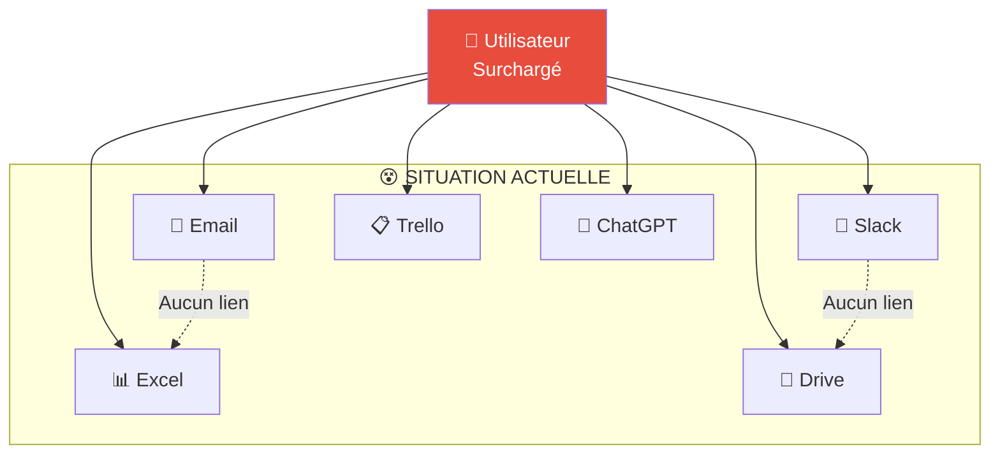

#### Slide 3: Solution CHE·NU

```
TITRE: Un cerveau unifié, gouverné par l'humain

MESSAGE CLÉ:
CHE·NU unifie contexte, agents IA, et décisions 
dans un système où RIEN ne s'active sans validation humaine.

BULLETS:
• Tronc central = source de vérité unique
• Sphères contextuelles = organisation naturelle
• Presets adaptatifs = suggestions intelligentes
• Timeline immuable = audit complet
```

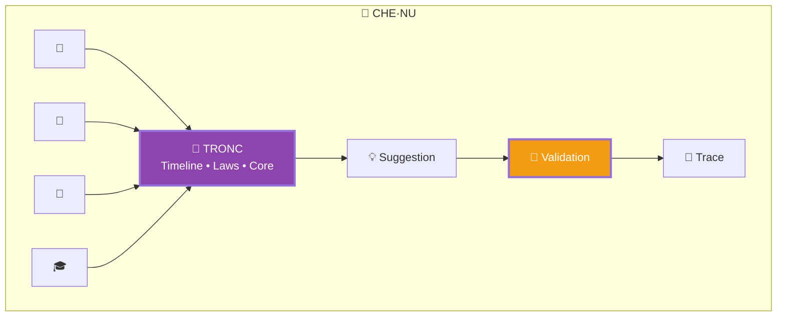

#### Slide 4: Le Tronc (Architecture)

```
TITRE: Architecture Constitutionnelle

MESSAGE CLÉ:
Comme une constitution protège les citoyens, 
le Tronc protège les décisions humaines.

BULLETS:
• Three Laws: Jamais nuire, Obéir, Protéger
• Timeline: Vérité immuable, auditée
• Presets: Adaptation sans automatisation
• 74,000+ lignes de code production-ready
```

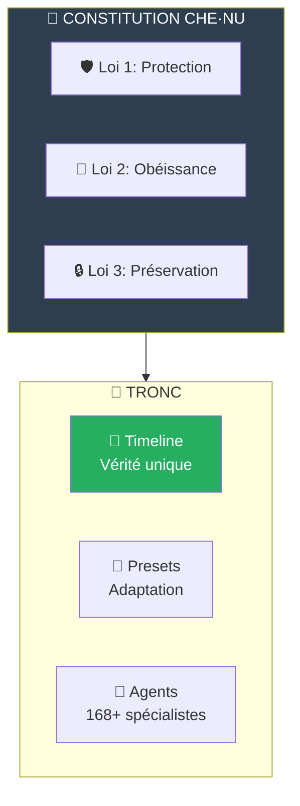

#### Slide 5: Agents & Gouvernance

```
TITRE: 168 experts IA, zéro autonomie dangereuse

MESSAGE CLÉ:
Chaque agent est spécialisé, supervisé, et 
ne peut JAMAIS agir sans approbation humaine.

BULLETS:
• Hiérarchie L0-L3 (Orchestrateur → Spécialistes)
• Chaque suggestion = raison explicite
• Audit trail sur chaque interaction
• Rollback possible sur toute décision
```

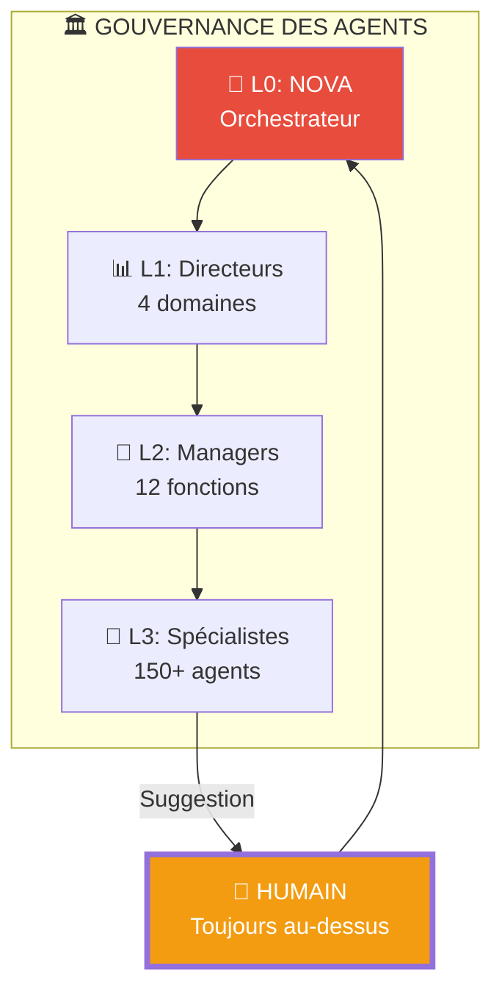

#### Slide 6: UX & XR

```
TITRE: De l'écran à l'immersion

MESSAGE CLÉ:
La même logique, visualisée en 2D, 3D, ou réalité mixte —
l'humain choisit son interface.

BULLETS:
• Web responsive (React/TypeScript)
• Universe 3D (Three.js)
• XR immersif (WebXR)
• Auras visuelles = état des presets
```

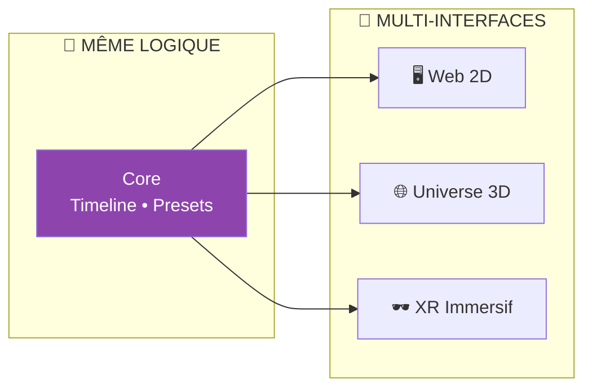

#### Slide 7: Cas d'Usage — Construction

```
TITRE: Premier marché: Construction Québec

MESSAGE CLÉ:
$50B/an de chantiers au Québec, 
90% gérés avec Excel et papier.

BULLETS:
• Conformité RBQ/CNESST/CCQ intégrée
• Gestion multi-projets unifiée
• 168 agents métier (estimateur, planificateur, etc.)
• ROI: -40% temps administratif
```

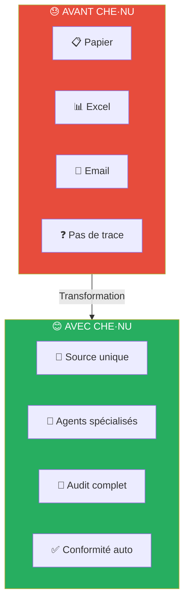

#### Slide 8: Scalabilité

```
TITRE: Construction → Toute industrie complexe

MESSAGE CLÉ:
L'architecture est domain-agnostic: 
seuls les agents changent, pas le tronc.

BULLETS:
• Phase 1: Construction Québec ($50B)
• Phase 2: Construction Canada ($200B)  
• Phase 3: Industries réglementées (santé, finance)
• TAM: $2T+ (gestion de projets complexes)
```

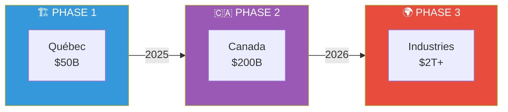

#### Slide 9: Avantage Concurrentiel

```
TITRE: Pourquoi CHE·NU gagne

MESSAGE CLÉ:
Aucun concurrent n'a la gouvernance constitutionnelle 
combinée à l'intelligence multi-agents.

BULLETS:
• vs Notion/Monday: Pas d'IA gouvernée
• vs ChatGPT/Claude: Pas de contexte persistant
• vs SAP/Oracle: Pas d'adaptation cognitive
• MOAT: Three Laws + Timeline + 168 Agents
```

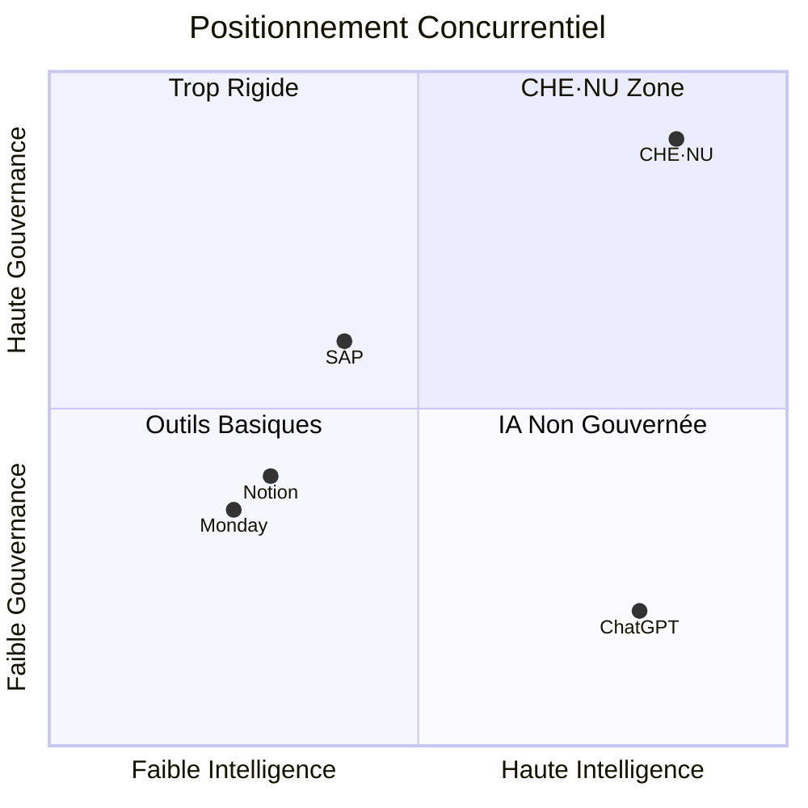

#### Slide 10: Business Model

```
TITRE: SaaS + Usage + Marketplace

MESSAGE CLÉ:
Revenus récurrents avec expansion naturelle 
par utilisateur et par agent.

BULLETS:
• Base: $99/user/mois (5 sphères, 50 agents)
• Pro: $299/user/mois (8 sphères, 168 agents, XR)
• Enterprise: Custom (agents personnalisés, on-premise)
• Marketplace: 30% sur agents tiers
```

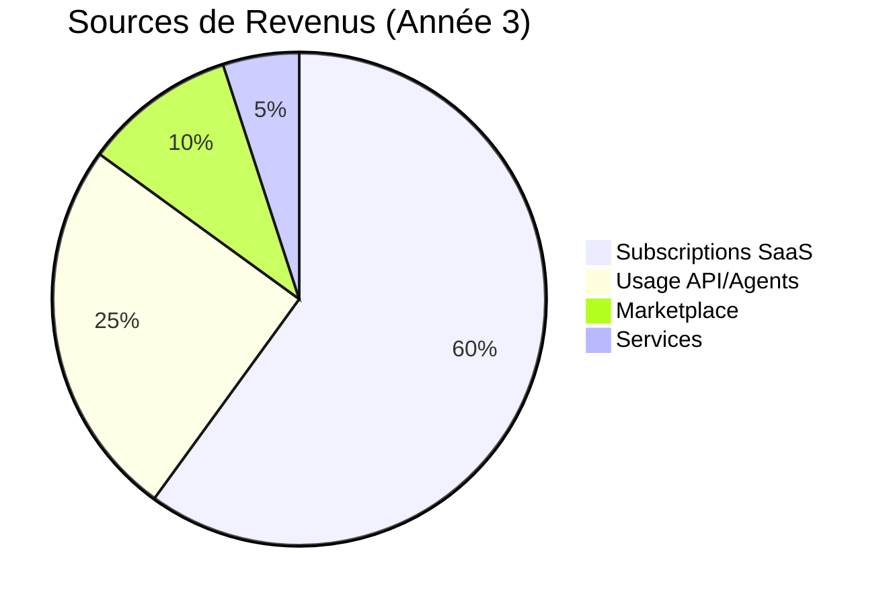

#### Slide 11: Sécurité & Éthique

```
TITRE: Confiance par design

MESSAGE CLÉ:
La gouvernance n'est pas un add-on, 
c'est le fondement de l'architecture.

BULLETS:
• Three Laws: Codées en dur, non modifiables
• Données: Chiffrement E2E, conformité PIPEDA
• Audit: Chaque décision tracée et exportable
• Éthique: Aucune décision autonome sur humains
```

```mermaid
graph TB
    subgraph SECURITY["🔒 SÉCURITÉ"]
        E2E["🔐 Chiffrement E2E"]
        PIPEDA["📜 Conformité PIPEDA"]
        AUDIT["📝 Audit complet"]
    end
    
    subgraph ETHICS["⚖️ ÉTHIQUE"]
        L1["🛡️ Protection humaine"]
        L2["👤 Décision humaine"]
        L3["📊 Transparence totale"]
    end
    
    SECURITY --> TRUST["✅ CONFIANCE"]
    ETHICS --> TRUST
    
    style TRUST fill:#27ae60,color:#fff,stroke-width:3px
```

#### Slide 12: Roadmap

```
TITRE: De 74K lignes à l'IPO

MESSAGE CLÉ:
Fondations solides, exécution méthodique, 
scalabilité prouvée.

BULLETS:
• Q1 2025: Beta privée (10 clients construction)
• Q3 2025: Launch public Québec
• Q1 2026: Expansion Canada
• Q4 2026: Série A, expansion internationale
```

```mermaid
gantt
    title Roadmap CHE·NU
    dateFormat  YYYY-MM
    section Produit
    Beta Privée           :2025-01, 3M
    Launch Québec         :2025-04, 6M
    Launch Canada         :2025-10, 6M
    section Business
    10 Clients Pilotes    :2025-01, 3M
    100 Clients           :2025-04, 6M
    1000 Clients          :2025-10, 12M
    section Funding
    Seed ($500K)          :milestone, 2025-01, 0d
    Série A ($5M)         :milestone, 2026-01, 0d
```

#### Slide 13: Équipe & Vision

```
TITRE: Bâtisseurs de l'IA responsable

MESSAGE CLÉ:
Une équipe qui comprend la construction ET l'IA, 
guidée par une vision éthique long-terme.

BULLETS:
• Fondateur: 15+ ans construction, expert IA
• Vision: L'IA comme outil, jamais comme maître
• Culture: "L'humain d'abord, toujours"
• Advisors: [À compléter]
```

#### Slide 14: The Ask

```
TITRE: Construisons ensemble

MESSAGE CLÉ:
$500K Seed pour prouver le modèle 
sur le marché construction Québec.

BULLETS:
• Utilisation: 60% Produit, 25% Ventes, 15% Ops
• Objectif 12 mois: 100 clients payants, $500K ARR
• Prochaine étape: Série A $5M (expansion Canada)
• Sortie potentielle: Acquisition stratégique ou IPO
```

```mermaid
graph LR
    subgraph NOW["🎯 MAINTENANT"]
        SEED["Seed<br/>$500K"]
    end
    
    subgraph M12["📅 +12 MOIS"]
        ARR["$500K ARR<br/>100 clients"]
    end
    
    subgraph M24["📅 +24 MOIS"]
        SERIEA["Série A<br/>$5M"]
    end
    
    subgraph EXIT["🚀 +5 ANS"]
        IPO["Exit<br/>$100M+"]
    end
    
    NOW --> M12 --> M24 --> EXIT
    
    style SEED fill:#f39c12,color:#fff
    style ARR fill:#27ae60,color:#fff
    style SERIEA fill:#3498db,color:#fff
    style IPO fill:#e74c3c,color:#fff
```

---

## 📎 Annexes

### Statistiques du Projet

```
Total lignes de code: 74,366
Modules TypeScript:   180+
Composants React:     60+
Agents définis:       168
Sphères:              9
Presets:              31+
Tests:                Intégrés
Documentation:        Complète
```

### Stack Technique

```
Frontend:  React 18 + TypeScript + Vite
3D/XR:     Three.js + React-Three-Fiber + WebXR
State:     Zustand + Context
Backend:   FastAPI + Python 3.11
Database:  PostgreSQL + Redis
Deploy:    Docker + Kubernetes
```

### Contact

```
Projet:    CHE·NU (Chez Nous)
Fondateur: Jo — Pro-Service Construction
Location:  Brossard, Québec
Status:    MVP 74K lignes, prêt pour beta
```

---

*Document généré le 8 décembre 2025*
*Version: 1.0*
*CHE·NU — L'IA qui amplifie, sans remplacer* 🌳
