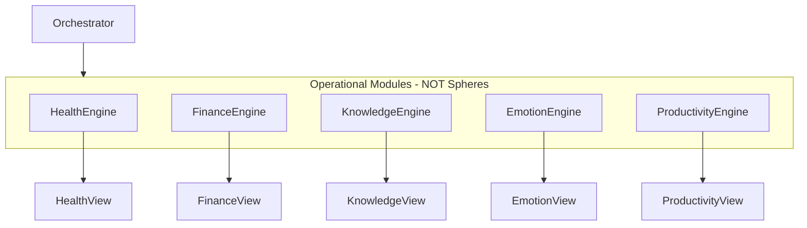
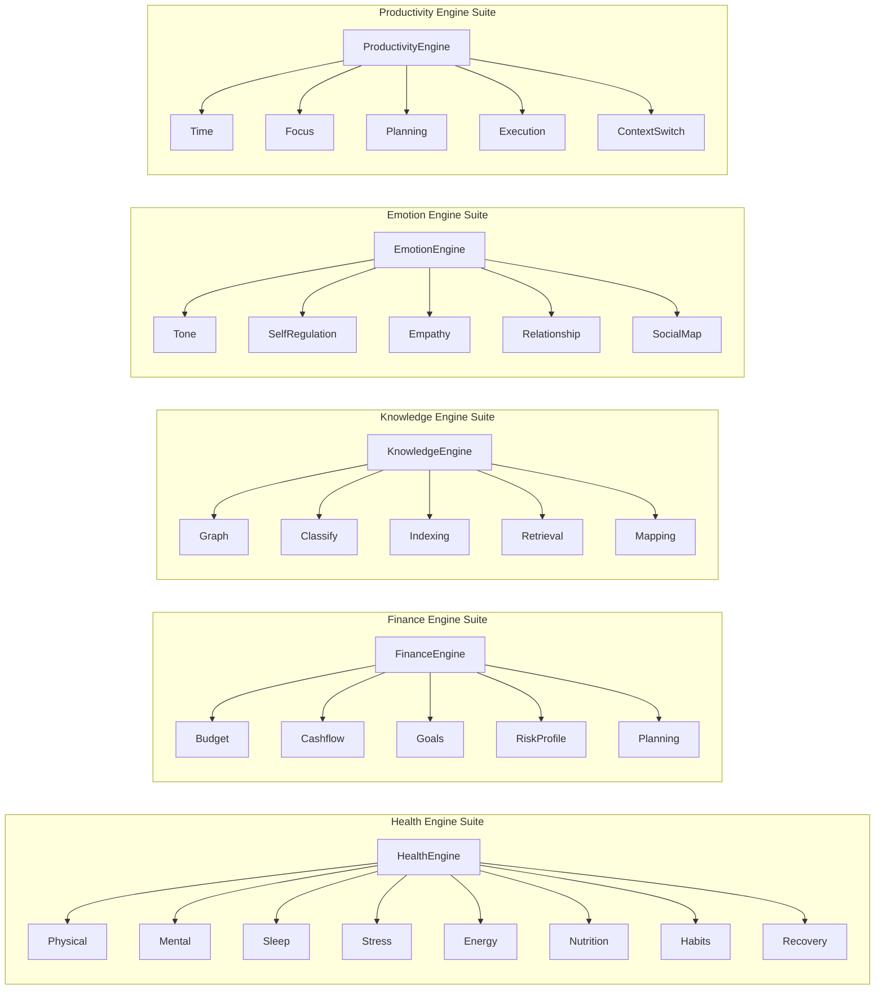

############################################################
#                                                          #
#              PHASE F: SYSTEM UPDATES                     #
#                                                          #
############################################################

============================================================
F.1 — SYSTEM INDEX JSON (COMPLETE UPDATE)
============================================================

--- FILE: /che-nu-sdk/system_index.json
--- ACTION: REPLACE ENTIRE FILE
--- PRIORITY: F.1

{
  "version": "3.0.0",
  "generated": "2025-12-12",
  "classification_note": "Health, Finance, Knowledge, Emotion, Productivity are OPERATIONAL MODULES, NOT Spheres.",

  "spheres": [
    { "name": "Personal", "path": "/che-nu-sdk/core/spheres/personal.ts", "status": "complete" },
    { "name": "Business", "path": "/che-nu-sdk/core/spheres/business.ts", "status": "complete" },
    { "name": "Creative", "path": "/che-nu-sdk/core/spheres/creative.ts", "status": "complete" },
    { "name": "Scholar", "path": "/che-nu-sdk/core/spheres/scholar.ts", "status": "complete" },
    { "name": "Social", "path": "/che-nu-sdk/core/spheres/social.ts", "status": "complete" },
    { "name": "Community", "path": "/che-nu-sdk/core/spheres/community.ts", "status": "complete" },
    { "name": "XR", "path": "/che-nu-sdk/core/spheres/xr.ts", "status": "complete" },
    { "name": "MyTeam", "path": "/che-nu-sdk/core/spheres/myteam.ts", "status": "complete" }
  ],

  "super_modules": [
    {
      "name": "MethodologyEngine",
      "path": "/che-nu-sdk/core/methodology.ts",
      "status": "complete",
      "classification": "super_module",
      "submodules": [
        { "name": "DecompositionOperator", "path": "/che-nu-sdk/core/methodology/operator.decomposition.ts" },
        { "name": "WorkflowOperator", "path": "/che-nu-sdk/core/methodology/operator.workflow.ts" },
        { "name": "TransformationOperator", "path": "/che-nu-sdk/core/methodology/operator.transformation.ts" },
        { "name": "AnalysisOperator", "path": "/che-nu-sdk/core/methodology/operator.analysis.ts" }
      ]
    },
    {
      "name": "SkillEngine",
      "path": "/che-nu-sdk/core/skill.ts",
      "status": "complete",
      "classification": "super_module",
      "submodules": [
        { "name": "CognitiveSkillsDomain", "path": "/che-nu-sdk/core/skill/domain.cognitive.ts" },
        { "name": "TechnicalSkillsDomain", "path": "/che-nu-sdk/core/skill/domain.technical.ts" },
        { "name": "SocialSkillsDomain", "path": "/che-nu-sdk/core/skill/domain.social.ts" },
        { "name": "CreativeSkillsDomain", "path": "/che-nu-sdk/core/skill/domain.creative.ts" },
        { "name": "PhysicalSkillsDomain", "path": "/che-nu-sdk/core/skill/domain.physical.ts" }
      ]
    }
  ],

  "operational_modules": [
    {
      "name": "HealthEngine",
      "path": "/che-nu-sdk/core/health.ts",
      "status": "complete",
      "classification": "operational_module",
      "attachedTo": ["Personal Sphere", "Agents"],
      "submodules": [
        { "name": "PhysicalEngine", "path": "/che-nu-sdk/core/health/physical.engine.ts" },
        { "name": "MentalEngine", "path": "/che-nu-sdk/core/health/mental.engine.ts" },
        { "name": "SleepEngine", "path": "/che-nu-sdk/core/health/sleep.engine.ts" },
        { "name": "StressEngine", "path": "/che-nu-sdk/core/health/stress.engine.ts" },
        { "name": "EnergyEngine", "path": "/che-nu-sdk/core/health/energy.engine.ts" },
        { "name": "NutritionEngine", "path": "/che-nu-sdk/core/health/nutrition.engine.ts" },
        { "name": "HabitsEngine", "path": "/che-nu-sdk/core/health/habits.engine.ts" },
        { "name": "RecoveryEngine", "path": "/che-nu-sdk/core/health/recovery.engine.ts" }
      ]
    },
    {
      "name": "FinanceEngine",
      "path": "/che-nu-sdk/core/finance.ts",
      "status": "complete",
      "classification": "operational_module",
      "submodules": [
        { "name": "BudgetEngine", "path": "/che-nu-sdk/core/finance/budget.engine.ts" },
        { "name": "CashflowEngine", "path": "/che-nu-sdk/core/finance/cashflow.engine.ts" },
        { "name": "GoalsEngine", "path": "/che-nu-sdk/core/finance/goals.engine.ts" },
        { "name": "RiskProfileEngine", "path": "/che-nu-sdk/core/finance/riskprofile.engine.ts" },
        { "name": "PlanningEngine", "path": "/che-nu-sdk/core/finance/planning.engine.ts" }
      ]
    },
    {
      "name": "KnowledgeEngine",
      "path": "/che-nu-sdk/core/knowledge.ts",
      "status": "complete",
      "classification": "operational_module",
      "submodules": [
        { "name": "GraphEngine", "path": "/che-nu-sdk/core/knowledge/graph.engine.ts" },
        { "name": "ClassifyEngine", "path": "/che-nu-sdk/core/knowledge/classify.engine.ts" },
        { "name": "IndexingEngine", "path": "/che-nu-sdk/core/knowledge/indexing.engine.ts" },
        { "name": "RetrievalEngine", "path": "/che-nu-sdk/core/knowledge/retrieval.engine.ts" },
        { "name": "MappingEngine", "path": "/che-nu-sdk/core/knowledge/mapping.engine.ts" }
      ]
    },
    {
      "name": "EmotionEngine",
      "path": "/che-nu-sdk/core/emotion.ts",
      "status": "complete",
      "classification": "operational_module",
      "submodules": [
        { "name": "ToneEngine", "path": "/che-nu-sdk/core/emotion/tone.engine.ts" },
        { "name": "SelfRegulationEngine", "path": "/che-nu-sdk/core/emotion/selfregulation.engine.ts" },
        { "name": "EmpathyEngine", "path": "/che-nu-sdk/core/emotion/empathy.engine.ts" },
        { "name": "RelationshipEngine", "path": "/che-nu-sdk/core/emotion/relationship.engine.ts" },
        { "name": "SocialMapEngine", "path": "/che-nu-sdk/core/emotion/socialmap.engine.ts" }
      ]
    },
    {
      "name": "ProductivityEngine",
      "path": "/che-nu-sdk/core/productivity.ts",
      "status": "complete",
      "classification": "operational_module",
      "submodules": [
        { "name": "TimeEngine", "path": "/che-nu-sdk/core/productivity/time.engine.ts" },
        { "name": "FocusEngine", "path": "/che-nu-sdk/core/productivity/focus.engine.ts" },
        { "name": "PlanningEngine", "path": "/che-nu-sdk/core/productivity/planning.engine.ts" },
        { "name": "ExecutionEngine", "path": "/che-nu-sdk/core/productivity/execution.engine.ts" },
        { "name": "ContextSwitchEngine", "path": "/che-nu-sdk/core/productivity/contextswitch.engine.ts" }
      ]
    }
  ],

  "transversal_engines": [
    { "name": "MemoryManager", "path": "/che-nu-sdk/core/memory_manager.ts", "status": "complete" },
    { "name": "ReplayEngine", "path": "/che-nu-sdk/core/replay_engine.ts", "status": "complete" },
    { "name": "HyperFabric", "path": "/che-nu-sdk/core/hyper_fabric.ts", "status": "complete" },
    { "name": "DepthLensSystem", "path": "/che-nu-sdk/core/depth_lens.ts", "status": "complete" },
    { "name": "CartographyEngine", "path": "/che-nu-sdk/core/cartography.ts", "status": "complete" },
    { "name": "ProjectionEngine", "path": "/che-nu-sdk/core/projection.ts", "status": "complete" }
  ],

  "schemas": [
    { "name": "methodology.schema.json", "path": "/che-nu-sdk/schemas/methodology.schema.json", "status": "complete" },
    { "name": "skill.schema.json", "path": "/che-nu-sdk/schemas/skill.schema.json", "status": "complete" },
    { "name": "health.schema.json", "path": "/che-nu-sdk/schemas/health.schema.json", "status": "complete" },
    { "name": "finance.schema.json", "path": "/che-nu-sdk/schemas/finance.schema.json", "status": "complete" },
    { "name": "knowledge.schema.json", "path": "/che-nu-sdk/schemas/knowledge.schema.json", "status": "complete" },
    { "name": "emotion.schema.json", "path": "/che-nu-sdk/schemas/emotion.schema.json", "status": "complete" },
    { "name": "productivity.schema.json", "path": "/che-nu-sdk/schemas/productivity.schema.json", "status": "complete" },
    { "name": "community.schema.json", "path": "/che-nu-sdk/schemas/community.schema.json", "status": "complete" },
    { "name": "xr.schema.json", "path": "/che-nu-sdk/schemas/xr.schema.json", "status": "complete" }
  ],

  "statistics": {
    "totalSpheres": 8,
    "totalSuperModules": 2,
    "totalOperationalModules": 5,
    "totalSubEngines": 28,
    "totalSchemas": 9,
    "totalTransversalEngines": 6
  }
}

============================================================
F.3 — ORCHESTRATOR UPDATE
============================================================

--- FILE: /che-nu-sdk/core/orchestrator.ts
--- ACTION: ADD TO determineModule() function
--- PRIORITY: F.3

/**
 * Determine which module handles the request
 * Updated with all operational modules
 */
function determineModule(domain: string, intent: string): string {
  const lowerDomain = domain.toLowerCase();
  const lowerIntent = intent.toLowerCase();

  // ============================================================
  // SPHERES — Domains of life
  // ============================================================
  
  if (lowerDomain === 'personal') return 'PersonalSphere';
  if (lowerDomain === 'business') return 'BusinessSphere';
  if (lowerDomain === 'creative') return 'CreativeSphere';
  if (lowerDomain === 'scholar') return 'ScholarSphere';
  if (lowerDomain === 'social') return 'SocialSphere';
  if (lowerDomain === 'community') return 'CommunitySphere';
  if (lowerDomain === 'xr') return 'XRSphere';
  if (lowerDomain === 'myteam') return 'MyTeamSphere';

  // ============================================================
  // SUPER-MODULES — NOT Spheres
  // ============================================================
  
  if (lowerDomain === 'methodology' || 
      lowerIntent.includes('workflow') ||
      lowerIntent.includes('decompose') ||
      lowerIntent.includes('transformation')) {
    return 'MethodologyEngine';
  }

  if (lowerDomain === 'skill' ||
      lowerIntent.includes('skill') ||
      lowerIntent.includes('learning path')) {
    return 'SkillEngine';
  }

  // ============================================================
  // OPERATIONAL MODULES — NOT Spheres
  // ============================================================
  
  // Health
  if (lowerDomain === 'health' ||
      lowerIntent.includes('health') ||
      lowerIntent.includes('sleep') ||
      lowerIntent.includes('energy') ||
      lowerIntent.includes('stress') ||
      lowerIntent.includes('nutrition') ||
      lowerIntent.includes('habits') ||
      lowerIntent.includes('recovery')) {
    return 'HealthEngine';
  }

  // Finance
  if (lowerDomain === 'finance' ||
      lowerIntent.includes('finance') ||
      lowerIntent.includes('budget') ||
      lowerIntent.includes('cashflow') ||
      lowerIntent.includes('financial goal')) {
    return 'FinanceEngine';
  }

  // Knowledge
  if (lowerDomain === 'knowledge' ||
      lowerIntent.includes('knowledge') ||
      lowerIntent.includes('topics') ||
      lowerIntent.includes('learning content') ||
      lowerIntent.includes('information structure')) {
    return 'KnowledgeEngine';
  }

  // Emotion / Social Intelligence
  if (lowerDomain === 'emotion' ||
      lowerDomain === 'social intelligence' ||
      lowerIntent.includes('emotion') ||
      lowerIntent.includes('tone') ||
      lowerIntent.includes('social dynamic') ||
      lowerIntent.includes('relationship')) {
    return 'EmotionEngine';
  }

  // Productivity
  if (lowerDomain === 'productivity' ||
      lowerIntent.includes('productivity') ||
      lowerIntent.includes('time management') ||
      lowerIntent.includes('focus') ||
      lowerIntent.includes('task')) {
    return 'ProductivityEngine';
  }

  // ============================================================
  // TRANSVERSAL ENGINES
  // ============================================================
  
  if (lowerIntent.includes('memory')) return 'MemoryManager';
  if (lowerIntent.includes('replay')) return 'ReplayEngine';
  if (lowerIntent.includes('fabric')) return 'HyperFabric';
  if (lowerIntent.includes('depth') || lowerIntent.includes('lens')) return 'DepthLensSystem';
  if (lowerIntent.includes('map') || lowerIntent.includes('cartograph')) return 'CartographyEngine';
  if (lowerIntent.includes('project') || lowerIntent.includes('view')) return 'ProjectionEngine';

  return 'GeneralHandler';
}

============================================================
F.4 — CONTEXT INTERPRETER UPDATE
============================================================

--- FILE: /che-nu-sdk/core/context_interpreter.ts
--- ACTION: ADD TO classifyDomain() function
--- PRIORITY: F.4

/**
 * Classify domain from input
 * Updated with all operational modules
 */
function classifyDomain(input: string): { domain: string; isModule: boolean } {
  const lowerInput = input.toLowerCase();

  // ============================================================
  // SPHERES
  // ============================================================
  
  if (lowerInput.includes('personal') || lowerInput.includes('home') || lowerInput.includes('family')) {
    return { domain: 'Personal', isModule: false };
  }
  if (lowerInput.includes('business') || lowerInput.includes('enterprise') || lowerInput.includes('company')) {
    return { domain: 'Business', isModule: false };
  }
  if (lowerInput.includes('creative') || lowerInput.includes('art') || lowerInput.includes('design')) {
    return { domain: 'Creative', isModule: false };
  }
  if (lowerInput.includes('scholar') || lowerInput.includes('research') || lowerInput.includes('academic')) {
    return { domain: 'Scholar', isModule: false };
  }
  if (lowerInput.includes('social') && !lowerInput.includes('intelligence')) {
    return { domain: 'Social', isModule: false };
  }
  if (lowerInput.includes('community') || lowerInput.includes('group') || lowerInput.includes('collective')) {
    return { domain: 'Community', isModule: false };
  }
  if (lowerInput.includes('xr') || lowerInput.includes('virtual') || lowerInput.includes('immersive')) {
    return { domain: 'XR', isModule: false };
  }
  if (lowerInput.includes('team') || lowerInput.includes('agent') || lowerInput.includes('myteam')) {
    return { domain: 'MyTeam', isModule: false };
  }

  // ============================================================
  // SUPER-MODULES (NOT Spheres)
  // ============================================================
  
  if (lowerInput.includes('methodology') || lowerInput.includes('workflow') || lowerInput.includes('decompose')) {
    return { domain: 'Methodology', isModule: true };
  }

  if (lowerInput.includes('skill') || lowerInput.includes('competency') || lowerInput.includes('learning path')) {
    return { domain: 'Skill', isModule: true };
  }

  // ============================================================
  // OPERATIONAL MODULES (NOT Spheres)
  // ============================================================
  
  // Health
  if (lowerInput.includes('health') || lowerInput.includes('sleep') || lowerInput.includes('energy') ||
      lowerInput.includes('stress') || lowerInput.includes('nutrition') || lowerInput.includes('habits') ||
      lowerInput.includes('recovery') || lowerInput.includes('physical') || lowerInput.includes('mental')) {
    return { domain: 'Health', isModule: true };
  }

  // Finance
  if (lowerInput.includes('finance') || lowerInput.includes('budget') || lowerInput.includes('cashflow') ||
      lowerInput.includes('financial') || lowerInput.includes('money') || lowerInput.includes('savings')) {
    return { domain: 'Finance', isModule: true };
  }

  // Knowledge
  if (lowerInput.includes('knowledge') || lowerInput.includes('topics') || lowerInput.includes('learning content') ||
      lowerInput.includes('information structure') || lowerInput.includes('graph')) {
    return { domain: 'Knowledge', isModule: true };
  }

  // Emotion / Social Intelligence
  if (lowerInput.includes('emotion') || lowerInput.includes('tone') || lowerInput.includes('social intelligence') ||
      lowerInput.includes('relationship') || lowerInput.includes('empathy')) {
    return { domain: 'Emotion', isModule: true };
  }

  // Productivity
  if (lowerInput.includes('productivity') || lowerInput.includes('time management') || lowerInput.includes('focus') ||
      lowerInput.includes('task') || lowerInput.includes('planning')) {
    return { domain: 'Productivity', isModule: true };
  }

  return { domain: 'General', isModule: false };
}

############################################################
#                                                          #
#              PHASE G: FRONTEND PAGES                     #
#                                                          #
############################################################

============================================================
G.1 — HEALTH PAGE
============================================================

--- FILE: /che-nu-frontend/pages/health.tsx
--- ACTION: CREATE NEW FILE
--- PRIORITY: G.1

import React, { useState } from 'react';
import Layout from '../components/Layout';
import HealthViewer from '../components/HealthViewer';
import { runCheNu } from '../services/chenu.service';

type ViewMode = 'overview' | 'sleep' | 'energy' | 'mental' | 'habits' | 'stress';

export default function HealthPage() {
  const [viewMode, setViewMode] = useState<ViewMode>('overview');
  const [result, setResult] = useState<any>(null);
  const [loading, setLoading] = useState(false);

  const handleAnalyze = async (mode: ViewMode) => {
    setLoading(true);
    setViewMode(mode);
    try {
      const queries: Record<ViewMode, string> = {
        overview: 'evaluate overall health',
        sleep: 'analyze sleep patterns',
        energy: 'analyze energy levels',
        mental: 'analyze mental state',
        habits: 'analyze habits',
        stress: 'analyze stress levels',
      };
      const res = await runCheNu(queries[mode]);
      setResult(res);
    } catch (err) {
      console.error(err);
    } finally {
      setLoading(false);
    }
  };

  return (
    <Layout>
      

        <header>
          <h1>Personal Health Dashboard</h1>
          Operational Module
          
Representational health structures. NO medical advice.

        </header>

        <nav className="mode-nav">
          <button className={viewMode === 'overview' ? 'active' : ''} onClick={() => handleAnalyze('overview')}>Overview</button>
          <button className={viewMode === 'sleep' ? 'active' : ''} onClick={() => handleAnalyze('sleep')}>Sleep</button>
          <button className={viewMode === 'energy' ? 'active' : ''} onClick={() => handleAnalyze('energy')}>Energy</button>
          <button className={viewMode === 'mental' ? 'active' : ''} onClick={() => handleAnalyze('mental')}>Mental</button>
          <button className={viewMode === 'habits' ? 'active' : ''} onClick={() => handleAnalyze('habits')}>Habits</button>
          <button className={viewMode === 'stress' ? 'active' : ''} onClick={() => handleAnalyze('stress')}>Stress</button>
        </nav>

        <main>
          {loading ? 
Loading...
 : <HealthViewer viewMode={viewMode} result={result} />}
        </main>

        <footer>
          
HealthEngine v1.0.0 — Operational Module — SAFE Compliant — NO Medical Advice

        </footer>
      

    </Layout>
  );
}

============================================================
G.2 — HEALTH VIEWER COMPONENT
============================================================

--- FILE: /che-nu-frontend/components/HealthViewer.tsx
--- ACTION: CREATE NEW FILE
--- PRIORITY: G.2

import React from 'react';

interface Props {
  viewMode: string;
  result: any;
}

export default function HealthViewer({ viewMode, result }: Props) {
  const renderScoreCard = (title: string, score: number, status: string) => (
    

      <h4>{title}</h4>
      
{score}

      
{status}

    

  );

  if (!result) {
    return 
Select an analysis type to view health insights.
;
  }

  return (
    

      {viewMode === 'overview' && (
        

          {renderScoreCard('Overall', result.overallScore || 50, 'Representational')}
          {renderScoreCard('Physical', result.physical?.score || 50, result.physical?.strength || 'moderate')}
          {renderScoreCard('Mental', result.mental?.score || 50, result.mental?.clarity || 'moderate')}
          {renderScoreCard('Sleep', result.sleep?.score || 50, result.sleep?.quality || 'fair')}
          {renderScoreCard('Energy', result.energy?.score || 50, result.energy?.current || 'moderate')}
          {renderScoreCard('Stress', result.stress?.score || 50, result.stress?.level || 'moderate')}
        

      )}

      {viewMode === 'sleep' && (
        

          <h3>Sleep Analysis</h3>
          
Duration: {result.sleep?.duration || 'adequate'}

          
Quality: {result.sleep?.quality || 'fair'}

          
Cycles: {result.sleep?.cycles || 4}

        

      )}

      {viewMode === 'energy' && (
        

          <h3>Energy Analysis</h3>
          
Current: {result.energy?.current || 'moderate'}

          
Trend: {result.energy?.trend || 'stable'}

        

      )}

      {viewMode === 'mental' && (
        

          <h3>Mental Analysis</h3>
          
Cognitive Load: {result.mental?.cognitiveLoad || 'moderate'}

          
Clarity: {result.mental?.clarity || 'moderate'}

          
Focus Index: {result.mental?.focusIndex || 50}

        

      )}

      {viewMode === 'habits' && (
        

          <h3>Habits Analysis</h3>
          
Positive Habits: {result.habits?.positive?.length || 0}

          
Areas for Review: {result.habits?.negative?.length || 0}

        

      )}

      {viewMode === 'stress' && (
        

          <h3>Stress Analysis</h3>
          
Level: {result.stress?.level || 'moderate'}

          
Stressors: {result.stress?.stressors?.join(', ') || 'general'}

        

      )}

      
    

  );
}

============================================================
G.3-G.10 — OTHER FRONTEND PAGES (COMPACT)
============================================================

--- FILE: /che-nu-frontend/pages/finance.tsx

import React, { useState } from 'react';
import Layout from '../components/Layout';
import FinanceViewer from '../components/FinanceViewer';
import { runCheNu } from '../services/chenu.service';

export default function FinancePage() {
  const [result, setResult] = useState<any>(null);
  const [loading, setLoading] = useState(false);

  const handleAnalyze = async (type: string) => {
    setLoading(true);
    const res = await runCheNu(`analyze ${type}`);
    setResult(res);
    setLoading(false);
  };

  return (
    <Layout>
      

        <header>
          <h1>Finance Dashboard</h1>
          Operational Module - NO Financial Advice
        </header>
        <nav>
          <button onClick={() => handleAnalyze('budget structure')}>Budget</button>
          <button onClick={() => handleAnalyze('cashflow')}>Cashflow</button>
          <button onClick={() => handleAnalyze('financial goals')}>Goals</button>
          <button onClick={() => handleAnalyze('risk profile')}>Risk Profile</button>
        </nav>
        <main>{loading ? 
Loading...
 : <FinanceViewer result={result} />}</main>
      

    </Layout>
  );
}

--- FILE: /che-nu-frontend/components/FinanceViewer.tsx

import React from 'react';

export default function FinanceViewer({ result }: { result: any }) {
  if (!result) return 
Select analysis type to view finance structure.
;
  return (
    

      <h3>Finance Structure</h3>
      <pre>{JSON.stringify(result, null, 2)}</pre>
    

  );
}

--- FILE: /che-nu-frontend/pages/knowledge.tsx

import React, { useState } from 'react';
import Layout from '../components/Layout';
import KnowledgeViewer from '../components/KnowledgeViewer';
import { runCheNu } from '../services/chenu.service';

export default function KnowledgePage() {
  const [result, setResult] = useState<any>(null);
  const [loading, setLoading] = useState(false);

  const handleAnalyze = async (type: string) => {
    setLoading(true);
    const res = await runCheNu(`${type}`);
    setResult(res);
    setLoading(false);
  };

  return (
    <Layout>
      

        <header>
          <h1>Knowledge Map</h1>
          Operational Module
        </header>
        <nav>
          <button onClick={() => handleAnalyze('build knowledge graph')}>Build Graph</button>
          <button onClick={() => handleAnalyze('classify topics')}>Classify</button>
          <button onClick={() => handleAnalyze('suggest index structure')}>Index</button>
          <button onClick={() => handleAnalyze('create retrieval plan')}>Retrieval</button>
        </nav>
        <main>{loading ? 
Loading...
 : <KnowledgeViewer result={result} />}</main>
      

    </Layout>
  );
}

--- FILE: /che-nu-frontend/components/KnowledgeViewer.tsx

import React from 'react';

export default function KnowledgeViewer({ result }: { result: any }) {
  if (!result) return 
Select analysis type to view knowledge structure.
;
  return (
    

      <h3>Knowledge Structure</h3>
      {result.nodes && 
Nodes: {result.nodes.length}
}
      {result.edges && 
Edges: {result.edges.length}
}
      <pre>{JSON.stringify(result, null, 2)}</pre>
    

  );
}

--- FILE: /che-nu-frontend/pages/emotion.tsx

import React, { useState } from 'react';
import Layout from '../components/Layout';
import EmotionViewer from '../components/EmotionViewer';
import { runCheNu } from '../services/chenu.service';

export default function EmotionPage() {
  const [result, setResult] = useState<any>(null);
  const [loading, setLoading] = useState(false);

  const handleAnalyze = async (type: string) => {
    setLoading(true);
    const res = await runCheNu(`analyze ${type}`);
    setResult(res);
    setLoading(false);
  };

  return (
    <Layout>
      

        <header>
          <h1>Emotion & Social Intelligence</h1>
          Operational Module - NO Diagnosis
        </header>
        <nav>
          <button onClick={() => handleAnalyze('emotional tone')}>Tone</button>
          <button onClick={() => handleAnalyze('relationships')}>Relationships</button>
          <button onClick={() => handleAnalyze('social context')}>Social Map</button>
        </nav>
        <main>{loading ? 
Loading...
 : <EmotionViewer result={result} />}</main>
      

    </Layout>
  );
}

--- FILE: /che-nu-frontend/components/EmotionViewer.tsx

import React from 'react';

export default function EmotionViewer({ result }: { result: any }) {
  if (!result) return 
Select analysis type to view emotion/social structure.
;
  return (
    

      <h3>Emotion / Social Structure</h3>
      {result.category && 
Tone: {result.category}
}
      <pre>{JSON.stringify(result, null, 2)}</pre>
    

  );
}

--- FILE: /che-nu-frontend/pages/productivity.tsx

import React, { useState } from 'react';
import Layout from '../components/Layout';
import ProductivityViewer from '../components/ProductivityViewer';
import { runCheNu } from '../services/chenu.service';

export default function ProductivityPage() {
  const [result, setResult] = useState<any>(null);
  const [loading, setLoading] = useState(false);

  const handleAnalyze = async (type: string) => {
    setLoading(true);
    const res = await runCheNu(`${type}`);
    setResult(res);
    setLoading(false);
  };

  return (
    <Layout>
      

        <header>
          <h1>Productivity Dashboard</h1>
          Operational Module
        </header>
        <nav>
          <button onClick={() => handleAnalyze('build task map')}>Task Map</button>
          <button onClick={() => handleAnalyze('plan time blocks')}>Time Blocks</button>
          <button onClick={() => handleAnalyze('outline priorities')}>Priorities</button>
          <button onClick={() => handleAnalyze('focus session')}>Focus</button>
        </nav>
        <main>{loading ? 
Loading...
 : <ProductivityViewer result={result} />}</main>
      

    </Layout>
  );
}

--- FILE: /che-nu-frontend/components/ProductivityViewer.tsx

import React from 'react';

export default function ProductivityViewer({ result }: { result: any }) {
  if (!result) return 
Select analysis type to view productivity structure.
;
  return (
    

      <h3>Productivity Structure</h3>
      {result.tasks && 
Tasks: {result.tasks.length}
}
      {result.blocks && 
Time Blocks: {result.blocks.length}
}
      <pre>{JSON.stringify(result, null, 2)}</pre>
    

  );
}

============================================================
G.11 — WORKFLOW GRID UPDATE
============================================================

--- FILE: /che-nu-frontend/components/WorkflowGrid.tsx
--- ACTION: ADD BUTTONS

// ADD these buttons to the existing WorkflowGrid:

<button className="workflow-btn" onClick={() => navigateTo('/health')}>
  ❤️
  Health Tools
  Operational
</button>

<button className="workflow-btn" onClick={() => navigateTo('/finance')}>
  💰
  Finance Tools
  Operational
</button>

<button className="workflow-btn" onClick={() => navigateTo('/knowledge')}>
  📚
  Knowledge Tools
  Operational
</button>

<button className="workflow-btn" onClick={() => navigateTo('/emotion')}>
  🧠
  Emotion / Social IQ
  Operational
</button>

<button className="workflow-btn" onClick={() => navigateTo('/productivity')}>
  ⚡
  Productivity Tools
  Operational
</button>

############################################################
#                                                          #
#              PHASE H: DOCUMENTATION                      #
#                                                          #
############################################################

============================================================
H.1 — UI FLOW UPDATE
============================================================

--- FILE: /che-nu-app/docs/UI_FLOW.md
--- ACTION: ADD SECTION

## Operational Module Workflows

These are OPERATIONAL MODULES - NOT Spheres.

### Health Tools
- Evaluate Overall Health
- Analyze Sleep
- Analyze Energy
- Analyze Mental Load
- Analyze Habits
- Analyze Stress

### Finance Tools
- Finance Overview
- Budget Skeleton
- Cashflow Map
- Goal Mapping
- Risk Profile

### Knowledge Tools
- Build Knowledge Graph
- Classify Topics
- Design Index
- Retrieval Plan

### Emotion / Social IQ
- Analyze Emotional Tone
- Map Relationships
- Social Context Overview

### Productivity Tools
- Task Map
- Time Block Plan
- Focus Layout
- Execution Overview

### Mermaid Diagram

============================================================
H.2 — COMPLETE DIAGRAMS UPDATE
============================================================

--- FILE: /che-nu-sdk/docs/DIAGRAMS.md
--- ACTION: ADD SECTION

## Complete CHE·NU Architecture Diagram

```mermaid
flowchart TB
    CHE_NU[CHE·NU System v3.0]
    
    CHE_NU --> Spheres
    CHE_NU --> SuperModules
    CHE_NU --> OperationalModules
    CHE_NU --> TransversalEngines

    subgraph Spheres[Spheres - 8 Domains of Life]
        S1[Personal]
        S2[Business]
        S3[Creative]
        S4[Scholar]
        S5[Social]
        S6[Community]
        S7[XR]
        S8[MyTeam]
    end

    subgraph SuperModules[Super-Modules]
        SM1[MethodologyEngine]
        SM2[SkillEngine]
    end

    subgraph OperationalModules[Operational Modules]
        OM1[HealthEngine]
        OM2[FinanceEngine]
        OM3[KnowledgeEngine]
        OM4[EmotionEngine]
        OM5[ProductivityEngine]
    end

    subgraph TransversalEngines[Transversal Engines]
        TE1[MemoryManager]
        TE2[ReplayEngine]
        TE3[HyperFabric]
        TE4[DepthLensSystem]
        TE5[CartographyEngine]
        TE6[ProjectionEngine]
    end

    style Spheres fill:#2F4C39,stroke:#3F7249
    style SuperModules fill:#7A593A,stroke:#D8B26A
    style OperationalModules fill:#3EB4A2,stroke:#D8B26A
    style TransversalEngines fill:#1E1F22,stroke:#8D8371
```

## Operational Modules Sub-Engines

############################################################
#                                                          #
#              END OF MEGA PACK                            #
#                                                          #
############################################################

============================================================
CONSOLIDATION SUMMARY
============================================================

TOTAL FILES CREATED/UPDATED:

PHASE A: Health Engine Suite
- 1 main engine + 8 sub-engines + 1 index + 1 schema = 11 files

PHASE B: Finance Engine Suite
- 1 main engine + 5 sub-engines + 1 index + 1 schema = 8 files

PHASE C: Knowledge Engine Suite
- 1 main engine + 5 sub-engines + 1 index + 1 schema = 8 files

PHASE D: Emotion Engine Suite
- 1 main engine + 5 sub-engines + 1 index + 1 schema = 8 files

PHASE E: Productivity Engine Suite
- 1 main engine + 5 sub-engines + 1 index + 1 schema = 8 files

PHASE F: System Updates
- system_index.json + orchestrator.ts + context_interpreter.ts = 3 files

PHASE G: Frontend
- 5 pages + 5 viewers + WorkflowGrid update = 11 files

PHASE H: Documentation
- UI_FLOW.md + DIAGRAMS.md = 2 files

TOTAL: ~59 new/updated files

============================================================
STATISTICS
============================================================

| Category | Count |
|----------|-------|
| Spheres | 8 |
| Super-Modules | 2 |
| Operational Modules | 5 |
| Sub-Engines | 28 |
| Schemas | 9 |
| Frontend Pages | 5 |
| Frontend Components | 5 |
| Transversal Engines | 6 |

============================================================
END OF MEGA ENGINE PACK
============================================================
