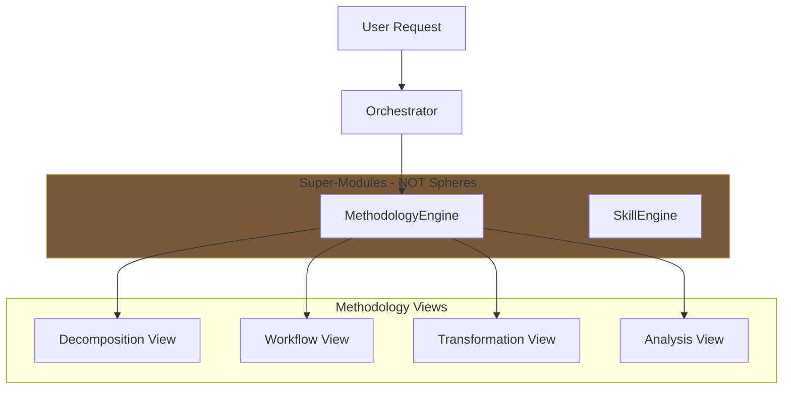
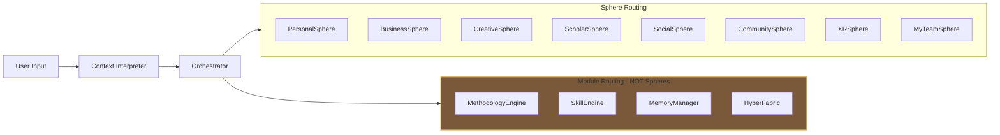
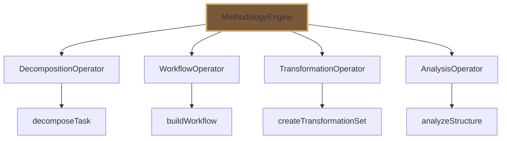
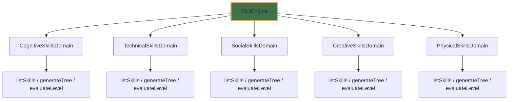

============================================================
CHE·NU — SYSTEM CORRECTION MASTER FILE
VERSION: 2.0.0
DATE: 2025-01-XX
============================================================

╔════════════════════════════════════════════════════════════╗
║  CONSOLIDATION AGENT INSTRUCTIONS                          ║
║  READ THIS SECTION FIRST                                   ║
╚════════════════════════════════════════════════════════════╝

EXECUTION ORDER FOR CONSOLIDATION:
----------------------------------
PHASE 1: REMOVALS (Execute First)
  1.1 → Remove "Methodology" from UniverseOS spheres
  1.2 → Remove Methodology from sphere diagrams
  1.3 → Remove any /methodology sphere page
  1.4 → Remove sphere routing for Methodology

PHASE 2: CORE MODULE CREATION
  2.1 → Create /che-nu-sdk/core/methodology.ts
  2.2 → Create /che-nu-sdk/core/methodology/ folder
  2.3 → Create methodology submodules (4 files)
  2.4 → Create /che-nu-sdk/core/skill/ folder
  2.5 → Create skill submodules (5 files)

PHASE 3: SCHEMA CREATION
  3.1 → Create /che-nu-sdk/schemas/methodology.schema.json
  3.2 → Update /che-nu-sdk/schemas/skill.schema.json

PHASE 4: SYSTEM INDEX UPDATES
  4.1 → Update /che-nu-sdk/system_index.json
  4.2 → Update /che-nu-sdk/docs/SYSTEM_INDEX.md

PHASE 5: ROUTING UPDATES
  5.1 → Update /che-nu-sdk/core/orchestrator.ts
  5.2 → Update /che-nu-sdk/core/context_interpreter.ts

PHASE 6: FRONTEND CREATION
  6.1 → Create /che-nu-frontend/pages/methodology.tsx
  6.2 → Create /che-nu-frontend/components/MethodologyViewer.tsx
  6.3 → Update /che-nu-frontend/components/WorkflowGrid.tsx

PHASE 7: DOCUMENTATION UPDATES
  7.1 → Update /che-nu-app/docs/UI_FLOW.md
  7.2 → Update /che-nu-sdk/docs/DIAGRAMS.md

PHASE 8: VERIFICATION
  8.1 → Verify no "Methodology" in sphere lists
  8.2 → Verify MethodologyEngine routing works
  8.3 → Verify all submodules export correctly

============================================================
CURRENT CHE·NU SPHERE LIST (CORRECTED)
============================================================

OFFICIAL SPHERES (8 total):
1. Personal
2. Business
3. Creative
4. Scholar
5. Social
6. Community
7. XR
8. MyTeam

NOT SPHERES (Super-Modules/Engines):
- MethodologyEngine ← CORRECTED
- SkillEngine
- MemoryManager
- ReplayEngine
- HyperFabric
- DepthLensSystem
- CartographyEngine
- ProjectionEngine
- KnowledgeEngine

============================================================
PHASE 1 — REMOVALS
============================================================

--- FILE: /che-nu-sdk/core/universe_os.ts
--- ACTION: REPLACE getRootSpheres() method
--- PRIORITY: 1.1

/**
 * Get root spheres for CHE·NU Universe
 * CORRECTED: Methodology is NOT a sphere
 */
getRootSpheres(): string[] {
  return [
    "Personal",
    "Business", 
    "Creative",
    "Scholar",
    "Social",
    "Community",
    "XR",
    "MyTeam"
  ];
  // NOTE: Methodology is a SUPER-MODULE, not a sphere
  // See MethodologyEngine in /che-nu-sdk/core/methodology.ts
}

============================================================
PHASE 2.1 — METHODOLOGY ENGINE (MAIN MODULE)
============================================================

--- FILE: /che-nu-sdk/core/methodology.ts
--- ACTION: CREATE NEW FILE
--- PRIORITY: 2.1

/**
 * CHE·NU SDK — Methodology Engine
 * ================================
 * SAFE · NON-AUTONOMOUS · REPRESENTATIONAL
 * 
 * CLASSIFICATION: SUPER-MODULE (NOT A SPHERE)
 * 
 * Provides system-wide operational tools:
 * - Task decomposition
 * - Workflow modeling
 * - Transformation operators
 * - Analysis operators
 * - Decision scaffolds
 * - Structural interpretation tools
 * 
 * @module MethodologyEngine
 * @version 1.0.0
 */

// ============================================================
// IMPORTS — SUBMODULES
// ============================================================

import { DecompositionOperator } from './methodology/operator.decomposition';
import { WorkflowOperator } from './methodology/operator.workflow';
import { TransformationOperator } from './methodology/operator.transformation';
import { AnalysisOperator } from './methodology/operator.analysis';

// ============================================================
// TYPES
// ============================================================

export interface TaskDecomposition {
  id: string;
  originalTask: string;
  steps: DecomposedStep[];
  dependencies: StepDependency[];
  meta: MethodologyMeta;
}

export interface DecomposedStep {
  id: string;
  order: number;
  name: string;
  description: string;
  type: 'action' | 'decision' | 'validation' | 'output';
  inputs: string[];
  outputs: string[];
  estimatedComplexity: 'low' | 'medium' | 'high';
}

export interface StepDependency {
  from: string;
  to: string;
  type: 'sequential' | 'parallel' | 'conditional';
}

export interface Workflow {
  id: string;
  name: string;
  description: string;
  nodes: WorkflowNode[];
  edges: WorkflowEdge[];
  entryPoint: string;
  exitPoints: string[];
  meta: MethodologyMeta;
}

export interface WorkflowNode {
  id: string;
  type: 'start' | 'end' | 'process' | 'decision' | 'fork' | 'join' | 'subprocess';
  label: string;
  data?: Record<string, unknown>;
}

export interface WorkflowEdge {
  id: string;
  source: string;
  target: string;
  label?: string;
  condition?: string;
}

export interface TransformationSet {
  id: string;
  name: string;
  transformations: Transformation[];
  meta: MethodologyMeta;
}

export interface Transformation {
  id: string;
  type: 'map' | 'filter' | 'reduce' | 'expand' | 'merge' | 'split' | 'convert';
  inputSchema: string;
  outputSchema: string;
  description: string;
}

export interface AnalysisScaffold {
  id: string;
  name: string;
  framework: string;
  dimensions: AnalysisDimension[];
  questions: AnalysisQuestion[];
  meta: MethodologyMeta;
}

export interface AnalysisDimension {
  id: string;
  name: string;
  weight: number;
  criteria: string[];
}

export interface AnalysisQuestion {
  id: string;
  dimension: string;
  question: string;
  responseType: 'scale' | 'boolean' | 'text' | 'choice';
  options?: string[];
}

export interface OperatorChoice {
  recommendedOperator: string;
  reasoning: string;
  alternatives: string[];
  confidence: number;
}

export interface MethodologyMeta {
  source: string;
  generated: string;
  version: string;
  moduleType: 'super_module';
  classification: 'not_a_sphere';
  safe: {
    isRepresentational: boolean;
    noAutonomy: boolean;
    noAgents: boolean;
    noPersistence: boolean;
  };
}

export interface MethodologyEngineConfig {
  maxSteps?: number;
  maxNodes?: number;
  enabledOperators?: string[];
}

// ============================================================
// METHODOLOGY ENGINE CLASS — SUPER-MODULE
// ============================================================

export class MethodologyEngine {
  private config: MethodologyEngineConfig;
  private readonly VERSION = '1.0.0';
  private readonly MODULE_TYPE = 'super_module';

  // Submodule instances
  private decomposition: DecompositionOperator;
  private workflow: WorkflowOperator;
  private transformation: TransformationOperator;
  private analysis: AnalysisOperator;

  constructor(config: MethodologyEngineConfig = {}) {
    this.config = {
      maxSteps: config.maxSteps || 50,
      maxNodes: config.maxNodes || 100,
      enabledOperators: config.enabledOperators || [
        'decomposition',
        'workflow',
        'transformation',
        'analysis',
      ],
    };

    // Initialize submodules
    this.decomposition = new DecompositionOperator();
    this.workflow = new WorkflowOperator();
    this.transformation = new TransformationOperator();
    this.analysis = new AnalysisOperator();
  }

  /**
   * Decompose a task into structured steps
   * SAFE: Returns representational structure only
   */
  decomposeTask(input: string | Record<string, unknown>): TaskDecomposition {
    const inputStr = typeof input === 'string' ? input : JSON.stringify(input);
    return this.decomposition.decompose(inputStr, this.createMeta(inputStr));
  }

  /**
   * Build a workflow from input
   * SAFE: Returns representational workflow structure
   */
  buildWorkflow(input: string | Record<string, unknown>): Workflow {
    const inputStr = typeof input === 'string' ? input : JSON.stringify(input);
    return this.workflow.build(inputStr, this.createMeta(inputStr));
  }

  /**
   * Generate transformation set
   * SAFE: Returns representational transformations
   */
  createTransformationSet(input: string | Record<string, unknown>): TransformationSet {
    const inputStr = typeof input === 'string' ? input : JSON.stringify(input);
    return this.transformation.create(inputStr, this.createMeta(inputStr));
  }

  /**
   * Analyze structure with scaffolding
   * SAFE: Returns representational analysis scaffold
   */
  analyzeStructure(input: string | Record<string, unknown>): AnalysisScaffold {
    const inputStr = typeof input === 'string' ? input : JSON.stringify(input);
    return this.analysis.analyze(inputStr, this.createMeta(inputStr));
  }

  /**
   * Choose the best operator for a given input
   * SAFE: Returns recommendation structure
   */
  chooseOperator(input: string | Record<string, unknown>): OperatorChoice {
    const inputStr = typeof input === 'string' ? input : JSON.stringify(input);
    const lowerInput = inputStr.toLowerCase();

    let recommended = 'decomposition';
    let reasoning = 'Default operator for general task structuring';
    const alternatives: string[] = [];

    if (lowerInput.includes('workflow') || lowerInput.includes('process') || lowerInput.includes('flow')) {
      recommended = 'workflow';
      reasoning = 'Input suggests process/flow modeling is needed';
      alternatives.push('decomposition', 'analysis');
    } else if (lowerInput.includes('transform') || lowerInput.includes('convert') || lowerInput.includes('map')) {
      recommended = 'transformation';
      reasoning = 'Input suggests data transformation is needed';
      alternatives.push('workflow');
    } else if (lowerInput.includes('analyze') || lowerInput.includes('evaluate') || lowerInput.includes('assess')) {
      recommended = 'analysis';
      reasoning = 'Input suggests analysis/evaluation is needed';
      alternatives.push('decomposition');
    } else {
      alternatives.push('workflow', 'analysis', 'transformation');
    }

    return {
      recommendedOperator: recommended,
      reasoning,
      alternatives,
      confidence: this.calculateConfidence(lowerInput, recommended),
    };
  }

  /**
   * Get available operators
   * SAFE: Static list
   */
  listOperators(): string[] {
    return [
      'decomposition',
      'workflow',
      'transformation',
      'analysis',
    ];
  }

  /**
   * Get engine metadata
   * SAFE: Static metadata only
   */
  meta(): Record<string, unknown> {
    return {
      name: 'MethodologyEngine',
      version: this.VERSION,
      description: 'System-wide operational tools super-module for CHE·NU',
      classification: {
        type: 'super_module',
        isNotASphere: true,
        category: 'operational_engine',
        similarTo: ['SkillEngine', 'MemoryManager', 'HyperFabric'],
      },
      safe: {
        isRepresentational: true,
        noAutonomy: true,
        noAgents: true,
        noExecution: true,
        noPersistentMemory: true,
        noLearning: true,
      },
      capabilities: [
        'decomposeTask',
        'buildWorkflow',
        'createTransformationSet',
        'analyzeStructure',
        'chooseOperator',
        'listOperators',
      ],
      submodules: [
        'operator.decomposition',
        'operator.workflow',
        'operator.transformation',
        'operator.analysis',
      ],
      config: this.config,
    };
  }

  // ============================================================
  // PRIVATE HELPERS
  // ============================================================

  private createMeta(source: string): MethodologyMeta {
    return {
      source,
      generated: new Date().toISOString(),
      version: this.VERSION,
      moduleType: 'super_module',
      classification: 'not_a_sphere',
      safe: {
        isRepresentational: true,
        noAutonomy: true,
        noAgents: true,
        noPersistence: true,
      },
    };
  }

  private calculateConfidence(input: string, operator: string): number {
    const keywords: Record<string, string[]> = {
      decomposition: ['task', 'break', 'steps', 'subtask', 'divide'],
      workflow: ['flow', 'process', 'sequence', 'pipeline', 'stages'],
      transformation: ['transform', 'convert', 'map', 'change', 'modify'],
      analysis: ['analyze', 'evaluate', 'assess', 'measure', 'compare'],
    };

    const matches = (keywords[operator] || []).filter(kw => input.includes(kw)).length;
    return Math.min(0.5 + matches * 0.15, 0.95);
  }
}

// ============================================================
// FACTORY FUNCTION
// ============================================================

export function createMethodologyEngine(config?: MethodologyEngineConfig): MethodologyEngine {
  return new MethodologyEngine(config);
}

export default MethodologyEngine;

============================================================
PHASE 2.2 — METHODOLOGY SUBMODULE: DECOMPOSITION
============================================================

--- FILE: /che-nu-sdk/core/methodology/operator.decomposition.ts
--- ACTION: CREATE NEW FILE
--- PRIORITY: 2.2

/**
 * CHE·NU SDK — Decomposition Operator
 * ====================================
 * SAFE · NON-AUTONOMOUS · REPRESENTATIONAL
 * 
 * Submodule of MethodologyEngine
 * Takes input → Returns decomposed steps
 * 
 * @module DecompositionOperator
 * @version 1.0.0
 */

import type { TaskDecomposition, DecomposedStep, StepDependency, MethodologyMeta } from '../methodology';

export class DecompositionOperator {
  private readonly VERSION = '1.0.0';

  /**
   * Decompose input into structured steps
   * SAFE: Representational output only
   */
  decompose(input: string, meta: MethodologyMeta): TaskDecomposition {
    const steps = this.generateSteps(input);
    const dependencies = this.inferDependencies(steps);

    return {
      id: `decomp-${Date.now()}`,
      originalTask: input,
      steps,
      dependencies,
      meta,
    };
  }

  /**
   * List decomposition strategies
   */
  listStrategies(): string[] {
    return [
      'sequential',      // Linear step-by-step
      'hierarchical',    // Tree structure
      'parallel',        // Concurrent branches
      'iterative',       // Loop-based
      'conditional',     // Decision-based
    ];
  }

  /**
   * Get operator metadata
   */
  meta(): Record<string, unknown> {
    return {
      name: 'DecompositionOperator',
      version: this.VERSION,
      parent: 'MethodologyEngine',
      type: 'submodule',
      safe: {
        isRepresentational: true,
        noAutonomy: true,
        noAgents: true,
      },
    };
  }

  // ============================================================
  // PRIVATE METHODS
  // ============================================================

  private generateSteps(input: string): DecomposedStep[] {
    const steps: DecomposedStep[] = [];
    const lowerInput = input.toLowerCase();

    // Identify key actions/verbs
    const actionPatterns = [
      { pattern: /analyze|study|examine/i, type: 'action' as const, name: 'Analysis' },
      { pattern: /decide|choose|select/i, type: 'decision' as const, name: 'Decision' },
      { pattern: /validate|verify|check/i, type: 'validation' as const, name: 'Validation' },
      { pattern: /create|generate|produce|output/i, type: 'output' as const, name: 'Output Generation' },
      { pattern: /plan|design|architect/i, type: 'action' as const, name: 'Planning' },
      { pattern: /implement|build|develop/i, type: 'action' as const, name: 'Implementation' },
      { pattern: /test|review|assess/i, type: 'validation' as const, name: 'Testing' },
    ];

    let stepId = 0;

    // Always start with initialization
    stepId++;
    steps.push({
      id: `step-${String(stepId).padStart(3, '0')}`,
      order: stepId,
      name: 'Initialize',
      description: 'Gather requirements and prepare context',
      type: 'action',
      inputs: ['task_definition'],
      outputs: ['context', 'requirements'],
      estimatedComplexity: 'low',
    });

    // Add steps based on patterns found
    for (const { pattern, type, name } of actionPatterns) {
      if (pattern.test(lowerInput)) {
        stepId++;
        steps.push({
          id: `step-${String(stepId).padStart(3, '0')}`,
          order: stepId,
          name,
          description: `${name} phase for the task`,
          type,
          inputs: steps[steps.length - 1]?.outputs || ['input'],
          outputs: [`${name.toLowerCase().replace(' ', '_')}_result`],
          estimatedComplexity: type === 'decision' ? 'high' : 'medium',
        });
      }
    }

    // If no patterns matched, add generic steps
    if (steps.length === 1) {
      stepId++;
      steps.push({
        id: `step-${String(stepId).padStart(3, '0')}`,
        order: stepId,
        name: 'Process',
        description: 'Main processing step',
        type: 'action',
        inputs: ['context'],
        outputs: ['processed_data'],
        estimatedComplexity: 'medium',
      });
    }

    // Always end with finalization
    stepId++;
    steps.push({
      id: `step-${String(stepId).padStart(3, '0')}`,
      order: stepId,
      name: 'Finalize',
      description: 'Complete task and prepare output',
      type: 'output',
      inputs: steps[steps.length - 1]?.outputs || ['result'],
      outputs: ['final_output'],
      estimatedComplexity: 'low',
    });

    return steps;
  }

  private inferDependencies(steps: DecomposedStep[]): StepDependency[] {
    const dependencies: StepDependency[] = [];

    for (let i = 0; i < steps.length - 1; i++) {
      dependencies.push({
        from: steps[i].id,
        to: steps[i + 1].id,
        type: steps[i].type === 'decision' ? 'conditional' : 'sequential',
      });
    }

    return dependencies;
  }
}

export default DecompositionOperator;

============================================================
PHASE 2.3 — METHODOLOGY SUBMODULE: WORKFLOW
============================================================

--- FILE: /che-nu-sdk/core/methodology/operator.workflow.ts
--- ACTION: CREATE NEW FILE
--- PRIORITY: 2.3

/**
 * CHE·NU SDK — Workflow Operator
 * ===============================
 * SAFE · NON-AUTONOMOUS · REPRESENTATIONAL
 * 
 * Submodule of MethodologyEngine
 * Creates workflow trees and process models
 * 
 * @module WorkflowOperator
 * @version 1.0.0
 */

import type { Workflow, WorkflowNode, WorkflowEdge, MethodologyMeta } from '../methodology';

export class WorkflowOperator {
  private readonly VERSION = '1.0.0';

  /**
   * Build workflow from input
   * SAFE: Representational output only
   */
  build(input: string, meta: MethodologyMeta): Workflow {
    const nodes = this.generateNodes(input);
    const edges = this.generateEdges(nodes);
    const entryPoint = nodes.find(n => n.type === 'start')?.id || nodes[0].id;
    const exitPoints = nodes.filter(n => n.type === 'end').map(n => n.id);

    return {
      id: `workflow-${Date.now()}`,
      name: this.extractWorkflowName(input),
      description: `Workflow generated from: ${input.substring(0, 50)}...`,
      nodes,
      edges,
      entryPoint,
      exitPoints: exitPoints.length > 0 ? exitPoints : [nodes[nodes.length - 1].id],
      meta,
    };
  }

  /**
   * List workflow patterns
   */
  listPatterns(): string[] {
    return [
      'linear',          // A → B → C
      'branching',       // A → (B | C) → D
      'parallel',        // A → [B, C] → D
      'loop',            // A → B → A (with condition)
      'state-machine',   // Multiple states with transitions
    ];
  }

  /**
   * Get operator metadata
   */
  meta(): Record<string, unknown> {
    return {
      name: 'WorkflowOperator',
      version: this.VERSION,
      parent: 'MethodologyEngine',
      type: 'submodule',
      safe: {
        isRepresentational: true,
        noAutonomy: true,
        noAgents: true,
      },
    };
  }

  // ============================================================
  // PRIVATE METHODS
  // ============================================================

  private generateNodes(input: string): WorkflowNode[] {
    const nodes: WorkflowNode[] = [];
    const lowerInput = input.toLowerCase();
    let nodeId = 0;

    // Start node
    nodeId++;
    nodes.push({
      id: `node-${String(nodeId).padStart(3, '0')}`,
      type: 'start',
      label: 'Start',
    });

    // Detect process steps
    const processKeywords = [
      { keyword: 'input', label: 'Receive Input' },
      { keyword: 'process', label: 'Process Data' },
      { keyword: 'validate', label: 'Validate' },
      { keyword: 'transform', label: 'Transform' },
      { keyword: 'analyze', label: 'Analyze' },
      { keyword: 'decide', label: 'Decision Point' },
      { keyword: 'output', label: 'Generate Output' },
    ];

    for (const { keyword, label } of processKeywords) {
      if (lowerInput.includes(keyword)) {
        nodeId++;
        nodes.push({
          id: `node-${String(nodeId).padStart(3, '0')}`,
          type: keyword === 'decide' ? 'decision' : 'process',
          label,
        });
      }
    }

    // If no keywords matched, add generic process
    if (nodes.length === 1) {
      nodeId++;
      nodes.push({
        id: `node-${String(nodeId).padStart(3, '0')}`,
        type: 'process',
        label: 'Main Process',
      });
    }

    // End node
    nodeId++;
    nodes.push({
      id: `node-${String(nodeId).padStart(3, '0')}`,
      type: 'end',
      label: 'End',
    });

    return nodes;
  }

  private generateEdges(nodes: WorkflowNode[]): WorkflowEdge[] {
    const edges: WorkflowEdge[] = [];

    for (let i = 0; i < nodes.length - 1; i++) {
      const currentNode = nodes[i];
      const nextNode = nodes[i + 1];

      if (currentNode.type === 'decision') {
        // Decision nodes have multiple outgoing edges
        edges.push({
          id: `edge-${i}-yes`,
          source: currentNode.id,
          target: nextNode.id,
          label: 'Yes',
          condition: 'condition === true',
        });

        // Add a "No" path if there's a subsequent node
        if (i + 2 < nodes.length) {
          edges.push({
            id: `edge-${i}-no`,
            source: currentNode.id,
            target: nodes[i + 2].id,
            label: 'No',
            condition: 'condition === false',
          });
        }
      } else {
        edges.push({
          id: `edge-${i}`,
          source: currentNode.id,
          target: nextNode.id,
        });
      }
    }

    return edges;
  }

  private extractWorkflowName(input: string): string {
    const words = input.split(' ').slice(0, 5).join(' ');
    return `Workflow: ${words}${input.length > words.length ? '...' : ''}`;
  }
}

export default WorkflowOperator;

============================================================
PHASE 2.4 — METHODOLOGY SUBMODULE: TRANSFORMATION
============================================================

--- FILE: /che-nu-sdk/core/methodology/operator.transformation.ts
--- ACTION: CREATE NEW FILE
--- PRIORITY: 2.4

/**
 * CHE·NU SDK — Transformation Operator
 * =====================================
 * SAFE · NON-AUTONOMOUS · REPRESENTATIONAL
 * 
 * Submodule of MethodologyEngine
 * Returns representational transformation sets
 * 
 * @module TransformationOperator
 * @version 1.0.0
 */

import type { TransformationSet, Transformation, MethodologyMeta } from '../methodology';

export class TransformationOperator {
  private readonly VERSION = '1.0.0';

  /**
   * Create transformation set from input
   * SAFE: Representational output only
   */
  create(input: string, meta: MethodologyMeta): TransformationSet {
    const transformations = this.generateTransformations(input);

    return {
      id: `transform-${Date.now()}`,
      name: `Transformation Set: ${input.substring(0, 30)}...`,
      transformations,
      meta,
    };
  }

  /**
   * List available transformation types
   */
  listTypes(): Transformation['type'][] {
    return ['map', 'filter', 'reduce', 'expand', 'merge', 'split', 'convert'];
  }

  /**
   * Get operator metadata
   */
  meta(): Record<string, unknown> {
    return {
      name: 'TransformationOperator',
      version: this.VERSION,
      parent: 'MethodologyEngine',
      type: 'submodule',
      safe: {
        isRepresentational: true,
        noAutonomy: true,
        noAgents: true,
      },
    };
  }

  // ============================================================
  // PRIVATE METHODS
  // ============================================================

  private generateTransformations(input: string): Transformation[] {
    const transformations: Transformation[] = [];
    const lowerInput = input.toLowerCase();
    let transformId = 0;

    const typePatterns: Array<{ pattern: RegExp; type: Transformation['type']; desc: string }> = [
      { pattern: /map|apply|each/i, type: 'map', desc: 'Apply function to each element' },
      { pattern: /filter|select|where/i, type: 'filter', desc: 'Filter elements by condition' },
      { pattern: /reduce|aggregate|sum|total/i, type: 'reduce', desc: 'Aggregate elements into single value' },
      { pattern: /expand|flatten|spread/i, type: 'expand', desc: 'Expand nested structures' },
      { pattern: /merge|combine|join/i, type: 'merge', desc: 'Merge multiple sources' },
      { pattern: /split|divide|partition/i, type: 'split', desc: 'Split into multiple outputs' },
      { pattern: /convert|transform|change/i, type: 'convert', desc: 'Convert between formats' },
    ];

    for (const { pattern, type, desc } of typePatterns) {
      if (pattern.test(lowerInput)) {
        transformId++;
        transformations.push({
          id: `t-${String(transformId).padStart(3, '0')}`,
          type,
          inputSchema: 'input_schema',
          outputSchema: 'output_schema',
          description: desc,
        });
      }
    }

    // Default transformation if none matched
    if (transformations.length === 0) {
      transformations.push({
        id: 't-001',
        type: 'convert',
        inputSchema: 'raw_input',
        outputSchema: 'processed_output',
        description: 'General conversion transformation',
      });
    }

    return transformations;
  }
}

export default TransformationOperator;

============================================================
PHASE 2.5 — METHODOLOGY SUBMODULE: ANALYSIS
============================================================

--- FILE: /che-nu-sdk/core/methodology/operator.analysis.ts
--- ACTION: CREATE NEW FILE
--- PRIORITY: 2.5

/**
 * CHE·NU SDK — Analysis Operator
 * ===============================
 * SAFE · NON-AUTONOMOUS · REPRESENTATIONAL
 * 
 * Submodule of MethodologyEngine
 * Returns representational analysis scaffolds
 * 
 * @module AnalysisOperator
 * @version 1.0.0
 */

import type { AnalysisScaffold, AnalysisDimension, AnalysisQuestion, MethodologyMeta } from '../methodology';

export class AnalysisOperator {
  private readonly VERSION = '1.0.0';

  /**
   * Analyze structure and create scaffold
   * SAFE: Representational output only
   */
  analyze(input: string, meta: MethodologyMeta): AnalysisScaffold {
    const framework = this.selectFramework(input);
    const dimensions = this.generateDimensions(input, framework);
    const questions = this.generateQuestions(dimensions);

    return {
      id: `analysis-${Date.now()}`,
      name: `Analysis: ${input.substring(0, 30)}...`,
      framework,
      dimensions,
      questions,
      meta,
    };
  }

  /**
   * List available analysis frameworks
   */
  listFrameworks(): string[] {
    return [
      'SWOT',              // Strengths, Weaknesses, Opportunities, Threats
      'PESTLE',            // Political, Economic, Social, Technological, Legal, Environmental
      'Five Forces',       // Porter's competitive analysis
      'Value Chain',       // Process value analysis
      'Root Cause',        // Problem analysis
      'Cost-Benefit',      // Economic analysis
      'Risk Assessment',   // Risk analysis
      'Gap Analysis',      // Current vs desired state
    ];
  }

  /**
   * Get operator metadata
   */
  meta(): Record<string, unknown> {
    return {
      name: 'AnalysisOperator',
      version: this.VERSION,
      parent: 'MethodologyEngine',
      type: 'submodule',
      safe: {
        isRepresentational: true,
        noAutonomy: true,
        noAgents: true,
      },
    };
  }

  // ============================================================
  // PRIVATE METHODS
  // ============================================================

  private selectFramework(input: string): string {
    const lowerInput = input.toLowerCase();

    if (lowerInput.includes('strength') || lowerInput.includes('weakness')) return 'SWOT';
    if (lowerInput.includes('market') || lowerInput.includes('competition')) return 'Five Forces';
    if (lowerInput.includes('risk')) return 'Risk Assessment';
    if (lowerInput.includes('cost') || lowerInput.includes('benefit')) return 'Cost-Benefit';
    if (lowerInput.includes('cause') || lowerInput.includes('problem')) return 'Root Cause';
    if (lowerInput.includes('gap') || lowerInput.includes('current') || lowerInput.includes('desired')) return 'Gap Analysis';

    return 'SWOT'; // Default
  }

  private generateDimensions(input: string, framework: string): AnalysisDimension[] {
    const frameworkDimensions: Record<string, Array<{ name: string; criteria: string[] }>> = {
      'SWOT': [
        { name: 'Strengths', criteria: ['internal', 'positive', 'advantage'] },
        { name: 'Weaknesses', criteria: ['internal', 'negative', 'disadvantage'] },
        { name: 'Opportunities', criteria: ['external', 'positive', 'potential'] },
        { name: 'Threats', criteria: ['external', 'negative', 'risk'] },
      ],
      'Five Forces': [
        { name: 'Supplier Power', criteria: ['bargaining', 'dependency', 'alternatives'] },
        { name: 'Buyer Power', criteria: ['customer', 'choice', 'switching'] },
        { name: 'Competitive Rivalry', criteria: ['competitors', 'market share', 'differentiation'] },
        { name: 'Threat of Substitution', criteria: ['alternatives', 'replacement', 'innovation'] },
        { name: 'Threat of New Entry', criteria: ['barriers', 'capital', 'regulation'] },
      ],
      'Risk Assessment': [
        { name: 'Probability', criteria: ['likelihood', 'frequency', 'occurrence'] },
        { name: 'Impact', criteria: ['severity', 'consequence', 'damage'] },
        { name: 'Detectability', criteria: ['monitoring', 'warning', 'visibility'] },
        { name: 'Mitigation', criteria: ['controls', 'prevention', 'response'] },
      ],
      'Gap Analysis': [
        { name: 'Current State', criteria: ['baseline', 'existing', 'present'] },
        { name: 'Desired State', criteria: ['target', 'goal', 'future'] },
        { name: 'Gap Size', criteria: ['difference', 'distance', 'delta'] },
        { name: 'Action Plan', criteria: ['steps', 'timeline', 'resources'] },
      ],
    };

    const dims = frameworkDimensions[framework] || frameworkDimensions['SWOT'];
    const totalWeight = 1 / dims.length;

    return dims.map((d, idx) => ({
      id: `dim-${String(idx + 1).padStart(2, '0')}`,
      name: d.name,
      weight: Math.round(totalWeight * 100) / 100,
      criteria: d.criteria,
    }));
  }

  private generateQuestions(dimensions: AnalysisDimension[]): AnalysisQuestion[] {
    const questions: AnalysisQuestion[] = [];
    let qId = 0;

    for (const dim of dimensions) {
      qId++;
      questions.push({
        id: `q-${String(qId).padStart(3, '0')}`,
        dimension: dim.id,
        question: `How would you rate the ${dim.name.toLowerCase()}?`,
        responseType: 'scale',
        options: ['1', '2', '3', '4', '5'],
      });

      qId++;
      questions.push({
        id: `q-${String(qId).padStart(3, '0')}`,
        dimension: dim.id,
        question: `Describe key factors for ${dim.name.toLowerCase()}:`,
        responseType: 'text',
      });
    }

    return questions;
  }
}

export default AnalysisOperator;

============================================================
PHASE 2.6 — METHODOLOGY SUBMODULE: INDEX
============================================================

--- FILE: /che-nu-sdk/core/methodology/index.ts
--- ACTION: CREATE NEW FILE
--- PRIORITY: 2.6

/**
 * CHE·NU SDK — Methodology Submodules Index
 * ==========================================
 * Exports all methodology operators
 */

export { DecompositionOperator } from './operator.decomposition';
export { WorkflowOperator } from './operator.workflow';
export { TransformationOperator } from './operator.transformation';
export { AnalysisOperator } from './operator.analysis';

============================================================
PHASE 2.7 — SKILL SUBMODULE: COGNITIVE
============================================================

--- FILE: /che-nu-sdk/core/skill/domain.cognitive.ts
--- ACTION: CREATE NEW FILE
--- PRIORITY: 2.7

/**
 * CHE·NU SDK — Cognitive Skills Domain
 * =====================================
 * SAFE · NON-AUTONOMOUS · REPRESENTATIONAL
 * 
 * Submodule of SkillEngine
 * 
 * @module CognitiveSkillsDomain
 * @version 1.0.0
 */

export interface CognitiveSkill {
  id: string;
  name: string;
  category: 'reasoning' | 'memory' | 'attention' | 'perception' | 'language' | 'executive';
  description: string;
  subskills?: string[];
}

export interface CognitiveTree {
  rootId: string;
  nodes: CognitiveSkill[];
  edges: Array<{ source: string; target: string; type: string }>;
}

export interface CognitiveEvaluation {
  skillId: string;
  level: 'developing' | 'functional' | 'proficient' | 'advanced' | 'exceptional';
  score: number;
  indicators: string[];
}

export class CognitiveSkillsDomain {
  private readonly VERSION = '1.0.0';
  private readonly DOMAIN = 'cognitive';

  /**
   * List cognitive skills
   */
  listSkills(): CognitiveSkill[] {
    return [
      {
        id: 'cog-001',
        name: 'Critical Thinking',
        category: 'reasoning',
        description: 'Ability to analyze and evaluate information objectively',
        subskills: ['analysis', 'evaluation', 'inference', 'interpretation'],
      },
      {
        id: 'cog-002',
        name: 'Problem Solving',
        category: 'reasoning',
        description: 'Ability to find solutions to complex challenges',
        subskills: ['identification', 'strategy', 'implementation', 'verification'],
      },
      {
        id: 'cog-003',
        name: 'Working Memory',
        category: 'memory',
        description: 'Ability to hold and manipulate information temporarily',
        subskills: ['retention', 'manipulation', 'retrieval'],
      },
      {
        id: 'cog-004',
        name: 'Focused Attention',
        category: 'attention',
        description: 'Ability to concentrate on specific stimuli',
        subskills: ['sustained', 'selective', 'divided', 'alternating'],
      },
      {
        id: 'cog-005',
        name: 'Pattern Recognition',
        category: 'perception',
        description: 'Ability to identify patterns and regularities',
        subskills: ['visual', 'auditory', 'abstract'],
      },
      {
        id: 'cog-006',
        name: 'Decision Making',
        category: 'executive',
        description: 'Ability to choose between alternatives effectively',
        subskills: ['evaluation', 'risk-assessment', 'commitment'],
      },
    ];
  }

  /**
   * Generate cognitive skill tree
   */
  generateTree(input?: string): CognitiveTree {
    const skills = this.listSkills();
    const edges: Array<{ source: string; target: string; type: string }> = [];

    // Create hierarchical connections
    edges.push({ source: 'cog-001', target: 'cog-002', type: 'enables' });
    edges.push({ source: 'cog-003', target: 'cog-001', type: 'supports' });
    edges.push({ source: 'cog-004', target: 'cog-003', type: 'enables' });
    edges.push({ source: 'cog-005', target: 'cog-001', type: 'supports' });
    edges.push({ source: 'cog-001', target: 'cog-006', type: 'enables' });

    return {
      rootId: 'cog-004', // Attention is foundational
      nodes: skills,
      edges,
    };
  }

  /**
   * Evaluate cognitive skill level
   */
  evaluateLevel(skillId: string, score: number): CognitiveEvaluation {
    let level: CognitiveEvaluation['level'] = 'developing';
    if (score >= 90) level = 'exceptional';
    else if (score >= 75) level = 'advanced';
    else if (score >= 60) level = 'proficient';
    else if (score >= 40) level = 'functional';

    const skill = this.listSkills().find(s => s.id === skillId);

    return {
      skillId,
      level,
      score,
      indicators: skill?.subskills || [],
    };
  }

  /**
   * Get domain metadata
   */
  meta(): Record<string, unknown> {
    return {
      name: 'CognitiveSkillsDomain',
      version: this.VERSION,
      domain: this.DOMAIN,
      parent: 'SkillEngine',
      type: 'submodule',
      skillCount: this.listSkills().length,
    };
  }
}

export default CognitiveSkillsDomain;

============================================================
PHASE 2.8 — SKILL SUBMODULE: TECHNICAL
============================================================

--- FILE: /che-nu-sdk/core/skill/domain.technical.ts
--- ACTION: CREATE NEW FILE
--- PRIORITY: 2.8

/**
 * CHE·NU SDK — Technical Skills Domain
 * =====================================
 * SAFE · NON-AUTONOMOUS · REPRESENTATIONAL
 * 
 * @module TechnicalSkillsDomain
 * @version 1.0.0
 */

export interface TechnicalSkill {
  id: string;
  name: string;
  category: 'programming' | 'systems' | 'data' | 'security' | 'devops' | 'architecture';
  description: string;
  technologies?: string[];
}

export interface TechnicalTree {
  rootId: string;
  nodes: TechnicalSkill[];
  edges: Array<{ source: string; target: string; type: string }>;
}

export interface TechnicalEvaluation {
  skillId: string;
  level: 'beginner' | 'intermediate' | 'advanced' | 'expert' | 'master';
  score: number;
  proficiencies: string[];
}

export class TechnicalSkillsDomain {
  private readonly VERSION = '1.0.0';
  private readonly DOMAIN = 'technical';

  listSkills(): TechnicalSkill[] {
    return [
      {
        id: 'tech-001',
        name: 'Programming',
        category: 'programming',
        description: 'Software development and coding skills',
        technologies: ['JavaScript', 'TypeScript', 'Python', 'Go', 'Rust'],
      },
      {
        id: 'tech-002',
        name: 'System Design',
        category: 'architecture',
        description: 'Designing scalable and maintainable systems',
        technologies: ['microservices', 'monolith', 'serverless', 'event-driven'],
      },
      {
        id: 'tech-003',
        name: 'Database Management',
        category: 'data',
        description: 'Data storage, retrieval, and optimization',
        technologies: ['PostgreSQL', 'MongoDB', 'Redis', 'Elasticsearch'],
      },
      {
        id: 'tech-004',
        name: 'DevOps',
        category: 'devops',
        description: 'CI/CD, infrastructure, and deployment',
        technologies: ['Docker', 'Kubernetes', 'Terraform', 'GitHub Actions'],
      },
      {
        id: 'tech-005',
        name: 'Security',
        category: 'security',
        description: 'Application and infrastructure security',
        technologies: ['OAuth', 'encryption', 'penetration testing', 'compliance'],
      },
      {
        id: 'tech-006',
        name: 'API Development',
        category: 'systems',
        description: 'REST, GraphQL, and API design',
        technologies: ['REST', 'GraphQL', 'gRPC', 'WebSocket'],
      },
    ];
  }

  generateTree(input?: string): TechnicalTree {
    const skills = this.listSkills();
    const edges = [
      { source: 'tech-001', target: 'tech-002', type: 'enables' },
      { source: 'tech-001', target: 'tech-003', type: 'enables' },
      { source: 'tech-001', target: 'tech-006', type: 'enables' },
      { source: 'tech-002', target: 'tech-004', type: 'enables' },
      { source: 'tech-004', target: 'tech-005', type: 'enables' },
    ];

    return { rootId: 'tech-001', nodes: skills, edges };
  }

  evaluateLevel(skillId: string, score: number): TechnicalEvaluation {
    let level: TechnicalEvaluation['level'] = 'beginner';
    if (score >= 95) level = 'master';
    else if (score >= 85) level = 'expert';
    else if (score >= 70) level = 'advanced';
    else if (score >= 50) level = 'intermediate';

    const skill = this.listSkills().find(s => s.id === skillId);

    return {
      skillId,
      level,
      score,
      proficiencies: skill?.technologies || [],
    };
  }

  meta(): Record<string, unknown> {
    return {
      name: 'TechnicalSkillsDomain',
      version: this.VERSION,
      domain: this.DOMAIN,
      parent: 'SkillEngine',
      type: 'submodule',
    };
  }
}

export default TechnicalSkillsDomain;

============================================================
PHASE 2.9 — SKILL SUBMODULE: SOCIAL
============================================================

--- FILE: /che-nu-sdk/core/skill/domain.social.ts
--- ACTION: CREATE NEW FILE
--- PRIORITY: 2.9

/**
 * CHE·NU SDK — Social Skills Domain
 * ==================================
 * SAFE · NON-AUTONOMOUS · REPRESENTATIONAL
 * 
 * @module SocialSkillsDomain
 * @version 1.0.0
 */

export interface SocialSkill {
  id: string;
  name: string;
  category: 'communication' | 'collaboration' | 'leadership' | 'emotional' | 'conflict';
  description: string;
  components?: string[];
}

export interface SocialTree {
  rootId: string;
  nodes: SocialSkill[];
  edges: Array<{ source: string; target: string; type: string }>;
}

export interface SocialEvaluation {
  skillId: string;
  level: 'emerging' | 'developing' | 'competent' | 'proficient' | 'exemplary';
  score: number;
  strengths: string[];
}

export class SocialSkillsDomain {
  private readonly VERSION = '1.0.0';
  private readonly DOMAIN = 'social';

  listSkills(): SocialSkill[] {
    return [
      {
        id: 'soc-001',
        name: 'Verbal Communication',
        category: 'communication',
        description: 'Expressing ideas clearly through speech',
        components: ['clarity', 'articulation', 'persuasion', 'listening'],
      },
      {
        id: 'soc-002',
        name: 'Written Communication',
        category: 'communication',
        description: 'Expressing ideas clearly in writing',
        components: ['clarity', 'structure', 'tone', 'grammar'],
      },
      {
        id: 'soc-003',
        name: 'Teamwork',
        category: 'collaboration',
        description: 'Working effectively with others',
        components: ['cooperation', 'coordination', 'support', 'flexibility'],
      },
      {
        id: 'soc-004',
        name: 'Leadership',
        category: 'leadership',
        description: 'Guiding and inspiring others',
        components: ['vision', 'delegation', 'motivation', 'accountability'],
      },
      {
        id: 'soc-005',
        name: 'Emotional Intelligence',
        category: 'emotional',
        description: 'Understanding and managing emotions',
        components: ['self-awareness', 'empathy', 'regulation', 'social-skills'],
      },
      {
        id: 'soc-006',
        name: 'Conflict Resolution',
        category: 'conflict',
        description: 'Resolving disagreements constructively',
        components: ['mediation', 'negotiation', 'compromise', 'de-escalation'],
      },
    ];
  }

  generateTree(input?: string): SocialTree {
    const skills = this.listSkills();
    const edges = [
      { source: 'soc-005', target: 'soc-001', type: 'enables' },
      { source: 'soc-005', target: 'soc-003', type: 'enables' },
      { source: 'soc-001', target: 'soc-004', type: 'enables' },
      { source: 'soc-003', target: 'soc-004', type: 'enables' },
      { source: 'soc-005', target: 'soc-006', type: 'enables' },
    ];

    return { rootId: 'soc-005', nodes: skills, edges };
  }

  evaluateLevel(skillId: string, score: number): SocialEvaluation {
    let level: SocialEvaluation['level'] = 'emerging';
    if (score >= 90) level = 'exemplary';
    else if (score >= 75) level = 'proficient';
    else if (score >= 60) level = 'competent';
    else if (score >= 40) level = 'developing';

    const skill = this.listSkills().find(s => s.id === skillId);

    return {
      skillId,
      level,
      score,
      strengths: skill?.components || [],
    };
  }

  meta(): Record<string, unknown> {
    return {
      name: 'SocialSkillsDomain',
      version: this.VERSION,
      domain: this.DOMAIN,
      parent: 'SkillEngine',
      type: 'submodule',
    };
  }
}

export default SocialSkillsDomain;

============================================================
PHASE 2.10 — SKILL SUBMODULE: CREATIVE
============================================================

--- FILE: /che-nu-sdk/core/skill/domain.creative.ts
--- ACTION: CREATE NEW FILE
--- PRIORITY: 2.10

/**
 * CHE·NU SDK — Creative Skills Domain
 * ====================================
 * SAFE · NON-AUTONOMOUS · REPRESENTATIONAL
 * 
 * @module CreativeSkillsDomain
 * @version 1.0.0
 */

export interface CreativeSkill {
  id: string;
  name: string;
  category: 'ideation' | 'design' | 'artistic' | 'writing' | 'innovation';
  description: string;
  expressions?: string[];
}

export interface CreativeTree {
  rootId: string;
  nodes: CreativeSkill[];
  edges: Array<{ source: string; target: string; type: string }>;
}

export interface CreativeEvaluation {
  skillId: string;
  level: 'novice' | 'apprentice' | 'journeyman' | 'artisan' | 'virtuoso';
  score: number;
  medium: string[];
}

export class CreativeSkillsDomain {
  private readonly VERSION = '1.0.0';
  private readonly DOMAIN = 'creative';

  listSkills(): CreativeSkill[] {
    return [
      {
        id: 'cre-001',
        name: 'Ideation',
        category: 'ideation',
        description: 'Generating original ideas and concepts',
        expressions: ['brainstorming', 'mind-mapping', 'lateral-thinking'],
      },
      {
        id: 'cre-002',
        name: 'Visual Design',
        category: 'design',
        description: 'Creating visual compositions and layouts',
        expressions: ['UI/UX', 'graphic-design', 'illustration', 'typography'],
      },
      {
        id: 'cre-003',
        name: 'Storytelling',
        category: 'writing',
        description: 'Crafting compelling narratives',
        expressions: ['fiction', 'non-fiction', 'screenplay', 'copywriting'],
      },
      {
        id: 'cre-004',
        name: 'Musical Expression',
        category: 'artistic',
        description: 'Creating and performing music',
        expressions: ['composition', 'performance', 'production', 'improvisation'],
      },
      {
        id: 'cre-005',
        name: 'Innovation',
        category: 'innovation',
        description: 'Applying creativity to solve problems',
        expressions: ['invention', 'improvement', 'disruption', 'synthesis'],
      },
      {
        id: 'cre-006',
        name: '3D Design',
        category: 'design',
        description: 'Creating three-dimensional models and environments',
        expressions: ['modeling', 'sculpting', 'animation', 'rendering'],
      },
    ];
  }

  generateTree(input?: string): CreativeTree {
    const skills = this.listSkills();
    const edges = [
      { source: 'cre-001', target: 'cre-002', type: 'enables' },
      { source: 'cre-001', target: 'cre-003', type: 'enables' },
      { source: 'cre-001', target: 'cre-005', type: 'enables' },
      { source: 'cre-002', target: 'cre-006', type: 'enables' },
    ];

    return { rootId: 'cre-001', nodes: skills, edges };
  }

  evaluateLevel(skillId: string, score: number): CreativeEvaluation {
    let level: CreativeEvaluation['level'] = 'novice';
    if (score >= 95) level = 'virtuoso';
    else if (score >= 80) level = 'artisan';
    else if (score >= 60) level = 'journeyman';
    else if (score >= 40) level = 'apprentice';

    const skill = this.listSkills().find(s => s.id === skillId);

    return {
      skillId,
      level,
      score,
      medium: skill?.expressions || [],
    };
  }

  meta(): Record<string, unknown> {
    return {
      name: 'CreativeSkillsDomain',
      version: this.VERSION,
      domain: this.DOMAIN,
      parent: 'SkillEngine',
      type: 'submodule',
    };
  }
}

export default CreativeSkillsDomain;

============================================================
PHASE 2.11 — SKILL SUBMODULE: PHYSICAL
============================================================

--- FILE: /che-nu-sdk/core/skill/domain.physical.ts
--- ACTION: CREATE NEW FILE
--- PRIORITY: 2.11

/**
 * CHE·NU SDK — Physical Skills Domain
 * ====================================
 * SAFE · NON-AUTONOMOUS · REPRESENTATIONAL
 * 
 * @module PhysicalSkillsDomain
 * @version 1.0.0
 */

export interface PhysicalSkill {
  id: string;
  name: string;
  category: 'strength' | 'endurance' | 'flexibility' | 'coordination' | 'motor';
  description: string;
  activities?: string[];
}

export interface PhysicalTree {
  rootId: string;
  nodes: PhysicalSkill[];
  edges: Array<{ source: string; target: string; type: string }>;
}

export interface PhysicalEvaluation {
  skillId: string;
  level: 'beginner' | 'intermediate' | 'advanced' | 'athlete' | 'elite';
  score: number;
  metrics: string[];
}

export class PhysicalSkillsDomain {
  private readonly VERSION = '1.0.0';
  private readonly DOMAIN = 'physical';

  listSkills(): PhysicalSkill[] {
    return [
      {
        id: 'phy-001',
        name: 'Muscular Strength',
        category: 'strength',
        description: 'Force production capabilities',
        activities: ['weightlifting', 'resistance-training', 'bodyweight'],
      },
      {
        id: 'phy-002',
        name: 'Cardiovascular Endurance',
        category: 'endurance',
        description: 'Sustained aerobic performance',
        activities: ['running', 'cycling', 'swimming', 'rowing'],
      },
      {
        id: 'phy-003',
        name: 'Flexibility',
        category: 'flexibility',
        description: 'Range of motion and mobility',
        activities: ['stretching', 'yoga', 'mobility-work'],
      },
      {
        id: 'phy-004',
        name: 'Balance & Coordination',
        category: 'coordination',
        description: 'Body control and stability',
        activities: ['gymnastics', 'martial-arts', 'dance', 'sports'],
      },
      {
        id: 'phy-005',
        name: 'Fine Motor Skills',
        category: 'motor',
        description: 'Precise hand and finger movements',
        activities: ['typing', 'instrument-playing', 'crafting', 'surgery'],
      },
      {
        id: 'phy-006',
        name: 'Reaction Time',
        category: 'motor',
        description: 'Speed of response to stimuli',
        activities: ['sports', 'gaming', 'driving', 'combat'],
      },
    ];
  }

  generateTree(input?: string): PhysicalTree {
    const skills = this.listSkills();
    const edges = [
      { source: 'phy-001', target: 'phy-002', type: 'complements' },
      { source: 'phy-003', target: 'phy-004', type: 'enables' },
      { source: 'phy-004', target: 'phy-005', type: 'enables' },
      { source: 'phy-004', target: 'phy-006', type: 'enables' },
    ];

    return { rootId: 'phy-001', nodes: skills, edges };
  }

  evaluateLevel(skillId: string, score: number): PhysicalEvaluation {
    let level: PhysicalEvaluation['level'] = 'beginner';
    if (score >= 95) level = 'elite';
    else if (score >= 85) level = 'athlete';
    else if (score >= 70) level = 'advanced';
    else if (score >= 50) level = 'intermediate';

    const skill = this.listSkills().find(s => s.id === skillId);

    return {
      skillId,
      level,
      score,
      metrics: skill?.activities || [],
    };
  }

  meta(): Record<string, unknown> {
    return {
      name: 'PhysicalSkillsDomain',
      version: this.VERSION,
      domain: this.DOMAIN,
      parent: 'SkillEngine',
      type: 'submodule',
    };
  }
}

export default PhysicalSkillsDomain;

============================================================
PHASE 2.12 — SKILL SUBMODULE: INDEX
============================================================

--- FILE: /che-nu-sdk/core/skill/index.ts
--- ACTION: CREATE NEW FILE
--- PRIORITY: 2.12

/**
 * CHE·NU SDK — Skill Submodules Index
 * ====================================
 * Exports all skill domain submodules
 */

export { CognitiveSkillsDomain } from './domain.cognitive';
export { TechnicalSkillsDomain } from './domain.technical';
export { SocialSkillsDomain } from './domain.social';
export { CreativeSkillsDomain } from './domain.creative';
export { PhysicalSkillsDomain } from './domain.physical';

============================================================
PHASE 3.1 — METHODOLOGY SCHEMA
============================================================

--- FILE: /che-nu-sdk/schemas/methodology.schema.json
--- ACTION: CREATE NEW FILE
--- PRIORITY: 3.1

{
  "$schema": "http://json-schema.org/draft-07/schema#",
  "$id": "https://che-nu.io/schemas/methodology.schema.json",
  "title": "CHE·NU Methodology Schema",
  "description": "Schema for MethodologyEngine structures. SUPER-MODULE - NOT A SPHERE. SAFE compliant.",
  "type": "object",
  "definitions": {
    "ModuleClassification": {
      "type": "object",
      "description": "Classification confirming this is a SUPER-MODULE, not a Sphere",
      "properties": {
        "type": { "type": "string", "const": "super_module" },
        "isNotASphere": { "type": "boolean", "const": true },
        "category": { "type": "string", "const": "operational_engine" }
      },
      "required": ["type", "isNotASphere", "category"]
    },
    "DecomposedStep": {
      "type": "object",
      "properties": {
        "id": { "type": "string" },
        "order": { "type": "integer", "minimum": 1 },
        "name": { "type": "string" },
        "description": { "type": "string" },
        "type": { "type": "string", "enum": ["action", "decision", "validation", "output"] },
        "inputs": { "type": "array", "items": { "type": "string" } },
        "outputs": { "type": "array", "items": { "type": "string" } },
        "estimatedComplexity": { "type": "string", "enum": ["low", "medium", "high"] }
      },
      "required": ["id", "order", "name", "type"]
    },
    "TaskDecomposition": {
      "type": "object",
      "properties": {
        "id": { "type": "string" },
        "originalTask": { "type": "string" },
        "steps": { "type": "array", "items": { "$ref": "#/definitions/DecomposedStep" } },
        "dependencies": { "type": "array" },
        "meta": { "$ref": "#/definitions/MethodologyMeta" }
      },
      "required": ["id", "steps", "meta"]
    },
    "WorkflowNode": {
      "type": "object",
      "properties": {
        "id": { "type": "string" },
        "type": { "type": "string", "enum": ["start", "end", "process", "decision", "fork", "join", "subprocess"] },
        "label": { "type": "string" },
        "data": { "type": "object" }
      },
      "required": ["id", "type", "label"]
    },
    "WorkflowEdge": {
      "type": "object",
      "properties": {
        "id": { "type": "string" },
        "source": { "type": "string" },
        "target": { "type": "string" },
        "label": { "type": "string" },
        "condition": { "type": "string" }
      },
      "required": ["id", "source", "target"]
    },
    "Workflow": {
      "type": "object",
      "properties": {
        "id": { "type": "string" },
        "name": { "type": "string" },
        "description": { "type": "string" },
        "nodes": { "type": "array", "items": { "$ref": "#/definitions/WorkflowNode" } },
        "edges": { "type": "array", "items": { "$ref": "#/definitions/WorkflowEdge" } },
        "entryPoint": { "type": "string" },
        "exitPoints": { "type": "array", "items": { "type": "string" } },
        "meta": { "$ref": "#/definitions/MethodologyMeta" }
      },
      "required": ["id", "name", "nodes", "edges", "meta"]
    },
    "Transformation": {
      "type": "object",
      "properties": {
        "id": { "type": "string" },
        "type": { "type": "string", "enum": ["map", "filter", "reduce", "expand", "merge", "split", "convert"] },
        "inputSchema": { "type": "string" },
        "outputSchema": { "type": "string" },
        "description": { "type": "string" }
      },
      "required": ["id", "type"]
    },
    "TransformationSet": {
      "type": "object",
      "properties": {
        "id": { "type": "string" },
        "name": { "type": "string" },
        "transformations": { "type": "array", "items": { "$ref": "#/definitions/Transformation" } },
        "meta": { "$ref": "#/definitions/MethodologyMeta" }
      },
      "required": ["id", "transformations", "meta"]
    },
    "AnalysisDimension": {
      "type": "object",
      "properties": {
        "id": { "type": "string" },
        "name": { "type": "string" },
        "weight": { "type": "number", "minimum": 0, "maximum": 1 },
        "criteria": { "type": "array", "items": { "type": "string" } }
      },
      "required": ["id", "name", "weight"]
    },
    "AnalysisQuestion": {
      "type": "object",
      "properties": {
        "id": { "type": "string" },
        "dimension": { "type": "string" },
        "question": { "type": "string" },
        "responseType": { "type": "string", "enum": ["scale", "boolean", "text", "choice"] },
        "options": { "type": "array", "items": { "type": "string" } }
      },
      "required": ["id", "dimension", "question", "responseType"]
    },
    "AnalysisScaffold": {
      "type": "object",
      "properties": {
        "id": { "type": "string" },
        "name": { "type": "string" },
        "framework": { "type": "string" },
        "dimensions": { "type": "array", "items": { "$ref": "#/definitions/AnalysisDimension" } },
        "questions": { "type": "array", "items": { "$ref": "#/definitions/AnalysisQuestion" } },
        "meta": { "$ref": "#/definitions/MethodologyMeta" }
      },
      "required": ["id", "framework", "dimensions", "meta"]
    },
    "MethodologyMeta": {
      "type": "object",
      "properties": {
        "source": { "type": "string" },
        "generated": { "type": "string", "format": "date-time" },
        "version": { "type": "string" },
        "moduleType": { "type": "string", "const": "super_module" },
        "classification": { "type": "string", "const": "not_a_sphere" },
        "safe": {
          "type": "object",
          "properties": {
            "isRepresentational": { "type": "boolean", "const": true },
            "noAutonomy": { "type": "boolean", "const": true },
            "noAgents": { "type": "boolean", "const": true },
            "noPersistence": { "type": "boolean", "const": true }
          },
          "required": ["isRepresentational", "noAutonomy", "noAgents"]
        }
      },
      "required": ["version", "moduleType", "safe"]
    }
  },
  "properties": {
    "classification": { "$ref": "#/definitions/ModuleClassification" },
    "decomposition": { "$ref": "#/definitions/TaskDecomposition" },
    "workflow": { "$ref": "#/definitions/Workflow" },
    "transformationSet": { "$ref": "#/definitions/TransformationSet" },
    "analysis": { "$ref": "#/definitions/AnalysisScaffold" }
  }
}

============================================================
PHASE 4.1 — SYSTEM INDEX JSON UPDATE
============================================================

--- FILE: /che-nu-sdk/system_index.json
--- ACTION: REPLACE ENTIRE FILE
--- PRIORITY: 4.1

{
  "version": "2.0.0",
  "generated": "2025-01-XX",
  "classification_note": "Methodology is NOT a Sphere. It is a Super-Module.",
  
  "spheres": [
    { "name": "Personal", "path": "/che-nu-sdk/core/spheres/personal.ts", "status": "complete" },
    { "name": "Business", "path": "/che-nu-sdk/core/spheres/business.ts", "status": "complete" },
    { "name": "Creative", "path": "/che-nu-sdk/core/spheres/creative.ts", "status": "complete" },
    { "name": "Scholar", "path": "/che-nu-sdk/core/spheres/scholar.ts", "status": "complete" },
    { "name": "Social", "path": "/che-nu-sdk/core/spheres/social.ts", "status": "complete" },
    { "name": "Community", "path": "/che-nu-sdk/core/spheres/community.ts", "status": "complete" },
    { "name": "XR", "path": "/che-nu-sdk/core/spheres/xr.ts", "status": "complete" },
    { "name": "MyTeam", "path": "/che-nu-sdk/core/spheres/myteam.ts", "status": "complete" }
  ],

  "super_modules": [
    {
      "name": "MethodologyEngine",
      "path": "/che-nu-sdk/core/methodology.ts",
      "status": "complete",
      "classification": "super_module",
      "isNotASphere": true,
      "submodules": [
        { "name": "DecompositionOperator", "path": "/che-nu-sdk/core/methodology/operator.decomposition.ts" },
        { "name": "WorkflowOperator", "path": "/che-nu-sdk/core/methodology/operator.workflow.ts" },
        { "name": "TransformationOperator", "path": "/che-nu-sdk/core/methodology/operator.transformation.ts" },
        { "name": "AnalysisOperator", "path": "/che-nu-sdk/core/methodology/operator.analysis.ts" }
      ],
      "methods": ["decomposeTask", "buildWorkflow", "createTransformationSet", "analyzeStructure", "chooseOperator", "listOperators", "meta"]
    },
    {
      "name": "SkillEngine",
      "path": "/che-nu-sdk/core/skill.ts",
      "status": "complete",
      "classification": "super_module",
      "isNotASphere": true,
      "submodules": [
        { "name": "CognitiveSkillsDomain", "path": "/che-nu-sdk/core/skill/domain.cognitive.ts" },
        { "name": "TechnicalSkillsDomain", "path": "/che-nu-sdk/core/skill/domain.technical.ts" },
        { "name": "SocialSkillsDomain", "path": "/che-nu-sdk/core/skill/domain.social.ts" },
        { "name": "CreativeSkillsDomain", "path": "/che-nu-sdk/core/skill/domain.creative.ts" },
        { "name": "PhysicalSkillsDomain", "path": "/che-nu-sdk/core/skill/domain.physical.ts" }
      ],
      "methods": ["listSkillDomains", "buildSkillTree", "evaluateSkill", "generateLearningPath", "meta"]
    }
  ],

  "transversal_engines": [
    { "name": "MemoryManager", "path": "/che-nu-sdk/core/memory_manager.ts", "status": "complete" },
    { "name": "ReplayEngine", "path": "/che-nu-sdk/core/replay_engine.ts", "status": "complete" },
    { "name": "HyperFabric", "path": "/che-nu-sdk/core/hyper_fabric.ts", "status": "complete" },
    { "name": "DepthLensSystem", "path": "/che-nu-sdk/core/depth_lens.ts", "status": "complete" },
    { "name": "CartographyEngine", "path": "/che-nu-sdk/core/cartography.ts", "status": "complete" },
    { "name": "ProjectionEngine", "path": "/che-nu-sdk/core/projection.ts", "status": "complete" },
    { "name": "KnowledgeEngine", "path": "/che-nu-sdk/core/knowledge.ts", "status": "pending" }
  ],

  "schemas": [
    { "name": "methodology.schema.json", "path": "/che-nu-sdk/schemas/methodology.schema.json", "status": "complete" },
    { "name": "skill.schema.json", "path": "/che-nu-sdk/schemas/skill.schema.json", "status": "complete" },
    { "name": "community.schema.json", "path": "/che-nu-sdk/schemas/community.schema.json", "status": "complete" },
    { "name": "xr.schema.json", "path": "/che-nu-sdk/schemas/xr.schema.json", "status": "complete" }
  ]
}

============================================================
PHASE 4.2 — SYSTEM INDEX MD UPDATE
============================================================

--- FILE: /che-nu-sdk/docs/SYSTEM_INDEX.md
--- ACTION: REPLACE ENTIRE FILE
--- PRIORITY: 4.2

# CHE·NU System Index

**Version:** 2.0.0  
**Updated:** 2025-01-XX

---

## ⚠️ IMPORTANT CLASSIFICATION NOTE

**Methodology is NOT a Sphere.**  
It is a **SUPER-MODULE** (internal operational engine).

---

## 🌐 Official Spheres (8 total)

These are the root domains of life in CHE·NU:

| # | Sphere | Path | Status |
|---|--------|------|--------|
| 1 | Personal | `/che-nu-sdk/core/spheres/personal.ts` | ✅ Complete |
| 2 | Business | `/che-nu-sdk/core/spheres/business.ts` | ✅ Complete |
| 3 | Creative | `/che-nu-sdk/core/spheres/creative.ts` | ✅ Complete |
| 4 | Scholar | `/che-nu-sdk/core/spheres/scholar.ts` | ✅ Complete |
| 5 | Social | `/che-nu-sdk/core/spheres/social.ts` | ✅ Complete |
| 6 | Community | `/che-nu-sdk/core/spheres/community.ts` | ✅ Complete |
| 7 | XR | `/che-nu-sdk/core/spheres/xr.ts` | ✅ Complete |
| 8 | MyTeam | `/che-nu-sdk/core/spheres/myteam.ts` | ✅ Complete |

---

## 🔧 Super-Modules (NOT Spheres)

These are internal operational engines with submodules:

### MethodologyEngine

| Component | Path | Status |
|-----------|------|--------|
| **Main Module** | `/che-nu-sdk/core/methodology.ts` | ✅ Complete |
| DecompositionOperator | `/che-nu-sdk/core/methodology/operator.decomposition.ts` | ✅ Complete |
| WorkflowOperator | `/che-nu-sdk/core/methodology/operator.workflow.ts` | ✅ Complete |
| TransformationOperator | `/che-nu-sdk/core/methodology/operator.transformation.ts` | ✅ Complete |
| AnalysisOperator | `/che-nu-sdk/core/methodology/operator.analysis.ts` | ✅ Complete |

### SkillEngine

| Component | Path | Status |
|-----------|------|--------|
| **Main Module** | `/che-nu-sdk/core/skill.ts` | ✅ Complete |
| CognitiveSkillsDomain | `/che-nu-sdk/core/skill/domain.cognitive.ts` | ✅ Complete |
| TechnicalSkillsDomain | `/che-nu-sdk/core/skill/domain.technical.ts` | ✅ Complete |
| SocialSkillsDomain | `/che-nu-sdk/core/skill/domain.social.ts` | ✅ Complete |
| CreativeSkillsDomain | `/che-nu-sdk/core/skill/domain.creative.ts` | ✅ Complete |
| PhysicalSkillsDomain | `/che-nu-sdk/core/skill/domain.physical.ts` | ✅ Complete |

---

## 🔄 Transversal Engines

| Engine | Path | Status |
|--------|------|--------|
| MemoryManager | `/che-nu-sdk/core/memory_manager.ts` | ✅ Complete |
| ReplayEngine | `/che-nu-sdk/core/replay_engine.ts` | ✅ Complete |
| HyperFabric | `/che-nu-sdk/core/hyper_fabric.ts` | ✅ Complete |
| DepthLensSystem | `/che-nu-sdk/core/depth_lens.ts` | ✅ Complete |
| CartographyEngine | `/che-nu-sdk/core/cartography.ts` | ✅ Complete |
| ProjectionEngine | `/che-nu-sdk/core/projection.ts` | ✅ Complete |
| KnowledgeEngine | `/che-nu-sdk/core/knowledge.ts` | ⏳ Pending |

---

## 📋 Schemas

| Schema | Path | Status |
|--------|------|--------|
| methodology.schema.json | `/che-nu-sdk/schemas/methodology.schema.json` | ✅ Complete |
| skill.schema.json | `/che-nu-sdk/schemas/skill.schema.json` | ✅ Complete |
| community.schema.json | `/che-nu-sdk/schemas/community.schema.json` | ✅ Complete |
| xr.schema.json | `/che-nu-sdk/schemas/xr.schema.json` | ✅ Complete |

---

## 📊 Classification Hierarchy

```
CHE·NU
├── Spheres (8) ← Domains of life
│   ├── Personal
│   ├── Business
│   ├── Creative
│   ├── Scholar
│   ├── Social
│   ├── Community
│   ├── XR
│   └── MyTeam
│
├── Super-Modules ← Operational engines with submodules
│   ├── MethodologyEngine
│   │   ├── operator.decomposition
│   │   ├── operator.workflow
│   │   ├── operator.transformation
│   │   └── operator.analysis
│   │
│   └── SkillEngine
│       ├── domain.cognitive
│       ├── domain.technical
│       ├── domain.social
│       ├── domain.creative
│       └── domain.physical
│
└── Transversal Engines ← Core infrastructure
    ├── MemoryManager
    ├── ReplayEngine
    ├── HyperFabric
    ├── DepthLensSystem
    ├── CartographyEngine
    ├── ProjectionEngine
    └── KnowledgeEngine
```

============================================================
PHASE 5.1 — ORCHESTRATOR UPDATE
============================================================

--- FILE: /che-nu-sdk/core/orchestrator.ts
--- ACTION: UPDATE determineModule() function
--- PRIORITY: 5.1

/**
 * Determine which module handles the request
 * CORRECTED: Methodology is NOT a Sphere
 */
function determineModule(domain: string, intent: string): string {
  const lowerDomain = domain.toLowerCase();
  const lowerIntent = intent.toLowerCase();

  // ============================================================
  // SPHERES — Domains of life
  // ============================================================
  
  if (lowerDomain === 'personal') return 'PersonalSphere';
  if (lowerDomain === 'business') return 'BusinessSphere';
  if (lowerDomain === 'creative') return 'CreativeSphere';
  if (lowerDomain === 'scholar') return 'ScholarSphere';
  if (lowerDomain === 'social') return 'SocialSphere';
  if (lowerDomain === 'community') return 'CommunitySphere';
  if (lowerDomain === 'xr') return 'XRSphere';
  if (lowerDomain === 'myteam') return 'MyTeamSphere';

  // ============================================================
  // SUPER-MODULES — NOT Spheres
  // ============================================================
  
  // MethodologyEngine - NOT a sphere
  if (lowerDomain === 'methodology' || 
      lowerIntent.includes('workflow') ||
      lowerIntent.includes('decompose') ||
      lowerIntent.includes('analyze structure') ||
      lowerIntent.includes('transformation')) {
    return 'MethodologyEngine'; // Super-module
  }

  // SkillEngine - NOT a sphere
  if (lowerDomain === 'skill' ||
      lowerIntent.includes('skill') ||
      lowerIntent.includes('learning path') ||
      lowerIntent.includes('evaluate skill')) {
    return 'SkillEngine'; // Super-module
  }

  // ============================================================
  // TRANSVERSAL ENGINES
  // ============================================================
  
  if (lowerIntent.includes('memory')) return 'MemoryManager';
  if (lowerIntent.includes('replay')) return 'ReplayEngine';
  if (lowerIntent.includes('fabric')) return 'HyperFabric';
  if (lowerIntent.includes('depth') || lowerIntent.includes('lens')) return 'DepthLensSystem';
  if (lowerIntent.includes('map') || lowerIntent.includes('cartograph')) return 'CartographyEngine';
  if (lowerIntent.includes('project') || lowerIntent.includes('view')) return 'ProjectionEngine';
  if (lowerIntent.includes('knowledge')) return 'KnowledgeEngine';

  // Default fallback
  return 'GeneralHandler';
}

============================================================
PHASE 5.2 — CONTEXT INTERPRETER UPDATE
============================================================

--- FILE: /che-nu-sdk/core/context_interpreter.ts
--- ACTION: UPDATE classifyDomain() function
--- PRIORITY: 5.2

/**
 * Classify domain from input
 * CORRECTED: Methodology returns as module, not sphere
 */
function classifyDomain(input: string): { domain: string; isModule: boolean } {
  const lowerInput = input.toLowerCase();

  // ============================================================
  // SPHERES — Return as sphere domain
  // ============================================================
  
  if (lowerInput.includes('personal') || lowerInput.includes('home') || lowerInput.includes('family')) {
    return { domain: 'Personal', isModule: false };
  }
  if (lowerInput.includes('business') || lowerInput.includes('enterprise') || lowerInput.includes('company')) {
    return { domain: 'Business', isModule: false };
  }
  if (lowerInput.includes('creative') || lowerInput.includes('art') || lowerInput.includes('design')) {
    return { domain: 'Creative', isModule: false };
  }
  if (lowerInput.includes('scholar') || lowerInput.includes('research') || lowerInput.includes('academic')) {
    return { domain: 'Scholar', isModule: false };
  }
  if (lowerInput.includes('social') || lowerInput.includes('friend') || lowerInput.includes('network')) {
    return { domain: 'Social', isModule: false };
  }
  if (lowerInput.includes('community') || lowerInput.includes('group') || lowerInput.includes('collective')) {
    return { domain: 'Community', isModule: false };
  }
  if (lowerInput.includes('xr') || lowerInput.includes('virtual') || lowerInput.includes('immersive')) {
    return { domain: 'XR', isModule: false };
  }
  if (lowerInput.includes('team') || lowerInput.includes('agent') || lowerInput.includes('myteam')) {
    return { domain: 'MyTeam', isModule: false };
  }

  // ============================================================
  // SUPER-MODULES — Return as module (NOT sphere)
  // ============================================================
  
  // Methodology triggers → Module
  if (lowerInput.includes('methodology') || 
      lowerInput.includes('workflow') || 
      lowerInput.includes('decompose') ||
      lowerInput.includes('analysis framework') ||
      lowerInput.includes('transformation')) {
    return { domain: 'Methodology', isModule: true }; // NOT a sphere
  }

  // Skill triggers → Module
  if (lowerInput.includes('skill') || 
      lowerInput.includes('competency') || 
      lowerInput.includes('learning path')) {
    return { domain: 'Skill', isModule: true }; // NOT a sphere
  }

  // Default
  return { domain: 'General', isModule: false };
}

============================================================
PHASE 6.1 — METHODOLOGY FRONTEND PAGE
============================================================

--- FILE: /che-nu-frontend/pages/methodology.tsx
--- ACTION: CREATE NEW FILE
--- PRIORITY: 6.1

/**
 * CHE·NU Frontend — Methodology Tools Page
 * =========================================
 * SUPER-MODULE PAGE - NOT A SPHERE
 */

import React, { useState } from 'react';
import Layout from '../components/Layout';
import MethodologyViewer from '../components/MethodologyViewer';
import { runCheNu } from '../services/chenu.service';

type ViewMode = 'decomposition' | 'workflow' | 'transformation' | 'analysis';

export default function MethodologyPage() {
  const [viewMode, setViewMode] = useState<ViewMode>('decomposition');
  const [result, setResult] = useState<any>(null);
  const [loading, setLoading] = useState(false);
  const [input, setInput] = useState('');

  const handleExecute = async () => {
    setLoading(true);
    try {
      let query = '';
      switch (viewMode) {
        case 'decomposition':
          query = `decompose task: ${input}`;
          break;
        case 'workflow':
          query = `build workflow for: ${input}`;
          break;
        case 'transformation':
          query = `create transformation set for: ${input}`;
          break;
        case 'analysis':
          query = `analyze structure: ${input}`;
          break;
      }
      const res = await runCheNu(query);
      setResult(res);
    } catch (err) {
      console.error(err);
    } finally {
      setLoading(false);
    }
  };

  return (
    <Layout>
      <div className="methodology-page">
        <header>
          <h1>Methodology Tools</h1>
          <span className="badge">Super-Module</span>
          <p>Task decomposition, workflow modeling, transformation, and analysis tools.</p>
          <small>Note: MethodologyEngine is a super-module, NOT a Sphere.</small>
        </header>

        <nav className="mode-nav">
          <button 
            className={viewMode === 'decomposition' ? 'active' : ''} 
            onClick={() => setViewMode('decomposition')}
          >
            Decomposition
          </button>
          <button 
            className={viewMode === 'workflow' ? 'active' : ''} 
            onClick={() => setViewMode('workflow')}
          >
            Workflow
          </button>
          <button 
            className={viewMode === 'transformation' ? 'active' : ''} 
            onClick={() => setViewMode('transformation')}
          >
            Transformation
          </button>
          <button 
            className={viewMode === 'analysis' ? 'active' : ''} 
            onClick={() => setViewMode('analysis')}
          >
            Analysis
          </button>
        </nav>

        <div className="input-section">
          <textarea
            value={input}
            onChange={(e) => setInput(e.target.value)}
            placeholder="Describe your task, process, or structure to analyze..."
            rows={4}
          />
          <button onClick={handleExecute} disabled={loading || !input.trim()}>
            {loading ? 'Processing...' : 'Execute'}
          </button>
        </div>

        <main>
          <MethodologyViewer viewMode={viewMode} result={result} />
        </main>

        <footer>
          <p>MethodologyEngine v1.0.0 — Super-Module — SAFE Compliant</p>
        </footer>
      </div>

      <style jsx>{`
        .methodology-page {
          padding: 2rem;
          max-width: 1200px;
          margin: 0 auto;
          color: #E9E4D6;
        }
        header h1 { color: #D8B26A; margin-bottom: 0.5rem; }
        .badge {
          display: inline-block;
          background: #7A593A;
          color: white;
          padding: 0.25rem 0.75rem;
          border-radius: 4px;
          font-size: 0.75rem;
          margin-bottom: 1rem;
        }
        .mode-nav {
          display: flex;
          gap: 1rem;
          margin: 1.5rem 0;
          border-bottom: 2px solid #2F4C39;
          padding-bottom: 1rem;
        }
        .mode-nav button {
          padding: 0.75rem 1.5rem;
          background: #1E1F22;
          border: 1px solid #3F7249;
          color: #E9E4D6;
          border-radius: 4px;
          cursor: pointer;
        }
        .mode-nav button:hover { background: #2F4C39; }
        .mode-nav button.active { background: #3F7249; }
        .input-section {
          margin-bottom: 2rem;
        }
        .input-section textarea {
          width: 100%;
          padding: 1rem;
          background: #1E1F22;
          border: 1px solid #3F7249;
          color: #E9E4D6;
          border-radius: 8px;
          resize: vertical;
          margin-bottom: 1rem;
        }
        .input-section button {
          padding: 0.75rem 2rem;
          background: #D8B26A;
          color: #1E1F22;
          border: none;
          border-radius: 4px;
          cursor: pointer;
          font-weight: bold;
        }
        .input-section button:disabled {
          opacity: 0.5;
          cursor: not-allowed;
        }
        main {
          background: #1E1F22;
          border: 1px solid #2F4C39;
          border-radius: 8px;
          padding: 2rem;
          min-height: 400px;
        }
        footer {
          margin-top: 2rem;
          text-align: center;
          color: #8D8371;
        }
      `}</style>
    </Layout>
  );
}

============================================================
PHASE 6.2 — METHODOLOGY VIEWER COMPONENT
============================================================

--- FILE: /che-nu-frontend/components/MethodologyViewer.tsx
--- ACTION: CREATE NEW FILE
--- PRIORITY: 6.2

/**
 * CHE·NU Frontend — Methodology Viewer Component
 * ===============================================
 * SUPER-MODULE COMPONENT
 */

import React from 'react';

interface Props {
  viewMode: 'decomposition' | 'workflow' | 'transformation' | 'analysis';
  result: any;
}

export default function MethodologyViewer({ viewMode, result }: Props) {
  
  const renderDecomposition = () => {
    if (!result?.steps) {
      return <p className="placeholder">Enter a task and click Execute to decompose it.</p>;
    }
    
    return (
      <div className="decomposition-view">
        <h3>Task Decomposition</h3>
        <p className="original">Original: {result.originalTask}</p>
        <div className="steps">
          {result.steps.map((step: any, idx: number) => (
            <div key={step.id} className="step">
              <div className="step-header">
                <span className="order">{step.order}</span>
                <span className="name">{step.name}</span>
                <span className={`type type-${step.type}`}>{step.type}</span>
              </div>
              <p className="description">{step.description}</p>
              <div className="io">
                <span>In: {step.inputs?.join(', ')}</span>
                <span>Out: {step.outputs?.join(', ')}</span>
              </div>
            </div>
          ))}
        </div>
      </div>
    );
  };

  const renderWorkflow = () => {
    if (!result?.nodes) {
      return <p className="placeholder">Enter a process and click Execute to build a workflow.</p>;
    }

    return (
      <div className="workflow-view">
        <h3>Workflow: {result.name}</h3>
        <div className="stats">
          <span>Nodes: {result.nodes.length}</span>
          <span>Edges: {result.edges.length}</span>
        </div>
        <div className="nodes">
          {result.nodes.map((node: any) => (
            <div key={node.id} className={`node node-${node.type}`}>
              <span className="type">{node.type}</span>
              <span className="label">{node.label}</span>
            </div>
          ))}
        </div>
        <div className="edges">
          <h4>Connections</h4>
          {result.edges.map((edge: any) => (
            <div key={edge.id} className="edge">
              {edge.source} → {edge.target}
              {edge.label && <span className="edge-label">({edge.label})</span>}
            </div>
          ))}
        </div>
      </div>
    );
  };

  const renderTransformation = () => {
    if (!result?.transformations) {
      return <p className="placeholder">Enter data requirements and click Execute to create transformations.</p>;
    }

    return (
      <div className="transformation-view">
        <h3>Transformation Set</h3>
        <div className="transformations">
          {result.transformations.map((t: any) => (
            <div key={t.id} className="transform">
              <span className="type">{t.type}</span>
              <p>{t.description}</p>
              <div className="schema">
                {t.inputSchema} → {t.outputSchema}
              </div>
            </div>
          ))}
        </div>
      </div>
    );
  };

  const renderAnalysis = () => {
    if (!result?.dimensions) {
      return <p className="placeholder">Enter a subject and click Execute to generate analysis scaffold.</p>;
    }

    return (
      <div className="analysis-view">
        <h3>Analysis Scaffold</h3>
        <p className="framework">Framework: {result.framework}</p>
        <div className="dimensions">
          {result.dimensions.map((dim: any) => (
            <div key={dim.id} className="dimension">
              <h4>{dim.name}</h4>
              <span className="weight">Weight: {(dim.weight * 100).toFixed(0)}%</span>
              <ul className="criteria">
                {dim.criteria.map((c: string, i: number) => (
                  <li key={i}>{c}</li>
                ))}
              </ul>
            </div>
          ))}
        </div>
        {result.questions && (
          <div className="questions">
            <h4>Analysis Questions</h4>
            {result.questions.slice(0, 6).map((q: any) => (
              <div key={q.id} className="question">
                <span className="q-type">[{q.responseType}]</span>
                {q.question}
              </div>
            ))}
          </div>
        )}
      </div>
    );
  };

  return (
    <div className="methodology-viewer">
      {viewMode === 'decomposition' && renderDecomposition()}
      {viewMode === 'workflow' && renderWorkflow()}
      {viewMode === 'transformation' && renderTransformation()}
      {viewMode === 'analysis' && renderAnalysis()}

      <style jsx>{`
        .methodology-viewer { color: #E9E4D6; }
        h3 { color: #D8B26A; border-bottom: 1px solid #3F7249; padding-bottom: 0.5rem; }
        .placeholder { color: #8D8371; font-style: italic; }
        
        /* Decomposition */
        .original { color: #8D8371; margin-bottom: 1rem; }
        .steps { display: flex; flex-direction: column; gap: 1rem; }
        .step { background: #2F4C39; border-radius: 8px; padding: 1rem; }
        .step-header { display: flex; align-items: center; gap: 1rem; margin-bottom: 0.5rem; }
        .order { background: #D8B26A; color: #1E1F22; width: 28px; height: 28px; border-radius: 50%; display: flex; align-items: center; justify-content: center; font-weight: bold; }
        .name { font-weight: bold; flex: 1; }
        .type { font-size: 0.75rem; padding: 0.2rem 0.5rem; border-radius: 4px; background: #1E1F22; }
        .type-action { color: #3EB4A2; }
        .type-decision { color: #D8B26A; }
        .type-validation { color: #3F7249; }
        .type-output { color: #7A593A; }
        .description { color: #8D8371; margin: 0.5rem 0; }
        .io { font-size: 0.875rem; color: #8D8371; display: flex; gap: 2rem; }

        /* Workflow */
        .stats { color: #8D8371; margin-bottom: 1rem; display: flex; gap: 2rem; }
        .nodes { display: flex; flex-wrap: wrap; gap: 1rem; margin-bottom: 1.5rem; }
        .node { background: #2F4C39; border: 2px solid #3F7249; border-radius: 8px; padding: 1rem; min-width: 120px; text-align: center; }
        .node-start { border-color: #3EB4A2; }
        .node-end { border-color: #7A593A; }
        .node-decision { border-color: #D8B26A; }
        .node .type { display: block; font-size: 0.75rem; color: #8D8371; }
        .node .label { font-weight: bold; }
        .edges { background: #1E1F22; border-radius: 8px; padding: 1rem; }
        .edge { padding: 0.5rem; border-bottom: 1px solid #2F4C39; font-family: monospace; }
        .edge-label { color: #D8B26A; margin-left: 0.5rem; }

        /* Transformation */
        .transformations { display: grid; grid-template-columns: repeat(auto-fill, minmax(250px, 1fr)); gap: 1rem; }
        .transform { background: #2F4C39; border-radius: 8px; padding: 1rem; }
        .transform .type { display: inline-block; background: #3EB4A2; color: #1E1F22; padding: 0.2rem 0.5rem; border-radius: 4px; font-weight: bold; margin-bottom: 0.5rem; }
        .schema { font-family: monospace; color: #8D8371; margin-top: 0.5rem; }

        /* Analysis */
        .framework { color: #3EB4A2; font-weight: bold; margin-bottom: 1rem; }
        .dimensions { display: grid; grid-template-columns: repeat(auto-fill, minmax(200px, 1fr)); gap: 1rem; margin-bottom: 1.5rem; }
        .dimension { background: #2F4C39; border-radius: 8px; padding: 1rem; }
        .dimension h4 { color: #D8B26A; margin: 0 0 0.5rem 0; }
        .weight { color: #3EB4A2; font-size: 0.875rem; }
        .criteria { margin: 0.5rem 0 0 1rem; padding: 0; }
        .criteria li { margin: 0.25rem 0; }
        .questions { background: #1E1F22; border-radius: 8px; padding: 1rem; }
        .question { padding: 0.5rem; border-bottom: 1px solid #2F4C39; }
        .q-type { color: #3EB4A2; margin-right: 0.5rem; font-size: 0.875rem; }
      `}</style>
    </div>
  );
}

============================================================
PHASE 6.3 — WORKFLOW GRID UPDATE
============================================================

--- FILE: /che-nu-frontend/components/WorkflowGrid.tsx
--- ACTION: ADD BUTTONS (do not replace entire file)
--- PRIORITY: 6.3

// ADD these buttons to the existing WorkflowGrid:

<button
  className="workflow-btn"
  onClick={() => navigateTo('/methodology')}
>
  <span className="icon">⚙️</span>
  <span className="label">Methodology Tools</span>
  <span className="badge super-module">Super-Module</span>
</button>

<button
  className="workflow-btn"
  onClick={() => navigateTo('/skill')}
>
  <span className="icon">📊</span>
  <span className="label">Skill Analysis</span>
  <span className="badge super-module">Super-Module</span>
</button>

// Note: These are SUPER-MODULES, not Spheres.
// The badge styling should differentiate them.

============================================================
PHASE 7.1 — UI FLOW UPDATE
============================================================

--- FILE: /che-nu-app/docs/UI_FLOW.md
--- ACTION: ADD SECTION (do not replace entire file)
--- PRIORITY: 7.1

## Methodology Tools Workflows (Super-Module)

**Note**: These workflows use the MethodologyEngine super-module.
Methodology is NOT a Sphere.

### Available Methodology Workflows:

1. **Task Decomposition**
   - Break complex tasks into structured steps
   - Identify dependencies between steps
   - Estimate complexity per step

2. **Workflow Builder**
   - Create visual workflow models
   - Define process nodes and edges
   - Map decision points and branches

3. **Transformation Operator**
   - Generate data transformation sets
   - Define input/output schemas
   - Map transformation types

4. **Analysis Scaffold**
   - Select analysis frameworks (SWOT, Five Forces, etc.)
   - Generate analysis dimensions
   - Create evaluation questions

### Mermaid Flow (Super-Module Access):



============================================================
PHASE 7.2 — DIAGRAMS UPDATE
============================================================

--- FILE: /che-nu-sdk/docs/DIAGRAMS.md
--- ACTION: REPLACE ENTIRE FILE
--- PRIORITY: 7.2

# CHE·NU System Diagrams

**Version:** 2.0.0  
**Classification:** Methodology is NOT a Sphere

---

## 1. Sphere Map (Corrected)

**Note:** Methodology is NOT included — it is a Super-Module.

```mermaid
flowchart TB
    subgraph Spheres[CHE·NU Spheres - Domains of Life]
        Personal([Personal])
        Business([Business])
        Creative([Creative])
        Scholar([Scholar])
        Social([Social])
        Community([Community])
        XR([XR])
        MyTeam([MyTeam])
    end

    Personal --- Business
    Personal --- Social
    Business --- Creative
    Scholar --- Research
    Social --- Community
    Creative --- XR
    MyTeam --- Business

    style Spheres fill:#1E1F22,stroke:#3F7249
```



---

## 2. Module Classification Diagram

```mermaid
flowchart TB
    CHE_NU[CHE·NU System]
    
    CHE_NU --> Spheres
    CHE_NU --> SuperModules
    CHE_NU --> TransversalEngines

    subgraph Spheres[Spheres - 8 Domains]
        S1[Personal]
        S2[Business]
        S3[Creative]
        S4[Scholar]
        S5[Social]
        S6[Community]
        S7[XR]
        S8[MyTeam]
    end

    subgraph SuperModules[Super-Modules - NOT Spheres]
        SM1[MethodologyEngine]
        SM2[SkillEngine]
    end

    subgraph TransversalEngines[Transversal Engines]
        TE1[MemoryManager]
        TE2[ReplayEngine]
        TE3[HyperFabric]
        TE4[DepthLensSystem]
        TE5[CartographyEngine]
        TE6[ProjectionEngine]
    end

    style SuperModules fill:#7A593A,stroke:#D8B26A,stroke-width:2px
    style Spheres fill:#2F4C39,stroke:#3F7249
    style TransversalEngines fill:#1E1F22,stroke:#3EB4A2
```



---

## 3. Orchestrator Routing Diagram (Corrected)



---

## 4. MethodologyEngine Submodules



---

## 5. SkillEngine Submodules



============================================================
╔════════════════════════════════════════════════════════════╗
║  END OF MASTER FILE                                        ║
║  CONSOLIDATION AGENT: Execute phases in order              ║
╚════════════════════════════════════════════════════════════╝

SUMMARY OF CHANGES:
-------------------
✅ REMOVED: Methodology from UniverseOS spheres
✅ REMOVED: Methodology from sphere diagrams
✅ CREATED: MethodologyEngine as Super-Module
✅ CREATED: 4 Methodology submodules
✅ CREATED: 5 Skill submodules
✅ CREATED: methodology.schema.json
✅ UPDATED: system_index.json
✅ UPDATED: SYSTEM_INDEX.md
✅ UPDATED: orchestrator.ts
✅ UPDATED: context_interpreter.ts
✅ CREATED: methodology.tsx page
✅ CREATED: MethodologyViewer.tsx
✅ UPDATED: WorkflowGrid.tsx
✅ UPDATED: UI_FLOW.md
✅ REPLACED: DIAGRAMS.md

OFFICIAL SPHERE COUNT: 8
SUPER-MODULE COUNT: 2 (Methodology, Skill)
TRANSVERSAL ENGINE COUNT: 6+

============================================================
