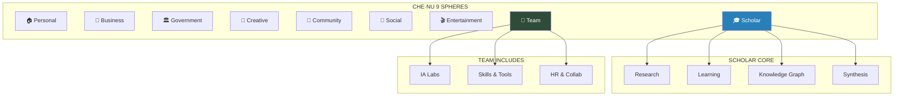

# ═══════════════════════════════════════════════════════════════════════════════
# CHE·NU™ — SPHERE ARCHITECTURE UPDATE v39
# 10 Sphères → 9 Sphères (avec Scholar)
# ═══════════════════════════════════════════════════════════════════════════════

## 🚨 CHANGEMENT MAJEUR D'ARCHITECTURE

**Date:** 2024-12-20  
**Version:** v39  
**Impact:** TOUS LES DOCUMENTS, SQL, API, FRONTEND  

---

## 📊 RÉSUMÉ DU CHANGEMENT

| Avant (v28) | Après (v39) |
|-------------|-------------|
| 10 sphères | **9 sphères** |
| skills_tools séparé | Intégré dans My Team |
| ia_labs séparé | Intégré dans My Team |
| Pas de Scholar | **Scholar ajoutée** 🎓 |

---

## 🔄 MAPPING DE MIGRATION

### Ancienne Structure (10 sphères)
```
1. personnel        → personal
2. entreprises      → business  
3. gouvernement     → government
4. creative_studio  → creative
5. skills_tools     → ❌ SUPPRIMÉE (→ My Team)
6. entertainment    → entertainment
7. community        → community
8. social_media     → social
9. ia_labs          → ❌ SUPPRIMÉE (→ My Team)
10. my_team         → team (absorbe skills_tools + ia_labs)
```

### Nouvelle Structure (9 sphères)
```
1. personal         🏠  Personnel
2. business         💼  Entreprises
3. government       🏛️  Gouvernement & Institutions
4. creative         🎨  Studio de Création
5. community        👥  Communauté
6. social           📱  Social & Media
7. entertainment    🎬  Divertissement
8. scholar          🎓  Érudit (NOUVELLE!)
9. team             🤝  Mon Équipe (+ IA Labs + Skills)
```

---

## 🎓 NOUVELLE SPHÈRE: SCHOLAR

### Définition
| Propriété | Valeur |
|-----------|--------|
| **ID** | `scholar` |
| **Nom EN** | Scholar |
| **Nom FR** | Érudit |
| **Emoji** | 🎓 |
| **Couleur** | #2980B9 (Deep Blue) |
| **Ordre** | 8 |
| **Route** | `/sphere/scholar` |

### Description
Recherche de connaissances, apprentissage, synthèse d'information.
Le cœur intellectuel de CHE·NU — où l'intelligence gouvernée prend tout son sens.

### Fonctionnalités Uniques

**Research:**
- ✅ Web Search (gouverné)
- ✅ Academic Search (papers, journals)
- ✅ Document Analysis
- ✅ Citation Management
- ✅ Fact Checking

**Learning:**
- ✅ Flashcards
- ✅ Spaced Repetition (SM-2 algorithm)
- ✅ Concept Mapping
- ✅ Quiz Generation
- ✅ Study Guides

**Synthesis:**
- ✅ Summarization
- ✅ Cross-Reference
- ✅ Knowledge Graph
- ✅ Information Reconciliation

### Agents Scholar
```typescript
export const SCHOLAR_AGENT_TYPES = [
  'research_assistant',    // Recherche web/académique
  'fact_checker',          // Vérification des faits
  'summarizer',            // Résumé de documents
  'citation_manager',      // Gestion bibliographique
  'tutor',                 // Tuteur personnalisé
  'knowledge_synthesizer', // Synthèse d'information
] as const;
```

### Bureau Scholar (6 sections standard)
| Section | Contenu Spécifique |
|---------|-------------------|
| Quick Capture | Notes de recherche rapides |
| Resume Workspace | Projets de recherche en cours |
| Threads | Fils de recherche .chenu |
| Data Files | PDFs, papers, bibliographies |
| Active Agents | Research assistants, tutors |
| Meetings | Sessions de study group |

---

## 📝 DOCUMENTS À METTRE À JOUR

### 1. CHENU_MASTER_REFERENCE_v5_FINAL.md

**Section: Table des Sphères (ligne ~340)**

REMPLACER:
```markdown
| # | ID | Nom | Emoji | Couleur | Description |
|---|-----|-----|-------|---------|-------------|
| 1 | `personnel` | Personnel | 🏠 | #76E6C7 | Vie privée... |
| 2 | `entreprises` | Entreprises | 💼 | #5BA9FF | Multi-entreprise... |
| 3 | `gouvernement` | Gouvernement | 🏛️ | #D08FFF | Administration... |
| 4 | `creative_studio` | Creative Studio | 🎨 | #FF8BAA | Expression... |
| 5 | `skills_tools` | Skills & Tools | 🛠️ | #59D0C6 | Hub compétences... |
| 6 | `entertainment` | Entertainment | 🎮 | #FFB04D | Loisirs... |
| 7 | `community` | Community | 🤝 | #22C55E | Relations... |
| 8 | `social_media` | Social & Media | 📱 | #66D06F | Réseaux... |
| 9 | `ia_labs` | IA Labs | 🤖 | #FF5FFF | R&D... |
| 10 | `my_team` | My Team | 👥 | #5ED8FF | Équipe... |
```

PAR:
```markdown
| # | ID | Nom | Emoji | Couleur | Description |
|---|-----|-----|-------|---------|-------------|
| 1 | `personal` | Personal | 🏠 | #3EB4A2 | Vie privée, santé, famille, bien-être |
| 2 | `business` | Business | 💼 | #D8B26A | Multi-entreprise, domaines, départements |
| 3 | `government` | Government | 🏛️ | #8D8371 | Administration, démarches, conformité |
| 4 | `creative` | Creative Studio | 🎨 | #9B59B6 | Expression artistique, design, médias |
| 5 | `community` | Community | 👥 | #3F7249 | Relations en personne, local, associations |
| 6 | `social` | Social & Media | 📱 | #E74C3C | Réseaux sociaux en ligne, médias numériques |
| 7 | `entertainment` | Entertainment | 🎬 | #F39C12 | Loisirs, jeux, voyages, streaming |
| 8 | `scholar` | Scholar | 🎓 | #2980B9 | Recherche, apprentissage, synthèse |
| 9 | `team` | My Team | 🤝 | #2F4C39 | Équipe, IA Labs, Skills & Tools intégrés |
```

**Section: SphereId Type (ligne ~978)**

REMPLACER:
```typescript
export type SphereId = 
  | 'personnel'
  | 'entreprises'
  | 'gouvernement'
  | 'creative_studio'
  | 'skills_tools'
  | 'entertainment'
  | 'community'
  | 'social_media'
  | 'ia_labs'
  | 'my_team';
```

PAR:
```typescript
export type SphereId = 
  | 'personal'
  | 'business'
  | 'government'
  | 'creative'
  | 'community'
  | 'social'
  | 'entertainment'
  | 'scholar'
  | 'team';
```

---

### 2. CHENU_SQL_SCHEMA_v29.sql

**REMPLACER l'ENUM sphere_id:**

```sql
-- AVANT
CREATE TYPE sphere_id AS ENUM (
    'personnel',
    'entreprises', 
    'gouvernement',
    'creative_studio',
    'skills_tools',
    'entertainment',
    'community',
    'social_media',
    'ia_labs',
    'my_team'
);

-- APRÈS
CREATE TYPE sphere_id AS ENUM (
    'personal',
    'business',
    'government',
    'creative',
    'community',
    'social',
    'entertainment',
    'scholar',
    'team'
);
```

**AJOUTER la table scholar_research_projects:**

```sql
-- ═══════════════════════════════════════════════════════════════
-- SCHOLAR SPHERE TABLES
-- ═══════════════════════════════════════════════════════════════

CREATE TABLE scholar_research_projects (
    id UUID PRIMARY KEY DEFAULT uuid_generate_v4(),
    user_id UUID NOT NULL REFERENCES users(id),
    title VARCHAR(200) NOT NULL,
    topic VARCHAR(100),
    status VARCHAR(20) DEFAULT 'active' CHECK (status IN ('active', 'completed', 'archived')),
    sources_count INTEGER DEFAULT 0,
    citations_count INTEGER DEFAULT 0,
    token_budget INTEGER DEFAULT 10000,
    tokens_used INTEGER DEFAULT 0,
    created_at TIMESTAMPTZ DEFAULT NOW(),
    updated_at TIMESTAMPTZ DEFAULT NOW()
);

CREATE TABLE scholar_learning_items (
    id UUID PRIMARY KEY DEFAULT uuid_generate_v4(),
    user_id UUID NOT NULL REFERENCES users(id),
    title VARCHAR(200) NOT NULL,
    item_type VARCHAR(20) NOT NULL CHECK (item_type IN ('flashcard_deck', 'concept_map', 'study_guide', 'quiz')),
    progress INTEGER DEFAULT 0 CHECK (progress >= 0 AND progress <= 100),
    next_review TIMESTAMPTZ,
    ease_factor DECIMAL(3,2) DEFAULT 2.50,
    interval_days INTEGER DEFAULT 1,
    created_at TIMESTAMPTZ DEFAULT NOW(),
    updated_at TIMESTAMPTZ DEFAULT NOW()
);

CREATE TABLE scholar_knowledge_nodes (
    id UUID PRIMARY KEY DEFAULT uuid_generate_v4(),
    user_id UUID NOT NULL REFERENCES users(id),
    title VARCHAR(200) NOT NULL,
    node_type VARCHAR(20) NOT NULL CHECK (node_type IN ('fact', 'concept', 'source', 'synthesis')),
    content TEXT,
    confidence DECIMAL(3,2) DEFAULT 0.50 CHECK (confidence >= 0 AND confidence <= 1),
    source_url TEXT,
    created_at TIMESTAMPTZ DEFAULT NOW(),
    updated_at TIMESTAMPTZ DEFAULT NOW()
);

CREATE TABLE scholar_knowledge_connections (
    id UUID PRIMARY KEY DEFAULT uuid_generate_v4(),
    source_node_id UUID NOT NULL REFERENCES scholar_knowledge_nodes(id) ON DELETE CASCADE,
    target_node_id UUID NOT NULL REFERENCES scholar_knowledge_nodes(id) ON DELETE CASCADE,
    relationship_type VARCHAR(50),
    strength DECIMAL(3,2) DEFAULT 0.50,
    created_at TIMESTAMPTZ DEFAULT NOW(),
    UNIQUE(source_node_id, target_node_id)
);

CREATE TABLE scholar_citations (
    id UUID PRIMARY KEY DEFAULT uuid_generate_v4(),
    research_project_id UUID REFERENCES scholar_research_projects(id) ON DELETE CASCADE,
    user_id UUID NOT NULL REFERENCES users(id),
    title VARCHAR(500) NOT NULL,
    authors TEXT[],
    publication_year INTEGER,
    journal VARCHAR(200),
    doi VARCHAR(100),
    url TEXT,
    citation_style VARCHAR(20) DEFAULT 'apa',
    created_at TIMESTAMPTZ DEFAULT NOW()
);

-- Indexes
CREATE INDEX idx_scholar_research_user ON scholar_research_projects(user_id);
CREATE INDEX idx_scholar_learning_user ON scholar_learning_items(user_id);
CREATE INDEX idx_scholar_learning_review ON scholar_learning_items(next_review);
CREATE INDEX idx_scholar_knowledge_user ON scholar_knowledge_nodes(user_id);
CREATE INDEX idx_scholar_citations_project ON scholar_citations(research_project_id);
```

---

### 3. CHENU_API_SPECS_v29.md

**AJOUTER les endpoints Scholar:**

```markdown
## Scholar API Endpoints

### Research Projects

#### GET /api/v1/scholar/research
Liste les projets de recherche de l'utilisateur.

**Response:**
```json
{
  "projects": [
    {
      "id": "uuid",
      "title": "AI Governance Frameworks",
      "topic": "Artificial Intelligence",
      "status": "active",
      "sources_count": 34,
      "citations_count": 28,
      "token_budget": 10000,
      "tokens_used": 3450,
      "updated_at": "2024-12-20T10:00:00Z"
    }
  ]
}
```

#### POST /api/v1/scholar/research
Crée un nouveau projet de recherche.

#### GET /api/v1/scholar/research/:id
Récupère un projet spécifique.

### Learning

#### GET /api/v1/scholar/learning
Liste les items d'apprentissage.

#### GET /api/v1/scholar/learning/due
Récupère les items à réviser (spaced repetition).

#### POST /api/v1/scholar/learning/:id/review
Enregistre une révision avec quality score (0-5).

### Knowledge Graph

#### GET /api/v1/scholar/knowledge
Liste les nœuds de connaissance.

#### POST /api/v1/scholar/knowledge
Crée un nouveau nœud.

#### POST /api/v1/scholar/knowledge/connect
Connecte deux nœuds.

### Search & Synthesis

#### POST /api/v1/scholar/search
Recherche web/académique gouvernée.

**Request:**
```json
{
  "query": "quantum computing applications",
  "sources": ["web", "academic", "knowledge_base"],
  "token_budget": 5000
}
```

#### POST /api/v1/scholar/synthesize
Synthétise plusieurs sources.

#### POST /api/v1/scholar/fact-check
Vérifie les faits d'un texte.
```

---

### 4. CHENU_AGENT_PROMPTS_v29.md

**AJOUTER les prompts Scholar:**

```markdown
## Scholar Sphere Agents

### scholar.research_assistant
```
You are a Research Assistant in CHE·NU's Scholar sphere.
Your role is to help users conduct thorough research while respecting token budgets.

CAPABILITIES:
- Web search (governed by token limits)
- Academic paper search
- Source evaluation
- Citation extraction
- Summary generation

GOVERNANCE RULES:
- Always check token budget before searching
- Prioritize high-quality sources
- Flag potential misinformation
- Track all sources for citation

ENCODING: Use research notation for efficiency
- [SRC:n] = Source reference
- [CITE:author,year] = Citation
- [CONF:high/med/low] = Confidence level
```

### scholar.fact_checker
```
You are a Fact Checker in CHE·NU's Scholar sphere.
Your mission is to verify claims and identify misinformation.

PROCESS:
1. Extract claims from text
2. Search for corroborating sources
3. Identify contradictions
4. Rate confidence per claim
5. Provide verdict with sources

OUTPUT FORMAT:
- Claim: [original text]
- Verdict: TRUE/FALSE/UNVERIFIED
- Confidence: 0-100%
- Sources: [list]
- Notes: [context]
```

### scholar.tutor
```
You are a Personal Tutor in CHE·NU's Scholar sphere.
Your goal is to help users learn effectively using proven techniques.

METHODS:
- Socratic questioning
- Spaced repetition scheduling
- Concept mapping
- Practice problem generation
- Knowledge gap identification

ADAPTATION:
- Assess user's current level
- Adjust difficulty progressively
- Celebrate progress
- Identify struggling areas
```
```

---

### 5. CHENU_MERMAID_DIAGRAMS_v29.md

**METTRE À JOUR le diagramme des sphères:**



---

### 6. CHENU_INVESTOR_BOOK.md

**METTRE À JOUR les mentions de sphères:**

Rechercher et remplacer:
- "10 spheres" → "9 spheres"
- "10 sphères" → "9 sphères"
- Ajouter Scholar dans la liste des sphères

---

### 7. LAYOUT_ENGINE_CHAPTER.md

**METTRE À JOUR SphereNavigator:**

```typescript
const SPHERES = [
  { id: 'personal', icon: '🏠', label: 'Personal' },
  { id: 'business', icon: '💼', label: 'Business' },
  { id: 'government', icon: '🏛️', label: 'Government' },
  { id: 'creative', icon: '🎨', label: 'Creative' },
  { id: 'community', icon: '👥', label: 'Community' },
  { id: 'social', icon: '📱', label: 'Social' },
  { id: 'entertainment', icon: '🎬', label: 'Entertainment' },
  { id: 'scholar', icon: '🎓', label: 'Scholar' },  // NEW!
  { id: 'team', icon: '🤝', label: 'Team' },
];
```

---

## 🔧 MIGRATION SCRIPT

```sql
-- Migration: 10 spheres → 9 spheres
-- Version: v28 → v39

BEGIN;

-- 1. Create new enum
CREATE TYPE sphere_id_v39 AS ENUM (
    'personal', 'business', 'government', 'creative',
    'community', 'social', 'entertainment', 'scholar', 'team'
);

-- 2. Create mapping function
CREATE OR REPLACE FUNCTION migrate_sphere_id(old_id TEXT) 
RETURNS sphere_id_v39 AS $$
BEGIN
    RETURN CASE old_id
        WHEN 'personnel' THEN 'personal'::sphere_id_v39
        WHEN 'entreprises' THEN 'business'::sphere_id_v39
        WHEN 'gouvernement' THEN 'government'::sphere_id_v39
        WHEN 'creative_studio' THEN 'creative'::sphere_id_v39
        WHEN 'skills_tools' THEN 'team'::sphere_id_v39  -- Merged into team
        WHEN 'entertainment' THEN 'entertainment'::sphere_id_v39
        WHEN 'community' THEN 'community'::sphere_id_v39
        WHEN 'social_media' THEN 'social'::sphere_id_v39
        WHEN 'ia_labs' THEN 'team'::sphere_id_v39  -- Merged into team
        WHEN 'my_team' THEN 'team'::sphere_id_v39
        ELSE 'personal'::sphere_id_v39  -- Default fallback
    END;
END;
$$ LANGUAGE plpgsql;

-- 3. Update all tables with sphere_id column
-- (Run for each table that has sphere_id)

-- 4. Drop old enum and rename new
-- ALTER TYPE sphere_id RENAME TO sphere_id_old;
-- ALTER TYPE sphere_id_v39 RENAME TO sphere_id;
-- DROP TYPE sphere_id_old;

COMMIT;
```

---

## ✅ CHECKLIST DE MISE À JOUR

### Documents Markdown
- [ ] CHENU_MASTER_REFERENCE_v5_FINAL.md
- [ ] CHENU_INVESTOR_BOOK.md
- [ ] CHENU_SYSTEM_MANUAL.md
- [ ] LAYOUT_ENGINE_CHAPTER.md
- [ ] WORKSPACE_ENGINE_CHAPTER.md
- [ ] DATASPACE_ENGINE_CHAPTER.md
- [ ] MEMORY_GOVERNANCE_CHAPTER.md
- [ ] BACKSTAGE_INTELLIGENCE_CHAPTER.md
- [ ] ONECLICK_ENGINE_CHAPTER.md
- [ ] OCW_CHAPTER.md
- [ ] MEETING_SYSTEM_CHAPTER.md
- [ ] IMMOBILIER_DOMAIN_CHAPTER.md
- [ ] FEATURE_AUDIT_ROADMAP.md
- [ ] CHENU_COMPTE_RENDU_CONTINUITY.md

### Fichiers Techniques
- [ ] CHENU_SQL_SCHEMA_v29.sql
- [ ] CHENU_API_SPECS_v29.md
- [ ] CHENU_AGENT_PROMPTS_v29.md
- [ ] CHENU_MERMAID_DIAGRAMS_v29.md

### Code Frontend (Phase 1)
- [x] schemas/index.ts (SphereIdSchema)
- [x] constants/canonical.ts (SPHERES)
- [x] tests/schemas.test.ts
- [x] components/scholar/ScholarBureau.tsx

---

## 📋 NOUVELLE ARCHITECTURE FINALE

```
╔═══════════════════════════════════════════════════════════════════════════════╗
║                        CHE·NU™ — 9 SPHERES ARCHITECTURE                       ║
╠═══════════════════════════════════════════════════════════════════════════════╣
║                                                                               ║
║   1. 🏠 Personal          5. 👥 Community        8. 🎓 Scholar               ║
║   2. 💼 Business          6. 📱 Social           9. 🤝 Team                  ║
║   3. 🏛️ Government        7. 🎬 Entertainment       ├── IA Labs              ║
║   4. 🎨 Creative                                     ├── Skills & Tools      ║
║                                                      └── HR & Collaboration  ║
║                                                                               ║
╠═══════════════════════════════════════════════════════════════════════════════╣
║   Each Sphere → 1 Bureau → 6 Sections (frozen)                               ║
║   Scholar = Core of Governed Intelligence 🧠                                  ║
╚═══════════════════════════════════════════════════════════════════════════════╝
```

---

## 🎯 POURQUOI SCHOLAR?

CHE·NU est un **Governed Intelligence Operating System**.

L'intelligence sans connaissance n'est rien. Scholar est:

1. **Le cerveau** — où la recherche et l'apprentissage se font
2. **Le cœur** — où la synthèse d'information réconcilie les données
3. **La mémoire** — où le Knowledge Graph grandit avec l'utilisateur
4. **Le tuteur** — où l'apprentissage personnalisé se déploie

Sans Scholar, CHE·NU serait un simple gestionnaire de tâches.
Avec Scholar, CHE·NU devient un **partenaire intellectuel gouverné**.

---

*Document créé: 2024-12-20*
*Version: v39*
*Auteur: Claude + Jo*
