# CHE·NU — Documentation Projet

> **"Chez Nous"** — Governed Intelligence Operating System
> *L'IA suggère. L'humain décide. Le système trace.*

---

## 📋 Table des Matières

1. [Vision du Projet](#vision-du-projet)
2. [Les Trois Lois Fondamentales](#les-trois-lois-fondamentales)
3. [Architecture Conceptuelle](#architecture-conceptuelle)
4. [Travail Accompli](#travail-accompli)
5. [Le Système de Presets](#le-système-de-presets)
6. [Méthodologie Deck Investisseur](#méthodologie-deck-investisseur)
7. [Structure des 14 Slides](#structure-des-14-slides)

---

## 🎯 Vision du Projet

### Qu'est-ce que CHE·NU?

CHE·NU est un **système d'exploitation d'intelligence gouvernée** qui place l'humain au centre de toutes les décisions tout en offrant la puissance de **168+ agents d'IA spécialisés**.

### Philosophie Fondamentale

```
┌─────────────────────────────────────────────────────────┐
│                                                         │
│  🤖 L'IA SUGGÈRE  →  👤 L'HUMAIN DÉCIDE  →  📝 TRACE   │
│                                                         │
└─────────────────────────────────────────────────────────┘
```

CHE·NU n'automatise **jamais** les décisions humaines. Il **amplifie** l'intelligence humaine.

### Marché Initial

| Aspect | Détail |
|--------|--------|
| **Industrie** | Construction au Québec |
| **Conformité** | RBQ, CNESST, CCQ |
| **Potentiel** | Scalable vers toute industrie complexe |
| **TAM** | $2T+ (gestion de projets complexes) |

---

## ⚖️ Les Trois Lois Fondamentales

### Diagramme des Lois

```mermaid
graph TB
    subgraph LOIS["⚖️ THREE LAWS — INVIOLABLES"]
        L1["🛡️ LOI 1<br/>Jamais nuire à l'humain<br/>ni par action ni par inaction"]
        L2["🤝 LOI 2<br/>Obéir aux ordres humains<br/>sauf si conflit avec Loi 1"]
        L3["🔒 LOI 3<br/>Protéger son existence<br/>sauf si conflit avec Loi 1 ou 2"]
    end
    
    L1 --> L2
    L2 --> L3
    
    style L1 fill:#e74c3c,color:#fff,stroke:#c0392b,stroke-width:3px
    style L2 fill:#f39c12,color:#fff,stroke:#d68910,stroke-width:3px
    style L3 fill:#27ae60,color:#fff,stroke:#1e8449,stroke-width:3px
```

### Application dans CHE·NU

| Loi | Implémentation |
|-----|----------------|
| **Loi 1** | Aucun agent ne peut prendre de décision automatique affectant la sécurité |
| **Loi 2** | Tous les presets sont suggestionnels, jamais imposés |
| **Loi 3** | Le système trace tout pour audit et transparence |

---

## 🏗️ Architecture Conceptuelle

### L'Univers CHE·NU — Structure en Arbre

```mermaid
graph TB
    subgraph TRUNK["🌳 TRONC CENTRAL — MVP"]
        CORE["🔮 CORE<br/>Timeline • Presets • Laws"]
    end
    
    subgraph SPHERES["🔮 SPHÈRES"]
        direction LR
        S1["👤 Personal"]
        S2["🏢 Business"]
        S3["🎨 Creative"]
        S4["🎉 Social"]
        S5["🎓 Scholar"]
        S6["🧠 Methodology"]
        S7["🏛️ Institutions"]
        S8["🕶️ XR"]
        S9["⚖️ Governance"]
    end
    
    CORE --> S1
    CORE --> S2
    CORE --> S3
    CORE --> S4
    CORE --> S5
    CORE --> S6
    CORE --> S7
    CORE --> S8
    CORE --> S9
    
    subgraph GOVERNANCE["🛡️ MÉTA-GOUVERNANCE"]
        GOV["Oversight • Audit • Compliance"]
    end
    
    S9 -.-> GOV
    
    style CORE fill:#8e44ad,color:#fff,stroke:#5b2c6f,stroke-width:4px
    style GOV fill:#2c3e50,color:#fff,stroke:#1a252f,stroke-width:2px
```

### Hiérarchie des Agents (168+)

```mermaid
graph TB
    subgraph L0["NIVEAU L0 — ORCHESTRATION"]
        NOVA["🌟 NOVA<br/>Orchestrateur Principal"]
    end
    
    subgraph L1["NIVEAU L1 — DIRECTEURS"]
        D1["📊 Directeur<br/>Business"]
        D2["🎨 Directeur<br/>Creative"]
        D3["🔧 Directeur<br/>Operations"]
        D4["⚖️ Directeur<br/>Compliance"]
    end
    
    subgraph L2["NIVEAU L2 — MANAGERS"]
        M1["Manager Projets"]
        M2["Manager Ressources"]
        M3["Manager Qualité"]
        M4["Manager Sécurité"]
    end
    
    subgraph L3["NIVEAU L3 — SPÉCIALISTES"]
        SP["40+ Agents<br/>Spécialisés par sphère"]
    end
    
    NOVA --> D1
    NOVA --> D2
    NOVA --> D3
    NOVA --> D4
    
    D1 --> M1
    D1 --> M2
    D3 --> M3
    D4 --> M4
    
    M1 --> SP
    M2 --> SP
    M3 --> SP
    M4 --> SP
    
    style NOVA fill:#e74c3c,color:#fff,stroke:#c0392b,stroke-width:3px
    style L0 fill:#fadbd8,stroke:#e74c3c
    style L1 fill:#fdebd0,stroke:#f39c12
    style L2 fill:#d5f5e3,stroke:#27ae60
    style L3 fill:#d6eaf8,stroke:#3498db
```

### Flow de Décision

```mermaid
sequenceDiagram
    participant U as 👤 Utilisateur
    participant S as 🔮 Système
    participant A as 🤖 Agents
    participant T as 📝 Timeline
    
    U->>S: Action / Question
    S->>A: Analyse contextuelle
    A->>A: Consultation multi-agents
    A->>S: Suggestions + Raisons
    S->>U: 💡 Proposition expliquée
    
    alt Acceptation
        U->>S: ✓ Valide
        S->>T: Enregistre décision
    else Refus
        U->>S: ✗ Refuse
        S->>T: Enregistre refus
    else Modification
        U->>S: ↻ Modifie
        S->>T: Enregistre modification
    end
    
    T->>T: Audit trail complet
```

---

## 📊 Travail Accompli

### Répartition du Code (76,280 lignes)

```mermaid
pie title Répartition du Code
    "XR Complete" : 16492
    "Core System" : 8500
    "Personalization" : 5781
    "Universe 3D" : 3999
    "Phases/Roles" : 3763
    "Presets" : 2315
    "Backend Python" : 6500
    "UI Components" : 12000
    "Documentation" : 2000
    "Autres" : 14930
```

### Modules Principaux Créés

| Module | Lignes | Description |
|--------|--------|-------------|
| `preset-trunk.ts` | 275 | **Source de vérité** — Timeline, XR Aura, Replay, Metrics |
| `preset-system.ts` | 339 | Single Source of Truth — Types, Presets, Roles, Phases |
| `sphere-presets.ts` | 450 | 31 presets pour 8 sphères |
| `preset-fusion.tsx` | 488 | Engine de fusion + UI Suggestion Panel |
| `preset-observability.ts` | 566 | Timeline avancée + Analytics détaillés |
| `xrPresetVisuals.ts` | 348 | Configuration visuelle des auras XR |
| `XRPresetAura.tsx` | 326 | Composant Three.js pour auras |

### Architecture des Presets

```mermaid
graph LR
    subgraph SOURCES["📥 SOURCES DE CONTEXTE"]
        MANUAL["✋ Manuel"]
        PROJECT["📁 Projet"]
        SPHERE["🔮 Sphère"]
        PHASE["📍 Phase"]
        ROLE["👤 Rôle"]
    end
    
    subgraph ENGINE["⚙️ FUSION ENGINE"]
        RESOLVE["resolvePresetFusion()"]
    end
    
    subgraph OUTPUT["📤 SORTIE"]
        SUGGEST["💡 Suggestion<br/>+ Raisons"]
    end
    
    MANUAL -->|Priorité 1| RESOLVE
    PROJECT -->|Priorité 2| RESOLVE
    SPHERE -->|Priorité 3| RESOLVE
    PHASE -->|Priorité 4| RESOLVE
    ROLE -->|Priorité 5| RESOLVE
    
    RESOLVE --> SUGGEST
    
    subgraph HUMAN["👤 DÉCISION HUMAINE"]
        APPLY["✓ Appliquer"]
        IGNORE["✗ Ignorer"]
    end
    
    SUGGEST --> APPLY
    SUGGEST --> IGNORE
    
    style RESOLVE fill:#8e44ad,color:#fff
    style SUGGEST fill:#f39c12,color:#fff
```

---

## 🎨 Le Système de Presets

### Preset Trunk — Code Canonique

```typescript
// TRUTH — Timeline globale
export const PresetTimeline: PresetChange[] = [];

// XR VISUAL — Auras
export const PresetAura = {
  focus:       { color: '#4A90E2', radius: 1.2 },
  exploration: { color: '#8E44AD', radius: 1.8 },
  audit:       { color: '#27AE60', radius: 1.5 },
  meeting:     { color: '#F39C12', radius: 2.2 },
  minimal:     { color: '#7F8C8D', radius: 0.8 },
};

// REPLAY — XR lit uniquement ceci
export const presetAt = (time: number) =>
  [...PresetTimeline].reverse().find(e => e.t <= time);

// METRICS — Observer, jamais juger
export const presetMetrics = () => {
  const m: Record<string, { c: number; d: number }> = {};
  PresetTimeline.forEach((e, i) => {
    m[e.p] ??= { c: 0, d: 0 };
    m[e.p].c++;
    if (PresetTimeline[i + 1])
      m[e.p].d += PresetTimeline[i + 1].t - e.t;
  });
  return m;
};
```

### Les 5 Lois du Système de Presets

```mermaid
graph TB
    subgraph LAWS["⚖️ 5 LOIS INVIOLABLES"]
        L1["1️⃣ Timeline = vérité absolue"]
        L2["2️⃣ XR = visualisation, jamais décision"]
        L3["3️⃣ Metrics = observation, jamais jugement"]
        L4["4️⃣ Aucun preset n'est automatique"]
        L5["5️⃣ Humain garde toujours le contrôle"]
    end
    
    L1 --> L2 --> L3 --> L4 --> L5
    
    style L1 fill:#e74c3c,color:#fff
    style L2 fill:#9b59b6,color:#fff
    style L3 fill:#3498db,color:#fff
    style L4 fill:#1abc9c,color:#fff
    style L5 fill:#f39c12,color:#fff
```

### Presets par Sphère

| Sphère | Presets |
|--------|---------|
| 👤 Personal | focus, reflection, minimal |
| 🏢 Business | execution, strategy, audit, crisis |
| 🎨 Creative | ideation, production, review, playground |
| 🎉 Social | engagement, content, analytics, minimal |
| 🎓 Scholar | learning, research, synthesis, exams |
| 🧠 Methodology | analysis, design, experiment, optimization |
| 🏛️ Institutions | compliance, policy, transparency |
| 🕶️ XR | exploration, meeting, replay |
| ⚖️ Governance | audit, review |

---

## 📈 Méthodologie Deck Investisseur

### Objectif

Créer UN deck investisseur qui:
- ✅ Explique CHE·NU sans surcharge
- ✅ Inspire confiance (tech + gouvernance)
- ✅ Montre un potentiel massif
- ✅ Reste aligné avec le tronc

### Méthode en 4 Phases

```mermaid
graph LR
    subgraph P1["🔹 PHASE 1"]
        S1["Structure<br/>Table des slides"]
    end
    
    subgraph P2["🔹 PHASE 2"]
        S2["Contenu<br/>Par slide"]
    end
    
    subgraph P3["🔹 PHASE 3"]
        S3["Version<br/>Investor-friendly"]
    end
    
    subgraph P4["🔹 PHASE 4"]
        S4["Export<br/>Multi-format"]
    end
    
    P1 -->|Validation| P2
    P2 -->|Révision| P3
    P3 -->|Finalisation| P4
    
    style P1 fill:#e74c3c,color:#fff
    style P2 fill:#f39c12,color:#fff
    style P3 fill:#27ae60,color:#fff
    style P4 fill:#3498db,color:#fff
```

---

## 📑 Structure des 14 Slides

### Vue d'ensemble

```mermaid
graph TB
    subgraph INTRO["🎯 INTRODUCTION"]
        S1["1. Vision & Mission"]
        S2["2. Problème Mondial"]
        S3["3. Solution CHE·NU"]
    end
    
    subgraph TECH["⚙️ TECHNOLOGIE"]
        S4["4. Le Tronc"]
        S5["5. Agents & Gouvernance"]
        S6["6. UX & XR"]
    end
    
    subgraph MARKET["📊 MARCHÉ"]
        S7["7. Cas d'usage"]
        S8["8. Scalabilité"]
        S9["9. Avantage Concurrentiel"]
    end
    
    subgraph BUSINESS["💼 BUSINESS"]
        S10["10. Business Model"]
        S11["11. Sécurité & Éthique"]
        S12["12. Roadmap"]
    end
    
    subgraph CLOSE["🎯 CLOSING"]
        S13["13. Équipe & Vision"]
        S14["14. Ask / Opportunity"]
    end
    
    INTRO --> TECH --> MARKET --> BUSINESS --> CLOSE
```

---

### Slide 1: Vision & Mission

**TITRE:** L'IA qui amplifie, sans remplacer

**MESSAGE CLÉ:** CHE·NU est le premier système d'exploitation d'intelligence gouvernée où l'humain reste maître de toutes les décisions.

**BULLETS:**
- 168+ agents IA spécialisés
- Gouvernance constitutionnelle intégrée
- Construction → Toute industrie complexe

```mermaid
graph LR
    AI["🤖 IA"] -->|suggère| HUMAN["👤 Humain"]
    HUMAN -->|décide| SYSTEM["📝 Système"]
    SYSTEM -->|trace| AUDIT["✓ Audit"]
    
    style HUMAN fill:#f39c12,color:#fff,stroke-width:3px
```

---

### Slide 2: Problème Mondial

**TITRE:** La surcharge cognitive tue la productivité

**MESSAGE CLÉ:** Les professionnels passent 60% de leur temps à chercher, organiser, et décider — pas à créer de la valeur.

**BULLETS:**
- Information fragmentée (10+ outils/jour)
- Décisions sans traçabilité
- IA actuelle: automatise OU assiste, jamais les deux
- Coût: $1.3T/an en productivité perdue (Fortune 500)

```mermaid
graph TB
    subgraph CHAOS["😵 SITUATION ACTUELLE"]
        T1["📧 Email"]
        T2["📊 Excel"]
        T3["💬 Slack"]
        T4["📁 Drive"]
        T5["📋 Trello"]
        T6["🤖 ChatGPT"]
    end
    
    USER["👤 Utilisateur<br/>Surchargé"] --> T1
    USER --> T2
    USER --> T3
    USER --> T4
    USER --> T5
    USER --> T6
    
    style USER fill:#e74c3c,color:#fff
```

---

### Slide 3: Solution CHE·NU

**TITRE:** Un cerveau unifié, gouverné par l'humain

**MESSAGE CLÉ:** CHE·NU unifie contexte, agents IA, et décisions dans un système où RIEN ne s'active sans validation humaine.

**BULLETS:**
- Tronc central = source de vérité unique
- Sphères contextuelles = organisation naturelle
- Presets adaptatifs = suggestions intelligentes
- Timeline immuable = audit complet

```mermaid
graph TB
    subgraph CHENU["🌳 CHE·NU"]
        TRUNK["🔮 TRONC<br/>Timeline • Laws • Core"]
        
        S1["👤"] --> TRUNK
        S2["🏢"] --> TRUNK
        S3["🎨"] --> TRUNK
        S4["🎓"] --> TRUNK
        
        TRUNK --> DECISION["💡 Suggestion"]
        DECISION --> HUMAN["👤 Validation"]
        HUMAN --> TRACE["📝 Trace"]
    end
    
    style TRUNK fill:#8e44ad,color:#fff,stroke-width:3px
    style HUMAN fill:#f39c12,color:#fff,stroke-width:3px
```

---

### Slide 4: Le Tronc (Architecture)

**TITRE:** Architecture Constitutionnelle

**MESSAGE CLÉ:** Comme une constitution protège les citoyens, le Tronc protège les décisions humaines.

**BULLETS:**
- Three Laws: Jamais nuire, Obéir, Protéger
- Timeline: Vérité immuable, auditée
- Presets: Adaptation sans automatisation
- 76,000+ lignes de code production-ready

```mermaid
graph TB
    subgraph CONSTITUTION["📜 CONSTITUTION CHE·NU"]
        LAW1["🛡️ Loi 1: Protection"]
        LAW2["🤝 Loi 2: Obéissance"]
        LAW3["🔒 Loi 3: Préservation"]
    end
    
    subgraph TRUNK["🌳 TRONC"]
        TIMELINE["📝 Timeline<br/>Vérité unique"]
        PRESETS["🎨 Presets<br/>Adaptation"]
        AGENTS["🤖 Agents<br/>168+ spécialistes"]
    end
    
    CONSTITUTION --> TRUNK
    
    style CONSTITUTION fill:#2c3e50,color:#fff
    style TIMELINE fill:#27ae60,color:#fff
```

---

### Slide 5: Agents & Gouvernance

**TITRE:** 168 experts IA, zéro autonomie dangereuse

**MESSAGE CLÉ:** Chaque agent est spécialisé, supervisé, et ne peut JAMAIS agir sans approbation humaine.

**BULLETS:**
- Hiérarchie L0-L3 (Orchestrateur → Spécialistes)
- Chaque suggestion = raison explicite
- Audit trail sur chaque interaction
- Rollback possible sur toute décision

```mermaid
graph TB
    HUMAN["👤 HUMAIN<br/>Toujours au-dessus"] --> L0
    
    subgraph HIERARCHY["🏛️ GOUVERNANCE"]
        L0["🌟 L0: NOVA"]
        L1["📊 L1: Directeurs"]
        L2["👔 L2: Managers"]
        L3["🔧 L3: Spécialistes"]
    end
    
    L0 --> L1 --> L2 --> L3
    L3 -->|Suggestion| HUMAN
    
    style HUMAN fill:#f39c12,color:#fff,stroke-width:4px
    style L0 fill:#e74c3c,color:#fff
```

---

### Slide 6: UX & XR

**TITRE:** De l'écran à l'immersion

**MESSAGE CLÉ:** La même logique, visualisée en 2D, 3D, ou réalité mixte — l'humain choisit son interface.

**BULLETS:**
- Web responsive (React/TypeScript)
- Universe 3D (Three.js)
- XR immersif (WebXR)
- Auras visuelles = état des presets

```mermaid
graph LR
    subgraph SAME["🔮 MÊME LOGIQUE"]
        CORE["Core<br/>Timeline • Presets"]
    end
    
    subgraph VIEWS["📱 MULTI-INTERFACES"]
        WEB["🖥️ Web 2D"]
        V3D["🌐 Universe 3D"]
        XR["🕶️ XR Immersif"]
    end
    
    CORE --> WEB
    CORE --> V3D
    CORE --> XR
    
    style CORE fill:#8e44ad,color:#fff
```

---

### Slide 7: Cas d'Usage — Construction

**TITRE:** Premier marché: Construction Québec

**MESSAGE CLÉ:** $50B/an de chantiers au Québec, 90% gérés avec Excel et papier.

**BULLETS:**
- Conformité RBQ/CNESST/CCQ intégrée
- Gestion multi-projets unifiée
- 168 agents métier (estimateur, planificateur, etc.)
- ROI: -40% temps administratif

```mermaid
graph TB
    subgraph BEFORE["😓 AVANT"]
        B1["📋 Papier"]
        B2["📊 Excel"]
        B3["❓ Pas de trace"]
    end
    
    subgraph AFTER["😊 APRÈS"]
        A1["🔮 Source unique"]
        A2["🤖 Agents"]
        A3["✅ Conformité"]
    end
    
    BEFORE -->|CHE·NU| AFTER
    
    style BEFORE fill:#e74c3c,color:#fff
    style AFTER fill:#27ae60,color:#fff
```

---

### Slide 8: Scalabilité

**TITRE:** Construction → Toute industrie complexe

**MESSAGE CLÉ:** L'architecture est domain-agnostic: seuls les agents changent, pas le tronc.

**BULLETS:**
- Phase 1: Construction Québec ($50B)
- Phase 2: Construction Canada ($200B)
- Phase 3: Industries réglementées (santé, finance)
- TAM: $2T+ (gestion de projets complexes)

```mermaid
graph LR
    subgraph P1["🏗️ PHASE 1"]
        QC["Québec<br/>$50B"]
    end
    
    subgraph P2["🇨🇦 PHASE 2"]
        CA["Canada<br/>$200B"]
    end
    
    subgraph P3["🌍 PHASE 3"]
        WORLD["Industries<br/>$2T+"]
    end
    
    P1 -->|2025| P2
    P2 -->|2026| P3
    
    style P1 fill:#3498db,color:#fff
    style P2 fill:#9b59b6,color:#fff
    style P3 fill:#e74c3c,color:#fff
```

---

### Slide 9: Avantage Concurrentiel

**TITRE:** Pourquoi CHE·NU gagne

**MESSAGE CLÉ:** Aucun concurrent n'a la gouvernance constitutionnelle combinée à l'intelligence multi-agents.

**BULLETS:**
- vs Notion/Monday: Pas d'IA gouvernée
- vs ChatGPT/Claude: Pas de contexte persistant
- vs SAP/Oracle: Pas d'adaptation cognitive
- MOAT: Three Laws + Timeline + 168 Agents

---

### Slide 10: Business Model

**TITRE:** SaaS + Usage + Marketplace

**MESSAGE CLÉ:** Revenus récurrents avec expansion naturelle par utilisateur et par agent.

**BULLETS:**
- Base: $99/user/mois (5 sphères, 50 agents)
- Pro: $299/user/mois (8 sphères, 168 agents, XR)
- Enterprise: Custom (agents personnalisés, on-premise)
- Marketplace: 30% sur agents tiers

```mermaid
pie title Sources de Revenus (Année 3)
    "Subscriptions SaaS" : 60
    "Usage API/Agents" : 25
    "Marketplace" : 10
    "Services" : 5
```

---

### Slide 11: Sécurité & Éthique

**TITRE:** Confiance par design

**MESSAGE CLÉ:** La gouvernance n'est pas un add-on, c'est le fondement de l'architecture.

**BULLETS:**
- Three Laws: Codées en dur, non modifiables
- Données: Chiffrement E2E, conformité PIPEDA
- Audit: Chaque décision tracée et exportable
- Éthique: Aucune décision autonome sur humains

---

### Slide 12: Roadmap

**TITRE:** De 76K lignes à l'IPO

**MESSAGE CLÉ:** Fondations solides, exécution méthodique, scalabilité prouvée.

**BULLETS:**
- Q1 2025: Beta privée (10 clients construction)
- Q3 2025: Launch public Québec
- Q1 2026: Expansion Canada
- Q4 2026: Série A, expansion internationale

```mermaid
gantt
    title Roadmap CHE·NU
    dateFormat  YYYY-MM
    section Produit
    Beta Privée           :2025-01, 3M
    Launch Québec         :2025-04, 6M
    Launch Canada         :2025-10, 6M
    section Funding
    Seed ($500K)          :milestone, 2025-01, 0d
    Série A ($5M)         :milestone, 2026-01, 0d
```

---

### Slide 13: Équipe & Vision

**TITRE:** Bâtisseurs de l'IA responsable

**MESSAGE CLÉ:** Une équipe qui comprend la construction ET l'IA, guidée par une vision éthique long-terme.

**BULLETS:**
- Fondateur: 15+ ans construction, expert IA
- Vision: L'IA comme outil, jamais comme maître
- Culture: "L'humain d'abord, toujours"
- Advisors: [À compléter]

---

### Slide 14: The Ask

**TITRE:** Construisons ensemble

**MESSAGE CLÉ:** $500K Seed pour prouver le modèle sur le marché construction Québec.

**BULLETS:**
- Utilisation: 60% Produit, 25% Ventes, 15% Ops
- Objectif 12 mois: 100 clients payants, $500K ARR
- Prochaine étape: Série A $5M (expansion Canada)
- Sortie potentielle: Acquisition stratégique ou IPO

```mermaid
graph LR
    subgraph NOW["🎯 MAINTENANT"]
        SEED["Seed<br/>$500K"]
    end
    
    subgraph M12["📅 +12 MOIS"]
        ARR["$500K ARR<br/>100 clients"]
    end
    
    subgraph M24["📅 +24 MOIS"]
        SERIEA["Série A<br/>$5M"]
    end
    
    NOW --> M12 --> M24
    
    style SEED fill:#f39c12,color:#fff
    style ARR fill:#27ae60,color:#fff
    style SERIEA fill:#3498db,color:#fff
```

---

## 📎 Statistiques Finales

| Métrique | Valeur |
|----------|--------|
| Total lignes de code | 76,280 |
| Modules TypeScript | 180+ |
| Composants React | 60+ |
| Agents définis | 168 |
| Sphères | 9 |
| Presets | 31+ |

### Stack Technique

| Layer | Technologies |
|-------|-------------|
| Frontend | React 18 + TypeScript + Vite |
| 3D/XR | Three.js + React-Three-Fiber + WebXR |
| State | Zustand + Context |
| Backend | FastAPI + Python 3.11 |
| Database | PostgreSQL + Redis |
| Deploy | Docker + Kubernetes |

---

*Document généré le 8 décembre 2025*
*Version: 1.0*
*CHE·NU — L'IA qui amplifie, sans remplacer* 🌳
