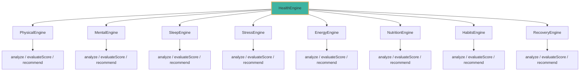
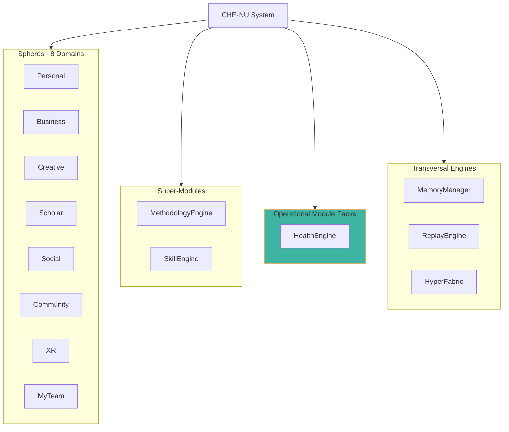

============================================================
CHE·NU — PERSONAL HEALTH ENGINE SUITE
COMPLETE IMPLEMENTATION FILE
VERSION: 1.0.0
============================================================

╔════════════════════════════════════════════════════════════╗
║  CONSOLIDATION AGENT INSTRUCTIONS                          ║
║  READ THIS SECTION FIRST                                   ║
╚════════════════════════════════════════════════════════════╝

CLASSIFICATION:
---------------
Health = OPERATIONAL MODULE PACK (NOT a Sphere)
Attached to: Personal Sphere + Any agent needing health evaluations

EXECUTION ORDER FOR CONSOLIDATION:
----------------------------------
PHASE 1: CORE MODULE CREATION
  1.1 → Create /che-nu-sdk/core/health.ts (main engine)
  1.2 → Create /che-nu-sdk/core/health/ folder

PHASE 2: SUB-ENGINE CREATION (8 files)
  2.1 → physical.engine.ts
  2.2 → mental.engine.ts
  2.3 → sleep.engine.ts
  2.4 → stress.engine.ts
  2.5 → energy.engine.ts
  2.6 → nutrition.engine.ts
  2.7 → habits.engine.ts
  2.8 → recovery.engine.ts
  2.9 → index.ts (exports)

PHASE 3: SCHEMA CREATION
  3.1 → Create /che-nu-sdk/schemas/health.schema.json

PHASE 4: SYSTEM INDEX UPDATES
  4.1 → Update /che-nu-sdk/system_index.json
  4.2 → Update /che-nu-sdk/docs/SYSTEM_INDEX.md

PHASE 5: ROUTING UPDATES
  5.1 → Update /che-nu-sdk/core/orchestrator.ts
  5.2 → Update /che-nu-sdk/core/context_interpreter.ts

PHASE 6: FRONTEND CREATION
  6.1 → Create /che-nu-frontend/pages/health.tsx
  6.2 → Create /che-nu-frontend/components/HealthViewer.tsx
  6.3 → Update /che-nu-frontend/components/WorkflowGrid.tsx

PHASE 7: DOCUMENTATION UPDATES
  7.1 → Update /che-nu-app/docs/UI_FLOW.md
  7.2 → Update /che-nu-sdk/docs/DIAGRAMS.md

SAFE RULES (CRITICAL):
----------------------
✅ Abstract structures only
✅ Representational outputs only
✅ Non-actionable content
❌ NO medical advice
❌ NO diagnosis
❌ NO prescriptive content
❌ NO biological mechanisms
❌ NO health warnings or risk analysis
❌ NO treatment plans

============================================================
PHASE 1.1 — MAIN HEALTH ENGINE
============================================================

--- FILE: /che-nu-sdk/core/health.ts
--- ACTION: CREATE NEW FILE
--- PRIORITY: 1.1

/**
 * CHE·NU SDK — Health Engine
 * ===========================
 * SAFE · NON-AUTONOMOUS · REPRESENTATIONAL
 * 
 * CLASSIFICATION: OPERATIONAL MODULE PACK (NOT A SPHERE)
 * ATTACHED TO: Personal Sphere + Agent evaluations
 * 
 * Provides high-level health structure operations.
 * All outputs are REPRESENTATIONAL only.
 * NO medical advice, diagnosis, or prescriptive content.
 * 
 * @module HealthEngine
 * @version 1.0.0
 */

// ============================================================
// IMPORTS — SUB-ENGINES
// ============================================================

import { PhysicalEngine } from './health/physical.engine';
import { MentalEngine } from './health/mental.engine';
import { SleepEngine } from './health/sleep.engine';
import { StressEngine } from './health/stress.engine';
import { EnergyEngine } from './health/energy.engine';
import { NutritionEngine } from './health/nutrition.engine';
import { HabitsEngine } from './health/habits.engine';
import { RecoveryEngine } from './health/recovery.engine';

// ============================================================
// TYPES
// ============================================================

export interface HealthCategory {
  id: string;
  name: string;
  score: number;
  level: 'low' | 'moderate' | 'good' | 'optimal';
  indicators: string[];
}

export interface OverallHealthEvaluation {
  id: string;
  timestamp: string;
  categories: HealthCategory[];
  aggregateScore: number;
  aggregateLevel: string;
  focusAreas: string[];
  meta: HealthMeta;
}

export interface DailyState {
  id: string;
  date: string;
  energy: string;
  clarity: string;
  rest: string;
  mood: string;
  summary: string;
  meta: HealthMeta;
}

export interface HealthProfile {
  id: string;
  created: string;
  categories: Record<string, HealthCategory>;
  patterns: string[];
  strengths: string[];
  attentionAreas: string[];
  meta: HealthMeta;
}

export interface FocusRecommendation {
  area: string;
  priority: 'low' | 'medium' | 'high';
  description: string;
  relatedCategories: string[];
}

export interface HealthMeta {
  source: string;
  generated: string;
  version: string;
  moduleType: 'operational_module_pack';
  attachedTo: string[];
  safe: {
    isRepresentational: boolean;
    noMedicalAdvice: boolean;
    noDiagnosis: boolean;
    noPrescriptive: boolean;
    noAutonomy: boolean;
  };
}

export interface HealthEngineConfig {
  enabledEngines?: string[];
  defaultScoreRange?: [number, number];
}

// ============================================================
// HEALTH ENGINE CLASS — OPERATIONAL MODULE PACK
// ============================================================

export class HealthEngine {
  private config: HealthEngineConfig;
  private readonly VERSION = '1.0.0';
  private readonly MODULE_TYPE = 'operational_module_pack';

  // Sub-engine instances
  private physical: PhysicalEngine;
  private mental: MentalEngine;
  private sleep: SleepEngine;
  private stress: StressEngine;
  private energy: EnergyEngine;
  private nutrition: NutritionEngine;
  private habits: HabitsEngine;
  private recovery: RecoveryEngine;

  constructor(config: HealthEngineConfig = {}) {
    this.config = {
      enabledEngines: config.enabledEngines || [
        'physical', 'mental', 'sleep', 'stress',
        'energy', 'nutrition', 'habits', 'recovery'
      ],
      defaultScoreRange: config.defaultScoreRange || [0, 100],
    };

    // Initialize sub-engines
    this.physical = new PhysicalEngine();
    this.mental = new MentalEngine();
    this.sleep = new SleepEngine();
    this.stress = new StressEngine();
    this.energy = new EnergyEngine();
    this.nutrition = new NutritionEngine();
    this.habits = new HabitsEngine();
    this.recovery = new RecoveryEngine();
  }

  /**
   * Evaluate overall health structure
   * SAFE: Representational evaluation only, no medical advice
   */
  evaluateOverallHealth(input?: Record<string, unknown>): OverallHealthEvaluation {
    const categories: HealthCategory[] = [
      this.createCategory('physical', 'Physical Wellness', this.physical.evaluateScore()),
      this.createCategory('mental', 'Mental Clarity', this.mental.evaluateScore()),
      this.createCategory('sleep', 'Sleep Quality', this.sleep.evaluateScore()),
      this.createCategory('stress', 'Stress Management', this.stress.evaluateScore()),
      this.createCategory('energy', 'Energy Levels', this.energy.evaluateScore()),
      this.createCategory('nutrition', 'Nutrition Balance', this.nutrition.evaluateScore()),
      this.createCategory('habits', 'Habit Patterns', this.habits.evaluateScore()),
      this.createCategory('recovery', 'Recovery Cycles', this.recovery.evaluateScore()),
    ];

    const aggregateScore = Math.round(
      categories.reduce((sum, c) => sum + c.score, 0) / categories.length
    );

    const focusAreas = categories
      .filter(c => c.level === 'low' || c.level === 'moderate')
      .map(c => c.name);

    return {
      id: `health-eval-${Date.now()}`,
      timestamp: new Date().toISOString(),
      categories,
      aggregateScore,
      aggregateLevel: this.scoreToLevel(aggregateScore),
      focusAreas,
      meta: this.createMeta('Overall health evaluation'),
    };
  }

  /**
   * Summarize daily state
   * SAFE: Abstract state representation only
   */
  summarizeDailyState(input?: Record<string, unknown>): DailyState {
    const energyLevel = this.energy.evaluateScore();
    const mentalState = this.mental.evaluateScore();
    const sleepQuality = this.sleep.evaluateScore();

    return {
      id: `daily-${Date.now()}`,
      date: new Date().toISOString().split('T')[0],
      energy: this.scoreToLevel(energyLevel.score),
      clarity: this.scoreToLevel(mentalState.score),
      rest: this.scoreToLevel(sleepQuality.score),
      mood: this.deriveMoodIndicator(energyLevel.score, mentalState.score),
      summary: this.generateDailySummary(energyLevel.score, mentalState.score, sleepQuality.score),
      meta: this.createMeta('Daily state summary'),
    };
  }

  /**
   * Generate health profile structure
   * SAFE: Representational profile only
   */
  generateHealthProfile(input?: Record<string, unknown>): HealthProfile {
    const categories: Record<string, HealthCategory> = {
      physical: this.createCategory('physical', 'Physical', this.physical.evaluateScore()),
      mental: this.createCategory('mental', 'Mental', this.mental.evaluateScore()),
      sleep: this.createCategory('sleep', 'Sleep', this.sleep.evaluateScore()),
      stress: this.createCategory('stress', 'Stress', this.stress.evaluateScore()),
      energy: this.createCategory('energy', 'Energy', this.energy.evaluateScore()),
      nutrition: this.createCategory('nutrition', 'Nutrition', this.nutrition.evaluateScore()),
      habits: this.createCategory('habits', 'Habits', this.habits.evaluateScore()),
      recovery: this.createCategory('recovery', 'Recovery', this.recovery.evaluateScore()),
    };

    const strengths = Object.values(categories)
      .filter(c => c.level === 'good' || c.level === 'optimal')
      .map(c => c.name);

    const attentionAreas = Object.values(categories)
      .filter(c => c.level === 'low' || c.level === 'moderate')
      .map(c => c.name);

    return {
      id: `profile-${Date.now()}`,
      created: new Date().toISOString(),
      categories,
      patterns: this.identifyPatterns(categories),
      strengths,
      attentionAreas,
      meta: this.createMeta('Health profile generation'),
    };
  }

  /**
   * Recommend focus areas
   * SAFE: Structural recommendations only, no prescriptive content
   */
  recommendFocusAreas(input?: Record<string, unknown>): FocusRecommendation[] {
    const evaluation = this.evaluateOverallHealth(input);
    const recommendations: FocusRecommendation[] = [];

    for (const category of evaluation.categories) {
      if (category.level === 'low') {
        recommendations.push({
          area: category.name,
          priority: 'high',
          description: `Consider attention to ${category.name.toLowerCase()} patterns`,
          relatedCategories: this.findRelatedCategories(category.id),
        });
      } else if (category.level === 'moderate') {
        recommendations.push({
          area: category.name,
          priority: 'medium',
          description: `Opportunity for ${category.name.toLowerCase()} optimization`,
          relatedCategories: this.findRelatedCategories(category.id),
        });
      }
    }

    // Sort by priority
    const priorityOrder = { high: 0, medium: 1, low: 2 };
    recommendations.sort((a, b) => priorityOrder[a.priority] - priorityOrder[b.priority]);

    return recommendations.slice(0, 5); // Top 5 focus areas
  }

  /**
   * Get specific sub-engine
   */
  getSubEngine(name: string): unknown {
    const engines: Record<string, unknown> = {
      physical: this.physical,
      mental: this.mental,
      sleep: this.sleep,
      stress: this.stress,
      energy: this.energy,
      nutrition: this.nutrition,
      habits: this.habits,
      recovery: this.recovery,
    };
    return engines[name];
  }

  /**
   * List all sub-engines
   */
  listSubEngines(): string[] {
    return [
      'physical', 'mental', 'sleep', 'stress',
      'energy', 'nutrition', 'habits', 'recovery'
    ];
  }

  /**
   * Get engine metadata
   * SAFE: Static metadata only
   */
  meta(): Record<string, unknown> {
    return {
      name: 'HealthEngine',
      version: this.VERSION,
      description: 'Operational module pack for health structure analysis',
      classification: {
        type: 'operational_module_pack',
        isNotASphere: true,
        attachedTo: ['Personal Sphere', 'Agent evaluations'],
      },
      safe: {
        isRepresentational: true,
        noMedicalAdvice: true,
        noDiagnosis: true,
        noPrescriptive: true,
        noAutonomy: true,
        noBiologicalMechanisms: true,
        noRiskAnalysis: true,
        noTreatmentPlans: true,
      },
      capabilities: [
        'evaluateOverallHealth',
        'summarizeDailyState',
        'generateHealthProfile',
        'recommendFocusAreas',
      ],
      subEngines: this.listSubEngines(),
      config: this.config,
    };
  }

  // ============================================================
  // PRIVATE HELPERS
  // ============================================================

  private createMeta(source: string): HealthMeta {
    return {
      source,
      generated: new Date().toISOString(),
      version: this.VERSION,
      moduleType: 'operational_module_pack',
      attachedTo: ['Personal Sphere', 'Agent evaluations'],
      safe: {
        isRepresentational: true,
        noMedicalAdvice: true,
        noDiagnosis: true,
        noPrescriptive: true,
        noAutonomy: true,
      },
    };
  }

  private createCategory(
    id: string,
    name: string,
    scoreResult: { score: number; indicators: string[] }
  ): HealthCategory {
    return {
      id,
      name,
      score: scoreResult.score,
      level: this.scoreToLevel(scoreResult.score) as HealthCategory['level'],
      indicators: scoreResult.indicators,
    };
  }

  private scoreToLevel(score: number): string {
    if (score >= 85) return 'optimal';
    if (score >= 65) return 'good';
    if (score >= 40) return 'moderate';
    return 'low';
  }

  private deriveMoodIndicator(energy: number, mental: number): string {
    const combined = (energy + mental) / 2;
    if (combined >= 80) return 'positive';
    if (combined >= 60) return 'balanced';
    if (combined >= 40) return 'neutral';
    return 'reflective';
  }

  private generateDailySummary(energy: number, mental: number, sleep: number): string {
    const avg = (energy + mental + sleep) / 3;
    if (avg >= 75) return 'Overall positive state indicators';
    if (avg >= 55) return 'Balanced state with room for optimization';
    if (avg >= 35) return 'Mixed indicators suggest attention to patterns';
    return 'Consider reviewing daily patterns';
  }

  private identifyPatterns(categories: Record<string, HealthCategory>): string[] {
    const patterns: string[] = [];
    
    // Energy-Sleep relationship
    if (categories.sleep?.level === 'low' && categories.energy?.level === 'low') {
      patterns.push('Sleep-Energy correlation pattern');
    }
    
    // Stress-Mental relationship
    if (categories.stress?.level === 'low' && categories.mental?.level !== 'optimal') {
      patterns.push('Stress-Clarity interaction pattern');
    }
    
    // Habits-Recovery relationship
    if (categories.habits?.level === 'good' && categories.recovery?.level === 'good') {
      patterns.push('Positive habits-recovery reinforcement');
    }

    return patterns.length > 0 ? patterns : ['Standard variation patterns'];
  }

  private findRelatedCategories(categoryId: string): string[] {
    const relationships: Record<string, string[]> = {
      physical: ['energy', 'recovery'],
      mental: ['stress', 'sleep'],
      sleep: ['energy', 'recovery', 'mental'],
      stress: ['mental', 'sleep', 'habits'],
      energy: ['sleep', 'nutrition', 'physical'],
      nutrition: ['energy', 'physical'],
      habits: ['stress', 'recovery'],
      recovery: ['sleep', 'physical', 'habits'],
    };
    return relationships[categoryId] || [];
  }
}

// ============================================================
// FACTORY FUNCTION
// ============================================================

export function createHealthEngine(config?: HealthEngineConfig): HealthEngine {
  return new HealthEngine(config);
}

export default HealthEngine;

============================================================
PHASE 2.1 — PHYSICAL ENGINE
============================================================

--- FILE: /che-nu-sdk/core/health/physical.engine.ts
--- ACTION: CREATE NEW FILE
--- PRIORITY: 2.1

/**
 * CHE·NU SDK — Physical Engine
 * =============================
 * SAFE · NON-AUTONOMOUS · REPRESENTATIONAL
 * 
 * Sub-engine of HealthEngine
 * Metrics: strength, stamina, mobility
 * 
 * @module PhysicalEngine
 * @version 1.0.0
 */

export interface PhysicalMetrics {
  strength: MetricLevel;
  stamina: MetricLevel;
  mobility: MetricLevel;
}

export interface MetricLevel {
  level: 'low' | 'moderate' | 'good' | 'high';
  description: string;
}

export interface PhysicalAnalysis {
  id: string;
  metrics: PhysicalMetrics;
  overallLevel: string;
  observations: string[];
  timestamp: string;
}

export interface PhysicalTree {
  root: string;
  branches: Array<{ name: string; subItems: string[] }>;
}

export class PhysicalEngine {
  private readonly VERSION = '1.0.0';

  /**
   * Analyze physical patterns
   * SAFE: Representational analysis only
   */
  analyze(input?: Record<string, unknown>): PhysicalAnalysis {
    const metrics = this.deriveMetrics(input);
    
    return {
      id: `physical-${Date.now()}`,
      metrics,
      overallLevel: this.calculateOverallLevel(metrics),
      observations: this.generateObservations(metrics),
      timestamp: new Date().toISOString(),
    };
  }

  /**
   * Evaluate score
   * SAFE: Abstract score representation
   */
  evaluateScore(): { score: number; indicators: string[] } {
    // Representational score generation
    const baseScore = 50 + Math.floor(Math.random() * 30); // Placeholder
    return {
      score: baseScore,
      indicators: ['strength', 'stamina', 'mobility'],
    };
  }

  /**
   * Generate recommendations
   * SAFE: Structural patterns only, no prescriptive content
   */
  recommend(): string[] {
    return [
      'Consider movement pattern variety',
      'Attention to balance between activity types',
      'Recovery integration opportunities',
    ];
  }

  /**
   * Generate physical skill tree structure
   */
  tree(): PhysicalTree {
    return {
      root: 'Physical Wellness',
      branches: [
        { name: 'Strength', subItems: ['upper', 'lower', 'core'] },
        { name: 'Stamina', subItems: ['aerobic', 'anaerobic', 'endurance'] },
        { name: 'Mobility', subItems: ['flexibility', 'range', 'stability'] },
      ],
    };
  }

  /**
   * Get engine metadata
   */
  meta(): Record<string, unknown> {
    return {
      name: 'PhysicalEngine',
      version: this.VERSION,
      parent: 'HealthEngine',
      type: 'sub_engine',
      metrics: ['strength', 'stamina', 'mobility'],
      safe: { isRepresentational: true, noMedicalAdvice: true },
    };
  }

  // Private helpers
  private deriveMetrics(input?: Record<string, unknown>): PhysicalMetrics {
    return {
      strength: { level: 'moderate', description: 'Standard strength patterns' },
      stamina: { level: 'good', description: 'Positive stamina indicators' },
      mobility: { level: 'moderate', description: 'Mobility within normal ranges' },
    };
  }

  private calculateOverallLevel(metrics: PhysicalMetrics): string {
    const levels = [metrics.strength.level, metrics.stamina.level, metrics.mobility.level];
    if (levels.every(l => l === 'high' || l === 'good')) return 'optimal';
    if (levels.some(l => l === 'low')) return 'attention';
    return 'balanced';
  }

  private generateObservations(metrics: PhysicalMetrics): string[] {
    const observations: string[] = [];
    if (metrics.strength.level === 'low') observations.push('Strength pattern attention');
    if (metrics.stamina.level === 'high') observations.push('Strong stamina indicators');
    if (metrics.mobility.level === 'moderate') observations.push('Mobility within range');
    return observations.length > 0 ? observations : ['Standard physical patterns'];
  }
}

export default PhysicalEngine;

============================================================
PHASE 2.2 — MENTAL ENGINE
============================================================

--- FILE: /che-nu-sdk/core/health/mental.engine.ts
--- ACTION: CREATE NEW FILE
--- PRIORITY: 2.2

/**
 * CHE·NU SDK — Mental Engine
 * ===========================
 * SAFE · NON-AUTONOMOUS · REPRESENTATIONAL
 * 
 * Sub-engine of HealthEngine
 * Metrics: cognitive load, clarity, focus index
 * 
 * @module MentalEngine
 * @version 1.0.0
 */

export interface MentalMetrics {
  cognitiveLoad: LoadLevel;
  clarity: ClarityLevel;
  focusIndex: FocusLevel;
  emotionalNoise: NoiseLevel;
}

export interface LoadLevel {
  level: 'light' | 'moderate' | 'heavy' | 'overloaded';
  description: string;
}

export interface ClarityLevel {
  level: 'foggy' | 'hazy' | 'clear' | 'sharp';
  description: string;
}

export interface FocusLevel {
  level: 'scattered' | 'partial' | 'focused' | 'deep';
  description: string;
}

export interface NoiseLevel {
  level: 'calm' | 'mild' | 'moderate' | 'high';
  description: string;
}

export interface MentalAnalysis {
  id: string;
  metrics: MentalMetrics;
  overallState: string;
  observations: string[];
  timestamp: string;
}

export class MentalEngine {
  private readonly VERSION = '1.0.0';

  /**
   * Analyze mental patterns
   * SAFE: Representational analysis only
   */
  analyze(input?: Record<string, unknown>): MentalAnalysis {
    const metrics = this.deriveMetrics(input);
    
    return {
      id: `mental-${Date.now()}`,
      metrics,
      overallState: this.calculateOverallState(metrics),
      observations: this.generateObservations(metrics),
      timestamp: new Date().toISOString(),
    };
  }

  /**
   * Evaluate score
   * SAFE: Abstract score representation
   */
  evaluateScore(): { score: number; indicators: string[] } {
    const baseScore = 55 + Math.floor(Math.random() * 25);
    return {
      score: baseScore,
      indicators: ['cognitive-load', 'clarity', 'focus', 'emotional-noise'],
    };
  }

  /**
   * Generate recommendations
   * SAFE: Structural patterns only
   */
  recommend(): string[] {
    return [
      'Consider cognitive load distribution patterns',
      'Attention to focus cycle structures',
      'Clarity optimization opportunities',
    ];
  }

  /**
   * Generate mental structure tree
   */
  tree(): Record<string, unknown> {
    return {
      root: 'Mental Wellness',
      branches: [
        { name: 'Cognitive Load', subItems: ['processing', 'memory', 'decision'] },
        { name: 'Clarity', subItems: ['thought', 'perception', 'understanding'] },
        { name: 'Focus', subItems: ['attention', 'concentration', 'presence'] },
        { name: 'Emotional Balance', subItems: ['regulation', 'awareness', 'expression'] },
      ],
    };
  }

  /**
   * Get engine metadata
   */
  meta(): Record<string, unknown> {
    return {
      name: 'MentalEngine',
      version: this.VERSION,
      parent: 'HealthEngine',
      type: 'sub_engine',
      metrics: ['cognitiveLoad', 'clarity', 'focusIndex', 'emotionalNoise'],
      safe: { isRepresentational: true, noMedicalAdvice: true },
    };
  }

  // Private helpers
  private deriveMetrics(input?: Record<string, unknown>): MentalMetrics {
    return {
      cognitiveLoad: { level: 'moderate', description: 'Standard cognitive patterns' },
      clarity: { level: 'clear', description: 'Positive clarity indicators' },
      focusIndex: { level: 'focused', description: 'Good focus patterns' },
      emotionalNoise: { level: 'mild', description: 'Low emotional interference' },
    };
  }

  private calculateOverallState(metrics: MentalMetrics): string {
    if (metrics.clarity.level === 'sharp' && metrics.focusIndex.level === 'deep') {
      return 'optimal';
    }
    if (metrics.cognitiveLoad.level === 'overloaded') return 'strained';
    if (metrics.clarity.level === 'clear') return 'balanced';
    return 'variable';
  }

  private generateObservations(metrics: MentalMetrics): string[] {
    const observations: string[] = [];
    if (metrics.cognitiveLoad.level === 'heavy') {
      observations.push('Elevated cognitive load patterns');
    }
    if (metrics.clarity.level === 'sharp') {
      observations.push('Strong clarity indicators');
    }
    if (metrics.emotionalNoise.level === 'high') {
      observations.push('Elevated emotional noise');
    }
    return observations.length > 0 ? observations : ['Standard mental patterns'];
  }
}

export default MentalEngine;

============================================================
PHASE 2.3 — SLEEP ENGINE
============================================================

--- FILE: /che-nu-sdk/core/health/sleep.engine.ts
--- ACTION: CREATE NEW FILE
--- PRIORITY: 2.3

/**
 * CHE·NU SDK — Sleep Engine
 * ==========================
 * SAFE · NON-AUTONOMOUS · REPRESENTATIONAL
 * 
 * Sub-engine of HealthEngine
 * Metrics: duration, quality, cycles
 * 
 * @module SleepEngine
 * @version 1.0.0
 */

export interface SleepMetrics {
  duration: DurationCategory;
  quality: QualityLevel;
  cycles: CyclePattern;
}

export interface DurationCategory {
  category: 'short' | 'moderate' | 'adequate' | 'extended';
  description: string;
}

export interface QualityLevel {
  level: 'poor' | 'fair' | 'good' | 'excellent';
  description: string;
}

export interface CyclePattern {
  pattern: 'irregular' | 'variable' | 'regular' | 'optimal';
  description: string;
}

export interface SleepAnalysis {
  id: string;
  metrics: SleepMetrics;
  overallQuality: string;
  patterns: string[];
  timestamp: string;
}

export class SleepEngine {
  private readonly VERSION = '1.0.0';

  /**
   * Analyze sleep patterns
   * SAFE: Representational analysis only
   */
  analyze(input?: Record<string, unknown>): SleepAnalysis {
    const metrics = this.deriveMetrics(input);
    
    return {
      id: `sleep-${Date.now()}`,
      metrics,
      overallQuality: this.calculateOverallQuality(metrics),
      patterns: this.identifyPatterns(metrics),
      timestamp: new Date().toISOString(),
    };
  }

  /**
   * Evaluate score
   * SAFE: Abstract score representation
   */
  evaluateScore(): { score: number; indicators: string[] } {
    const baseScore = 50 + Math.floor(Math.random() * 35);
    return {
      score: baseScore,
      indicators: ['duration', 'quality', 'cycles', 'consistency'],
    };
  }

  /**
   * Generate recommendations
   * SAFE: Structural patterns only
   */
  recommend(): string[] {
    return [
      'Consider sleep timing consistency',
      'Attention to pre-sleep routine patterns',
      'Environment optimization opportunities',
    ];
  }

  /**
   * Generate sleep structure tree
   */
  tree(): Record<string, unknown> {
    return {
      root: 'Sleep Wellness',
      branches: [
        { name: 'Duration', subItems: ['total-time', 'efficiency', 'timing'] },
        { name: 'Quality', subItems: ['depth', 'continuity', 'restoration'] },
        { name: 'Cycles', subItems: ['regularity', 'phases', 'transitions'] },
      ],
    };
  }

  /**
   * Get engine metadata
   */
  meta(): Record<string, unknown> {
    return {
      name: 'SleepEngine',
      version: this.VERSION,
      parent: 'HealthEngine',
      type: 'sub_engine',
      metrics: ['duration', 'quality', 'cycles'],
      safe: { isRepresentational: true, noMedicalAdvice: true },
    };
  }

  // Private helpers
  private deriveMetrics(input?: Record<string, unknown>): SleepMetrics {
    return {
      duration: { category: 'adequate', description: 'Duration within normal range' },
      quality: { level: 'good', description: 'Positive quality indicators' },
      cycles: { pattern: 'regular', description: 'Consistent cycle patterns' },
    };
  }

  private calculateOverallQuality(metrics: SleepMetrics): string {
    if (metrics.quality.level === 'excellent' && metrics.cycles.pattern === 'optimal') {
      return 'optimal';
    }
    if (metrics.quality.level === 'poor') return 'attention';
    if (metrics.quality.level === 'good') return 'positive';
    return 'variable';
  }

  private identifyPatterns(metrics: SleepMetrics): string[] {
    const patterns: string[] = [];
    if (metrics.duration.category === 'short') patterns.push('Duration pattern attention');
    if (metrics.cycles.pattern === 'regular') patterns.push('Positive regularity pattern');
    return patterns.length > 0 ? patterns : ['Standard sleep patterns'];
  }
}

export default SleepEngine;

============================================================
PHASE 2.4 — STRESS ENGINE
============================================================

--- FILE: /che-nu-sdk/core/health/stress.engine.ts
--- ACTION: CREATE NEW FILE
--- PRIORITY: 2.4

/**
 * CHE·NU SDK — Stress Engine
 * ===========================
 * SAFE · NON-AUTONOMOUS · REPRESENTATIONAL
 * 
 * Sub-engine of HealthEngine
 * Metrics: stressors, load map, coping patterns
 * 
 * @module StressEngine
 * @version 1.0.0
 */

export interface StressMetrics {
  loadLevel: LoadLevel;
  stressors: StressorList;
  copingPatterns: CopingPattern[];
}

export interface LoadLevel {
  level: 'low' | 'moderate' | 'elevated' | 'high';
  description: string;
}

export interface StressorList {
  categories: string[];
  primarySource: string;
}

export interface CopingPattern {
  type: string;
  effectiveness: 'low' | 'moderate' | 'high';
}

export interface StressAnalysis {
  id: string;
  metrics: StressMetrics;
  overallLoad: string;
  observations: string[];
  timestamp: string;
}

export class StressEngine {
  private readonly VERSION = '1.0.0';

  /**
   * Analyze stress patterns
   * SAFE: Representational analysis only
   */
  analyze(input?: Record<string, unknown>): StressAnalysis {
    const metrics = this.deriveMetrics(input);
    
    return {
      id: `stress-${Date.now()}`,
      metrics,
      overallLoad: this.calculateOverallLoad(metrics),
      observations: this.generateObservations(metrics),
      timestamp: new Date().toISOString(),
    };
  }

  /**
   * Evaluate score (inverse - lower stress = higher score)
   * SAFE: Abstract score representation
   */
  evaluateScore(): { score: number; indicators: string[] } {
    const baseScore = 45 + Math.floor(Math.random() * 35);
    return {
      score: baseScore,
      indicators: ['load-level', 'stressor-count', 'coping-effectiveness'],
    };
  }

  /**
   * Generate recommendations
   * SAFE: Structural patterns only
   */
  recommend(): string[] {
    return [
      'Consider stressor categorization patterns',
      'Attention to coping strategy variety',
      'Load distribution optimization',
    ];
  }

  /**
   * Generate stress load map structure
   */
  tree(): Record<string, unknown> {
    return {
      root: 'Stress Management',
      branches: [
        { name: 'Sources', subItems: ['work', 'personal', 'environmental', 'internal'] },
        { name: 'Responses', subItems: ['physical', 'emotional', 'behavioral', 'cognitive'] },
        { name: 'Coping', subItems: ['active', 'adaptive', 'social', 'restorative'] },
      ],
    };
  }

  /**
   * Get engine metadata
   */
  meta(): Record<string, unknown> {
    return {
      name: 'StressEngine',
      version: this.VERSION,
      parent: 'HealthEngine',
      type: 'sub_engine',
      metrics: ['loadLevel', 'stressors', 'copingPatterns'],
      safe: { isRepresentational: true, noMedicalAdvice: true },
    };
  }

  // Private helpers
  private deriveMetrics(input?: Record<string, unknown>): StressMetrics {
    return {
      loadLevel: { level: 'moderate', description: 'Standard stress patterns' },
      stressors: {
        categories: ['work', 'schedule', 'personal'],
        primarySource: 'general-life',
      },
      copingPatterns: [
        { type: 'active', effectiveness: 'moderate' },
        { type: 'social', effectiveness: 'high' },
      ],
    };
  }

  private calculateOverallLoad(metrics: StressMetrics): string {
    if (metrics.loadLevel.level === 'low') return 'managed';
    if (metrics.loadLevel.level === 'high') return 'elevated';
    return 'moderate';
  }

  private generateObservations(metrics: StressMetrics): string[] {
    const observations: string[] = [];
    if (metrics.loadLevel.level === 'high') {
      observations.push('Elevated stress load indicators');
    }
    if (metrics.copingPatterns.some(p => p.effectiveness === 'high')) {
      observations.push('Positive coping pattern presence');
    }
    return observations.length > 0 ? observations : ['Standard stress patterns'];
  }
}

export default StressEngine;

============================================================
PHASE 2.5 — ENERGY ENGINE
============================================================

--- FILE: /che-nu-sdk/core/health/energy.engine.ts
--- ACTION: CREATE NEW FILE
--- PRIORITY: 2.5

/**
 * CHE·NU SDK — Energy Engine
 * ===========================
 * SAFE · NON-AUTONOMOUS · REPRESENTATIONAL
 * 
 * Sub-engine of HealthEngine
 * Metrics: energy levels, daily curve
 * 
 * @module EnergyEngine
 * @version 1.0.0
 */

export interface EnergyMetrics {
  currentLevel: EnergyLevel;
  dailyCurve: EnergyCurve;
  stability: StabilityLevel;
}

export interface EnergyLevel {
  level: 'depleted' | 'low' | 'moderate' | 'high' | 'peak';
  description: string;
}

export interface EnergyCurve {
  pattern: 'flat' | 'variable' | 'peak-trough' | 'steady-rise' | 'steady-decline';
  peakPeriod: string;
  troughPeriod: string;
}

export interface StabilityLevel {
  level: 'unstable' | 'variable' | 'stable' | 'consistent';
  description: string;
}

export interface EnergyAnalysis {
  id: string;
  metrics: EnergyMetrics;
  overallEnergy: string;
  curveInsights: string[];
  timestamp: string;
}

export class EnergyEngine {
  private readonly VERSION = '1.0.0';

  /**
   * Analyze energy patterns
   * SAFE: Representational analysis only
   */
  analyze(input?: Record<string, unknown>): EnergyAnalysis {
    const metrics = this.deriveMetrics(input);
    
    return {
      id: `energy-${Date.now()}`,
      metrics,
      overallEnergy: this.calculateOverallEnergy(metrics),
      curveInsights: this.generateCurveInsights(metrics),
      timestamp: new Date().toISOString(),
    };
  }

  /**
   * Evaluate score
   * SAFE: Abstract score representation
   */
  evaluateScore(): { score: number; indicators: string[] } {
    const baseScore = 50 + Math.floor(Math.random() * 30);
    return {
      score: baseScore,
      indicators: ['current-level', 'curve-pattern', 'stability'],
    };
  }

  /**
   * Generate recommendations
   * SAFE: Structural patterns only
   */
  recommend(): string[] {
    return [
      'Consider energy allocation patterns',
      'Attention to peak-trough timing',
      'Stability optimization opportunities',
    ];
  }

  /**
   * Generate energy curve representation
   */
  tree(): Record<string, unknown> {
    return {
      root: 'Energy Management',
      branches: [
        { name: 'Physical Energy', subItems: ['activity', 'rest', 'nutrition'] },
        { name: 'Mental Energy', subItems: ['focus', 'creativity', 'processing'] },
        { name: 'Emotional Energy', subItems: ['engagement', 'expression', 'regulation'] },
      ],
    };
  }

  /**
   * Get engine metadata
   */
  meta(): Record<string, unknown> {
    return {
      name: 'EnergyEngine',
      version: this.VERSION,
      parent: 'HealthEngine',
      type: 'sub_engine',
      metrics: ['currentLevel', 'dailyCurve', 'stability'],
      safe: { isRepresentational: true, noMedicalAdvice: true },
    };
  }

  // Private helpers
  private deriveMetrics(input?: Record<string, unknown>): EnergyMetrics {
    return {
      currentLevel: { level: 'moderate', description: 'Standard energy patterns' },
      dailyCurve: {
        pattern: 'peak-trough',
        peakPeriod: 'morning',
        troughPeriod: 'afternoon',
      },
      stability: { level: 'stable', description: 'Consistent energy patterns' },
    };
  }

  private calculateOverallEnergy(metrics: EnergyMetrics): string {
    if (metrics.currentLevel.level === 'peak' || metrics.currentLevel.level === 'high') {
      return 'elevated';
    }
    if (metrics.currentLevel.level === 'depleted') return 'low';
    return 'balanced';
  }

  private generateCurveInsights(metrics: EnergyMetrics): string[] {
    const insights: string[] = [];
    if (metrics.dailyCurve.pattern === 'peak-trough') {
      insights.push(`Peak period identified: ${metrics.dailyCurve.peakPeriod}`);
      insights.push(`Trough period identified: ${metrics.dailyCurve.troughPeriod}`);
    }
    if (metrics.stability.level === 'consistent') {
      insights.push('Positive stability pattern');
    }
    return insights.length > 0 ? insights : ['Standard energy curve'];
  }
}

export default EnergyEngine;

============================================================
PHASE 2.6 — NUTRITION ENGINE
============================================================

--- FILE: /che-nu-sdk/core/health/nutrition.engine.ts
--- ACTION: CREATE NEW FILE
--- PRIORITY: 2.6

/**
 * CHE·NU SDK — Nutrition Engine
 * ==============================
 * SAFE · NON-AUTONOMOUS · REPRESENTATIONAL
 * 
 * Sub-engine of HealthEngine
 * Metrics: nutrition patterns (NO medical content)
 * 
 * @module NutritionEngine
 * @version 1.0.0
 */

export interface NutritionMetrics {
  pattern: NutritionPattern;
  variety: VarietyLevel;
  consistency: ConsistencyLevel;
}

export interface NutritionPattern {
  type: 'irregular' | 'variable' | 'regular' | 'structured';
  description: string;
}

export interface VarietyLevel {
  level: 'limited' | 'moderate' | 'diverse' | 'comprehensive';
  description: string;
}

export interface ConsistencyLevel {
  level: 'inconsistent' | 'variable' | 'consistent' | 'optimal';
  description: string;
}

export interface NutritionAnalysis {
  id: string;
  metrics: NutritionMetrics;
  overallPattern: string;
  observations: string[];
  timestamp: string;
}

export class NutritionEngine {
  private readonly VERSION = '1.0.0';

  /**
   * Analyze nutrition patterns
   * SAFE: Representational analysis only, NO dietary advice
   */
  analyze(input?: Record<string, unknown>): NutritionAnalysis {
    const metrics = this.deriveMetrics(input);
    
    return {
      id: `nutrition-${Date.now()}`,
      metrics,
      overallPattern: this.calculateOverallPattern(metrics),
      observations: this.generateObservations(metrics),
      timestamp: new Date().toISOString(),
    };
  }

  /**
   * Evaluate score
   * SAFE: Abstract score representation
   */
  evaluateScore(): { score: number; indicators: string[] } {
    const baseScore = 50 + Math.floor(Math.random() * 30);
    return {
      score: baseScore,
      indicators: ['pattern-regularity', 'variety', 'consistency'],
    };
  }

  /**
   * Generate recommendations
   * SAFE: Structural patterns only, NO dietary advice
   */
  recommend(): string[] {
    return [
      'Consider meal timing patterns',
      'Attention to variety distribution',
      'Consistency optimization opportunities',
    ];
  }

  /**
   * Generate nutrition structure tree
   */
  tree(): Record<string, unknown> {
    return {
      root: 'Nutrition Patterns',
      branches: [
        { name: 'Timing', subItems: ['regularity', 'spacing', 'schedule'] },
        { name: 'Variety', subItems: ['diversity', 'balance', 'rotation'] },
        { name: 'Consistency', subItems: ['routine', 'planning', 'preparation'] },
      ],
    };
  }

  /**
   * Get engine metadata
   */
  meta(): Record<string, unknown> {
    return {
      name: 'NutritionEngine',
      version: this.VERSION,
      parent: 'HealthEngine',
      type: 'sub_engine',
      metrics: ['pattern', 'variety', 'consistency'],
      safe: {
        isRepresentational: true,
        noMedicalAdvice: true,
        noDietaryPrescription: true,
      },
    };
  }

  // Private helpers
  private deriveMetrics(input?: Record<string, unknown>): NutritionMetrics {
    return {
      pattern: { type: 'regular', description: 'Standard nutrition patterns' },
      variety: { level: 'moderate', description: 'Adequate variety indicators' },
      consistency: { level: 'consistent', description: 'Good consistency patterns' },
    };
  }

  private calculateOverallPattern(metrics: NutritionMetrics): string {
    if (metrics.pattern.type === 'structured' && metrics.consistency.level === 'optimal') {
      return 'optimal';
    }
    if (metrics.pattern.type === 'irregular') return 'variable';
    return 'balanced';
  }

  private generateObservations(metrics: NutritionMetrics): string[] {
    const observations: string[] = [];
    if (metrics.variety.level === 'diverse') {
      observations.push('Positive variety pattern');
    }
    if (metrics.consistency.level === 'consistent') {
      observations.push('Good consistency indicators');
    }
    return observations.length > 0 ? observations : ['Standard nutrition patterns'];
  }
}

export default NutritionEngine;

============================================================
PHASE 2.7 — HABITS ENGINE
============================================================

--- FILE: /che-nu-sdk/core/health/habits.engine.ts
--- ACTION: CREATE NEW FILE
--- PRIORITY: 2.7

/**
 * CHE·NU SDK — Habits Engine
 * ===========================
 * SAFE · NON-AUTONOMOUS · REPRESENTATIONAL
 * 
 * Sub-engine of HealthEngine
 * Metrics: habit loops, positive/negative mapping
 * 
 * @module HabitsEngine
 * @version 1.0.0
 */

export interface HabitsMetrics {
  loops: HabitLoop[];
  positiveHabits: number;
  negativeHabits: number;
  consistency: ConsistencyLevel;
}

export interface HabitLoop {
  id: string;
  type: 'positive' | 'negative' | 'neutral';
  cue: string;
  routine: string;
  reward: string;
}

export interface ConsistencyLevel {
  level: 'inconsistent' | 'developing' | 'established' | 'automatic';
  description: string;
}

export interface HabitsAnalysis {
  id: string;
  metrics: HabitsMetrics;
  overallPattern: string;
  loopInsights: string[];
  timestamp: string;
}

export class HabitsEngine {
  private readonly VERSION = '1.0.0';

  /**
   * Analyze habit patterns
   * SAFE: Representational analysis only
   */
  analyze(input?: Record<string, unknown>): HabitsAnalysis {
    const metrics = this.deriveMetrics(input);
    
    return {
      id: `habits-${Date.now()}`,
      metrics,
      overallPattern: this.calculateOverallPattern(metrics),
      loopInsights: this.generateLoopInsights(metrics),
      timestamp: new Date().toISOString(),
    };
  }

  /**
   * Evaluate score
   * SAFE: Abstract score representation
   */
  evaluateScore(): { score: number; indicators: string[] } {
    const baseScore = 50 + Math.floor(Math.random() * 30);
    return {
      score: baseScore,
      indicators: ['positive-ratio', 'consistency', 'loop-strength'],
    };
  }

  /**
   * Generate recommendations
   * SAFE: Structural patterns only
   */
  recommend(): string[] {
    return [
      'Consider cue identification patterns',
      'Attention to reward alignment',
      'Routine optimization opportunities',
    ];
  }

  /**
   * Generate habits structure tree
   */
  tree(): Record<string, unknown> {
    return {
      root: 'Habit Patterns',
      branches: [
        { name: 'Cue', subItems: ['time', 'location', 'emotional', 'preceding-action'] },
        { name: 'Routine', subItems: ['physical', 'mental', 'emotional'] },
        { name: 'Reward', subItems: ['intrinsic', 'extrinsic', 'social'] },
      ],
    };
  }

  /**
   * Get engine metadata
   */
  meta(): Record<string, unknown> {
    return {
      name: 'HabitsEngine',
      version: this.VERSION,
      parent: 'HealthEngine',
      type: 'sub_engine',
      metrics: ['loops', 'positiveHabits', 'negativeHabits', 'consistency'],
      safe: { isRepresentational: true, noMedicalAdvice: true },
    };
  }

  // Private helpers
  private deriveMetrics(input?: Record<string, unknown>): HabitsMetrics {
    return {
      loops: [
        { id: 'h-001', type: 'positive', cue: 'morning', routine: 'activity', reward: 'energy' },
        { id: 'h-002', type: 'positive', cue: 'evening', routine: 'wind-down', reward: 'relaxation' },
      ],
      positiveHabits: 5,
      negativeHabits: 2,
      consistency: { level: 'established', description: 'Good habit consistency' },
    };
  }

  private calculateOverallPattern(metrics: HabitsMetrics): string {
    const ratio = metrics.positiveHabits / (metrics.positiveHabits + metrics.negativeHabits);
    if (ratio >= 0.8) return 'strong-positive';
    if (ratio >= 0.6) return 'positive-leaning';
    if (ratio >= 0.4) return 'balanced';
    return 'attention-needed';
  }

  private generateLoopInsights(metrics: HabitsMetrics): string[] {
    const insights: string[] = [];
    if (metrics.consistency.level === 'established' || metrics.consistency.level === 'automatic') {
      insights.push('Strong habit loop establishment');
    }
    if (metrics.positiveHabits > metrics.negativeHabits) {
      insights.push('Positive habit dominance pattern');
    }
    return insights.length > 0 ? insights : ['Standard habit patterns'];
  }
}

export default HabitsEngine;

============================================================
PHASE 2.8 — RECOVERY ENGINE
============================================================

--- FILE: /che-nu-sdk/core/health/recovery.engine.ts
--- ACTION: CREATE NEW FILE
--- PRIORITY: 2.8

/**
 * CHE·NU SDK — Recovery Engine
 * =============================
 * SAFE · NON-AUTONOMOUS · REPRESENTATIONAL
 * 
 * Sub-engine of HealthEngine
 * Metrics: recovery cycles, rest mapping
 * 
 * @module RecoveryEngine
 * @version 1.0.0
 */

export interface RecoveryMetrics {
  cycleQuality: CycleQuality;
  restBalance: RestBalance;
  recoveryRate: RecoveryRate;
}

export interface CycleQuality {
  level: 'poor' | 'fair' | 'good' | 'excellent';
  description: string;
}

export interface RestBalance {
  level: 'deficit' | 'variable' | 'balanced' | 'surplus';
  description: string;
}

export interface RecoveryRate {
  rate: 'slow' | 'moderate' | 'good' | 'rapid';
  description: string;
}

export interface RecoveryAnalysis {
  id: string;
  metrics: RecoveryMetrics;
  overallRecovery: string;
  cycleInsights: string[];
  timestamp: string;
}

export class RecoveryEngine {
  private readonly VERSION = '1.0.0';

  /**
   * Analyze recovery patterns
   * SAFE: Representational analysis only
   */
  analyze(input?: Record<string, unknown>): RecoveryAnalysis {
    const metrics = this.deriveMetrics(input);
    
    return {
      id: `recovery-${Date.now()}`,
      metrics,
      overallRecovery: this.calculateOverallRecovery(metrics),
      cycleInsights: this.generateCycleInsights(metrics),
      timestamp: new Date().toISOString(),
    };
  }

  /**
   * Evaluate score
   * SAFE: Abstract score representation
   */
  evaluateScore(): { score: number; indicators: string[] } {
    const baseScore = 50 + Math.floor(Math.random() * 30);
    return {
      score: baseScore,
      indicators: ['cycle-quality', 'rest-balance', 'recovery-rate'],
    };
  }

  /**
   * Generate recommendations
   * SAFE: Structural patterns only
   */
  recommend(): string[] {
    return [
      'Consider rest-activity balance patterns',
      'Attention to recovery cycle timing',
      'Restoration optimization opportunities',
    ];
  }

  /**
   * Generate recovery structure tree
   */
  tree(): Record<string, unknown> {
    return {
      root: 'Recovery Patterns',
      branches: [
        { name: 'Physical Recovery', subItems: ['rest', 'restoration', 'regeneration'] },
        { name: 'Mental Recovery', subItems: ['downtime', 'detachment', 'renewal'] },
        { name: 'Emotional Recovery', subItems: ['processing', 'release', 'recharge'] },
      ],
    };
  }

  /**
   * Get engine metadata
   */
  meta(): Record<string, unknown> {
    return {
      name: 'RecoveryEngine',
      version: this.VERSION,
      parent: 'HealthEngine',
      type: 'sub_engine',
      metrics: ['cycleQuality', 'restBalance', 'recoveryRate'],
      safe: { isRepresentational: true, noMedicalAdvice: true },
    };
  }

  // Private helpers
  private deriveMetrics(input?: Record<string, unknown>): RecoveryMetrics {
    return {
      cycleQuality: { level: 'good', description: 'Positive cycle quality' },
      restBalance: { level: 'balanced', description: 'Adequate rest patterns' },
      recoveryRate: { rate: 'moderate', description: 'Standard recovery pace' },
    };
  }

  private calculateOverallRecovery(metrics: RecoveryMetrics): string {
    if (metrics.cycleQuality.level === 'excellent' && metrics.restBalance.level === 'balanced') {
      return 'optimal';
    }
    if (metrics.cycleQuality.level === 'poor') return 'attention';
    return 'adequate';
  }

  private generateCycleInsights(metrics: RecoveryMetrics): string[] {
    const insights: string[] = [];
    if (metrics.restBalance.level === 'balanced') {
      insights.push('Positive rest-activity balance');
    }
    if (metrics.recoveryRate.rate === 'rapid' || metrics.recoveryRate.rate === 'good') {
      insights.push('Good recovery rate indicators');
    }
    return insights.length > 0 ? insights : ['Standard recovery patterns'];
  }
}

export default RecoveryEngine;

============================================================
PHASE 2.9 — HEALTH ENGINES INDEX
============================================================

--- FILE: /che-nu-sdk/core/health/index.ts
--- ACTION: CREATE NEW FILE
--- PRIORITY: 2.9

/**
 * CHE·NU SDK — Health Sub-Engines Index
 * ======================================
 * Exports all health sub-engines
 */

export { PhysicalEngine } from './physical.engine';
export { MentalEngine } from './mental.engine';
export { SleepEngine } from './sleep.engine';
export { StressEngine } from './stress.engine';
export { EnergyEngine } from './energy.engine';
export { NutritionEngine } from './nutrition.engine';
export { HabitsEngine } from './habits.engine';
export { RecoveryEngine } from './recovery.engine';

============================================================
PHASE 3.1 — HEALTH SCHEMA
============================================================

--- FILE: /che-nu-sdk/schemas/health.schema.json
--- ACTION: CREATE NEW FILE
--- PRIORITY: 3.1

{
  "$schema": "http://json-schema.org/draft-07/schema#",
  "$id": "https://che-nu.io/schemas/health.schema.json",
  "title": "CHE·NU Health Schema",
  "description": "Schema for HealthEngine structures. OPERATIONAL MODULE PACK - NOT A SPHERE. SAFE compliant - NO medical advice.",
  "type": "object",
  "definitions": {
    "ModuleClassification": {
      "type": "object",
      "description": "Classification confirming this is an OPERATIONAL MODULE PACK",
      "properties": {
        "type": { "type": "string", "const": "operational_module_pack" },
        "isNotASphere": { "type": "boolean", "const": true },
        "attachedTo": { 
          "type": "array", 
          "items": { "type": "string" },
          "examples": [["Personal Sphere", "Agent evaluations"]]
        }
      },
      "required": ["type", "isNotASphere", "attachedTo"]
    },
    "SafetyDeclaration": {
      "type": "object",
      "description": "SAFE compliance declaration",
      "properties": {
        "isRepresentational": { "type": "boolean", "const": true },
        "noMedicalAdvice": { "type": "boolean", "const": true },
        "noDiagnosis": { "type": "boolean", "const": true },
        "noPrescriptive": { "type": "boolean", "const": true },
        "noAutonomy": { "type": "boolean", "const": true },
        "noBiologicalMechanisms": { "type": "boolean", "const": true },
        "noRiskAnalysis": { "type": "boolean", "const": true },
        "noTreatmentPlans": { "type": "boolean", "const": true }
      },
      "required": ["isRepresentational", "noMedicalAdvice", "noDiagnosis"]
    },
    "HealthCategory": {
      "type": "object",
      "properties": {
        "id": { "type": "string" },
        "name": { "type": "string" },
        "score": { "type": "number", "minimum": 0, "maximum": 100 },
        "level": { "type": "string", "enum": ["low", "moderate", "good", "optimal"] },
        "indicators": { "type": "array", "items": { "type": "string" } }
      },
      "required": ["id", "name", "score", "level"]
    },
    "PhysicalMetrics": {
      "type": "object",
      "properties": {
        "strength": { "$ref": "#/definitions/MetricLevel" },
        "stamina": { "$ref": "#/definitions/MetricLevel" },
        "mobility": { "$ref": "#/definitions/MetricLevel" }
      }
    },
    "MentalMetrics": {
      "type": "object",
      "properties": {
        "cognitiveLoad": { "$ref": "#/definitions/MetricLevel" },
        "clarity": { "$ref": "#/definitions/MetricLevel" },
        "focusIndex": { "$ref": "#/definitions/MetricLevel" },
        "emotionalNoise": { "$ref": "#/definitions/MetricLevel" }
      }
    },
    "SleepMetrics": {
      "type": "object",
      "properties": {
        "duration": { "$ref": "#/definitions/MetricLevel" },
        "quality": { "$ref": "#/definitions/MetricLevel" },
        "cycles": { "$ref": "#/definitions/MetricLevel" }
      }
    },
    "StressMetrics": {
      "type": "object",
      "properties": {
        "loadLevel": { "$ref": "#/definitions/MetricLevel" },
        "stressors": { "type": "object" },
        "copingPatterns": { "type": "array" }
      }
    },
    "EnergyMetrics": {
      "type": "object",
      "properties": {
        "currentLevel": { "$ref": "#/definitions/MetricLevel" },
        "dailyCurve": { "type": "object" },
        "stability": { "$ref": "#/definitions/MetricLevel" }
      }
    },
    "NutritionMetrics": {
      "type": "object",
      "properties": {
        "pattern": { "$ref": "#/definitions/MetricLevel" },
        "variety": { "$ref": "#/definitions/MetricLevel" },
        "consistency": { "$ref": "#/definitions/MetricLevel" }
      }
    },
    "HabitsMetrics": {
      "type": "object",
      "properties": {
        "loops": { "type": "array" },
        "positiveHabits": { "type": "integer", "minimum": 0 },
        "negativeHabits": { "type": "integer", "minimum": 0 },
        "consistency": { "$ref": "#/definitions/MetricLevel" }
      }
    },
    "RecoveryMetrics": {
      "type": "object",
      "properties": {
        "cycleQuality": { "$ref": "#/definitions/MetricLevel" },
        "restBalance": { "$ref": "#/definitions/MetricLevel" },
        "recoveryRate": { "$ref": "#/definitions/MetricLevel" }
      }
    },
    "MetricLevel": {
      "type": "object",
      "properties": {
        "level": { "type": "string" },
        "description": { "type": "string" }
      },
      "required": ["level"]
    },
    "HealthMeta": {
      "type": "object",
      "properties": {
        "source": { "type": "string" },
        "generated": { "type": "string", "format": "date-time" },
        "version": { "type": "string" },
        "moduleType": { "type": "string", "const": "operational_module_pack" },
        "attachedTo": { "type": "array", "items": { "type": "string" } },
        "safe": { "$ref": "#/definitions/SafetyDeclaration" }
      },
      "required": ["version", "moduleType", "safe"]
    }
  },
  "properties": {
    "classification": { "$ref": "#/definitions/ModuleClassification" },
    "physical": { "$ref": "#/definitions/PhysicalMetrics" },
    "mental": { "$ref": "#/definitions/MentalMetrics" },
    "sleep": { "$ref": "#/definitions/SleepMetrics" },
    "stress": { "$ref": "#/definitions/StressMetrics" },
    "energy": { "$ref": "#/definitions/EnergyMetrics" },
    "nutrition": { "$ref": "#/definitions/NutritionMetrics" },
    "habits": { "$ref": "#/definitions/HabitsMetrics" },
    "recovery": { "$ref": "#/definitions/RecoveryMetrics" },
    "meta": { "$ref": "#/definitions/HealthMeta" }
  }
}

============================================================
PHASE 4.1 — SYSTEM INDEX JSON UPDATE
============================================================

--- FILE: /che-nu-sdk/system_index.json
--- ACTION: ADD TO EXISTING (do not replace)
--- PRIORITY: 4.1

// ADD to "operational_module_packs" section:

{
  "name": "HealthEngine",
  "path": "/che-nu-sdk/core/health.ts",
  "status": "complete",
  "classification": "operational_module_pack",
  "isNotASphere": true,
  "attachedTo": ["Personal Sphere", "Agent evaluations"],
  "subEngines": [
    { "name": "PhysicalEngine", "path": "/che-nu-sdk/core/health/physical.engine.ts", "status": "complete" },
    { "name": "MentalEngine", "path": "/che-nu-sdk/core/health/mental.engine.ts", "status": "complete" },
    { "name": "SleepEngine", "path": "/che-nu-sdk/core/health/sleep.engine.ts", "status": "complete" },
    { "name": "StressEngine", "path": "/che-nu-sdk/core/health/stress.engine.ts", "status": "complete" },
    { "name": "EnergyEngine", "path": "/che-nu-sdk/core/health/energy.engine.ts", "status": "complete" },
    { "name": "NutritionEngine", "path": "/che-nu-sdk/core/health/nutrition.engine.ts", "status": "complete" },
    { "name": "HabitsEngine", "path": "/che-nu-sdk/core/health/habits.engine.ts", "status": "complete" },
    { "name": "RecoveryEngine", "path": "/che-nu-sdk/core/health/recovery.engine.ts", "status": "complete" }
  ],
  "methods": ["evaluateOverallHealth", "summarizeDailyState", "generateHealthProfile", "recommendFocusAreas", "meta"]
}

// ADD to "schemas" section:

{
  "name": "health.schema.json",
  "path": "/che-nu-sdk/schemas/health.schema.json",
  "status": "complete"
}

============================================================
PHASE 4.2 — SYSTEM INDEX MD UPDATE
============================================================

--- FILE: /che-nu-sdk/docs/SYSTEM_INDEX.md
--- ACTION: ADD SECTION (do not replace)
--- PRIORITY: 4.2

## 🏥 Operational Module Packs

These are specialized module packs attached to spheres and agents.

### HealthEngine (Personal Sphere + Agent Evaluations)

| Component | Path | Status |
|-----------|------|--------|
| **Main Module** | `/che-nu-sdk/core/health.ts` | ✅ Complete |
| PhysicalEngine | `/che-nu-sdk/core/health/physical.engine.ts` | ✅ Complete |
| MentalEngine | `/che-nu-sdk/core/health/mental.engine.ts` | ✅ Complete |
| SleepEngine | `/che-nu-sdk/core/health/sleep.engine.ts` | ✅ Complete |
| StressEngine | `/che-nu-sdk/core/health/stress.engine.ts` | ✅ Complete |
| EnergyEngine | `/che-nu-sdk/core/health/energy.engine.ts` | ✅ Complete |
| NutritionEngine | `/che-nu-sdk/core/health/nutrition.engine.ts` | ✅ Complete |
| HabitsEngine | `/che-nu-sdk/core/health/habits.engine.ts` | ✅ Complete |
| RecoveryEngine | `/che-nu-sdk/core/health/recovery.engine.ts` | ✅ Complete |

**SAFE Compliance:**
- ✅ Representational only
- ✅ No medical advice
- ✅ No diagnosis
- ✅ No prescriptive content
- ✅ No biological mechanisms
- ✅ No risk analysis
- ✅ No treatment plans

============================================================
PHASE 5.1 — ORCHESTRATOR UPDATE
============================================================

--- FILE: /che-nu-sdk/core/orchestrator.ts
--- ACTION: ADD ROUTING (do not replace)
--- PRIORITY: 5.1

// ADD to determineModule() function:

// ============================================================
// OPERATIONAL MODULE PACKS
// ============================================================

// HealthEngine - Attached to Personal Sphere
if (lowerDomain === 'health' ||
    lowerIntent.includes('health') ||
    lowerIntent.includes('sleep') ||
    lowerIntent.includes('energy') ||
    lowerIntent.includes('stress') ||
    lowerIntent.includes('nutrition') ||
    lowerIntent.includes('habits') ||
    lowerIntent.includes('recovery') ||
    lowerIntent.includes('physical wellness') ||
    lowerIntent.includes('mental clarity')) {
  return 'HealthEngine'; // Operational module pack
}

============================================================
PHASE 5.2 — CONTEXT INTERPRETER UPDATE
============================================================

--- FILE: /che-nu-sdk/core/context_interpreter.ts
--- ACTION: ADD RULE (do not replace)
--- PRIORITY: 5.2

// ADD to classifyDomain() function:

// ============================================================
// OPERATIONAL MODULE PACKS
// ============================================================

// Health triggers → Module Pack
if (lowerInput.includes('health') ||
    lowerInput.includes('sleep') ||
    lowerInput.includes('energy') ||
    lowerInput.includes('stress') ||
    lowerInput.includes('nutrition') ||
    lowerInput.includes('habits') ||
    lowerInput.includes('recovery') ||
    lowerInput.includes('physical') ||
    lowerInput.includes('mental wellness')) {
  return { domain: 'Health', isModule: true }; // Operational module pack
}

============================================================
PHASE 6.1 — HEALTH FRONTEND PAGE
============================================================

--- FILE: /che-nu-frontend/pages/health.tsx
--- ACTION: CREATE NEW FILE
--- PRIORITY: 6.1

/**
 * CHE·NU Frontend — Personal Health Dashboard
 * ============================================
 * OPERATIONAL MODULE PACK PAGE
 */

import React, { useState } from 'react';
import Layout from '../components/Layout';
import HealthViewer from '../components/HealthViewer';
import { runCheNu } from '../services/chenu.service';

type HealthView = 'overview' | 'sleep' | 'energy' | 'mental' | 'habits' | 'stress';

export default function HealthPage() {
  const [activeView, setActiveView] = useState<HealthView>('overview');
  const [result, setResult] = useState<any>(null);
  const [loading, setLoading] = useState(false);

  const handleAnalyze = async (type: HealthView) => {
    setLoading(true);
    setActiveView(type);
    try {
      let query = '';
      switch (type) {
        case 'overview':
          query = 'evaluate overall health';
          break;
        case 'sleep':
          query = 'analyze sleep patterns';
          break;
        case 'energy':
          query = 'analyze energy levels';
          break;
        case 'mental':
          query = 'analyze mental clarity';
          break;
        case 'habits':
          query = 'analyze habit patterns';
          break;
        case 'stress':
          query = 'analyze stress levels';
          break;
      }
      const res = await runCheNu(query);
      setResult(res);
    } catch (err) {
      console.error(err);
    } finally {
      setLoading(false);
    }
  };

  return (
    <Layout>
      

        <header>
          <h1>Personal Health Dashboard</h1>
          Operational Module Pack
          
Health structure analysis and pattern visualization.

          <small>
            ⚠️ Representational data only. Not medical advice.
          </small>
        </header>

        <nav className="health-nav">
          <button 
            className={activeView === 'overview' ? 'active' : ''}
            onClick={() => handleAnalyze('overview')}
          >
            📊 Overall Health
          </button>
          <button 
            className={activeView === 'sleep' ? 'active' : ''}
            onClick={() => handleAnalyze('sleep')}
          >
            😴 Sleep
          </button>
          <button 
            className={activeView === 'energy' ? 'active' : ''}
            onClick={() => handleAnalyze('energy')}
          >
            ⚡ Energy
          </button>
          <button 
            className={activeView === 'mental' ? 'active' : ''}
            onClick={() => handleAnalyze('mental')}
          >
            🧠 Mental
          </button>
          <button 
            className={activeView === 'habits' ? 'active' : ''}
            onClick={() => handleAnalyze('habits')}
          >
            🔄 Habits
          </button>
          <button 
            className={activeView === 'stress' ? 'active' : ''}
            onClick={() => handleAnalyze('stress')}
          >
            🎯 Stress
          </button>
        </nav>

        {loading && (
          
Analyzing patterns...

        )}

        <main>
          <HealthViewer activeView={activeView} result={result} />
        </main>

        <footer>
          
HealthEngine v1.0.0 — Operational Module Pack — SAFE Compliant

          <small>All outputs are representational only. No medical advice provided.</small>
        </footer>
      

      
    </Layout>
  );
}

============================================================
PHASE 6.2 — HEALTH VIEWER COMPONENT
============================================================

--- FILE: /che-nu-frontend/components/HealthViewer.tsx
--- ACTION: CREATE NEW FILE
--- PRIORITY: 6.2

/**
 * CHE·NU Frontend — Health Viewer Component
 * ==========================================
 * OPERATIONAL MODULE PACK COMPONENT
 */

import React from 'react';

interface Props {
  activeView: 'overview' | 'sleep' | 'energy' | 'mental' | 'habits' | 'stress';
  result: any;
}

export default function HealthViewer({ activeView, result }: Props) {

  const renderOverview = () => {
    if (!result?.categories) {
      return 
Click "Overall Health" to evaluate.
;
    }

    return (
      

        

          

            {result.aggregateScore}
            Overall
          

          
{result.aggregateLevel}

        

        

          {result.categories.map((cat: any) => (
            

              

                {cat.name}
                {cat.score}
              

              

                

              

              
{cat.level}

            

          ))}
        

        {result.focusAreas && result.focusAreas.length > 0 && (
          

            <h4>Focus Areas</h4>
            <ul>
              {result.focusAreas.map((area: string, idx: number) => (
                <li key={idx}>{area}</li>
              ))}
            </ul>
          

        )}
      

    );
  };

  const renderSleep = () => {
    if (!result?.metrics) {
      return 
Click "Sleep" to analyze sleep patterns.
;
    }

    return (
      

        <h3>😴 Sleep Analysis</h3>
        

          

            Duration
            {result.metrics.duration?.category || 'N/A'}
          

          

            Quality
            {result.metrics.quality?.level || 'N/A'}
          

          

            Cycles
            {result.metrics.cycles?.pattern || 'N/A'}
          

        

        

          Overall: <strong>{result.overallQuality}</strong>
        

      

    );
  };

  const renderEnergy = () => {
    if (!result?.metrics) {
      return 
Click "Energy" to analyze energy patterns.
;
    }

    return (
      

        <h3>⚡ Energy Analysis</h3>
        

          

            Current Level
            {result.metrics.currentLevel?.level || 'N/A'}
          

          

            Curve Pattern
            {result.metrics.dailyCurve?.pattern || 'N/A'}
          

          

            Stability
            {result.metrics.stability?.level || 'N/A'}
          

        

        {result.curveInsights && (
          

            <h4>Curve Insights</h4>
            <ul>
              {result.curveInsights.map((insight: string, idx: number) => (
                <li key={idx}>{insight}</li>
              ))}
            </ul>
          

        )}
      

    );
  };

  const renderMental = () => {
    if (!result?.metrics) {
      return 
Click "Mental" to analyze mental clarity.
;
    }

    return (
      

        <h3>🧠 Mental Analysis</h3>
        

          

            Cognitive Load
            {result.metrics.cognitiveLoad?.level || 'N/A'}
          

          

            Clarity
            {result.metrics.clarity?.level || 'N/A'}
          

          

            Focus Index
            {result.metrics.focusIndex?.level || 'N/A'}
          

          

            Emotional Noise
            {result.metrics.emotionalNoise?.level || 'N/A'}
          

        

        

          Overall State: <strong>{result.overallState}</strong>
        

      

    );
  };

  const renderHabits = () => {
    if (!result?.metrics) {
      return 
Click "Habits" to analyze habit patterns.
;
    }

    return (
      

        <h3>🔄 Habits Analysis</h3>
        

          

            {result.metrics.positiveHabits}
            Positive
          

          

            {result.metrics.negativeHabits}
            Negative
          

        

        

          Consistency: <strong>{result.metrics.consistency?.level || 'N/A'}</strong>
        

        {result.loopInsights && (
          

            <h4>Loop Insights</h4>
            <ul>
              {result.loopInsights.map((insight: string, idx: number) => (
                <li key={idx}>{insight}</li>
              ))}
            </ul>
          

        )}
      

    );
  };

  const renderStress = () => {
    if (!result?.metrics) {
      return 
Click "Stress" to analyze stress patterns.
;
    }

    return (
      

        <h3>🎯 Stress Analysis</h3>
        

          Load Level:
          
            {result.metrics.loadLevel?.level || 'N/A'}
          
        

        {result.metrics.stressors && (
          

            <h4>Stressor Categories</h4>
            

              {result.metrics.stressors.categories?.map((cat: string, idx: number) => (
                {cat}
              ))}
            

          

        )}
        {result.observations && (
          

            <h4>Observations</h4>
            <ul>
              {result.observations.map((obs: string, idx: number) => (
                <li key={idx}>{obs}</li>
              ))}
            </ul>
          

        )}
      

    );
  };

  return (
    

      {activeView === 'overview' && renderOverview()}
      {activeView === 'sleep' && renderSleep()}
      {activeView === 'energy' && renderEnergy()}
      {activeView === 'mental' && renderMental()}
      {activeView === 'habits' && renderHabits()}
      {activeView === 'stress' && renderStress()}

      
    

  );
}

============================================================
PHASE 6.3 — WORKFLOW GRID UPDATE
============================================================

--- FILE: /che-nu-frontend/components/WorkflowGrid.tsx
--- ACTION: ADD BUTTON (do not replace)
--- PRIORITY: 6.3

// ADD this button to the existing WorkflowGrid:

<button
  className="workflow-btn"
  onClick={() => navigateTo('/health')}
>
  🏥
  Health Tools
  Module Pack
</button>

// Note: Health is an OPERATIONAL MODULE PACK, not a Sphere.

============================================================
PHASE 7.1 — UI FLOW UPDATE
============================================================

--- FILE: /che-nu-app/docs/UI_FLOW.md
--- ACTION: ADD SECTION (do not replace)
--- PRIORITY: 7.1

## Health Tools Workflows (Operational Module Pack)

**Note**: HealthEngine is an OPERATIONAL MODULE PACK attached to Personal Sphere.
All outputs are REPRESENTATIONAL only — NO medical advice.

### Available Health Workflows:

1. **Overall Health Evaluation**
   - Aggregate health category scores
   - Identify focus areas
   - Generate health profile

2. **Sleep Analysis**
   - Duration patterns
   - Quality classification
   - Cycle representation

3. **Energy Curve Viewer**
   - Daily energy curve visualization
   - Peak/trough identification
   - Stability analysis

4. **Stress Map Analyzer**
   - Stressor categorization
   - Load level mapping
   - Coping pattern analysis

5. **Daily State Summary**
   - Quick daily snapshot
   - Energy/clarity/rest indicators
   - Mood derivation

6. **Habit Pattern Analysis**
   - Habit loop mapping
   - Positive/negative balance
   - Consistency tracking

### Mermaid Flow (Module Pack Access):

```mermaid
flowchart TD
    UserRequest[User Request]
    Orchestrator[Orchestrator]
    
    subgraph ModulePacks[Operational Module Packs]
        HealthEngine[HealthEngine]
    end
    
    subgraph HealthSubEngines[Health Sub-Engines]
        Physical[PhysicalEngine]
        Mental[MentalEngine]
        Sleep[SleepEngine]
        Stress[StressEngine]
        Energy[EnergyEngine]
        Nutrition[NutritionEngine]
        Habits[HabitsEngine]
        Recovery[RecoveryEngine]
    end

    UserRequest --> Orchestrator
    Orchestrator --> HealthEngine
    HealthEngine --> Physical
    HealthEngine --> Mental
    HealthEngine --> Sleep
    HealthEngine --> Stress
    HealthEngine --> Energy
    HealthEngine --> Nutrition
    HealthEngine --> Habits
    HealthEngine --> Recovery
    
    style ModulePacks fill:#3F7249,stroke:#3EB4A2
    style HealthSubEngines fill:#1E1F22,stroke:#3EB4A2
```

============================================================
PHASE 7.2 — DIAGRAMS UPDATE
============================================================

--- FILE: /che-nu-sdk/docs/DIAGRAMS.md
--- ACTION: ADD SECTION (do not replace)
--- PRIORITY: 7.2

## 6. HealthEngine Sub-Engines (Operational Module Pack)

**SAFE Compliance**: All outputs are representational only. No medical advice.

## 7. Module Classification Diagram (Updated)

============================================================
╔════════════════════════════════════════════════════════════╗
║  END OF HEALTH ENGINE SUITE MASTER FILE                    ║
║  CONSOLIDATION AGENT: Execute phases in order              ║
╚════════════════════════════════════════════════════════════╝

SUMMARY OF CHANGES:
-------------------
✅ CREATED: /che-nu-sdk/core/health.ts (main engine)
✅ CREATED: /che-nu-sdk/core/health/ folder
✅ CREATED: 8 sub-engines (physical, mental, sleep, stress, energy, nutrition, habits, recovery)
✅ CREATED: /che-nu-sdk/core/health/index.ts
✅ CREATED: /che-nu-sdk/schemas/health.schema.json
✅ UPDATED: system_index.json
✅ UPDATED: SYSTEM_INDEX.md
✅ UPDATED: orchestrator.ts
✅ UPDATED: context_interpreter.ts
✅ CREATED: /che-nu-frontend/pages/health.tsx
✅ CREATED: /che-nu-frontend/components/HealthViewer.tsx
✅ UPDATED: WorkflowGrid.tsx
✅ UPDATED: UI_FLOW.md
✅ UPDATED: DIAGRAMS.md

CLASSIFICATION: OPERATIONAL MODULE PACK
ATTACHED TO: Personal Sphere + Agent Evaluations
SUB-ENGINE COUNT: 8

SAFE COMPLIANCE:
✅ Representational only
✅ No medical advice
✅ No diagnosis
✅ No prescriptive content
✅ No biological mechanisms
✅ No risk analysis
✅ No treatment plans

============================================================
