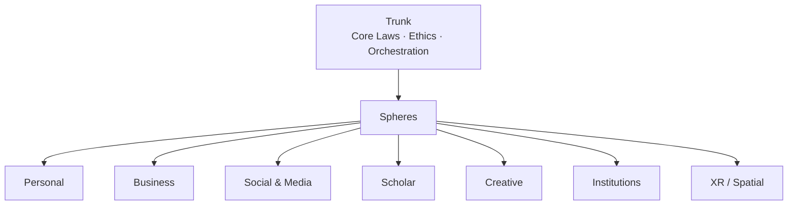
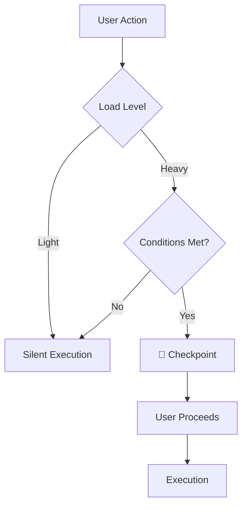

# CHE·NU

**A Sovereign Multi-Agent Operating Space**

---

## Vision

CHE·NU provides a coherent structure for humans to navigate life, work, and collaboration with AI agents.

- Multi-sphere operating space
- Human sovereignty by design
- Ethics enforced by architecture
- Scales from individual to institutional use
- Native progression from 2D to XR

---

## The Problem

Modern digital life is fragmented and opaque.

- Tools are scattered across platforms with no unified structure
- AI systems make implicit decisions without user awareness
- Behavioral nudging and silent optimization erode trust
- Users lack clarity on what AI does on their behalf
- Institutions cannot adopt AI without accountability guarantees

---

## The Opportunity

A new category of system is needed:

- One that structures human-AI collaboration
- Where agents assist but never decide
- Where ethics is architectural, not policy-based
- Where clarity replaces manipulation
- Where responsibility remains human

---

## What is CHE·NU?

CHE·NU (pronounced "Chez Nous") is a sovereign operating space where:

- Humans define intent and boundaries
- Agents provide clarity and assistance
- Spheres organize life domains
- A stable trunk governs ethics and orchestration
- All operations are explicit, voluntary, and reversible

---

## Architecture Overview

CHE·NU is organized into three layers:

| Layer | Purpose |
|-------|---------|
| **Trunk** | Core laws, ethics, orchestration |
| **Spheres** | Life domains (Personal, Business, Social, Scholar, XR…) |
| **Agents** | Specialized assistants under human control |

---

## Architecture — Trunk & Spheres

---

## Agents

Agents in CHE·NU are tools, not actors.

| Principle | Meaning |
|-----------|---------|
| No autonomous decisions | Agents clarify, never choose |
| No automatic chaining | All delegation passes through the user |
| No intent inference | Agents do not guess what users want |
| No behavioral memory | No profiling, no moral history |

---

## Agent Roles

| Agent Type | Does | Never Does |
|------------|------|------------|
| Analysis | Describe, organize | Decide, recommend |
| Methodology | Present frameworks | Choose, prioritize |
| Comparison | Compare factually | Judge, prefer |
| Presentation | Format, structure | Modify meaning |

---

## Ethics by Architecture

CHE·NU enforces ethics at the structural level.

| Approach | CHE·NU |
|----------|--------|
| Policy-based ethics | ❌ Can be overridden |
| Training-based ethics | ❌ Opaque, inconsistent |
| **Architecture-based ethics** | ✅ Frozen, verifiable |

Ethics is not a feature. It is the foundation.

---

## Ethical Foundation

The following principles are immutable:

- No agent makes decisions for users
- No moral judgment or scoring
- No behavioral nudging
- Responsibility remains human
- Assistance is explicit and reversible
- Silence mode disables all observation

This foundation is versioned, hashed, and auditable.

---

## Ethics Checkpoints

Ethics Checkpoints are structural moments of clarity.

They are:
- Non-intrusive
- Optional and ignorable
- Never blocking
- Never judging

They appear only when responsibility changes scale.

---

## Ethics Checkpoints — Locations

Checkpoints appear at exactly 4 locations:

| Location | Trigger |
|----------|---------|
| Task Init | Creating a task |
| Context Change | Switching spheres |
| XR / Meeting | Entering spatial mode |
| Replay / Export | Publishing or sharing |

No other checkpoint exists.

---

## Ethics Checkpoints — Workflows

Heavy multi-agent workflows may trigger a checkpoint.

**Definition of HEAVY:**
- Multiple agents involved
- Cross-sphere data
- Persistent output
- XR involvement
- Explicitly declared as complex

**Light workflows never trigger checkpoints.**

---

## Ethics Checkpoints — Flow

---

## Checkpoint Content

| Element | Value |
|---------|-------|
| Icon | 🧭 |
| Message | "Human responsibility active · Assistance optional" |

No warnings. No judgments. No alerts.

---

## Market Context

CHE·NU addresses growing concerns in AI adoption:

| Concern | CHE·NU Response |
|---------|-----------------|
| AI trust deficit | Sovereignty by design |
| Regulatory pressure | Architecture-level compliance |
| Enterprise caution | Auditable ethics |
| User fatigue | Clarity over manipulation |

---

## Use Cases

| Segment | Application |
|---------|-------------|
| Professionals | Unified workspace across life domains |
| Enterprises | AI governance and accountability |
| Institutions | Transparent public-facing AI |
| Creators | Sovereign creative studio |
| Researchers | Knowledge and methodology management |

---

## Roadmap

| Phase | Focus |
|-------|-------|
| **Foundation** | Core architecture, ethics, agents |
| **MVP** | Web interface, vertical application |
| **Scale** | Enterprise features, XR integration |
| **Platform** | API ecosystem, third-party agents |

---

## Why Now

- AI capabilities have reached multi-agent readiness
- Trust and ethics concerns are accelerating
- Regulatory frameworks are forming
- XR adoption is approaching mainstream
- The window for ethical AI infrastructure is open

---

## Summary

✅ Ethics frozen at the core

✅ Responsibility stays human

✅ Agents clarify, never decide

✅ Checkpoints inform, never block

✅ Built to scale from 2D to XR

---

## Closing

> CHE·NU is not an AI that tells users what to do.
> It is a system that ensures users always know what they are doing.

---

# CHE·NU

**Your universe. Your rules. Your clarity.**

🧭
