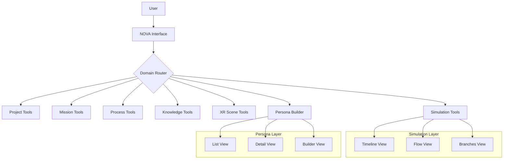

############################################################
#                                                          #
#       CHE·NU SIMULATION + PERSONA LAYERS                 #
#       SYSTEM INDEX & ORCHESTRATOR UPDATES                #
#       SAFE · REPRESENTATIONAL · NON-AUTONOMOUS           #
#                                                          #
############################################################

============================================================
SECTION C1 — SYSTEM INDEX UPDATE
============================================================

--- FILE: /che-nu-sdk/system_index.json (ADD ENTRIES)

{
  "layers": {
    "simulation": {
      "name": "Simulation Layer",
      "description": "Representational simulation and state flow modeling",
      "version": "1.0.0",
      "modules": {
        "SimulationEngine": {
          "path": "/core/simulation.ts",
          "description": "Main simulation engine for representational simulations",
          "subModules": ["StateFlowEngine", "VariationEngine"]
        },
        "StateFlowEngine": {
          "path": "/core/simulation/stateflow.engine.ts",
          "description": "State flow and transition modeling",
          "parent": "SimulationEngine"
        },
        "VariationEngine": {
          "path": "/core/simulation/variation.engine.ts",
          "description": "What-if variation modeling",
          "parent": "SimulationEngine"
        }
      },
      "schemas": ["simulation.schema.json"],
      "safe": {
        "isRepresentational": true,
        "noAutonomy": true,
        "noExecution": true,
        "noPrediction": true
      }
    },
    "persona": {
      "name": "Persona Layer",
      "description": "Representational persona modeling",
      "version": "1.0.0",
      "modules": {
        "PersonaEngine": {
          "path": "/core/persona.ts",
          "description": "Main persona engine for representational personas",
          "subModules": [
            "TraitEngine",
            "StyleEngine",
            "DomainAffinityEngine",
            "EngineAffinityEngine",
            "CapabilityInfluenceEngine"
          ]
        },
        "TraitEngine": {
          "path": "/core/persona/trait.engine.ts",
          "description": "Abstract structural traits",
          "parent": "PersonaEngine"
        },
        "StyleEngine": {
          "path": "/core/persona/style.engine.ts",
          "description": "Work styles for personas",
          "parent": "PersonaEngine"
        },
        "DomainAffinityEngine": {
          "path": "/core/persona/domain_affinity.engine.ts",
          "description": "Domain affinity mapping",
          "parent": "PersonaEngine"
        },
        "EngineAffinityEngine": {
          "path": "/core/persona/engine_affinity.engine.ts",
          "description": "Engine affinity mapping",
          "parent": "PersonaEngine"
        },
        "CapabilityInfluenceEngine": {
          "path": "/core/persona/capability_influence.engine.ts",
          "description": "Capability influence modeling",
          "parent": "PersonaEngine"
        },
        "PersonaTemplates": {
          "path": "/core/persona/persona_templates.ts",
          "description": "Predefined persona templates",
          "parent": "PersonaEngine"
        }
      },
      "schemas": ["persona.schema.json"],
      "safe": {
        "isRepresentational": true,
        "noAutonomy": true,
        "noPsychology": true,
        "noAdvice": true
      }
    }
  }
}

============================================================
SECTION C2 — SYSTEM INDEX MARKDOWN UPDATE
============================================================

--- FILE: /che-nu-sdk/docs/SYSTEM_INDEX.md (ADD SECTIONS)

## SIMULATION LAYER

**Status:** ✅ Complete  
**Version:** 1.0.0  
**Path:** `/che-nu-sdk/core/simulation/`

### Overview

The Simulation Layer provides representational simulation capabilities 
for CHE·NU structures. It models state flows, branches, and what-if 
variations WITHOUT prediction or execution.

### Modules

| Module | Path | Description |
|--------|------|-------------|
| SimulationEngine | `/core/simulation.ts` | Main simulation orchestrator |
| StateFlowEngine | `/core/simulation/stateflow.engine.ts` | State flow modeling |
| VariationEngine | `/core/simulation/variation.engine.ts` | What-if variation modeling |

### Key Types

- `SimulationRun` — Complete simulation with timeline and branches
- `SimulationFrame` — Single point in simulation
- `SimulationBranch` — Alternative path
- `StateFlow` — State flow model
- `VariationAnalysis` — What-if analysis result

### Schema

- `simulation.schema.json`

### SAFE Compliance

- ✅ Representational only
- ✅ No autonomy
- ✅ No execution
- ✅ No prediction

---

## PERSONA LAYER

**Status:** ✅ Complete  
**Version:** 1.0.0  
**Path:** `/che-nu-sdk/core/persona/`

### Overview

The Persona Layer provides representational persona modeling for 
CHE·NU workflows. It models traits, styles, affinities, and 
preferences WITHOUT psychology or advice.

### Modules

| Module | Path | Description |
|--------|------|-------------|
| PersonaEngine | `/core/persona.ts` | Main persona orchestrator |
| TraitEngine | `/core/persona/trait.engine.ts` | Abstract structural traits |
| StyleEngine | `/core/persona/style.engine.ts` | Work styles |
| DomainAffinityEngine | `/core/persona/domain_affinity.engine.ts` | Domain affinity |
| EngineAffinityEngine | `/core/persona/engine_affinity.engine.ts` | Engine affinity |
| CapabilityInfluenceEngine | `/core/persona/capability_influence.engine.ts` | Capability influence |
| PersonaTemplates | `/core/persona/persona_templates.ts` | Predefined templates |

### Key Types

- `PersonaModel` — Complete persona structure
- `PersonaTrait` — Abstract structural trait
- `PersonaStyle` — Work style
- `DomainAffinity` — Domain affinity mapping
- `EngineAffinity` — Engine affinity mapping
- `CapabilityInfluence` — Capability influence

### Templates

| Template | Category | Description |
|----------|----------|-------------|
| Explorer | creative | Discovery and learning focused |
| Architect | analytical | Structure and design focused |
| Analyst | analytical | Data and insights focused |
| Creative | creative | Innovation and expression focused |
| Strategist | analytical | Vision and planning focused |
| Maker | work | Building and execution focused |

### Schema

- `persona.schema.json`

### SAFE Compliance

- ✅ Representational only
- ✅ No autonomy
- ✅ No psychology
- ✅ No advice

============================================================
SECTION C3 — ORCHESTRATOR UPDATE
============================================================

--- FILE: /che-nu-sdk/core/orchestrator.ts (ADD ROUTES)

/**
 * ADDITIONAL ROUTES FOR ORCHESTRATOR
 * Add these to the existing orchestrator.ts
 */

// Add to DOMAIN_TO_ENGINE mapping:
const DOMAIN_ENGINE_ADDITIONS = {
  'Simulation': 'SimulationEngine',
  'StateFlow': 'StateFlowEngine',
  'Variation': 'VariationEngine',
  'Persona': 'PersonaEngine',
  'Trait': 'TraitEngine',
  'Style': 'StyleEngine',
  'DomainAffinity': 'DomainAffinityEngine',
  'EngineAffinity': 'EngineAffinityEngine',
  'CapabilityInfluence': 'CapabilityInfluenceEngine',
};

// Add to route() function:
function routeSimulationDomain(intent: string): string {
  const intentLower = intent.toLowerCase();
  
  if (intentLower.includes('stateflow') || intentLower.includes('state flow')) {
    return 'StateFlowEngine';
  }
  if (intentLower.includes('variation') || intentLower.includes('what-if')) {
    return 'VariationEngine';
  }
  if (intentLower.includes('simulat')) {
    return 'SimulationEngine';
  }
  
  return 'SimulationEngine'; // Default
}

function routePersonaDomain(intent: string): string {
  const intentLower = intent.toLowerCase();
  
  if (intentLower.includes('trait')) {
    return 'TraitEngine';
  }
  if (intentLower.includes('style')) {
    return 'StyleEngine';
  }
  if (intentLower.includes('domain') && intentLower.includes('affinity')) {
    return 'DomainAffinityEngine';
  }
  if (intentLower.includes('engine') && intentLower.includes('affinity')) {
    return 'EngineAffinityEngine';
  }
  if (intentLower.includes('capability') || intentLower.includes('influence')) {
    return 'CapabilityInfluenceEngine';
  }
  if (intentLower.includes('persona')) {
    return 'PersonaEngine';
  }
  
  return 'PersonaEngine'; // Default
}

// Update main route() function to include:
/*
  case 'Simulation':
    return routeSimulationDomain(intent);
  case 'Persona':
    return routePersonaDomain(intent);
*/

============================================================
SECTION C4 — CONTEXT INTERPRETER UPDATE
============================================================

--- FILE: /che-nu-sdk/core/context_interpreter.ts (ADD RULES)

/**
 * ADDITIONAL RULES FOR CONTEXT INTERPRETER
 * Add these to the existing context_interpreter.ts
 */

// Add to DOMAIN_KEYWORDS mapping:
const DOMAIN_KEYWORDS_ADDITIONS = {
  'Simulation': [
    'simulation', 'simulate', 'simulating',
    'state flow', 'stateflow',
    'branch', 'branches', 'branching',
    'timeline', 'frame', 'frames',
    'what-if', 'whatif', 'variation', 'variations',
    'replay', 'playback',
  ],
  'Persona': [
    'persona', 'personas',
    'trait', 'traits',
    'style', 'styles', 'work style',
    'affinity', 'affinities',
    'preference', 'preferences',
    'cognitive', 'behavioral',
    'explorer', 'architect', 'analyst', 'creative', 'strategist', 'maker',
  ],
};

// Add to classify() function:
function checkSimulationDomain(tokens: string[]): boolean {
  const simulationKeywords = [
    'simulation', 'simulate', 'simulating',
    'stateflow', 'state-flow',
    'branch', 'variation', 'what-if',
    'timeline', 'frame', 'replay',
  ];
  
  return tokens.some(token => 
    simulationKeywords.some(kw => token.includes(kw))
  );
}

function checkPersonaDomain(tokens: string[]): boolean {
  const personaKeywords = [
    'persona', 'trait', 'style',
    'affinity', 'preference',
    'cognitive', 'behavioral',
    'explorer', 'architect', 'analyst',
  ];
  
  return tokens.some(token => 
    personaKeywords.some(kw => token.includes(kw))
  );
}

// Update main classify() function to include:
/*
  if (checkSimulationDomain(tokens)) {
    return { domain: 'Simulation', confidence: calculateConfidence(tokens, 'Simulation') };
  }
  if (checkPersonaDomain(tokens)) {
    return { domain: 'Persona', confidence: calculateConfidence(tokens, 'Persona') };
  }
*/

============================================================
SECTION C5 — UI FLOW UPDATE
============================================================

--- FILE: /che-nu-app/docs/UI_FLOW.md (ADD SECTIONS)

## SIMULATION WORKFLOW

```
User → NOVA → Simulation Tools
   → Select subject (project/mission/process/persona)
   → Run simulation
   → View timeline
   → Explore branches
   → Analyze variations
   → Export results (representational)
```

### Views

1. **Timeline View** — Linear frame-by-frame progression
2. **Flow View** — Visual flow with branch indicators
3. **Branches View** — All alternative paths

### SAFE Notice

All simulations are representational only:
- No prediction
- No execution
- No optimization

---

## PERSONA WORKFLOW

```
User → NOVA → Persona Builder
   → Choose template OR create new
   → Add/remove traits
   → Add/remove styles
   → Set domain affinities
   → Set engine affinities
   → Configure process preferences
   → Save persona (representational)
```

### Views

1. **List View** — Grid of all personas
2. **Detail View** — Full persona visualization
3. **Builder View** — Trait/style configuration

### SAFE Notice

All personas are representational only:
- No psychology
- No advice
- No real personality modeling

---

## UPDATED MERMAID DIAGRAM



============================================================
SECTION C6 — WORKFLOWGRID UPDATE
============================================================

--- FILE: /che-nu-frontend/components/WorkflowGrid.tsx (ADD ITEMS)

/**
 * ADD TO EXISTING WorkflowGrid ITEMS ARRAY
 */

const SIMULATION_PERSONA_ITEMS = [
  {
    id: 'simulation',
    name: 'Simulation Tools',
    icon: '🎬',
    description: 'Representational simulations and state flows',
    route: '/simulation',
    color: '#3EB4A2', // cenoteTurquoise
    category: 'advanced',
  },
  {
    id: 'persona',
    name: 'Persona Builder',
    icon: '👤',
    description: 'Create representational personas',
    route: '/persona',
    color: '#D8B26A', // sacredGold
    category: 'core',
  },
];

// Add to existing WORKFLOW_ITEMS array

============================================================
END OF SIMULATION + PERSONA SYSTEM UPDATES
============================================================
