============================================================
CHE·NU — SKILL MODULE INTEGRATION (CORRECTED)
TRANSVERSAL ENGINE — NOT A SPHERE
SAFE · REPRESENTATIONAL · NON-AUTONOMOUS
============================================================

CLASSIFICATION: TRANSVERSAL MODULE / ENGINE
CATEGORY: Same as MemoryManager, ReplayEngine, HyperFabric
NOT A SPHERE — NOT A DOMAIN OF LIFE

============================================================

--- FILE: /che-nu-sdk/core/skill.ts

/**
 * CHE·NU SDK — Skill Engine
 * ==========================
 * SAFE · NON-AUTONOMOUS · REPRESENTATIONAL
 * 
 * CLASSIFICATION: TRANSVERSAL MODULE (NOT A SPHERE)
 * 
 * Representational skill structures for CHE·NU.
 * Used internally by workflows, agents, and analysis.
 * Similar to: MemoryManager, ReplayEngine, HyperFabric
 * 
 * @module SkillEngine
 * @version 1.0.0
 */

// ============================================================
// TYPES
// ============================================================

export interface SkillDomain {
  id: string;
  name: string;
  category: 'technical' | 'creative' | 'analytical' | 'interpersonal' | 'strategic' | 'operational';
  description: string;
  parentDomain?: string;
  subSkills?: string[];
  tags?: string[];
}

export interface SkillNode {
  id: string;
  name: string;
  level: number;
  domain: string;
  proficiency: 'novice' | 'beginner' | 'intermediate' | 'advanced' | 'expert' | 'master';
  dependencies: string[];
  children: string[];
  metadata?: Record<string, unknown>;
}

export interface SkillTree {
  rootId: string;
  nodes: SkillNode[];
  edges: SkillEdge[];
  meta: SkillMeta;
}

export interface SkillEdge {
  id: string;
  source: string;
  target: string;
  type: 'prerequisite' | 'related' | 'advancement' | 'specialization';
  weight: number;
}

export interface SkillEvaluation {
  skillId: string;
  skillName: string;
  currentLevel: string;
  score: number;
  strengths: string[];
  gaps: string[];
  recommendations: string[];
  evaluatedAt: string;
}

export interface LearningPath {
  id: string;
  name: string;
  targetSkill: string;
  currentLevel: string;
  targetLevel: string;
  steps: LearningStep[];
  estimatedDuration: string;
  meta: SkillMeta;
}

export interface LearningStep {
  order: number;
  skillId: string;
  skillName: string;
  action: string;
  resources: string[];
  milestone: string;
}

export interface SkillMeta {
  source: string;
  generated: string;
  version: string;
  moduleType: 'transversal';
  safe: {
    isRepresentational: boolean;
    noAutonomy: boolean;
    noAgents: boolean;
  };
}

export interface SkillEngineConfig {
  maxNodes?: number;
  maxDepth?: number;
  defaultProficiency?: SkillNode['proficiency'];
}

// ============================================================
// SKILL ENGINE CLASS — TRANSVERSAL MODULE
// ============================================================

export class SkillEngine {
  private config: SkillEngineConfig;
  private readonly VERSION = '1.0.0';
  private readonly MODULE_TYPE = 'transversal'; // NOT a sphere

  constructor(config: SkillEngineConfig = {}) {
    this.config = {
      maxNodes: config.maxNodes || 200,
      maxDepth: config.maxDepth || 10,
      defaultProficiency: config.defaultProficiency || 'beginner',
    };
  }

  /**
   * List available skill domains
   * SAFE: Returns static representational data
   */
  listSkillDomains(): SkillDomain[] {
    return [
      {
        id: 'domain-technical',
        name: 'Technical Skills',
        category: 'technical',
        description: 'Programming, engineering, system design, and technical problem-solving',
        subSkills: ['programming', 'system-design', 'debugging', 'architecture'],
        tags: ['tech', 'engineering', 'development'],
      },
      {
        id: 'domain-creative',
        name: 'Creative Skills',
        category: 'creative',
        description: 'Design, art, content creation, and creative expression',
        subSkills: ['design', 'writing', 'visual-arts', 'multimedia'],
        tags: ['art', 'design', 'creation'],
      },
      {
        id: 'domain-analytical',
        name: 'Analytical Skills',
        category: 'analytical',
        description: 'Data analysis, research, critical thinking, and problem decomposition',
        subSkills: ['data-analysis', 'research', 'critical-thinking', 'statistics'],
        tags: ['analysis', 'research', 'data'],
      },
      {
        id: 'domain-interpersonal',
        name: 'Interpersonal Skills',
        category: 'interpersonal',
        description: 'Communication, collaboration, leadership, and relationship building',
        subSkills: ['communication', 'leadership', 'teamwork', 'negotiation'],
        tags: ['people', 'social', 'communication'],
      },
      {
        id: 'domain-strategic',
        name: 'Strategic Skills',
        category: 'strategic',
        description: 'Planning, decision-making, vision setting, and long-term thinking',
        subSkills: ['planning', 'decision-making', 'vision', 'risk-assessment'],
        tags: ['strategy', 'planning', 'leadership'],
      },
      {
        id: 'domain-operational',
        name: 'Operational Skills',
        category: 'operational',
        description: 'Process management, efficiency optimization, and execution',
        subSkills: ['project-management', 'process-optimization', 'quality-control'],
        tags: ['operations', 'execution', 'management'],
      },
    ];
  }

  /**
   * Build a representational skill tree from input
   * SAFE: Produces structural output only, no execution
   */
  buildSkillTree(input: string | Record<string, unknown>): SkillTree {
    const inputStr = typeof input === 'string' ? input : JSON.stringify(input);
    const timestamp = new Date().toISOString();

    const nodes = this.parseNodesFromInput(inputStr);
    const edges = this.generateEdges(nodes);
    const rootId = nodes.length > 0 ? nodes[0].id : 'root';

    return {
      rootId,
      nodes,
      edges,
      meta: {
        source: inputStr,
        generated: timestamp,
        version: this.VERSION,
        moduleType: this.MODULE_TYPE,
        safe: {
          isRepresentational: true,
          noAutonomy: true,
          noAgents: true,
        },
      },
    };
  }

  /**
   * Evaluate a skill based on input criteria
   * SAFE: Returns representational evaluation, no side effects
   */
  evaluateSkill(
    skillId: string,
    skillName: string,
    criteria?: Record<string, unknown>
  ): SkillEvaluation {
    const score = this.calculateScore(criteria);
    const level = this.scoreToLevel(score);

    return {
      skillId,
      skillName,
      currentLevel: level,
      score,
      strengths: this.identifyStrengths(skillName, score),
      gaps: this.identifyGaps(skillName, score),
      recommendations: this.generateRecommendations(skillName, level),
      evaluatedAt: new Date().toISOString(),
    };
  }

  /**
   * Generate a learning path for skill development
   * SAFE: Returns representational path, no execution
   */
  generateLearningPath(
    targetSkill: string,
    currentLevel: string = 'novice',
    targetLevel: string = 'advanced'
  ): LearningPath {
    const steps = this.buildLearningSteps(targetSkill, currentLevel, targetLevel);

    return {
      id: `path-${Date.now()}`,
      name: `Path to ${targetLevel} ${targetSkill}`,
      targetSkill,
      currentLevel,
      targetLevel,
      steps,
      estimatedDuration: this.estimateDuration(steps.length),
      meta: {
        source: `Learning path: ${targetSkill} from ${currentLevel} to ${targetLevel}`,
        generated: new Date().toISOString(),
        version: this.VERSION,
        moduleType: this.MODULE_TYPE,
        safe: {
          isRepresentational: true,
          noAutonomy: true,
          noAgents: true,
        },
      },
    };
  }

  /**
   * Get engine metadata
   * SAFE: Static metadata only
   */
  meta(): Record<string, unknown> {
    return {
      name: 'SkillEngine',
      version: this.VERSION,
      description: 'Transversal skill analysis and mapping engine for CHE·NU',
      classification: {
        type: 'transversal_module',
        isNotASphere: true,
        category: 'engine',
        similarTo: ['MemoryManager', 'ReplayEngine', 'HyperFabric', 'DepthLensSystem'],
      },
      safe: {
        isRepresentational: true,
        noAutonomy: true,
        noAgents: true,
        noExecution: true,
        noPersistentMemory: true,
      },
      capabilities: [
        'listSkillDomains',
        'buildSkillTree',
        'evaluateSkill',
        'generateLearningPath',
      ],
      config: this.config,
    };
  }

  // ============================================================
  // PRIVATE HELPER METHODS
  // ============================================================

  private parseNodesFromInput(input: string): SkillNode[] {
    const nodes: SkillNode[] = [];
    const lowerInput = input.toLowerCase();
    const domains = this.listSkillDomains();

    let nodeId = 0;
    for (const domain of domains) {
      for (const keyword of domain.tags || []) {
        if (lowerInput.includes(keyword)) {
          nodeId++;
          nodes.push({
            id: `skill-${String(nodeId).padStart(3, '0')}`,
            name: domain.name,
            level: 1,
            domain: domain.id,
            proficiency: this.config.defaultProficiency!,
            dependencies: [],
            children: domain.subSkills || [],
          });
          break;
        }
      }
    }

    if (nodes.length === 0) {
      nodes.push({
        id: 'skill-001',
        name: 'General Skill',
        level: 0,
        domain: 'domain-general',
        proficiency: 'beginner',
        dependencies: [],
        children: [],
      });
    }

    return nodes.slice(0, this.config.maxNodes);
  }

  private generateEdges(nodes: SkillNode[]): SkillEdge[] {
    const edges: SkillEdge[] = [];
    let edgeId = 0;

    for (let i = 0; i < nodes.length; i++) {
      for (let j = i + 1; j < nodes.length; j++) {
        edgeId++;
        edges.push({
          id: `edge-${String(edgeId).padStart(3, '0')}`,
          source: nodes[i].id,
          target: nodes[j].id,
          type: 'related',
          weight: 0.5,
        });
      }
    }

    return edges;
  }

  private calculateScore(criteria?: Record<string, unknown>): number {
    if (!criteria) return 50;
    const values = Object.values(criteria).filter(v => typeof v === 'number') as number[];
    if (values.length === 0) return 50;
    return Math.round(values.reduce((a, b) => a + b, 0) / values.length);
  }

  private scoreToLevel(score: number): string {
    if (score >= 95) return 'master';
    if (score >= 85) return 'expert';
    if (score >= 70) return 'advanced';
    if (score >= 50) return 'intermediate';
    if (score >= 30) return 'beginner';
    return 'novice';
  }

  private identifyStrengths(skillName: string, score: number): string[] {
    const strengths: string[] = [];
    if (score >= 70) strengths.push(`Strong foundation in ${skillName}`);
    if (score >= 50) strengths.push('Consistent application of core concepts');
    if (score >= 30) strengths.push('Growing understanding of fundamentals');
    return strengths.length > 0 ? strengths : ['Potential for growth identified'];
  }

  private identifyGaps(skillName: string, score: number): string[] {
    const gaps: string[] = [];
    if (score < 90) gaps.push('Advanced techniques require development');
    if (score < 70) gaps.push(`Deeper ${skillName} expertise needed`);
    if (score < 50) gaps.push('Core concepts need reinforcement');
    return gaps;
  }

  private generateRecommendations(skillName: string, level: string): string[] {
    const recommendations: string[] = [
      `Continue practicing ${skillName} fundamentals`,
      `Seek mentorship from ${level === 'novice' ? 'intermediate' : 'expert'} practitioners`,
      'Apply skills in real-world projects',
    ];
    return recommendations;
  }

  private buildLearningSteps(
    targetSkill: string,
    currentLevel: string,
    targetLevel: string
  ): LearningStep[] {
    const levels = ['novice', 'beginner', 'intermediate', 'advanced', 'expert', 'master'];
    const currentIdx = levels.indexOf(currentLevel);
    const targetIdx = levels.indexOf(targetLevel);
    const steps: LearningStep[] = [];

    for (let i = currentIdx; i < targetIdx; i++) {
      steps.push({
        order: i - currentIdx + 1,
        skillId: `step-${i + 1}`,
        skillName: `${targetSkill} - ${levels[i + 1]} level`,
        action: `Progress from ${levels[i]} to ${levels[i + 1]}`,
        resources: [`${targetSkill} ${levels[i + 1]} training materials`],
        milestone: `Achieve ${levels[i + 1]} proficiency`,
      });
    }

    return steps;
  }

  private estimateDuration(stepCount: number): string {
    const months = stepCount * 2;
    if (months < 12) return `${months} months`;
    const years = Math.round(months / 12 * 10) / 10;
    return `${years} year${years !== 1 ? 's' : ''}`;
  }
}

// ============================================================
// FACTORY FUNCTION
// ============================================================

export function createSkillEngine(config?: SkillEngineConfig): SkillEngine {
  return new SkillEngine(config);
}

export default SkillEngine;

--- FILE: /che-nu-sdk/schemas/skill.schema.json

{
  "$schema": "http://json-schema.org/draft-07/schema#",
  "$id": "https://che-nu.io/schemas/skill.schema.json",
  "title": "CHE·NU Skill Schema",
  "description": "Schema for representational skill structures in CHE·NU. TRANSVERSAL MODULE - NOT A SPHERE. SAFE compliant.",
  "type": "object",
  "definitions": {
    "ModuleClassification": {
      "type": "object",
      "description": "Classification confirming this is a TRANSVERSAL MODULE, not a Sphere",
      "properties": {
        "type": {
          "type": "string",
          "const": "transversal_module"
        },
        "isNotASphere": {
          "type": "boolean",
          "const": true
        },
        "category": {
          "type": "string",
          "const": "engine"
        },
        "similarTo": {
          "type": "array",
          "items": { "type": "string" },
          "examples": [["MemoryManager", "ReplayEngine", "HyperFabric", "DepthLensSystem"]]
        }
      },
      "required": ["type", "isNotASphere", "category"]
    },
    "SkillDomain": {
      "type": "object",
      "description": "A skill domain category",
      "required": ["id", "name", "category", "description"],
      "properties": {
        "id": {
          "type": "string",
          "pattern": "^domain-[a-z]+$"
        },
        "name": {
          "type": "string",
          "minLength": 1,
          "maxLength": 100
        },
        "category": {
          "type": "string",
          "enum": ["technical", "creative", "analytical", "interpersonal", "strategic", "operational"]
        },
        "description": {
          "type": "string",
          "maxLength": 500
        },
        "parentDomain": {
          "type": "string"
        },
        "subSkills": {
          "type": "array",
          "items": { "type": "string" }
        },
        "tags": {
          "type": "array",
          "items": { "type": "string" }
        }
      }
    },
    "SkillNode": {
      "type": "object",
      "description": "A node in the skill tree",
      "required": ["id", "name", "level", "domain", "proficiency", "dependencies", "children"],
      "properties": {
        "id": {
          "type": "string",
          "pattern": "^skill-[0-9]{3}$"
        },
        "name": {
          "type": "string"
        },
        "level": {
          "type": "integer",
          "minimum": 0,
          "maximum": 10
        },
        "domain": {
          "type": "string"
        },
        "proficiency": {
          "type": "string",
          "enum": ["novice", "beginner", "intermediate", "advanced", "expert", "master"]
        },
        "dependencies": {
          "type": "array",
          "items": { "type": "string" }
        },
        "children": {
          "type": "array",
          "items": { "type": "string" }
        },
        "metadata": {
          "type": "object"
        }
      }
    },
    "SkillEdge": {
      "type": "object",
      "description": "Connection between skill nodes",
      "required": ["id", "source", "target", "type", "weight"],
      "properties": {
        "id": {
          "type": "string",
          "pattern": "^edge-[0-9]{3}$"
        },
        "source": {
          "type": "string"
        },
        "target": {
          "type": "string"
        },
        "type": {
          "type": "string",
          "enum": ["prerequisite", "related", "advancement", "specialization"]
        },
        "weight": {
          "type": "number",
          "minimum": 0,
          "maximum": 1
        }
      }
    },
    "SkillTree": {
      "type": "object",
      "description": "Complete skill tree structure",
      "required": ["rootId", "nodes", "edges", "meta"],
      "properties": {
        "rootId": {
          "type": "string"
        },
        "nodes": {
          "type": "array",
          "items": { "$ref": "#/definitions/SkillNode" }
        },
        "edges": {
          "type": "array",
          "items": { "$ref": "#/definitions/SkillEdge" }
        },
        "meta": {
          "$ref": "#/definitions/SkillMeta"
        }
      }
    },
    "SkillEvaluation": {
      "type": "object",
      "description": "Skill evaluation result",
      "required": ["skillId", "skillName", "currentLevel", "score", "strengths", "gaps", "recommendations", "evaluatedAt"],
      "properties": {
        "skillId": { "type": "string" },
        "skillName": { "type": "string" },
        "currentLevel": { "type": "string" },
        "score": { "type": "number", "minimum": 0, "maximum": 100 },
        "strengths": { "type": "array", "items": { "type": "string" } },
        "gaps": { "type": "array", "items": { "type": "string" } },
        "recommendations": { "type": "array", "items": { "type": "string" } },
        "evaluatedAt": { "type": "string", "format": "date-time" }
      }
    },
    "LearningStep": {
      "type": "object",
      "description": "A step in a learning path",
      "required": ["order", "skillId", "skillName", "action", "resources", "milestone"],
      "properties": {
        "order": { "type": "integer", "minimum": 1 },
        "skillId": { "type": "string" },
        "skillName": { "type": "string" },
        "action": { "type": "string" },
        "resources": { "type": "array", "items": { "type": "string" } },
        "milestone": { "type": "string" }
      }
    },
    "LearningPath": {
      "type": "object",
      "description": "A learning path for skill development",
      "required": ["id", "name", "targetSkill", "currentLevel", "targetLevel", "steps", "estimatedDuration", "meta"],
      "properties": {
        "id": { "type": "string" },
        "name": { "type": "string" },
        "targetSkill": { "type": "string" },
        "currentLevel": { "type": "string" },
        "targetLevel": { "type": "string" },
        "steps": { "type": "array", "items": { "$ref": "#/definitions/LearningStep" } },
        "estimatedDuration": { "type": "string" },
        "meta": { "$ref": "#/definitions/SkillMeta" }
      }
    },
    "SkillMeta": {
      "type": "object",
      "description": "Metadata for skill structures",
      "required": ["source", "generated", "version", "moduleType", "safe"],
      "properties": {
        "source": { "type": "string" },
        "generated": { "type": "string", "format": "date-time" },
        "version": { "type": "string", "pattern": "^[0-9]+\\.[0-9]+\\.[0-9]+$" },
        "moduleType": {
          "type": "string",
          "const": "transversal",
          "description": "MUST be 'transversal' - this is NOT a sphere"
        },
        "safe": {
          "type": "object",
          "required": ["isRepresentational", "noAutonomy", "noAgents"],
          "properties": {
            "isRepresentational": { "type": "boolean", "const": true },
            "noAutonomy": { "type": "boolean", "const": true },
            "noAgents": { "type": "boolean", "const": true }
          }
        }
      }
    }
  },
  "properties": {
    "classification": {
      "$ref": "#/definitions/ModuleClassification"
    },
    "domains": {
      "type": "array",
      "items": { "$ref": "#/definitions/SkillDomain" }
    },
    "tree": {
      "$ref": "#/definitions/SkillTree"
    },
    "evaluation": {
      "$ref": "#/definitions/SkillEvaluation"
    },
    "learningPath": {
      "$ref": "#/definitions/LearningPath"
    }
  }
}

--- FILE: /che-nu-sdk/system_index.json (ADD TO EXISTING - CORE MODULES SECTION ONLY)

{
  "modules": {
    "transversal_engines": [
      {
        "name": "SkillEngine",
        "path": "/che-nu-sdk/core/skill.ts",
        "status": "complete",
        "classification": "transversal_module",
        "isNotASphere": true,
        "similarTo": ["MemoryManager", "ReplayEngine", "HyperFabric", "DepthLensSystem"],
        "dependencies": [],
        "methods": [
          "listSkillDomains",
          "buildSkillTree",
          "evaluateSkill",
          "generateLearningPath",
          "meta"
        ]
      }
    ]
  },
  "schemas": [
    {
      "name": "skill.schema.json",
      "path": "/che-nu-sdk/schemas/skill.schema.json",
      "status": "complete",
      "classification": "transversal_module_schema"
    }
  ]
}

--- FILE: /che-nu-sdk/docs/SYSTEM_INDEX.md (ADD TO EXISTING)

## Transversal Modules / Engines

These are **NOT Spheres**. They are internal modules used across all spheres.

| Module | Path | Status | Similar To |
|--------|------|--------|------------|
| MemoryManager | `/che-nu-sdk/core/memory_manager.ts` | Complete | - |
| ReplayEngine | `/che-nu-sdk/core/replay_engine.ts` | Complete | - |
| HyperFabric | `/che-nu-sdk/core/hyper_fabric.ts` | Complete | - |
| DepthLensSystem | `/che-nu-sdk/core/depth_lens.ts` | Complete | - |
| CartographyEngine | `/che-nu-sdk/core/cartography.ts` | Complete | - |
| ProjectionEngine | `/che-nu-sdk/core/projection.ts` | Complete | - |
| **SkillEngine** | `/che-nu-sdk/core/skill.ts` | **Complete** | MemoryManager, HyperFabric |

## Transversal Module Schemas

| Schema | Path | Status |
|--------|------|--------|
| skill.schema.json | `/che-nu-sdk/schemas/skill.schema.json` | Complete |

**IMPORTANT**: SkillEngine is a TRANSVERSAL MODULE, NOT a Sphere.
It does NOT appear in UniverseOS.getRootSpheres().

--- FILE: /che-nu-app/docs/UI_FLOW.md (ADD TO EXISTING)

## Skill Analysis Workflows (Transversal Module)

**Note**: These workflows use the SkillEngine transversal module.
Skill is NOT a Sphere - it is an internal engine.

### Available Skill Workflows:

1. **Skill Analysis**
   - Analyze current skill levels
   - Identify strengths and gaps
   - Get improvement recommendations

2. **Skill Tree Builder**
   - Build visual skill trees
   - Map skill relationships
   - Define learning dependencies

3. **Skill Evaluation**
   - Evaluate specific skills
   - Score proficiency levels
   - Track progress over time

### Mermaid Flow (Transversal Module Access):


--- FILE: /che-nu-app/docs/WIREFRAMES.md (ADD TO EXISTING)

### SKILL ANALYSIS WIREFRAME (Transversal Module)

**Note**: SkillEngine is a TRANSVERSAL MODULE, not a Sphere.

```
+-----------------------------------------------------+
| SKILL ANALYSIS                      [Transversal]   |
+-----------------------------------------------------+
| Skill Domains:                                       |
| ☑ Technical    ☑ Creative    ☑ Analytical          |
| ☑ Interpersonal ☑ Strategic  ☑ Operational         |
+-----------------------------------------------------+
| Current Evaluation:                                  |
| ├─ Score: 72/100                                    |
| ├─ Level: Intermediate                              |
| └─ Strengths: [list]                                |
+-----------------------------------------------------+
| [Analyze] [Build Tree] [Generate Path]              |
+-----------------------------------------------------+
```

### SKILL TREE BUILDER WIREFRAME

```
+-----------------------------------------------------+
| SKILL TREE BUILDER                  [Transversal]   |
+-----------------------------------------------------+
|                    [Root Skill]                      |
|                         │                            |
|            ┌───────────┼───────────┐                |
|            ▼           ▼           ▼                |
|       [Technical] [Creative] [Analytical]           |
|            │                       │                |
|       ┌────┴────┐             ┌────┴────┐          |
|       ▼         ▼             ▼         ▼          |
|   [Coding] [Design]      [Research] [Stats]        |
+-----------------------------------------------------+
| [Save Tree] [Export] [Back]                         |
+-----------------------------------------------------+
```

--- FILE: /che-nu-frontend/pages/skill.tsx

/**
 * CHE·NU Frontend — Skill Analysis Page
 * ======================================
 * TRANSVERSAL MODULE PAGE - NOT A SPHERE
 * 
 * Uses SkillEngine for skill analysis, tree building, and evaluation.
 */

import React, { useState, useEffect } from 'react';
import Layout from '../components/Layout';
import SkillViewer from '../components/SkillViewer';
import { runCheNu } from '../services/chenu.service';

// Types
interface SkillDomain {
  id: string;
  name: string;
  category: string;
  description: string;
}

interface SkillEvaluation {
  skillId: string;
  skillName: string;
  currentLevel: string;
  score: number;
  strengths: string[];
  gaps: string[];
  recommendations: string[];
}

interface SkillTree {
  rootId: string;
  nodes: Array<{
    id: string;
    name: string;
    level: number;
    proficiency: string;
  }>;
  edges: Array<{
    source: string;
    target: string;
    type: string;
  }>;
}

type ViewMode = 'domains' | 'evaluation' | 'tree' | 'path';

export default function SkillPage() {
  const [viewMode, setViewMode] = useState<ViewMode>('domains');
  const [domains, setDomains] = useState<SkillDomain[]>([]);
  const [evaluation, setEvaluation] = useState<SkillEvaluation | null>(null);
  const [skillTree, setSkillTree] = useState<SkillTree | null>(null);
  const [loading, setLoading] = useState(false);
  const [error, setError] = useState<string | null>(null);

  // Load domains on mount
  useEffect(() => {
    loadSkillDomains();
  }, []);

  const loadSkillDomains = async () => {
    setLoading(true);
    try {
      const result = await runCheNu('list skill domains');
      if (result?.domains) {
        setDomains(result.domains);
      }
    } catch (err) {
      setError('Failed to load skill domains');
    } finally {
      setLoading(false);
    }
  };

  const handleAnalyzeSkills = async () => {
    setLoading(true);
    setError(null);
    try {
      const result = await runCheNu('evaluate my technical and creative skills');
      if (result?.evaluation) {
        setEvaluation(result.evaluation);
        setViewMode('evaluation');
      }
    } catch (err) {
      setError('Failed to analyze skills');
    } finally {
      setLoading(false);
    }
  };

  const handleBuildTree = async () => {
    setLoading(true);
    setError(null);
    try {
      const result = await runCheNu('build skill tree for technical development');
      if (result?.tree) {
        setSkillTree(result.tree);
        setViewMode('tree');
      }
    } catch (err) {
      setError('Failed to build skill tree');
    } finally {
      setLoading(false);
    }
  };

  const handleGeneratePath = async () => {
    setLoading(true);
    setError(null);
    try {
      const result = await runCheNu('generate learning path from beginner to advanced programming');
      if (result?.path) {
        setViewMode('path');
      }
    } catch (err) {
      setError('Failed to generate learning path');
    } finally {
      setLoading(false);
    }
  };

  return (
    <Layout>
      <div className="skill-page">
        {/* Header */}
        <header className="skill-header">
          <h1>Skill Analysis</h1>
          <span className="module-badge">Transversal Module</span>
          <p className="subtitle">
            Analyze skills, build skill trees, and generate learning paths.
            <br />
            <small>Note: SkillEngine is a transversal module, not a Sphere.</small>
          </p>
        </header>

        {/* Navigation Tabs */}
        <nav className="skill-nav">
          <button
            className={viewMode === 'domains' ? 'active' : ''}
            onClick={() => setViewMode('domains')}
          >
            Domains
          </button>
          <button
            className={viewMode === 'evaluation' ? 'active' : ''}
            onClick={handleAnalyzeSkills}
          >
            Analyze Skills
          </button>
          <button
            className={viewMode === 'tree' ? 'active' : ''}
            onClick={handleBuildTree}
          >
            Build Tree
          </button>
          <button
            className={viewMode === 'path' ? 'active' : ''}
            onClick={handleGeneratePath}
          >
            Learning Path
          </button>
        </nav>

        {/* Error Display */}
        {error && (
          <div className="error-message">
            {error}
          </div>
        )}

        {/* Loading State */}
        {loading && (
          <div className="loading">
            Processing...
          </div>
        )}

        {/* Content */}
        <main className="skill-content">
          <SkillViewer
            viewMode={viewMode}
            domains={domains}
            evaluation={evaluation}
            skillTree={skillTree}
          />
        </main>

        {/* Footer */}
        <footer className="skill-footer">
          <p>SkillEngine v1.0.0 — Transversal Module — SAFE Compliant</p>
        </footer>
      </div>

      <style jsx>{`
        .skill-page {
          padding: 2rem;
          max-width: 1200px;
          margin: 0 auto;
        }

        .skill-header {
          margin-bottom: 2rem;
        }

        .skill-header h1 {
          color: #D8B26A;
          margin-bottom: 0.5rem;
        }

        .module-badge {
          display: inline-block;
          background: #3F7249;
          color: white;
          padding: 0.25rem 0.75rem;
          border-radius: 4px;
          font-size: 0.75rem;
          margin-bottom: 1rem;
        }

        .subtitle {
          color: #8D8371;
        }

        .skill-nav {
          display: flex;
          gap: 1rem;
          margin-bottom: 2rem;
          border-bottom: 2px solid #2F4C39;
          padding-bottom: 1rem;
        }

        .skill-nav button {
          padding: 0.75rem 1.5rem;
          background: #1E1F22;
          border: 1px solid #3F7249;
          color: #E9E4D6;
          border-radius: 4px;
          cursor: pointer;
          transition: all 0.2s;
        }

        .skill-nav button:hover {
          background: #2F4C39;
        }

        .skill-nav button.active {
          background: #3F7249;
          color: white;
        }

        .error-message {
          background: #7A593A;
          color: white;
          padding: 1rem;
          border-radius: 4px;
          margin-bottom: 1rem;
        }

        .loading {
          text-align: center;
          padding: 2rem;
          color: #D8B26A;
        }

        .skill-content {
          background: #1E1F22;
          border: 1px solid #2F4C39;
          border-radius: 8px;
          padding: 2rem;
          min-height: 400px;
        }

        .skill-footer {
          margin-top: 2rem;
          text-align: center;
          color: #8D8371;
          font-size: 0.875rem;
        }
      `}</style>
    </Layout>
  );
}

--- FILE: /che-nu-frontend/components/SkillViewer.tsx

/**
 * CHE·NU Frontend — Skill Viewer Component
 * =========================================
 * TRANSVERSAL MODULE COMPONENT
 * 
 * Renders skill domains, evaluations, trees, and learning paths.
 */

import React from 'react';

// Types
interface SkillDomain {
  id: string;
  name: string;
  category: string;
  description: string;
  subSkills?: string[];
  tags?: string[];
}

interface SkillEvaluation {
  skillId: string;
  skillName: string;
  currentLevel: string;
  score: number;
  strengths: string[];
  gaps: string[];
  recommendations: string[];
}

interface SkillNode {
  id: string;
  name: string;
  level: number;
  proficiency: string;
}

interface SkillEdge {
  source: string;
  target: string;
  type: string;
}

interface SkillTree {
  rootId: string;
  nodes: SkillNode[];
  edges: SkillEdge[];
}

type ViewMode = 'domains' | 'evaluation' | 'tree' | 'path';

interface SkillViewerProps {
  viewMode: ViewMode;
  domains: SkillDomain[];
  evaluation: SkillEvaluation | null;
  skillTree: SkillTree | null;
}

export default function SkillViewer({
  viewMode,
  domains,
  evaluation,
  skillTree,
}: SkillViewerProps) {

  // Render Domains View
  const renderDomains = () => (
    <div className="domains-view">
      <h2>Skill Domains</h2>
      <div className="domains-grid">
        {domains.map((domain) => (
          <div key={domain.id} className="domain-card">
            <h3>{domain.name}</h3>
            <span className="category-badge">{domain.category}</span>
            <p>{domain.description}</p>
            {domain.subSkills && domain.subSkills.length > 0 && (
              <div className="sub-skills">
                <strong>Sub-skills:</strong>
                <ul>
                  {domain.subSkills.map((skill, idx) => (
                    <li key={idx}>{skill}</li>
                  ))}
                </ul>
              </div>
            )}
          </div>
        ))}
      </div>
    </div>
  );

  // Render Evaluation View
  const renderEvaluation = () => {
    if (!evaluation) {
      return <p>No evaluation data. Click "Analyze Skills" to start.</p>;
    }

    return (
      <div className="evaluation-view">
        <h2>Skill Evaluation</h2>
        
        <div className="evaluation-header">
          <div className="score-display">
            <span className="score">{evaluation.score}</span>
            <span className="score-label">/ 100</span>
          </div>
          <div className="level-badge">{evaluation.currentLevel}</div>
        </div>

        <div className="evaluation-sections">
          <div className="section strengths">
            <h3>✓ Strengths</h3>
            <ul>
              {evaluation.strengths.map((s, idx) => (
                <li key={idx}>{s}</li>
              ))}
            </ul>
          </div>

          <div className="section gaps">
            <h3>△ Gaps</h3>
            <ul>
              {evaluation.gaps.map((g, idx) => (
                <li key={idx}>{g}</li>
              ))}
            </ul>
          </div>

          <div className="section recommendations">
            <h3>→ Recommendations</h3>
            <ul>
              {evaluation.recommendations.map((r, idx) => (
                <li key={idx}>{r}</li>
              ))}
            </ul>
          </div>
        </div>
      </div>
    );
  };

  // Render Tree View
  const renderTree = () => {
    if (!skillTree) {
      return <p>No skill tree. Click "Build Tree" to create one.</p>;
    }

    return (
      <div className="tree-view">
        <h2>Skill Tree</h2>
        
        <div className="tree-stats">
          <span>Nodes: {skillTree.nodes.length}</span>
          <span>Connections: {skillTree.edges.length}</span>
        </div>

        <div className="tree-visualization">
          {skillTree.nodes.map((node) => (
            <div key={node.id} className="tree-node" data-level={node.level}>
              <div className="node-name">{node.name}</div>
              <div className="node-proficiency">{node.proficiency}</div>
            </div>
          ))}
        </div>

        <div className="tree-edges">
          <h4>Connections</h4>
          {skillTree.edges.map((edge, idx) => (
            <div key={idx} className="edge-item">
              {edge.source} → {edge.target} ({edge.type})
            </div>
          ))}
        </div>
      </div>
    );
  };

  // Render Path View
  const renderPath = () => (
    <div className="path-view">
      <h2>Learning Path</h2>
      <p>Learning path generation is available through the SkillEngine.</p>
      <div className="path-placeholder">
        <div className="path-step">Step 1: Foundation</div>
        <div className="path-arrow">↓</div>
        <div className="path-step">Step 2: Core Skills</div>
        <div className="path-arrow">↓</div>
        <div className="path-step">Step 3: Advanced Topics</div>
        <div className="path-arrow">↓</div>
        <div className="path-step">Step 4: Mastery</div>
      </div>
    </div>
  );

  // Main render
  return (
    <div className="skill-viewer">
      {viewMode === 'domains' && renderDomains()}
      {viewMode === 'evaluation' && renderEvaluation()}
      {viewMode === 'tree' && renderTree()}
      {viewMode === 'path' && renderPath()}

      <style jsx>{`
        .skill-viewer {
          color: #E9E4D6;
        }

        h2 {
          color: #D8B26A;
          border-bottom: 1px solid #3F7249;
          padding-bottom: 0.5rem;
          margin-bottom: 1.5rem;
        }

        /* Domains View */
        .domains-grid {
          display: grid;
          grid-template-columns: repeat(auto-fill, minmax(280px, 1fr));
          gap: 1.5rem;
        }

        .domain-card {
          background: #2F4C39;
          border-radius: 8px;
          padding: 1.5rem;
        }

        .domain-card h3 {
          color: #D8B26A;
          margin-bottom: 0.5rem;
        }

        .category-badge {
          display: inline-block;
          background: #3EB4A2;
          color: #1E1F22;
          padding: 0.2rem 0.5rem;
          border-radius: 4px;
          font-size: 0.75rem;
          margin-bottom: 0.75rem;
        }

        .sub-skills ul {
          margin: 0.5rem 0 0 1rem;
          padding: 0;
        }

        .sub-skills li {
          margin: 0.25rem 0;
        }

        /* Evaluation View */
        .evaluation-header {
          display: flex;
          align-items: center;
          gap: 2rem;
          margin-bottom: 2rem;
        }

        .score-display {
          font-size: 3rem;
          font-weight: bold;
        }

        .score {
          color: #D8B26A;
        }

        .score-label {
          color: #8D8371;
          font-size: 1.5rem;
        }

        .level-badge {
          background: #3F7249;
          padding: 0.5rem 1rem;
          border-radius: 4px;
          text-transform: uppercase;
          font-weight: bold;
        }

        .evaluation-sections {
          display: grid;
          grid-template-columns: repeat(3, 1fr);
          gap: 1.5rem;
        }

        .section {
          background: #1E1F22;
          border: 1px solid #3F7249;
          border-radius: 8px;
          padding: 1rem;
        }

        .section h3 {
          margin-bottom: 0.75rem;
          font-size: 1rem;
        }

        .strengths h3 { color: #3EB4A2; }
        .gaps h3 { color: #D8B26A; }
        .recommendations h3 { color: #3F7249; }

        .section ul {
          margin: 0;
          padding-left: 1.25rem;
        }

        .section li {
          margin: 0.5rem 0;
        }

        /* Tree View */
        .tree-stats {
          display: flex;
          gap: 2rem;
          margin-bottom: 1.5rem;
          color: #8D8371;
        }

        .tree-visualization {
          display: flex;
          flex-wrap: wrap;
          gap: 1rem;
          margin-bottom: 1.5rem;
        }

        .tree-node {
          background: #2F4C39;
          border: 2px solid #3F7249;
          border-radius: 8px;
          padding: 1rem;
          min-width: 150px;
          text-align: center;
        }

        .node-name {
          font-weight: bold;
          margin-bottom: 0.5rem;
        }

        .node-proficiency {
          font-size: 0.875rem;
          color: #3EB4A2;
        }

        .tree-edges {
          background: #1E1F22;
          border-radius: 8px;
          padding: 1rem;
        }

        .edge-item {
          padding: 0.5rem;
          border-bottom: 1px solid #2F4C39;
          font-family: monospace;
        }

        /* Path View */
        .path-placeholder {
          display: flex;
          flex-direction: column;
          align-items: center;
          gap: 0.5rem;
          margin-top: 2rem;
        }

        .path-step {
          background: #3F7249;
          padding: 1rem 2rem;
          border-radius: 8px;
          font-weight: bold;
        }

        .path-arrow {
          color: #D8B26A;
          font-size: 1.5rem;
        }
      `}</style>
    </div>
  );
}

--- FILE: /che-nu-frontend/components/WorkflowGrid.tsx (ADD BUTTON - NOT REPLACE)

// Add this button to the existing WorkflowGrid:

<button
  className="workflow-btn"
  onClick={() => navigateTo('/skill')}
>
  <span className="icon">📊</span>
  <span className="label">Skill Analysis</span>
  <span className="badge transversal">Transversal</span>
</button>

// Note: Skill is a TRANSVERSAL MODULE, not a Sphere.
// The badge indicates this distinction.

--- FILE: /che-nu-sdk/core/orchestrator.ts (ADD ROUTING - NOT SPHERE)

// Add to determineModule() function - ROUTING SECTION ONLY
// This is NOT adding a Sphere, just enabling module routing

/**
 * Determine which module handles the request
 * Note: SkillEngine is a TRANSVERSAL MODULE, not a Sphere
 */
function determineModule(domain: string, intent: string): string {
  // ... existing sphere routing ...

  // TRANSVERSAL MODULES (not Spheres)
  if (domain === 'Skill' || intent.includes('skill')) {
    return 'SkillEngine'; // Transversal module, NOT a sphere
  }
  
  if (domain === 'Memory' || intent.includes('memory')) {
    return 'MemoryManager'; // Transversal module
  }

  if (domain === 'Replay' || intent.includes('replay')) {
    return 'ReplayEngine'; // Transversal module
  }

  // ... rest of routing ...
}

--- FILE: /che-nu-sdk/docs/DIAGRAMS.md (ADD - CORRECT CLASSIFICATION)

## Orchestrator Module Routing Diagram

**Note**: SkillEngine is a TRANSVERSAL MODULE, not a Sphere.


## Module Classification Diagram

```mermaid
flowchart LR
    subgraph Classification
        direction TB
        A[CHE·NU Modules]
        A --> B[Spheres]
        A --> C[Transversal Modules]
        
        B --> B1[Personal]
        B --> B2[Business]
        B --> B3[Creative]
        B --> B4[Scholar]
        B --> B5[...]
        
        C --> C1[SkillEngine]
        C --> C2[MemoryManager]
        C --> C3[ReplayEngine]
        C --> C4[HyperFabric]
        C --> C5[...]
    end

    note1[Spheres = Domains of Life]
    note2[Transversal = Internal Engines]
    
    B -.- note1
    C -.- note2
```



============================================================
CONFIRMATION — ALL CORRECTIONS APPLIED
============================================================

✅ CREATED: /che-nu-sdk/core/skill.ts (Transversal Module)
✅ CREATED: /che-nu-sdk/schemas/skill.schema.json
✅ UPDATED: /che-nu-sdk/system_index.json (Module only, NOT sphere)
✅ UPDATED: /che-nu-sdk/docs/SYSTEM_INDEX.md (Module only)
✅ UPDATED: /che-nu-app/docs/UI_FLOW.md (Workflows added)
✅ UPDATED: /che-nu-app/docs/WIREFRAMES.md (Wireframes added)
✅ CREATED: /che-nu-frontend/pages/skill.tsx
✅ CREATED: /che-nu-frontend/components/SkillViewer.tsx
✅ UPDATED: /che-nu-frontend/components/WorkflowGrid.tsx (Button added)
✅ UPDATED: /che-nu-sdk/core/orchestrator.ts (Routing only)
✅ CREATED: /che-nu-sdk/docs/DIAGRAMS.md (Correct classification)

❌ NOT MODIFIED: UniverseOS.getRootSpheres() - UNCHANGED
❌ NOT ADDED: Skill to Sphere list - CORRECT
❌ NOT ADDED: Skill to Sphere diagrams - CORRECT

============================================================
END OF CORRECTED OUTPUT
============================================================
