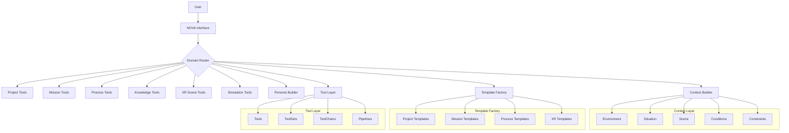

############################################################
#                                                          #
#       CHE·NU SYSTEM UPDATES                              #
#       CONTEXT + TEMPLATE FACTORY + TOOL LAYERS           #
#       SAFE · REPRESENTATIONAL · NON-AUTONOMOUS           #
#                                                          #
############################################################

============================================================
SECTION D1 — SYSTEM INDEX UPDATE (JSON)
============================================================

--- FILE: /che-nu-sdk/system_index.json (ADD ENTRIES)

{
  "layers": {
    "context": {
      "name": "Context Layer",
      "description": "Representational context modeling",
      "version": "1.0.0",
      "modules": {
        "ContextEngine": {
          "path": "/core/context.ts",
          "description": "Main context engine",
          "subModules": [
            "SituationEngine",
            "EnvironmentEngine",
            "SceneEngine",
            "ConditionEngine",
            "ConstraintEngine"
          ]
        },
        "SituationEngine": {
          "path": "/core/context/situation.engine.ts",
          "description": "Situation modeling",
          "parent": "ContextEngine"
        },
        "EnvironmentEngine": {
          "path": "/core/context/environment.engine.ts",
          "description": "Environment modeling",
          "parent": "ContextEngine"
        },
        "SceneEngine": {
          "path": "/core/context/scene.engine.ts",
          "description": "Scene modeling",
          "parent": "ContextEngine"
        },
        "ConditionEngine": {
          "path": "/core/context/condition.engine.ts",
          "description": "Condition modeling",
          "parent": "ContextEngine"
        },
        "ConstraintEngine": {
          "path": "/core/context/constraint.engine.ts",
          "description": "Constraint modeling",
          "parent": "ContextEngine"
        },
        "ContextPatternLibrary": {
          "path": "/core/context/context_patterns.ts",
          "description": "Predefined context patterns"
        }
      },
      "schemas": ["context.schema.json"],
      "safe": {
        "isRepresentational": true,
        "noAutonomy": true,
        "noExecution": true
      }
    },
    "template_factory": {
      "name": "Template Factory Layer",
      "description": "Universal template generation",
      "version": "1.0.0",
      "modules": {
        "TemplateFactoryEngine": {
          "path": "/core/template_factory.ts",
          "description": "Main template factory engine",
          "subModules": [
            "ProjectTemplateGenerator",
            "MissionTemplateGenerator",
            "ProcessTemplateGenerator",
            "PersonaTemplateGenerator",
            "ObjectTemplateGenerator",
            "SimulationTemplateGenerator",
            "XRSceneTemplateGenerator"
          ]
        },
        "ProjectTemplateGenerator": {
          "path": "/core/template_factory/project_template.engine.ts",
          "parent": "TemplateFactoryEngine"
        },
        "MissionTemplateGenerator": {
          "path": "/core/template_factory/mission_template.engine.ts",
          "parent": "TemplateFactoryEngine"
        },
        "ProcessTemplateGenerator": {
          "path": "/core/template_factory/process_template.engine.ts",
          "parent": "TemplateFactoryEngine"
        },
        "PersonaTemplateGenerator": {
          "path": "/core/template_factory/persona_template.engine.ts",
          "parent": "TemplateFactoryEngine"
        },
        "ObjectTemplateGenerator": {
          "path": "/core/template_factory/object_template.engine.ts",
          "parent": "TemplateFactoryEngine"
        },
        "SimulationTemplateGenerator": {
          "path": "/core/template_factory/simulation_template.engine.ts",
          "parent": "TemplateFactoryEngine"
        },
        "XRSceneTemplateGenerator": {
          "path": "/core/template_factory/xr_scene_template.engine.ts",
          "parent": "TemplateFactoryEngine"
        }
      },
      "schemas": ["template.schema.json"],
      "safe": {
        "isRepresentational": true,
        "noAutonomy": true,
        "noRealPlans": true
      }
    },
    "tool": {
      "name": "Tool Layer",
      "description": "Representational tool structures",
      "version": "1.0.0",
      "modules": {
        "ToolEngine": {
          "path": "/core/tool.ts",
          "description": "Main tool engine",
          "subModules": [
            "AnalysisToolEngine",
            "TransformToolEngine",
            "MappingToolEngine",
            "ConstructionToolEngine",
            "AbstractionToolEngine",
            "XRToolEngine"
          ]
        },
        "AnalysisToolEngine": {
          "path": "/core/tool/analysis.engine.ts",
          "parent": "ToolEngine"
        },
        "TransformToolEngine": {
          "path": "/core/tool/transform.engine.ts",
          "parent": "ToolEngine"
        },
        "MappingToolEngine": {
          "path": "/core/tool/mapping.engine.ts",
          "parent": "ToolEngine"
        },
        "ConstructionToolEngine": {
          "path": "/core/tool/construction.engine.ts",
          "parent": "ToolEngine"
        },
        "AbstractionToolEngine": {
          "path": "/core/tool/abstraction.engine.ts",
          "parent": "ToolEngine"
        },
        "XRToolEngine": {
          "path": "/core/tool/xr_tools.engine.ts",
          "parent": "ToolEngine"
        },
        "ToolSetLibrary": {
          "path": "/core/tool/toolsets.ts"
        },
        "ToolChainLibrary": {
          "path": "/core/tool/toolchains.ts"
        },
        "ToolPipelineLibrary": {
          "path": "/core/tool/toolpipelines.ts"
        }
      },
      "schemas": ["tool.schema.json"],
      "safe": {
        "isRepresentational": true,
        "noExecution": true,
        "noAPI": true
      }
    }
  }
}

============================================================
SECTION D2 — SYSTEM INDEX MARKDOWN UPDATE
============================================================

--- FILE: /che-nu-sdk/docs/SYSTEM_INDEX.md (ADD SECTIONS)

## CONTEXT LAYER

**Status:** ✅ Complete  
**Version:** 1.0.0  
**Path:** `/che-nu-sdk/core/context/`

### Overview

The Context Layer provides representational context modeling for CHE·NU.
It describes scenes, environments, situations, conditions, and constraints
WITHOUT real environment detection or autonomous decisions.

### Modules

| Module | Path | Description |
|--------|------|-------------|
| ContextEngine | `/core/context.ts` | Main context orchestrator |
| SituationEngine | `/core/context/situation.engine.ts` | Situation modeling |
| EnvironmentEngine | `/core/context/environment.engine.ts` | Environment modeling |
| SceneEngine | `/core/context/scene.engine.ts` | Scene modeling |
| ConditionEngine | `/core/context/condition.engine.ts` | Condition modeling |
| ConstraintEngine | `/core/context/constraint.engine.ts` | Constraint modeling |
| ContextPatternLibrary | `/core/context/context_patterns.ts` | Predefined patterns |

### Context Patterns

| Pattern | Category | Description |
|---------|----------|-------------|
| Creative Studio | creative | Context for creative work |
| Research | analytical | Context for research |
| XR Production | technical | Context for XR creation |
| Team Collaboration | collaborative | Context for teamwork |
| Strategic Planning | strategic | Context for strategy |
| Personal Reflection | personal | Context for reflection |
| Workshop | workshop | Context for workshops |
| Review Session | review | Context for reviews |

### Schema

- `context.schema.json`

### SAFE Compliance

- ✅ Representational only
- ✅ No autonomy
- ✅ No execution

---

## TEMPLATE FACTORY LAYER

**Status:** ✅ Complete  
**Version:** 1.0.0  
**Path:** `/che-nu-sdk/core/template_factory/`

### Overview

The Template Factory Layer provides universal template generation for CHE·NU
structures. It generates representational templates for projects, missions,
processes, personas, objects, simulations, and XR scenes WITHOUT real plans.

### Modules

| Module | Path | Description |
|--------|------|-------------|
| TemplateFactoryEngine | `/core/template_factory.ts` | Main factory engine |
| ProjectTemplateGenerator | `/core/template_factory/project_template.engine.ts` | Project templates |
| MissionTemplateGenerator | `/core/template_factory/mission_template.engine.ts` | Mission templates |
| ProcessTemplateGenerator | `/core/template_factory/process_template.engine.ts` | Process templates |
| PersonaTemplateGenerator | `/core/template_factory/persona_template.engine.ts` | Persona templates |
| ObjectTemplateGenerator | `/core/template_factory/object_template.engine.ts` | Object templates |
| SimulationTemplateGenerator | `/core/template_factory/simulation_template.engine.ts` | Simulation templates |
| XRSceneTemplateGenerator | `/core/template_factory/xr_scene_template.engine.ts` | XR scene templates |

### Template Types

| Type | Category | Description |
|------|----------|-------------|
| Project | planning | Project structures |
| Mission | execution | Mission definitions |
| Process | workflow | Process workflows |
| Persona | modeling | Persona modeling |
| Object | definition | Object definitions |
| Simulation | analysis | Simulation setup |
| XR Scene | immersive | XR scene creation |

### Schema

- `template.schema.json`

### SAFE Compliance

- ✅ Representational only
- ✅ No autonomy
- ✅ No real plans
- ✅ No execution

---

## TOOL LAYER

**Status:** ✅ Complete  
**Version:** 1.0.0  
**Path:** `/che-nu-sdk/core/tool/`

### Overview

The Tool Layer provides representational tool structures for CHE·NU.
Tools are symbolic descriptions, NOT executable. No real API calls,
no system commands, no external integrations.

### Modules

| Module | Path | Description |
|--------|------|-------------|
| ToolEngine | `/core/tool.ts` | Main tool orchestrator |
| AnalysisToolEngine | `/core/tool/analysis.engine.ts` | Analysis tools |
| TransformToolEngine | `/core/tool/transform.engine.ts` | Transformation tools |
| MappingToolEngine | `/core/tool/mapping.engine.ts` | Mapping tools |
| ConstructionToolEngine | `/core/tool/construction.engine.ts` | Construction tools |
| AbstractionToolEngine | `/core/tool/abstraction.engine.ts` | Abstraction tools |
| XRToolEngine | `/core/tool/xr_tools.engine.ts` | XR helper tools |
| ToolSetLibrary | `/core/tool/toolsets.ts` | ToolSet library |
| ToolChainLibrary | `/core/tool/toolchains.ts` | ToolChain library |
| ToolPipelineLibrary | `/core/tool/toolpipelines.ts` | ToolPipeline library |

### Tool Types

| Type | Icon | Description |
|------|------|-------------|
| Analysis | 🔍 | Data analysis tools |
| Transformation | 🔄 | Structure transformation |
| Mapping | 🗺️ | Element mapping |
| Construction | 🏗️ | Structure building |
| Abstraction | 💭 | Abstraction tools |
| XR Helper | 🥽 | XR-related tools |

### ToolSets

| ToolSet | Category | Tools |
|---------|----------|-------|
| Analysis Basic Set | analysis | Pattern, Node, Dependency, Complexity Analyzers |
| Mapping Core Set | mapping | Engine, Sphere, Graph Linker, Context Mappers |
| Process Construction Set | construction | Process, Workflow Builders |
| XR Builder Set | xr | Scene Placeholder, Object Mapper, Environment Builder |
| Persona Influence Set | persona | Trait Mapper, Style Matcher |
| Simulation Helper Set | simulation | Frame Builder, Branch Analyzer |

### ToolChains

| Chain | Steps | Category |
|-------|-------|----------|
| Project Startup | 3 | project |
| Mission Structuring | 3 | mission |
| Process Mapping | 3 | process |
| Knowledge Expansion | 3 | knowledge |
| XR Scene Assembly | 4 | xr |
| Simulation Prep | 3 | simulation |

### ToolPipelines

| Pipeline | Chain | Engines |
|----------|-------|---------|
| Project Mapping | Project Startup | ProjectEngine, ProcessEngine |
| Mission Execution | Mission Structuring | MissionEngine, ProcessEngine |
| Knowledge Graph | Knowledge Expansion | KnowledgeEngine |
| XR Production | XR Scene Assembly | XREngine, ContextEngine |
| Simulation Run | Simulation Prep | SimulationEngine |

### Schema

- `tool.schema.json`

### SAFE Compliance

- ✅ Representational only
- ✅ No execution
- ✅ No API calls
- ✅ No system commands

============================================================
SECTION D3 — ORCHESTRATOR UPDATE
============================================================

--- FILE: /che-nu-sdk/core/orchestrator.ts (ADD ROUTES)

/**
 * ADDITIONAL ROUTES FOR ORCHESTRATOR
 * Add these to the existing orchestrator.ts
 */

// Add to DOMAIN_TO_ENGINE mapping:
const DOMAIN_ENGINE_ADDITIONS_V2 = {
  // Context Layer
  'Context': 'ContextEngine',
  'Situation': 'SituationEngine',
  'Environment': 'EnvironmentEngine',
  'Scene': 'SceneEngine',
  'Condition': 'ConditionEngine',
  'Constraint': 'ConstraintEngine',
  
  // Template Factory Layer
  'Template': 'TemplateFactoryEngine',
  'TemplateFactory': 'TemplateFactoryEngine',
  'ProjectTemplate': 'ProjectTemplateGenerator',
  'MissionTemplate': 'MissionTemplateGenerator',
  'ProcessTemplate': 'ProcessTemplateGenerator',
  'PersonaTemplate': 'PersonaTemplateGenerator',
  'XRSceneTemplate': 'XRSceneTemplateGenerator',
  
  // Tool Layer
  'Tool': 'ToolEngine',
  'Tools': 'ToolEngine',
  'ToolSet': 'ToolSetLibrary',
  'ToolChain': 'ToolChainLibrary',
  'ToolPipeline': 'ToolPipelineLibrary',
  'AnalysisTool': 'AnalysisToolEngine',
  'TransformTool': 'TransformToolEngine',
  'MappingTool': 'MappingToolEngine',
  'ConstructionTool': 'ConstructionToolEngine',
  'XRTool': 'XRToolEngine',
};

// Route function for Context domain
function routeContextDomain(intent: string): string {
  const intentLower = intent.toLowerCase();
  
  if (intentLower.includes('situation')) return 'SituationEngine';
  if (intentLower.includes('environment')) return 'EnvironmentEngine';
  if (intentLower.includes('scene')) return 'SceneEngine';
  if (intentLower.includes('condition')) return 'ConditionEngine';
  if (intentLower.includes('constraint')) return 'ConstraintEngine';
  if (intentLower.includes('pattern')) return 'ContextPatternLibrary';
  
  return 'ContextEngine';
}

// Route function for Template domain
function routeTemplateDomain(intent: string): string {
  const intentLower = intent.toLowerCase();
  
  if (intentLower.includes('project')) return 'ProjectTemplateGenerator';
  if (intentLower.includes('mission')) return 'MissionTemplateGenerator';
  if (intentLower.includes('process')) return 'ProcessTemplateGenerator';
  if (intentLower.includes('persona')) return 'PersonaTemplateGenerator';
  if (intentLower.includes('object')) return 'ObjectTemplateGenerator';
  if (intentLower.includes('simulation')) return 'SimulationTemplateGenerator';
  if (intentLower.includes('xr') || intentLower.includes('scene')) return 'XRSceneTemplateGenerator';
  
  return 'TemplateFactoryEngine';
}

// Route function for Tool domain
function routeToolDomain(intent: string): string {
  const intentLower = intent.toLowerCase();
  
  if (intentLower.includes('toolset')) return 'ToolSetLibrary';
  if (intentLower.includes('toolchain') || intentLower.includes('chain')) return 'ToolChainLibrary';
  if (intentLower.includes('pipeline')) return 'ToolPipelineLibrary';
  if (intentLower.includes('analysis') || intentLower.includes('analyze')) return 'AnalysisToolEngine';
  if (intentLower.includes('transform')) return 'TransformToolEngine';
  if (intentLower.includes('mapping') || intentLower.includes('map')) return 'MappingToolEngine';
  if (intentLower.includes('construct') || intentLower.includes('build')) return 'ConstructionToolEngine';
  if (intentLower.includes('abstract')) return 'AbstractionToolEngine';
  if (intentLower.includes('xr')) return 'XRToolEngine';
  
  return 'ToolEngine';
}

// Add to main route() switch:
/*
  case 'Context':
    return routeContextDomain(intent);
  case 'Template':
    return routeTemplateDomain(intent);
  case 'Tool':
  case 'Tools':
    return routeToolDomain(intent);
*/

============================================================
SECTION D4 — CONTEXT INTERPRETER UPDATE
============================================================

--- FILE: /che-nu-sdk/core/context_interpreter.ts (ADD RULES)

/**
 * ADDITIONAL RULES FOR CONTEXT INTERPRETER
 * Add these to the existing context_interpreter.ts
 */

// Domain keywords additions
const DOMAIN_KEYWORDS_V2 = {
  'Context': [
    'context', 'contexts',
    'situation', 'situations',
    'environment', 'environments',
    'scene', 'scenes',
    'condition', 'conditions',
    'constraint', 'constraints',
    'atmosphere', 'ambiance',
  ],
  'Template': [
    'template', 'templates',
    'generate template', 'create template',
    'factory', 'generator',
    'preset', 'presets',
    'starter', 'framework',
    'scaffold', 'scaffolding',
  ],
  'Tool': [
    'tool', 'tools',
    'toolset', 'toolsets',
    'toolchain', 'toolchains',
    'pipeline', 'pipelines',
    'analyzer', 'transformer',
    'mapper', 'builder',
  ],
};

// Check functions
function checkContextDomain(tokens: string[]): boolean {
  const keywords = [
    'context', 'situation', 'environment',
    'scene', 'condition', 'constraint',
    'atmosphere', 'ambiance',
  ];
  return tokens.some(t => keywords.some(k => t.includes(k)));
}

function checkTemplateDomain(tokens: string[]): boolean {
  const keywords = [
    'template', 'factory', 'generator',
    'preset', 'scaffold', 'starter',
  ];
  return tokens.some(t => keywords.some(k => t.includes(k)));
}

function checkToolDomain(tokens: string[]): boolean {
  const keywords = [
    'tool', 'toolset', 'toolchain',
    'pipeline', 'analyzer', 'transformer',
    'mapper', 'builder',
  ];
  return tokens.some(t => keywords.some(k => t.includes(k)));
}

// Add to main classify() function:
/*
  if (checkContextDomain(tokens)) {
    return { domain: 'Context', confidence: calculateConfidence(tokens, 'Context') };
  }
  if (checkTemplateDomain(tokens)) {
    return { domain: 'Template', confidence: calculateConfidence(tokens, 'Template') };
  }
  if (checkToolDomain(tokens)) {
    return { domain: 'Tool', confidence: calculateConfidence(tokens, 'Tool') };
  }
*/

============================================================
SECTION D5 — UI FLOW UPDATE
============================================================

--- FILE: /che-nu-app/docs/UI_FLOW.md (ADD SECTIONS)

## CONTEXT WORKFLOW

```
User → NOVA → Context Tools
   → Define environment
   → Define situation
   → Build scene
   → Add conditions
   → Add constraints
   → Apply context pattern
   → View engine links
   → Export (representational)
```

### Views

1. **Overview** — List of all contexts
2. **Detail** — Full context visualization
3. **Builder** — Create/edit context

### Context Patterns

- Creative Studio Context
- Research Context
- XR Production Context
- Team Collaboration Context
- Strategic Planning Context
- Personal Reflection Context
- Workshop Context
- Review Session Context

### SAFE Notice

All contexts are representational only:
- No real environment detection
- No autonomous decisions
- No system integration

---

## TEMPLATE FACTORY WORKFLOW

```
User → NOVA → Template Factory
   → Choose template type
   → Generate structural template
   → View structure
   → View recommended engines
   → Export (representational)
```

### Template Types

- Project Templates
- Mission Templates
- Process Templates
- Persona Templates
- Object Templates
- Simulation Templates
- XR Scene Templates

### Views

1. **Grid** — Template cards
2. **Detail** — Full template visualization
3. **Generator** — Create new templates

### SAFE Notice

All templates are representational only:
- No real plans
- No actionable strategies
- Structural placeholders only

---

## TOOL LAYER WORKFLOW

```
User → NOVA → Tool Layer
   → Browse tools
   → Browse toolsets
   → View toolchains
   → Select tool pipeline
   → Link to process/engine (symbolic)
```

### Components

1. **Tools** — Individual representational tools
2. **ToolSets** — Groups of related tools
3. **ToolChains** — Ordered tool sequences
4. **ToolPipelines** — Process/engine mappings

### Tool Types

- Analysis Tools (🔍)
- Transformation Tools (🔄)
- Mapping Tools (🗺️)
- Construction Tools (🏗️)
- Abstraction Tools (💭)
- XR Helper Tools (🥽)

### SAFE Notice

All tools are representational only:
- NO real execution
- NO API calls
- NO system commands
- Symbolic descriptions only

---

## UPDATED MERMAID DIAGRAM



============================================================
SECTION D6 — WORKFLOWGRID UPDATE
============================================================

--- FILE: /che-nu-frontend/components/WorkflowGrid.tsx (ADD ITEMS)

/**
 * ADD TO EXISTING WorkflowGrid ITEMS ARRAY
 */

const NEW_WORKFLOW_ITEMS = [
  {
    id: 'context',
    name: 'Context Builder',
    icon: '🌐',
    description: 'Create representational contexts',
    route: '/context',
    color: '#3EB4A2', // cenoteTurquoise
    category: 'core',
  },
  {
    id: 'templates',
    name: 'Template Factory',
    icon: '🏭',
    description: 'Generate structural templates',
    route: '/templates',
    color: '#D8B26A', // sacredGold
    category: 'core',
  },
  {
    id: 'tools',
    name: 'Tool Layer',
    icon: '🛠️',
    description: 'Representational tools and pipelines',
    route: '/tools',
    color: '#3F7249', // jungleEmerald
    category: 'advanced',
  },
];

// Update WORKFLOW_ITEMS array to include these

============================================================
SECTION D7 — COMPLETE LAYER SUMMARY
============================================================

## CHE·NU LAYER INVENTORY (UPDATED)

### Core Layers ✅

| Layer | Status | Modules | Schema | Frontend |
|-------|--------|---------|--------|----------|
| **Project** | ✅ | ProjectEngine | project.schema.json | /project |
| **Mission** | ✅ | MissionEngine | mission.schema.json | /mission |
| **Process** | ✅ | ProcessEngine | process.schema.json | /process |
| **Knowledge** | ✅ | KnowledgeEngine | knowledge.schema.json | /knowledge |
| **XR** | ✅ | XREngine | xr.schema.json | /xr |

### New Layers ✅

| Layer | Status | Modules | Schema | Frontend |
|-------|--------|---------|--------|----------|
| **Simulation** | ✅ | SimulationEngine + 2 sub | simulation.schema.json | /simulation |
| **Persona** | ✅ | PersonaEngine + 5 sub | persona.schema.json | /persona |
| **Context** | ✅ | ContextEngine + 5 sub + patterns | context.schema.json | /context |
| **Template Factory** | ✅ | TemplateFactoryEngine + 7 generators | template.schema.json | /templates |
| **Tool** | ✅ | ToolEngine + 6 sub + 3 libraries | tool.schema.json | /tools |

### Total File Count

- **Core Engines:** 5
- **Sub-engines:** 23
- **Libraries:** 4
- **Schemas:** 10
- **Frontend Pages:** 10
- **Frontend Components:** 10
- **System Updates:** 4

### SAFE Compliance Matrix

| Layer | Representational | No Autonomy | No Execution | No Real Plans |
|-------|-----------------|-------------|--------------|---------------|
| Simulation | ✅ | ✅ | ✅ | - |
| Persona | ✅ | ✅ | - | ✅ (No Psychology) |
| Context | ✅ | ✅ | ✅ | - |
| Template Factory | ✅ | ✅ | ✅ | ✅ |
| Tool | ✅ | - | ✅ | ✅ (No API) |

============================================================
END OF SYSTEM UPDATES
============================================================
