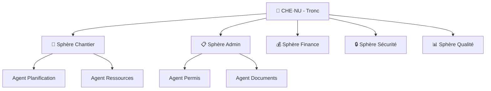
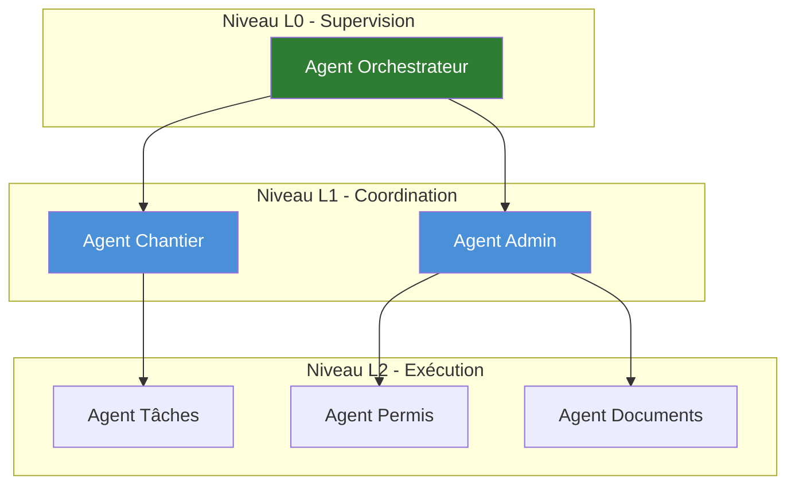
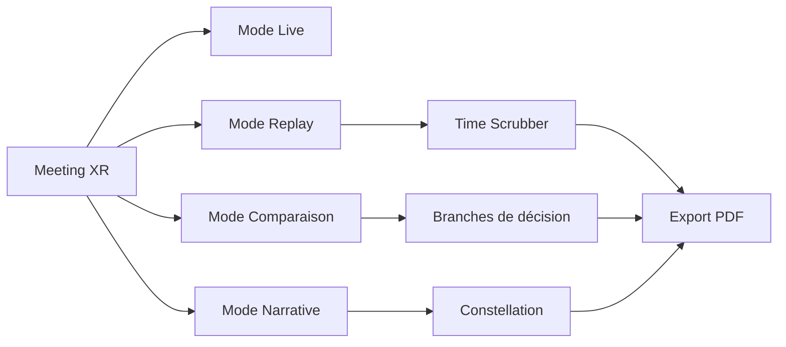
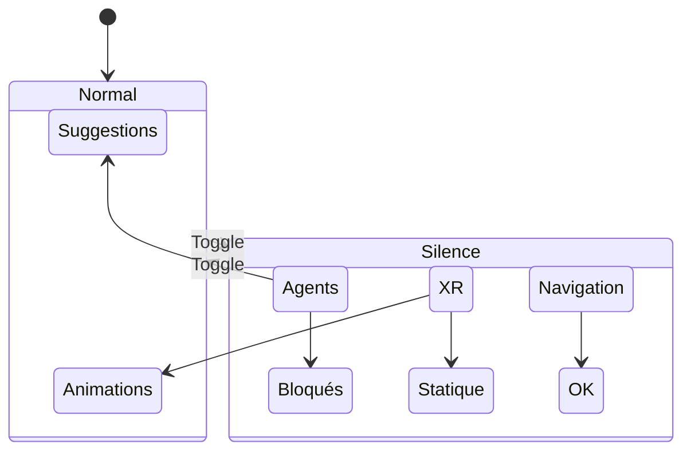

# CHE·NU — Deck Investisseur

---

## Slide 1 — Titre

# CHE·NU
### Plateforme de gestion de construction intelligente pour le Québec

**Pro-Service Construction** | Brossard, Québec

---

## Slide 2 — Le Problème

### La construction au Québec fait face à 3 défis majeurs

1. **Complexité réglementaire** : RBQ, CNESST, CCQ — chaque projet implique des dizaines de conformités
2. **Fragmentation des outils** : devis, planification, communication, suivi — aucun système intégré
3. **Manque de visibilité** : les décisions se prennent sans historique, sans traçabilité

> Résultat : Retards, dépassements de coûts, litiges.

---

## Slide 3 — La Solution

### CHE·NU : Un système de gouvernance intelligent

CHE·NU centralise la gestion de projet autour de **sphères de travail**, chacune pilotée par des agents spécialisés sous contrôle humain.

---

## Slide 4 — Architecture Multi-Agents

### Agents hiérarchisés, jamais autonomes

**Principe fondamental** : Les agents suggèrent, l'humain décide.

---

## Slide 5 — Expérience XR

### Salles de réunion virtuelles pour la coordination

- **Timeline replay** : Revoir les décisions passées
- **Comparaison multi-décisions** : Visualiser les alternatives
- **Export PDF/PNG** : Documentation instantanée

**Aucune IA générative dans l'export** — seulement ce qui a été vu.

---

## Slide 6 — Méthodologies Adaptables

### L'utilisateur choisit sa méthode de travail

| Méthodologie | Complexité | Usage |
|--------------|------------|-------|
| Lean Construction | Moyenne | Grands projets |
| Agile Chantier | Haute | Projets complexes |
| Séquentiel Traditionnel | Basse | Résidentiel, entretien |

**Règle CHE·NU** : Aucune auto-optimisation. L'humain sélectionne toujours.

---

## Slide 7 — Mode Silence

### Le calme comme fonctionnalité

Quand l'utilisateur a besoin de concentration :
- Aucune suggestion
- Aucune notification
- Vue statique uniquement

---

## Slide 8 — Conformité Québec

### Intégration native des réglementations

| Organisme | Intégration |
|-----------|-------------|
| **RBQ** | Validation des licences, inspections |
| **CNESST** | Suivi sécurité, formations |
| **CCQ** | Gestion heures, conventions |

**Avantage compétitif** : Aucun concurrent n'offre cette intégration locale.

---

## Slide 9 — Stack Technique

### Technologies modernes, architecture solide

| Couche | Technologies |
|--------|--------------|
| Frontend | React, TypeScript, Three.js (XR) |
| Backend | FastAPI, Python, PostgreSQL |
| Infrastructure | Docker, CI/CD |
| IA | Multi-LLM (Claude, GPT, Gemini, Ollama) |

**54,000+ lignes de code** — production-ready.

---

## Slide 10 — Traction & Développement

### Ce qui est construit aujourd'hui

- ✅ Universe View avec sphères navigables
- ✅ Système de session persistant
- ✅ Mode Silence fonctionnel
- ✅ Salles XR avec timeline et replay
- ✅ Comparaison multi-décisions
- ✅ Export PDF/PNG client-side
- ✅ Moteur de méthodologies
- ✅ 168+ agents définis

**Prochaines étapes** : Tests terrain, intégration RBQ API.

---

## Slide 11 — Modèle Économique

### SaaS B2B — Abonnement mensuel

| Tier | Prix | Cible |
|------|------|-------|
| Solo | 99$/mois | Entrepreneurs individuels |
| Team | 299$/mois | PME construction (5-15 employés) |
| Enterprise | Sur mesure | Généraux, promoteurs |

**Marché adressable** : 45,000+ entreprises de construction au Québec.

---

## Slide 12 — L'Équipe & La Vision

### Fondateur

**Jo** — Développeur full-stack, entrepreneur, expert construction Québec

### Vision

> Faire de CHE·NU la plateforme de référence pour la gestion de construction au Québec, puis au Canada.

### Principes non-négociables

1. L'humain garde toujours le contrôle
2. Transparence totale des décisions IA
3. Conformité locale avant expansion

---

## Contact

**Pro-Service Construction**  
Brossard, Québec

---

*Document généré par CHE·NU — Aucune promesse irréaliste.*
