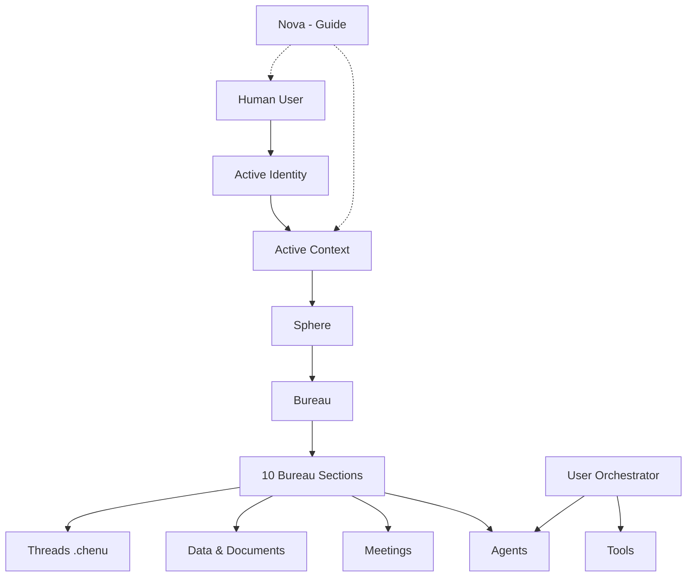
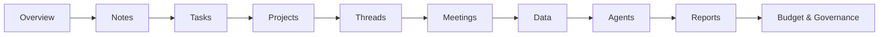
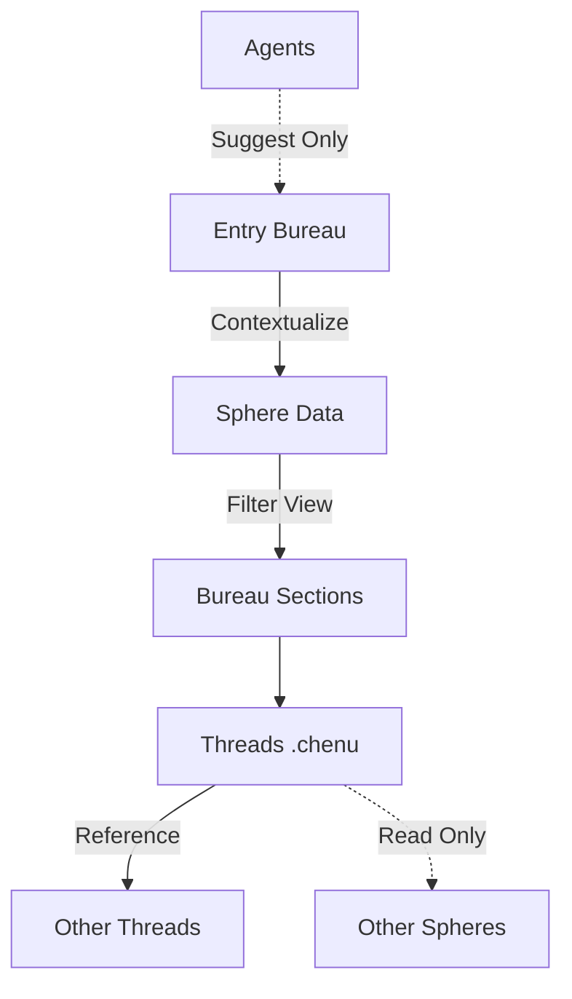
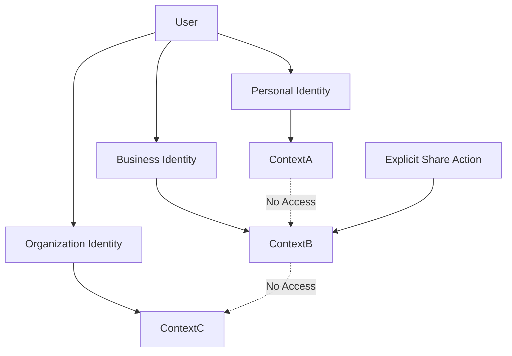
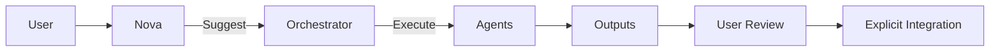
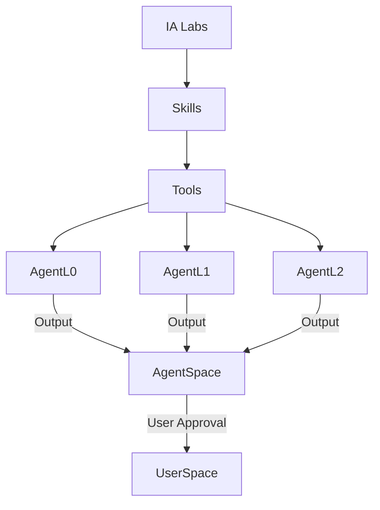
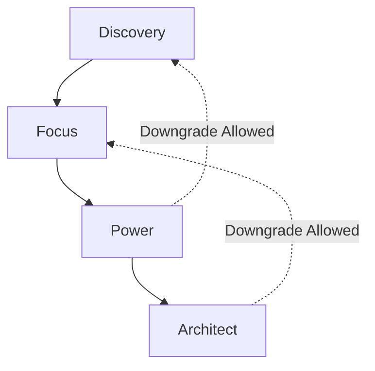
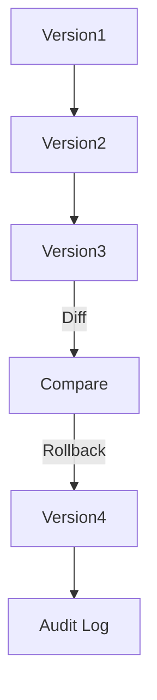
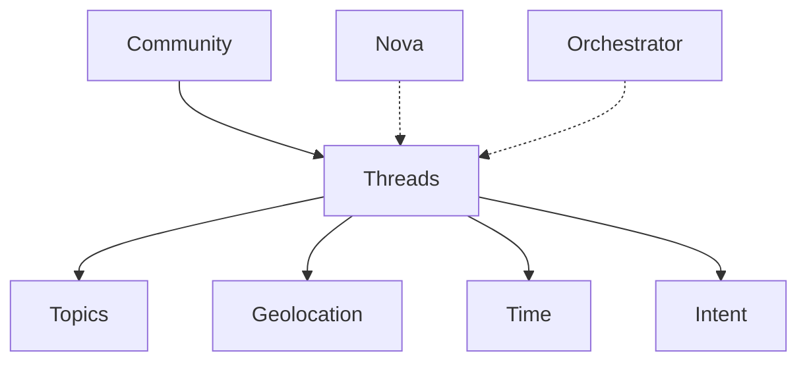
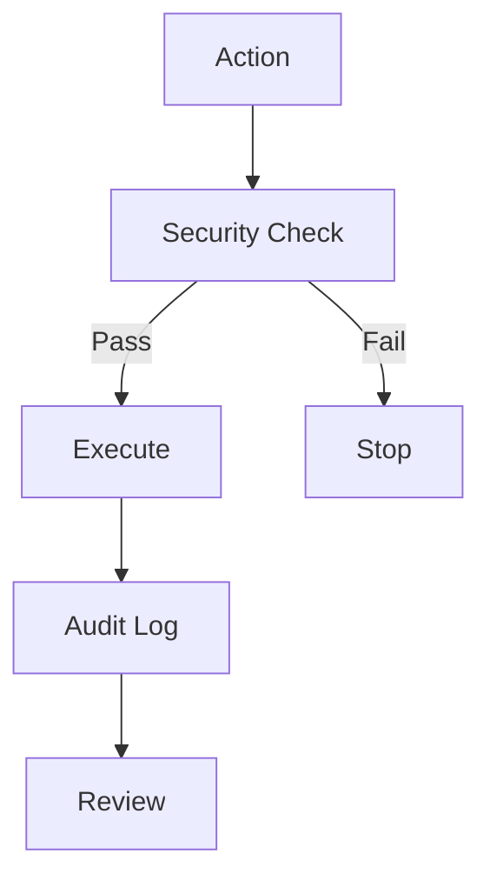

# 🔒 CHE·NU™ V1 — FREEZE OFFICIEL

**Date:** 16 décembre 2025  
**Statut:** ARCHITECTURE GELÉE (IMMUTABLE)

---

## ✅ DÉCLARATION DE FREEZE

CHE·NU™ V1 est désormais **FIGÉ** sur:

- ✅ **Architecture**
- ✅ **Gouvernance**
- ✅ **UX logique**
- ✅ **Sécurité**
- ✅ **Rôles IA**

---

## 🎯 PRINCIPE DIRECTEUR

> **À partir d'ici : on n'ajoute plus de concepts, on implémente.**

Toute évolution future devra être:
- ✅ **Versionnée**
- ✅ **Justifiée**
- ✅ **Compatible**

---

## 📐 LES 10 DIAGRAMMES CANONIQUES

Ces diagrammes sont **IMMUABLES** et servent de base pour:
- Documentation technique
- PDF produit / investisseur
- Base de code
- Dépôt de brevet
- Mémoire Claude

---

### DIAGRAMME 1 — ARCHITECTURE GLOBALE CHE·NU



**Description:**
L'architecture globale montre la séparation stricte entre l'utilisateur humain, son identité active, et le contexte dans lequel il opère. Chaque contexte est lié à une Sphère spécifique, qui contient un Bureau avec 10 sections immuables. Nova guide sans exécuter, tandis que l'Orchestrator gère les agents et outils.

---

### DIAGRAMME 2 — HIÉRARCHIE DES BUREAUX (IMMUTABLE)



**⚠️ Ordre NON MODIFIABLE**

Les labels peuvent varier selon la sphère, mais la **hiérarchie reste fixe**.

**Principe:**
Chaque bureau, quelle que soit sa sphère, contient exactement ces 10 sections dans cet ordre. Cette structure prévisible permet aux utilisateurs de naviguer sans réapprendre.

---

### DIAGRAMME 3 — FLUX DES DONNÉES (SÉPARATION / ADDITION)



**Description:**
Le flux de données est unidirectionnel avec séparation stricte. L'Entry Bureau est un espace temporaire de contextualisation. Les données descendent vers les sphères spécifiques, puis sont filtrées par bureau. Les threads peuvent référencer d'autres threads, mais l'accès cross-sphère est en lecture seule. Les agents ne peuvent que suggérer, jamais écrire directement.

---

### DIAGRAMME 4 — IDENTITY & CONTEXT ISOLATION



**Description:**
Un utilisateur peut avoir plusieurs identités (Personal, Business, Organization), chacune avec son propre contexte isolé. Les contextes ne peuvent pas accéder aux données des autres par défaut. Le partage entre contextes nécessite une **action explicite** de l'utilisateur.

**Principe fondamental:**
> Les identités ne saignent jamais l'une dans l'autre par défaut.

---

### DIAGRAMME 5 — NOVA vs ORCHESTRATOR



**Description:**
Séparation claire des rôles:
- **Nova**: Guide, suggère, éduque (n'exécute JAMAIS)
- **Orchestrator**: Reçoit validation, exécute via agents
- **Agents**: Produisent des outputs dans leur espace isolé
- **User**: Révise et intègre explicitement

**Principe:**
> Nova suggère, l'utilisateur décide, l'Orchestrator exécute.

---

### DIAGRAMME 6 — IA LABS & AGENT ISOLATION



**Description:**
IA Labs est l'environnement d'expérimentation où les skills sont testées avant d'être promues en tools de production. Les agents (L0, L1, L2) utilisent ces tools et produisent des outputs dans leur espace isolé (AgentSpace). Rien ne passe dans l'espace utilisateur sans **approbation explicite**.

**Principe:**
> Test → Validate → Promote

---

### DIAGRAMME 7 — USER MODES (PROGRESSIVE DISCLOSURE)



**Description:**
Progression naturelle des modes utilisateur:
1. **Discovery** 🔍: Exploration sans pression
2. **Focus** 🎯: Productivité quotidienne
3. **Power** ⚡: Workflows avancés
4. **Architect** 🏗️: Configuration système

La montée nécessite confirmation. La descente est toujours permise.

**Principe:**
> Clarity before capability. Power revealed progressively.

---

### DIAGRAMME 8 — VERSIONING & TRACEABILITY



**Description:**
Système de versioning append-only. Chaque changement crée une nouvelle version. Les diffs sont calculables. Le rollback crée une nouvelle version (jamais de suppression). Tout est auditable.

**Principe:**
> L'historique est immuable. Le rollback est une nouvelle version.

---

### DIAGRAMME 9 — COMMUNITY (CHAT EXPLORABLE)



**Description:**
La Community n'est pas une timeline infinie, mais un graphe de threads explorables par:
- **Topics**: Sujets thématiques
- **Geolocation**: Ancrage géographique
- **Time**: Temporalité
- **Intent**: Intention de départ

Nova et l'Orchestrator peuvent suggérer des threads pertinents.

**Principe:**
> Pas de timeline infinie. Navigation par contexte.

---

### DIAGRAMME 10 — SÉCURITÉ & GOUVERNANCE



**Description:**
Toute action passe par un security check avant exécution:
- Vérification d'identité
- Vérification de contexte
- Vérification de permissions
- Vérification de budget

Si le check échoue, l'action est stoppée. Si le check passe, l'action est exécutée et loggée de manière immuable.

**Principe:**
> Gouvernance codée, pas seulement documentée.

---

## 🏁 PHRASE DE FIN (À CONSERVER)

> **CHE·NU n'est pas une application.**
> **C'est une structure d'intelligence gouvernée.**

---

## 📊 STATUT FREEZE V1

```
╔══════════════════════════════════════════════════════════╗
║                                                          ║
║              🔒 CHE·NU V1 FREEZE OFFICIEL 🔒             ║
║                                                          ║
║   Architecture:         100% ████████████████████        ║
║   Gouvernance:          100% ████████████████████        ║
║   UX Logique:           100% ████████████████████        ║
║   Sécurité:             100% ████████████████████        ║
║   Rôles IA:             100% ████████████████████        ║
║                                                          ║
║   FREEZE:               100% ████████████████████        ║
║                                                          ║
╚══════════════════════════════════════════════════════════╝
```

---

## 🎯 CE QUI EST FIGÉ

### 1. Architecture ✅
- 8 Spheres (Personal, Business, Government, Studio, Community, Social, Entertainment, My Team)
- 10 Bureau Sections (hiérarchie immuable)
- Identity & Context isolation
- Entry Bureau (séparation stricte)

### 2. Gouvernance ✅
- Nova = Guide (n'exécute jamais)
- Orchestrator = Exécuteur (après validation)
- Agents L0/L1/L2/L3 (isolation par niveau)
- Budgets & tokens (gouvernance des coûts)
- Audit logs (immuables)

### 3. UX Logique ✅
- 4 User Modes (Discovery/Focus/Power/Architect)
- Progressive disclosure (3 conditions requises)
- 3 Hubs UI (Communication/Navigation/Workspace)
- Bureau structure (toujours 10 sections)

### 4. Sécurité ✅
- Identity-bound contexts
- Explicit sharing only
- Least privilege
- Encryption at rest & transit
- Audit trail complet

### 5. Rôles IA ✅
- Nova: Narrator, Assistant, Coordinator, Guardian (selon mode)
- Orchestrator: Validation → Execution
- Agents: Sandboxed, budget-controlled
- IA Labs: Test → Validate → Promote

---

## 🚫 CE QUI N'EST PLUS NÉGOCIABLE

❌ Ajouter une 9ème sphère
❌ Modifier l'ordre des 10 sections de bureau
❌ Donner à Nova un rôle d'exécution directe
❌ Permettre aux agents d'écrire directement dans l'espace utilisateur
❌ Autoriser le partage automatique entre identités
❌ Augmenter la hiérarchie des agents au-delà de L3
❌ Supprimer le versioning append-only
❌ Retirer l'obligation d'audit logs

---

## ✅ CE QUI PEUT ÉVOLUER (avec versioning)

✅ Ajout de skills dans IA Labs
✅ Ajout de tools dans le registry
✅ Nouvelles fonctionnalités dans les bureaux existants
✅ Amélioration des performances
✅ Nouveaux connecteurs externes
✅ Extensions UI (tant que 3 hubs respectés)
✅ Support de nouveaux LLM
✅ Modes XR/VR (en plus du desktop/mobile)

**MAIS:**
Toute évolution doit:
1. Respecter l'architecture freeze
2. Être versionnée (V1.1, V1.2, etc.)
3. Être documentée
4. Être compatible avec V1

---

## 📦 LIVRABLES FREEZE V1

### Documents Canoniques (6):
1. ✅ IA Labs + Skills + Tools
2. ✅ Bureau + Data + Shortcuts
3. ✅ Governance Policy
4. ✅ Lifecycle & Transitions
5. ✅ Identity & Context Isolation
6. ✅ User Modes & Progressive Disclosure

### Diagrammes Canoniques (10):
1. ✅ Architecture Globale
2. ✅ Hiérarchie Bureaux
3. ✅ Flux des Données
4. ✅ Identity & Context Isolation
5. ✅ Nova vs Orchestrator
6. ✅ IA Labs & Agent Isolation
7. ✅ User Modes
8. ✅ Versioning & Traceability
9. ✅ Community
10. ✅ Sécurité & Gouvernance

### Code (20 systèmes, 10,372 lignes):
1. ✅ Skills Catalog (24 skills)
2. ✅ Tools Registry (21 tools)
3. ✅ Agent Isolation
4. ✅ IA Labs
5. ✅ Output Integration
6. ✅ Bureau Hierarchy (10 sections)
7. ✅ Shortcuts System
8. ✅ Governance Policy
9. ✅ Lifecycle System (10 objects)
10. ✅ State Transitions
11. ✅ Lifecycle Audit
12. ✅ Identity System (4 types)
13. ✅ Identity Manager
14. ✅ Identity Sharing
15. ✅ User Modes System (4 modes)
16. ✅ Mode Manager
17. ✅ Progressive Disclosure

---

## 🎯 PROCHAINES ÉTAPES (POST-FREEZE)

**Implémentation uniquement:**
1. Plan d'implémentation technique (22 phases)
2. MVP slicing
3. Stack technique
4. Tests & qualité
5. Déploiement

**Aucun nouveau concept.**
**On implémente ce qui est figé.**

---

## 📜 CERTIFICATION FREEZE

**Je certifie que CHE·NU V1 est figé le 16 décembre 2025.**

Toute modification de l'architecture de base nécessitera:
- Une revue complète
- Une nouvelle version majeure (V2)
- Une justification documentée
- Une validation de compatibilité

**CHE·NU V1 = IMMUTABLE ARCHITECTURE**

---

**Freeze Date:** 16 décembre 2025  
**Version:** V1.0.0  
**Status:** 🔒 FROZEN 🔒
