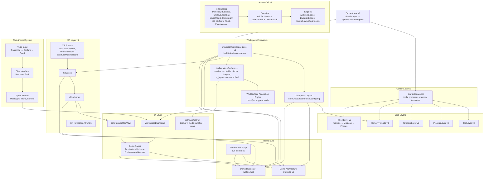

# CHE·NU System Diagram

## Layer Descriptions

### UniverseOS v3
- **10 Spheres**: Personal, Business, Creative, Scholar, SocialMedia, Community, XR, MyTeam, AILab, Entertainment
- **Domains**: Specialized areas within spheres (e.g., Architecture in Creative)
- **Engines**: Processing engines for each domain

### Core Layers
- **ContextLayer**: Snapshot of current context (tools, processes, memory, templates)
- **ToolLayer**: Available tools and toolchains
- **ProcessLayer**: Process models and workflows
- **TemplateLayer**: Document and structure templates
- **MemoryThreads**: Conceptual memory threads
- **ProjectLayer**: Projects → Missions → Phases hierarchy

### Workspace Ecosystem
- **Universal Workspace Layer**: Adaptive workspace generation
- **DataSpace Layer**: Data storage (notes, resources, archives, config, logs)
- **Unified WorkSurface**: Multi-mode editor (text, table, blocks, diagram, xr_layout, summary, final)
- **Adaptation Engine**: Auto-suggests modes based on input

### XR Layer
- **XRScene**: Individual XR scenes/rooms
- **XRUniverse**: Collection of connected scenes
- **XR Presets**: Pre-configured scene templates
- **Navigation/Portals**: Scene-to-scene connections

### Chat & Vocal System
- **Chat Interface**: Source of truth for all communications
- **Voice Input**: Speech-to-text with confirmation
- **Agent Inboxes**: Per-agent message and task queues

### UI Layer
- **WorkspaceDashboard**: Main workspace view
- **WorkSurface UI**: Editor interface with mode switching
- **XRUniverseMapView**: Visual map of XR universe
- **Demo Pages**: Interactive demonstrations
