# System Hierarchy

```mermaid
flowchart TB
    subgraph Authority["🔒 AUTHORITY HIERARCHY"]
        USER["👤 USER<br/>Final Authority"]
        NOVA["🛡️ NOVA (L0)<br/>Governance & Explanation"]
        ORCH["🎯 ORCHESTRATOR (L1)<br/>Planning & Coordination"]
        AGENTS["🤖 AGENTS (L2-L3)<br/>Analysis Only"]
        SYSTEM["⚙️ SYSTEM CORE<br/>Execution"]
    end

    USER -->|"Decides"| NOVA
    NOVA -->|"Proposes"| USER
    NOVA -->|"Plans via"| ORCH
    ORCH -->|"Delegates to"| AGENTS
    AGENTS -->|"Results to"| ORCH
    ORCH -->|"Proposal to"| NOVA
    
    USER -->|"✅ Confirms"| SYSTEM
    SYSTEM -->|"📊 Reports"| USER

    style USER fill:#7c3aed,color:#fff
    style NOVA fill:#a855f7,color:#fff
    style ORCH fill:#3b82f6,color:#fff
    style AGENTS fill:#10b981,color:#fff
    style SYSTEM fill:#6b7280,color:#fff
```

## Key Rules

1. **USER** has final authority over all actions
2. **NOVA** explains, proposes, but never executes
3. **ORCHESTRATOR** coordinates agents but cannot act alone
4. **AGENTS** analyze only, never execute
5. **SYSTEM** executes only after USER confirmation
