# Budget Flow

```mermaid
flowchart TB
    subgraph Budget["💰 BUDGET SYSTEM"]
        PRESET["🎚️ PRESET<br/>Eco / Balanced / Pro"]
        SPHERE["🌐 SPHERE BUDGET<br/>Per Domain"]
        PROJECT["📁 PROJECT BUDGET<br/>Per Project"]
        MEETING["👥 MEETING BUDGET<br/>Per Session"]
        GUARD["🛡️ BUDGET GUARD<br/>Enforcement"]
        LEDGER["📒 LEDGER<br/>Token History"]
    end

    PRESET --> SPHERE
    SPHERE --> PROJECT
    PROJECT --> MEETING
    
    MEETING --> GUARD
    GUARD -->|"✅ Allowed"| ACTION["⚡ Action"]
    GUARD -->|"❌ Blocked"| WARN["⚠️ Warning"]
    
    ACTION --> LEDGER
    WARN --> USER_DECIDE["👤 User Override?"]
    USER_DECIDE -->|"Yes + Extra Budget"| ACTION
    USER_DECIDE -->|"No"| STOP["🛑 Stop"]

    style PRESET fill:#f59e0b,color:#fff
    style SPHERE fill:#8b5cf6,color:#fff
    style PROJECT fill:#3b82f6,color:#fff
    style MEETING fill:#10b981,color:#fff
    style GUARD fill:#ef4444,color:#fff
    style LEDGER fill:#6b7280,color:#fff
```

## Budget Rules

1. **Global preset sets baseline**
2. **Sphere budget inherits from preset**
3. **Project budget scoped within sphere**
4. **Meeting budget scoped within project**
5. **Guard checks BEFORE execution**
6. **All token usage logged to ledger**
7. **User can override with explicit confirmation**
