# Meeting Lifecycle

```mermaid
flowchart LR
    subgraph Lifecycle["📅 MEETING LIFECYCLE"]
        CREATE["📝 CREATE<br/>Define scope & budget"]
        WORK["💼 WORK<br/>Collaboration"]
        AI_OPT["🤖 AI ASSIST<br/>Optional & Scoped"]
        END_MTG["🏁 END<br/>Close session"]
        SUMMARY["📊 SUMMARY<br/>Optional proposal"]
    end

    CREATE --> WORK
    WORK --> AI_OPT
    AI_OPT -->|"Within Budget"| WORK
    AI_OPT -->|"Budget Exceeded"| PAUSE["⏸️ Pause AI"]
    PAUSE --> WORK
    WORK --> END_MTG
    END_MTG --> SUMMARY
    SUMMARY -->|"Accept"| SAVE["💾 Save"]
    SUMMARY -->|"Reject"| DISCARD["🗑️ Discard"]

    style CREATE fill:#f59e0b,color:#fff
    style WORK fill:#3b82f6,color:#fff
    style AI_OPT fill:#8b5cf6,color:#fff
    style END_MTG fill:#10b981,color:#fff
    style SUMMARY fill:#6b7280,color:#fff
```

## Meeting Rules

1. **AI is OFF by default**
2. **Explicit scope required to enable AI**
3. **Budget enforced during meeting**
4. **No recording without consent**
5. **No transcription without consent**
6. **Summary is a PROPOSAL, not automatic**
